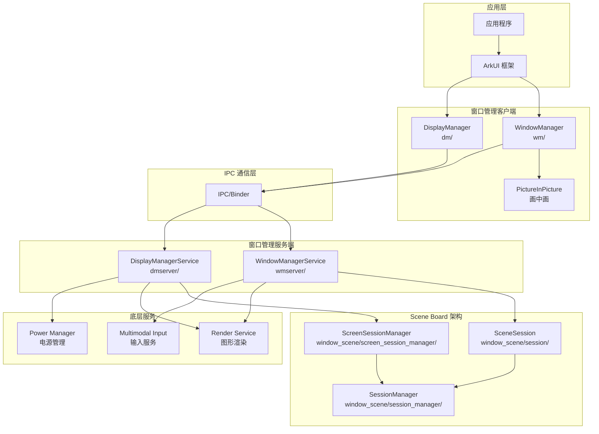
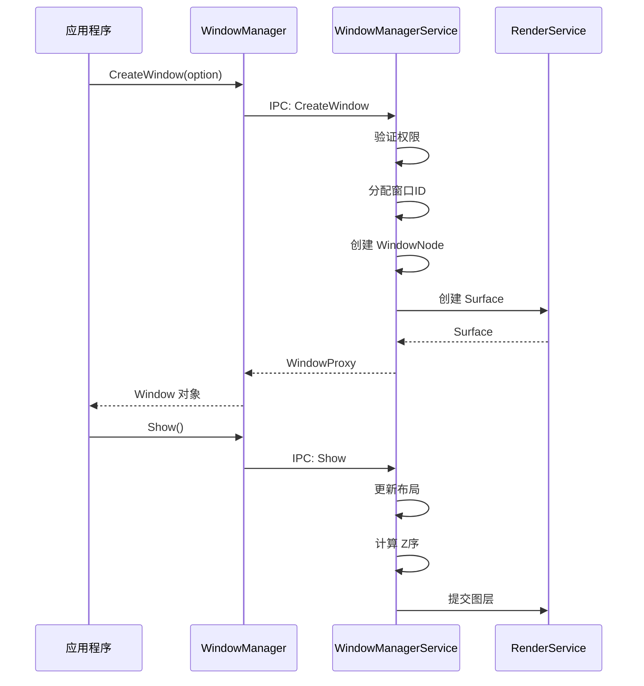
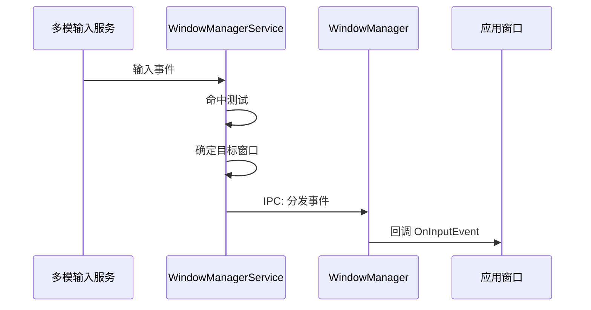
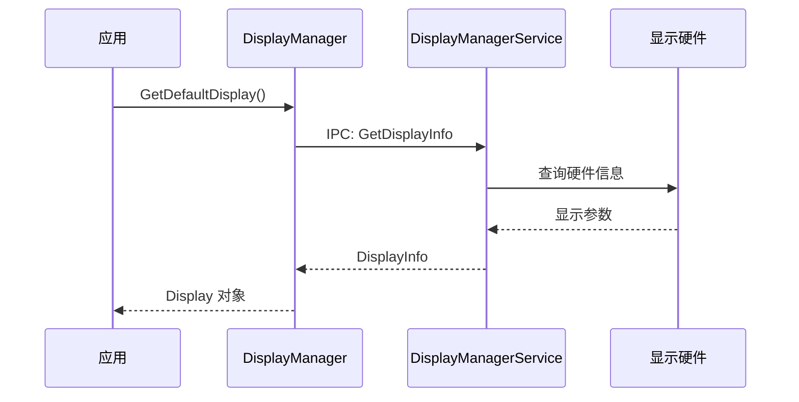

# 架构说明

## 目的

本文档详细说明 Window Manager 子系统的组件架构、数据流、线程模型和关键时序。

## 总体架构



## 组件详细说明

### 1. Window Manager Client (wm/)

**核心类**：
- `Window` (`wm/include/window.h`) - 窗口对象基类
- `WindowImpl` (`wm/src/window_impl.cpp`) - 窗口实现
- `WindowManager` (`wm/src/window_manager.cpp`) - 窗口管理器
- `WindowOption` (`wm/include/window_option.h`) - 窗口配置

**职责**：
- 提供窗口创建、销毁、显示、隐藏接口
- 管理窗口生命周期回调
- 处理输入事件分发
- 连接 Ability 框架和 UI 框架

**关键文件**：
```
wm/
├── include/
│   ├── window.h              # Window 类定义
│   ├── window_manager.h      # WindowManager 类
│   ├── window_option.h       # 窗口配置选项
│   └── ...
├── src/
│   ├── window.cpp            # Window 实现
│   ├── window_impl.cpp       # 窗口实现细节
│   ├── window_manager.cpp    # 窗口管理实现
│   └── ...
└── BUILD.gn                  # 构建配置: libwm.so
```

### 2. Display Manager Client (dm/)

**核心类**：
- `Display` (`dm/include/display.h`) - 显示对象
- `DisplayManager` (`dm/include/display_manager.h`) - 显示管理器
- `Screen` (`dm/include/screen.h`) - 屏幕对象

**职责**：
- 提供显示信息查询
- 屏幕管理（分辨率、方向）
- 屏幕分组管理

**关键文件**：
```
dm/
├── include/
│   ├── display.h             # Display 类
│   ├── display_manager.h     # DisplayManager 类
│   └── ...
├── src/
│   ├── display.cpp
│   ├── display_manager.cpp
│   └── ...
└── BUILD.gn                  # 构建配置: libdm.so
```

### 3. Window Manager Server (wmserver/)

**核心类**：
- `WindowManagerService` (`wmserver/src/window_manager_service.cpp`) - WMS 服务
- `WindowController` (`wmserver/src/window_controller.cpp`) - 窗口控制
- `WindowRoot` (`wmserver/src/window_root.cpp`) - 窗口树根
- `WindowLayoutPolicy` (`wmserver/src/window_layout_policy.cpp`) - 布局策略

**职责**：
- 窗口布局计算
- Z序管理
- 窗口树结构维护
- 动画协调
- 截图服务

**关键文件**：
```
wmserver/
├── include/
│   ├── window_manager_service.h
│   └── ...
├── src/
│   ├── window_manager_service.cpp
│   ├── window_controller.cpp
│   ├── window_root.cpp
│   ├── window_layout_policy.cpp
│   └── ...
└── BUILD.gn                  # 构建配置: libwms.so
```

### 4. Display Manager Server (dmserver/)

**核心类**：
- `DisplayManagerService` (`dmserver/src/display_manager_service.cpp`) - DMS 服务
- `AbstractDisplayController` (`dmserver/src/abstract_display_controller.cpp`)
- `ScreenRotationController` (`dmserver/src/screen_rotation_controller.cpp`)

**职责**：
- 抽象显示控制
- 屏幕旋转管理
- 截图控制
- 亮灭屏控制

**关键文件**：
```
dmserver/
├── include/
│   ├── display_manager_service.h
│   └── ...
├── src/
│   ├── display_manager_service.cpp
│   ├── abstract_display_controller.cpp
│   └── ...
└── BUILD.gn                  # 构建配置: libdms.so
```

### 5. Window Scene (window_scene/) - Scene Board 架构

**核心组件**：

| 组件 | 路径 | 职责 |
|------|------|------|
| SceneSession | `window_scene/session/` | 场景会话，替代传统 Window |
| SessionManager | `window_scene/session_manager/` | 会话生命周期管理 |
| ScreenSessionManager | `window_scene/screen_session_manager/` | 屏幕会话管理 |
| Common | `window_scene/common/` | 公共定义和工具 |

**架构关系**：
```
Traditional:        Scene Board:
┌──────────┐        ┌─────────────┐
│ Window   │   →    │ SceneSession│
├──────────┤        ├─────────────┤
│ WMS      │   →    │ SessionMgr  │
├──────────┤        ├─────────────┤
│ DMS      │   →    │ ScreenSessMgr│
└──────────┘        └─────────────┘
```

## 数据流

### 窗口创建流程



### 输入事件分发流程



### 显示信息查询流程



## 线程模型

### 客户端线程模型

```
主线程 (UI Thread)
├── Window 操作 API 调用
├── 事件回调处理
└── UI 更新

后台线程 (IPC Thread)
├── IPC 请求发送
└── IPC 响应接收
```

### 服务端线程模型

```
主服务线程
├── IPC 请求处理
├── 窗口状态管理
└── 布局计算

布局线程
├── 布局策略执行
├── Z序调整
└── 动画帧调度

工作线程池
├── 截图处理
├── 缩略图生成
└── 文件IO
```

### 关键线程安全点

1. **窗口状态访问**：使用 Mutex 保护窗口状态变更
2. **布局计算**：单线程执行，避免竞态
3. **IPC 回调**：在独立线程执行，需要 Post 到主线程更新 UI

## 关键时序

### 窗口生命周期时序

```
时间轴: ──────────────────────────────────────────────>

创建阶段:
  App: CreateWindow()
       │
       ▼
  WM:  分配资源 ──→ 请求 WMS ──→ 等待响应
       │                              │
       ▼                              ▼
  WMS: 验证权限 ──→ 创建 Node ──→ 返回 Handle
       │                              │
       ▼                              ▼
  App: 获得 Window 对象 ◄──────────────┘

显示阶段:
  App: Show()
       │
       ▼
  WM:  发送 IPC
       │
       ▼
  WMS: 更新布局 ──→ 计算 Z序 ──→ 提交渲染
       │
       ▼
  App: 窗口可见

销毁阶段:
  App: Destroy()
       │
       ▼
  WM:  发送 IPC
       │
       ▼
  WMS: 移除 Node ──→ 回收资源 ──→ 更新布局
       │
       ▼
  App: 窗口销毁完成
```

### 亮屏/灭屏时序

```
电源键触发:
  PowerManager ──→ DisplayManagerService
                         │
                         ▼
                   通知所有监听者
                         │
         ┌───────────────┼───────────────┐
         ▼               ▼               ▼
       应用层         系统UI         硬件抽象层
         │               │               │
         ▼               ▼               ▼
    暂停渲染      显示锁屏界面      背光控制
```

## IPC 接口定义

### Window Manager IPC

```cpp
// wmserver/include/zidl/IWindowManager.idl
interface IWindowManager {
    CreateWindow(in WindowOption option, out sptr<IRemoteObject> window);
    RemoveWindow(in int32_t windowId);
    ShowWindow(in int32_t windowId);
    HideWindow(in int32_t windowId);
    // ... 更多接口
};
```

### Display Manager IPC

```cpp
// dmserver/IDisplayManager.idl
interface IDisplayManager {
    GetDefaultDisplayInfo(out DisplayInfo info);
    GetAllDisplayInfo(out List<DisplayInfo> infos);
    SetDisplayState(in DisplayState state);
    // ... 更多接口
};
```

## 系统服务集成

### System Ability 注册

| SA ID | 服务名 | 说明 |
|-------|--------|------|
| 4606 | WindowManagerService | 窗口管理服务 |
| 4607 | DisplayManagerService / ScreenSessionManager | 显示/屏幕会话管理 |

配置文件位置：`sa_profile/4606.json`, `sa_profile/4607.json`

## 相关文档

- [目录结构](03_Directory_Structure.md)
- [N-API 参考](04_NAPI_Reference.md)
- [内部 API](05_Inner_API.md)
