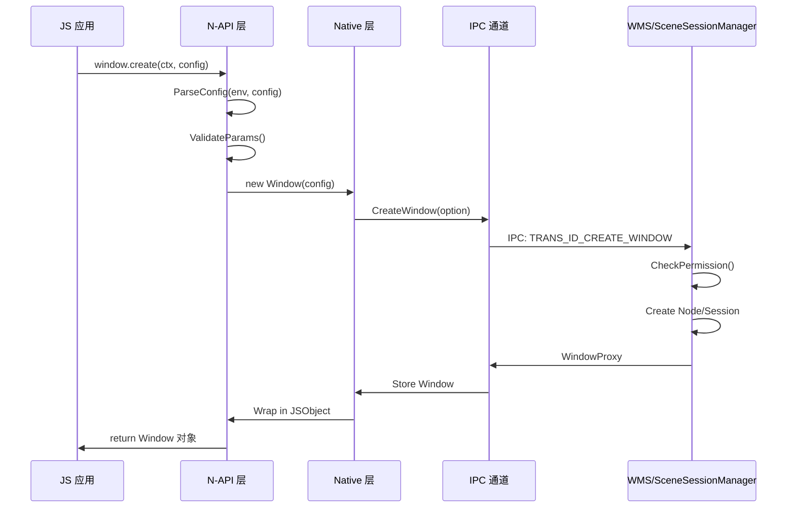
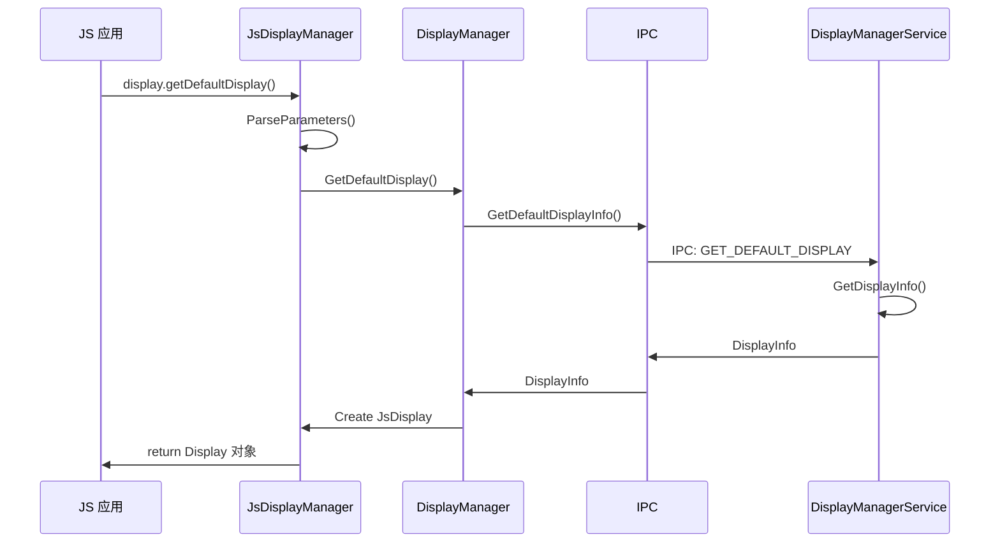

# N-API 参考

## 目的

本文档详细梳理 Window Manager 子系统对外暴露的 N-API 接口，包括 JS API 清单、参数校验、调用链和错误码。

**适用范围**：
- 应用开发者（使用 JS/TS 调用窗口 API）
- 框架开发者（集成 Window Manager N-API）
- 安全审计人员

## N-API 模块清单

| 模块名 | 路径 | 说明 | 主要功能 |
|--------|------|------|----------|
| `@ohos.window` | `interfaces/kits/napi/window_runtime/` | 窗口运行时 | 窗口创建、属性、生命周期 |
| `@ohos.display` | `interfaces/kits/napi/window_runtime/` | 显示管理 | 屏幕信息、分辨率、方向 |
| `@ohos.windowExtension` | `interfaces/kits/napi/extension/` | 窗口扩展 | UIExtension 支持 |
| `@ohos.windowExtensionAbility` | `interfaces/kits/napi/window_extension_ability/` | 扩展能力 | ExtensionAbility 支持 |
| `@ohos.embeddedWindowStage` | `interfaces/kits/napi/embeddable_window_stage/` | 嵌入式窗口 | 嵌入式窗口支持 |
| `@ohos.pipWindow` | `interfaces/kits/napi/picture_in_picture_napi/` | 画中画 | PIP 窗口控制 |
| `@ohos.floatingBall` | `interfaces/kits/napi/floating_ball_napi/` | 悬浮球 | 悬浮球功能 |
| `@ohos.screenshot` | `interfaces/kits/napi/screenshot/` | 截图 | 屏幕截图功能 |
| `@ohos.sceneSessionManager` | `window_scene/interfaces/kits/napi/scene_session_manager/` | 场景会话 | Scene Board 会话管理 |
| `@ohos.screenSessionManager` | `window_scene/interfaces/kits/napi/screen_session_manager/` | 屏幕会话 | Scene Board 屏幕管理 |
| `@ohos.transactionManager` | `window_scene/interfaces/kits/napi/transaction_manager/` | 事务管理 | 同步操作 |
| `@ohos.sessionManagerService` | `window_scene/interfaces/kits/napi/session_manager_service/` | 会话服务 | 获取 SSM |

## 核心 N-API 模块详解

### 1. Window Runtime N-API

**注册点**: `interfaces/kits/napi/window_runtime/window_stage_napi/window_stage_module.cpp:30`

```cpp
static napi_module g_winStageModule = {
    .nm_version = 1,
    .nm_flags = 0,
    .nm_filename = "libwindow_napi.z.so",
    .nm_register_func = WindowStageInit,
    .nm_modname = "@ohos.window",
    .nm_priv = nullptr,
    .reserved = { 0 }
};
extern "C" __attribute__((constructor)) void RegisterWindowStageModule() {
    napi_module_register(&g_winStageModule);
}
```

**主要类**:
- `JsWindow` (`js_window.cpp`) - Window 对象封装
- `JsWindowStage` (`js_window_stage.cpp`) - WindowStage 封装
- `JsDisplay` (`js_display.cpp`) - Display 对象封装
- `JsDisplayManager` (`js_display_manager.cpp`) - DisplayManager 封装

**JS API 映射**:

| JS 方法 | C++ 实现 | 说明 |
|---------|----------|------|
| `window.getProperties()` | `JsWindow::GetProperties()` | 获取窗口属性 |
| `window.setUIContent()` | `JsWindow::SetUIContent()` | 设置 UI 内容 |
| `window.show()` | `JsWindow::Show()` | 显示窗口 |
| `window.hide()` | `JsWindow::Hide()` | 隐藏窗口 |
| `window.destroy()` | `JsWindow::Destroy()` | 销毁窗口 |
| `window.on('touch')` | `JsWindow::RegisterTouchCallback()` | 注册触摸事件 |
| `window.resize()` | `JsWindow::Resize()` | 调整窗口大小 |
| `window.moveTo()` | `JsWindow::MoveTo()` | 移动窗口位置 |
| `window.setFullScreen()` | `JsWindow::SetFullScreen()` | 设置全屏 |
| `window.setLayoutFullScreen()` | `JsWindow::SetLayoutFullScreen()` | 设置布局全屏 |

**错误码**:
- `1300001` - 重复操作
- `1300002` - 无效窗口状态
- `1300003` - 无效窗口
- `1300004` - 无权限

### 2. Screenshot N-API

**注册点**: `interfaces/kits/napi/screenshot/native_screenshot_module.cpp:775`

```cpp
static napi_module g_screenshotModule = {
    .nm_version = 1,
    .nm_modname = "@ohos.screenshot",
    .nm_register_func = ScreenshotInit,
    ...
};
napi_module_register(&g_screenshotModule);
```

**导出方法**:
- `save()`: 保存截图到文件
- `pick(): 选取区域截图`

**权限要求**: `ohos.permission.CAPTURE_SCREEN`

### 3. PictureInPicture N-API

**注册点**: `interfaces/kits/napi/picture_in_picture_napi/js_pipwindow_module.cpp:27`

```cpp
static napi_module g_winManagerModule = {
    .nm_version = 1,
    .nm_modname = "@ohos.pipWindow",
    .nm_register_func = PiPWindowInit,
    ...
};
```

**主要类**:
- `JsPiPWindow` - PIP 窗口控制
- `JsPiPWindowManager` - PIP 窗口管理

**JS API**:
- `create()`: 创建 PIP 窗口
- `startPiP()`: 启动画中画
- `stopPiP()`: 停止画中画
- `on('stateChange')`: 状态变化监听

### 4. FloatingBall N-API

**注册点**: `interfaces/kits/napi/floating_ball_napi/js_fbwindow_module.cpp:28`

```cpp
static napi_module g_winManagerModule = {
    .nm_version = 1,
    .nm_modname = "@ohos.floatingBall",
    .nm_register_func = FbWindowInit,
    ...
};
```

**权限要求**: `ohos.permission.USE_FLOAT_BALL`

### 5. SceneSessionManager N-API (Scene Board)

**注册点**: `window_scene/interfaces/kits/napi/scene_session_manager/scene_session_manager_module.cpp:28`

```cpp
static napi_module g_sceneSessionModule = {
    .nm_version = 1,
    .nm_modname = "@ohos.sceneSessionManager",
    .nm_register_func = SceneSessionManagerInit,
    ...
};
```

**主要功能**:
- 场景会话生命周期管理
- 窗口属性设置
- Focus 管理

## 调用链示例

### 窗口创建调用链



### 显示信息查询调用链



## 参数校验模式

### 1. 类型校验
```cpp
// js_window.cpp 示例
napi_valuetype valueType = napi_undefined;
napi_typeof(env, value, &valueType);
if (valueType != napi_object) {
    return NapiThrowError(env, WmErrorCode::WM_ERROR_INVALID_PARAM);
}
```

### 2. 范围校验
```cpp
// 检查窗口大小范围
if (width <= 0 || height <= 0 || width > MAX_WINDOW_SIZE || height > MAX_WINDOW_SIZE) {
    return NapiThrowError(env, WmErrorCode::WM_ERROR_INVALID_PARAM);
}
```

### 3. 空值校验
```cpp
if (nativeWindow == nullptr) {
    return NapiThrowError(env, WmErrorCode::WM_ERROR_STATE_ABNORMALLY);
}
```

### 4. 权限校验
```cpp
if (!SessionPermission::VerifyCallingPermission("ohos.permission.CAPTURE_SCREEN")) {
    return NapiThrowError(env, WmErrorCode::WM_ERROR_NO_PERMISSION);
}
```

## 同步 vs 异步模式

### 同步调用
```cpp
// 直接返回结果
napi_value JsWindow::Show(napi_env env, napi_callback_info info) {
    WMError ret = window->Show();
    return CreateJsValue(env, static_cast<int32_t>(ret));
}
```

### Promise 异步
```cpp
// 使用 Promise 异步返回
napi_value JsWindow::Resize(napi_env env, napi_callback_info info) {
    napi_deferred deferred;
    napi_value promise;
    napi_create_promise(env, &deferred, &promise);
    
    // 异步执行
    auto asyncTask = [deferred, width, height]() {
        WMError ret = window->Resize(width, height);
        // Resolve/Reject promise
    };
    // ...
    return promise;
}
```

### Callback 异步
```cpp
// 使用回调函数
napi_value JsWindow::On(napi_env env, napi_callback_info info) {
    // 解析 callback
    napi_ref callbackRef;
    napi_create_reference(env, callback, 1, &callbackRef);
    
    // 注册 native 回调
    window->RegisterCallback([callbackRef](...)) {
        // 调用 JS callback
    };
}
```

## 错误码定义

| 错误码 | 名称 | 说明 |
|--------|------|------|
| 0 | `WM_OK` | 成功 |
| 1300001 | `WM_ERROR_REPEAT_OPERATION` | 重复操作 |
| 1300002 | `WM_ERROR_INVALID_WINDOW_STATE` | 无效窗口状态 |
| 1300003 | `WM_ERROR_INVALID_WINDOW` | 无效窗口 |
| 1300004 | `WM_ERROR_NO_PERMISSION` | 无权限 |
| 1300005 | `WM_ERROR_INVALID_PARAM` | 无效参数 |
| 1300006 | `WM_ERROR_DEVICE_NOT_SUPPORT` | 设备不支持 |
| 1300007 | `WM_ERROR_NULLPTR` | 空指针 |
| 1300008 | `WM_ERROR_INVALID_PARENT` | 无效父窗口 |

## 权限要求汇总

| N-API 模块 | 敏感操作 | 所需权限 |
|------------|----------|----------|
| Screenshot | save() | `ohos.permission.CAPTURE_SCREEN` |
| FloatingBall | create() | `ohos.permission.USE_FLOAT_BALL` |
| Window | setPrivacyMode() | `ohos.permission.PRIVACY_WINDOW` |
| Window | setTransparent() | `ohos.permission.SET_WINDOW_TRANSPARENT` |
| Window | setTopmost() | `ohos.permission.WINDOW_TOPMOST` |
| Display | setOrientation() | 系统应用 |
| PiP | create() | 系统应用或特殊权限 |

## 相关文档

- [内部 API](05_Inner_API.md)
- [架构说明](02_Architecture.md)
- [安全分析](07_Security_Analysis.md)
