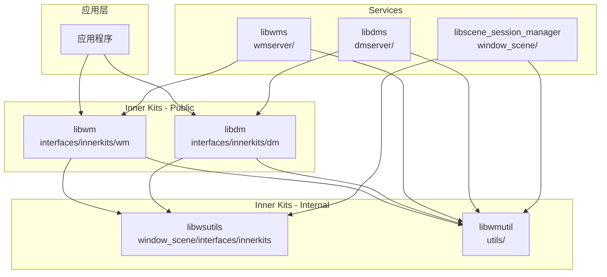

# 内部 API (Inner API)

## 目的

本文档梳理 Window Manager 子系统的内部 C++ API，包括模块接口、依赖方向、稳定性和可替换点。

## Inner API 分类

### 1. Window Manager Client API (`interfaces/innerkits/wm/`)

**核心头文件**:
- `window.h` - 窗口对象接口
- `window_manager.h` - 窗口管理器接口
- `window_option.h` - 窗口配置选项
- `wm_common.h` - 公共定义和枚举

**关键类**:
```cpp
// window.h:35-45
class Window {
public:
    static sptr<Window> Create(const std::string& windowName,
                                sptr<WindowOption> option);
    virtual WMError Show() = 0;
    virtual WMError Hide() = 0;
    virtual WMError Destroy() = 0;
    virtual WMError Resize(uint32_t width, uint32_t height) = 0;
    virtual WMError MoveTo(int32_t x, int32_t y) = 0;
    // ... 更多方法
};
```

**稳定性**: 稳定 (Stable)
**ABI 保证**: 主要版本兼容

### 2. Display Manager Client API (`interfaces/innerkits/dm/`)

**核心头文件**:
- `display.h` - 显示对象接口
- `display_manager.h` - 显示管理器接口
- `dm_common.h` - 公共定义

**关键类**:
```cpp
// display.h:40-50
class Display {
public:
    virtual DisplayId GetId() const = 0;
    virtual int32_t GetWidth() const = 0;
    virtual int32_t GetHeight() const = 0;
    virtual float GetVirtualPixelRatio() const = 0;
    virtual Rotation GetRotation() const = 0;
    virtual Orientation GetOrientation() const = 0;
    // ... 更多方法
};
```

**稳定性**: 稳定 (Stable)

### 3. Window Scene Inner API (`window_scene/interfaces/innerkits/`)

**核心组件**:
- `scene_board_judgement.h` - Scene Board 检测

**关键函数**:
```cpp
// scene_board_judgement.h
namespace SceneBoardJudgement {
    bool IsSceneBoardEnabled();
    bool IsWindowSceneCreated();
}
```

**稳定性**: 内部使用，不推荐外部依赖

### 4. Utils API (`utils/include/`)

**核心头文件**:
- `singleton_container.h` - 单例容器
- `window_visibility_info.h` - 窗口可见性信息

**稳定性**: 内部使用

## 模块依赖图



## 接口稳定性分级

| 级别 | 说明 | 头文件位置 | 使用建议 |
|------|------|-----------|----------|
| **稳定 (Stable)** | ABI 兼容，主要版本不变 | `interfaces/innerkits/*/`<br/>`interfaces/kits/ndk/` | 可放心使用 |
| **平台 (Platform)** | 平台保证，可能扩展 | `interfaces/innerkits/*/`<br/>标记 `platformsdk` | 系统应用可用 |
| **内部 (Internal)** | 随时变更，不保证兼容 | `*/include/`<br/>`window_scene/*/` | 不推荐外部使用 |
| **私有 (Private)** | 模块内部使用 | 模块内部头文件 | 禁止使用 |

## 关键接口调用链

### 创建窗口调用链

```
应用代码
    │
    ▼
Window::Create()                          [interfaces/innerkits/wm/window.h]
    │
    ▼
WindowManager::CreateWindow()             [wm/src/window_manager.cpp]
    │
    ▼
WindowAdapter::CreateWindow()             [wm/src/window_adapter.cpp]
    │
    ▼
IPC: IWindowManager::CreateWindow()       [wmserver/include/zidl/]
    │
    ▼
WindowManagerService::CreateWindow()      [wmserver/src/window_manager_service.cpp]
    │
    ▼
WindowController::CreateWindow()          [wmserver/src/window_controller.cpp]
    │
    ▼
WindowNode::Create()                      [wmserver/src/window_node.cpp]
```

### 获取显示信息调用链

```
应用代码
    │
    ▼
DisplayManager::GetDefaultDisplay()       [interfaces/innerkits/dm/display_manager.h]
    │
    ▼
DisplayManagerAdapter::GetDefaultDisplay()[dm/src/display_manager_adapter.cpp]
    │
    ▼
IPC: IDisplayManager::GetDefaultDisplay()[dmserver/IDisplayManager.idl]
    │
    ▼
DisplayManagerService::GetDefaultDisplay()[dmserver/src/display_manager_service.cpp]
    │
    ▼
AbstractDisplayController::GetDisplay()   [dmserver/src/abstract_display_controller.cpp]
```

## 可替换点 (Extension Points)

### 1. 布局策略扩展

**位置**: `wmserver/include/window_layout_policy.h`

```cpp
class WindowLayoutPolicy {
public:
    virtual void Layout(const std::vector<sptr<WindowNode>>& windowNodes) = 0;
    virtual void NotifyClientWindowSizeChange() {}
};

// 实现自定义布局策略
class CustomLayoutPolicy : public WindowLayoutPolicy {
    // 自定义实现
};
```

### 2. 窗口动画扩展

**位置**: `wmserver/include/remote_animation.h`

```cpp
class RemoteAnimation : public IRemoteAnimation {
public:
    virtual WMError OnRemoteAnimationStart() override;
    virtual WMError OnRemoteAnimationFinish() override;
};
```

### 3. 显示控制器扩展

**位置**: `dmserver/include/abstract_display_controller.h`

```cpp
class AbstractDisplayController {
public:
    virtual sptr<AbstractDisplay> GetAbstractDisplay(DisplayId id) = 0;
    virtual bool HasDisplayInfoChanged() = 0;
};
```

## 头文件包含规范

### 推荐包含方式

```cpp
// 使用完整路径，从仓库根目录开始
#include "foundation/window/window_manager/interfaces/innerkits/wm/window.h"
#include "foundation/window/window_manager/interfaces/innerkits/dm/display_manager.h"
```

### BUILD.gn 配置

```gn
# 使用 public_configs 暴露头文件路径
config("libwm_public_config") {
  include_dirs = [
    "//foundation/window/window_manager/interfaces/innerkits",
    "//foundation/window/window_manager/interfaces/innerkits/wm",
  ]
}

ohos_shared_library("my_module") {
  public_configs = [ "//foundation/window/window_manager/wm:libwm_public_config" ]
  deps = [
    "//foundation/window/window_manager/wm:libwm",
    "//foundation/window/window_manager/dm:libdm",
  ]
}
```

## 依赖版本管理

### bundle.json 中的 Inner Kits 定义

```json
{
  "inner_kits": [
    {
      "type": "so",
      "name": "//foundation/window/window_manager/wm:libwm",
      "header": {
        "header_files": [
          "window.h",
          "window_manager.h",
          "window_option.h"
        ],
        "header_base": "//foundation/window/window_manager/interfaces/innerkits/wm"
      }
    },
    {
      "type": "so",
      "name": "//foundation/window/window_manager/dm:libdm",
      "header": {
        "header_files": [
          "display.h",
          "display_manager.h"
        ],
        "header_base": "//foundation/window/window_manager/interfaces/innerkits/dm"
      }
    }
  ]
}
```

## 常用类型定义

### 窗口相关类型

```cpp
// wm_common.h
using WindowType = OHOS::WindowType;
using WindowMode = OHOS::WindowMode;
using WindowState = OHOS::WindowState;
using WMError = OHOS::WMError;
using Rect = struct { int32_t posX_, posY_, width_, height_; };
using WindowId = int32_t;
```

### 显示相关类型

```cpp
// dm_common.h
using DisplayId = uint64_t;
using ScreenId = uint64_t;
using Orientation = OHOS::Orientation;
using Rotation = OHOS::Rotation;
using DmErrorCode = OHOS::DmErrorCode;
```

## 调试接口

### 窗口调试

```cpp
// wm/include/window_inspector.h
class WindowInspector {
public:
    static void DumpWindowInfo();
    static void DumpWindowLayout();
    static void DumpAllWindows();
};
```

### 显示调试

```cpp
// dmserver/include/display_dumper.h
class DisplayDumper {
public:
    static std::string DumpDisplayInfo();
    static std::string DumpScreenInfo();
};
```

## 相关文档

- [N-API 参考](04_NAPI_Reference.md)
- [架构说明](02_Architecture.md)
- [GN Targets](06_GN_Targets.md)
