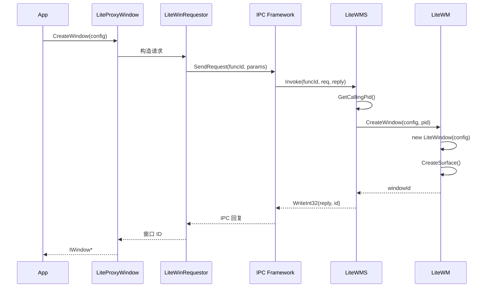
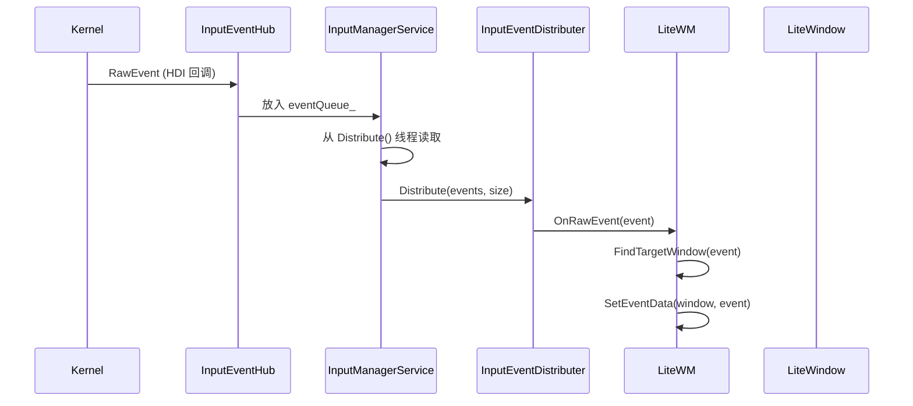

# 架构设计

## 整体架构

window_manager_lite 采用 **C/S（客户端/服务端）架构**，基于 OpenHarmony 的 SAMGR（System Ability Manager）框架实现进程间通信。

### 架构分层

```
┌─────────────────────────────────────────────────────────────┐
│                      Presentation Layer                      │
│                    (UI Components / Apps)                    │
├─────────────────────────────────────────────────────────────┤
│                       Client Layer                           │
│                   libwms_client.so                          │
│  ┌─────────────────────────────────────────────────────┐   │
│  │  LiteProxyWindow  →  LiteWinRequestor  →  IPC      │   │
│  └─────────────────────────────────────────────────────┘   │
├─────────────────────────────────────────────────────────────┤
│                       Service Layer                          │
│                      wms_server                              │
│  ┌─────────────────────────────────────────────────────┐   │
│  │  LiteWMS (IPC Handler)                              │   │
│  │  ├── LiteWM (Window Manager)                       │   │
│  │  │   └── LiteWindow [×N]                          │   │
│  │  └── InputManagerService                           │   │
│  │      ├── InputEventDistributer                     │   │
│  │      └── InputEventHub                              │   │
│  └─────────────────────────────────────────────────────┘   │
├─────────────────────────────────────────────────────────────┤
│                       HAL Layer                               │
│  ┌──────────────────────┐  ┌──────────────────────────┐    │
│  │    Display HAL       │  │     Input HAL (HDI)     │    │
│  └──────────────────────┘  └──────────────────────────┘    │
└─────────────────────────────────────────────────────────────┘
```

## C/S 通信机制

### 1. 服务注册 (SAMGR)

**WMS 服务注册**

```cpp
// services/wms/samgr_wms.cpp:85-91
static void Init(void)
{
    SAMGR_GetInstance()->RegisterService((Service*)&g_example);
    SAMGR_GetInstance()->RegisterDefaultFeatureApi(SERVICE_NAME, GET_IUNKNOWN(g_example));
}
SYSEX_SERVICE_INIT(Init);
```

- 服务名: `"WMS"` (`lite_wm_type.h:84`)
- 使用 `SYSEX_SERVICE_INIT` 宏自动注册

**IMS 服务注册**

```cpp
// services/ims/samgr_ims.cpp:84-98
static void Init(void)
{
    BOOL ret = SAMGR_GetInstance()->RegisterService(...);
    ret = SAMGR_GetInstance()->RegisterDefaultFeatureApi(IMS_SERVICE_NAME, ...);
}
SYSEX_SERVICE_INIT(Init);
```

### 2. IPC 请求处理

**WMS 请求分发**

```cpp
// services/wms/lite_wms.cpp:31-80
void LiteWMS::WMSRequestHandle(int funcId, void* origin, IpcIo* req, IpcIo* reply)
{
    switch (funcId) {
        case LiteWMS_GetSurface:
            OHOS::LiteWMS::GetInstance()->GetSurface(req, reply);
            break;
        // ... 其他 case
    }
}
```

**证据**: `lite_wms.h:33` - `WMSRequestHandle` 函数声明

### 3. 客户端调用链

```
App 调用
    │
    ▼
LiteProxyWindow::Show()
    │
    ▼
LiteWinRequestor::Show()
    │
    ▼
IClientProxy (IPC 框架)
    │
    ▼
LiteWMS::WMSRequestHandle() [服务端]
    │
    ▼
LiteWM::Show() [业务逻辑]
```

## 线程模型

### 1. 服务端线程配置

```cpp
// services/wms/samgr_wms.cpp:62-67
static TaskConfig GetTaskConfig(Service* service)
{
    (void)service;
    TaskConfig config = {LEVEL_HIGH, PRI_BELOW_NORMAL, 0x800, 20, SHARED_TASK};
    return config;
}
```

| 配置项 | 值 | 说明 |
|--------|-----|------|
| LEVEL | HIGH | 高优先级任务 |
| PRIORITY | PRI_BELOW_NORMAL | 低于普通优先级 |
| STACK_SIZE | 0x800 (2KB) | 栈大小 |
| QUEUE_SIZE | 20 | 消息队列深度 |
| TASK_POLICY | SHARED_TASK | 共享任务池 |

### 2. 窗口管理器线程

LiteWM 使用 **单例模式**，运行在主任务中：

```cpp
// services/wms/lite_wm.cpp:127-131
LiteWM* LiteWM::GetInstance()
{
    static LiteWM liteWm;
    return &lite### 3.Wm;
}
```

 输入管理线程

InputManagerService 启动独立线程处理输入事件：

```cpp
// services/ims/input_manager_service.cpp
static void* InputManagerService::Distribute(void* args)
{
    // 事件分发循环
    while (distributerThreadCreated_) {
        // 从队列读取事件并分发
    }
}
```

## 数据流

### 1. 窗口创建数据流

```
1. App 调用 LiteProxyWindow::CreateWindow(config)
2. LiteWMRequestor 通过 IPC 发送 CreateWindow 请求
3. LiteWMS::CreateWindow() 处理请求
   - 获取调用方 PID: GetCallingPid()
   - 调用 LiteWM::CreateWindow(config, pid)
4. 创建 LiteWindow 对象
5. 返回窗口 ID
```

**证据**: `lite_wms.cpp:186-199`

### 2. 输入事件数据流

```
RawEvent (内核/驱动)
    │
    ▼
InputEventHub::EventCallback() [HDI 回调]
    │
    ▼
InputManagerService::eventQueue_ [事件队列]
    │
    ▼
InputManagerService::Distribute() [分发线程]
    │
    ▼
InputEventDistributer::Distribute()
    │
    ▼
LiteWM::OnRawEvent() [事件监听器]
    │
    ▼
FindTargetWindow() [找目标窗口]
    │
    ▼
设置 DeviceData 并通知窗口
```

### 3. 屏幕截图数据流

```
App 调用 Screenshot()
    │
    ▼
权限检查: CheckPermission(uid, "ohos.permission.WRITE_MEDIA_IMAGES")
    │
    ├── 失败 ──→ 返回错误
    │
    └── 成功 ──→ LiteWM::OnScreenshot(surface)
                     │
                     ▼
              Screenshot() [主循环中执行]
                     │
                     ▼
              memcpy_s(dstBuffer, srcLayerData)
```

**证据**: `lite_wms.cpp:216-228`

## 时序图

### 窗口创建时序



### 输入事件分发时序



## 关键设计决策

| 决策 | 说明 | 优缺点 |
|------|------|--------|
| SAMGR 服务框架 | 使用系统能力管理框架注册服务 | + 统一管理<br>- 增加复杂度 |
| IPC 单向调用 | 客户端发送请求，服务端同步返回 | + 简单可靠<br>- 不支持异步回调 |
| 单例窗口管理器 | LiteWM 使用单例 | + 全局访问方便<br>- 难以多实例化 |
| 事件队列 + 线程 | IMS 使用生产者/消费者模式 | + 线程安全<br>- 增加延迟 |
| 位图管理窗口 ID | 使用 32 位位图管理窗口 ID | + 高效<br>- 最多 32 窗口 |
