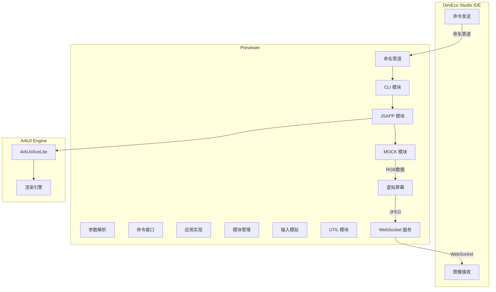
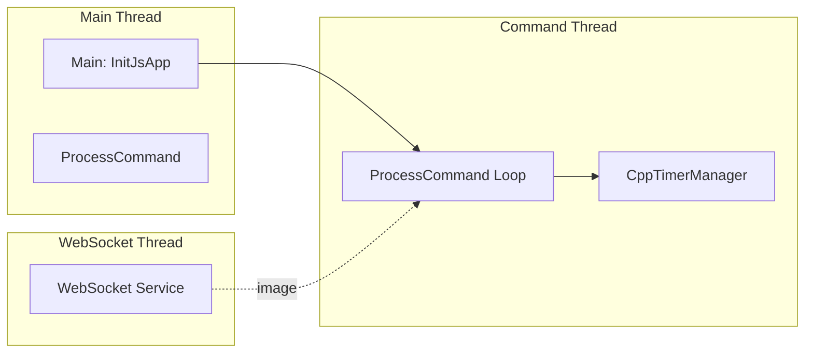
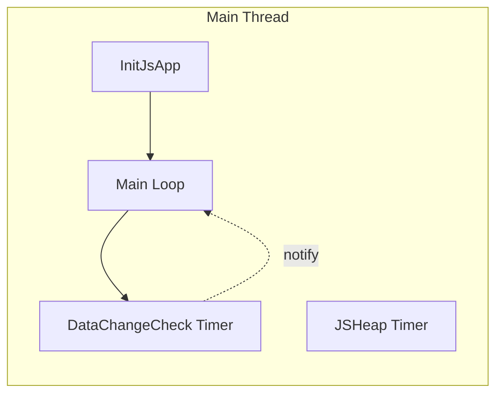

# 架构设计

## 组件图



## 数据流

### 命令流 (IDE → Previewer)

```
1. DevEco Studio 发送 JSON 命令到命名管道
2. CommandLineInterface::ProcessCommand() 读取消息
3. CommandParser 解析 JSON
4. CommandLineFactory 创建命令对象
5. 对应 Command::Run() 执行
6. 返回结果到 IDE
```

### 渲染流 (Previewer → IDE)

```
1. ArkUI 引擎渲染页面
2. VirtualScreen::Callback() 接收帧数据
3. RgbToJpg() 压缩为 JPEG
4. 添加 40 字节协议头
5. WebSocketServer::WriteData() 发送
6. DevEco Studio 接收并显示
```

## 线程模型

### Rich Previewer



**关键文件**: `RichPreviewer.cpp:99-126`

### Lite Previewer



**关键文件**: `ThinPreviewer.cpp:100-143`

## 入口点

### Rich 入口

**文件**: `RichPreviewer.cpp`

```cpp
int main(int argc, char* argv[])
{
    // 1. 解析命令行参数
    CommandParser& parser = CommandParser::GetInstance();
    parser.ParseArgs(argc, argv);

    // 2. 初始化共享数据
    InitSharedData();

    // 3. 初始化命令接口
    CommandLineInterface::GetInstance().Init(parser.Value("s"));

    // 4. 启动命令处理线程
    std::thread commandThead(ProcessCommand);
    commandThead.detach();

    // 5. 初始化渲染
    VirtualScreenImpl::GetInstance().InitResolution();
    JsAppImpl::GetInstance().InitJsApp();

    return 0;
}
```

### Lite 入口

**文件**: `ThinPreviewer.cpp`

```cpp
int main(int argc, char* argv[])
{
    // 1. 解析命令行参数
    CommandParser& parser = CommandParser::GetInstance();
    parser.ParseArgs(argc, argv);

    // 2. 初始化共享数据 (传感器默认值)
    InitSharedData();

    // 3. 初始化设备模型
    ModelManager::SetCurrentDevice(parser.GetDeviceType());

    // 4. 初始化虚拟屏幕
    VirtualScreenImpl::GetInstance().InitResolution();

    // 5. 初始化命令接口
    CommandLineInterface::GetInstance().Init(parser.Value("s"));

    // 6. 初始化 JS 应用
    JsAppImpl::GetInstance().InitJsApp();

    // 7. 主循环
    while (!Interrupter::IsInterrupt()) {
        CommandLineInterface::GetInstance().ProcessCommand();
        manager.RunTimerTick();
    }
}
```

## 主处理循环

### ProcessCommand

**文件**: `RichPreviewer.cpp:65-78`

```cpp
static void ProcessCommand()
{
    // 启动 Inspector 通知定时器 (1秒间隔)
    static CppTimer inspectorNotifytimer(NotifyInspectorChanged);
    inspectorNotifytimer.Start(1000);

    VirtualScreenImpl::GetInstance().InitFrameCountTimer();

    while (!Interrupter::IsInterrupt()) {
        CommandLineInterface::GetInstance().ProcessCommand();
        CppTimerManager::GetTimerManager().RunTimerTick();
        std::this_thread::sleep_for(std::chrono::milliseconds(1));
    }
    JsAppImpl::GetInstance().Stop();
}
```

---

## 相关文档

- 概览: [00_Overview.md](./00_Overview.md)
- 目录结构: [01_Directory_Structure.md](./01_Directory_Structure.md)
- 通信协议: [03_Communication_Protocol.md](./03_Communication_Protocol.md)
