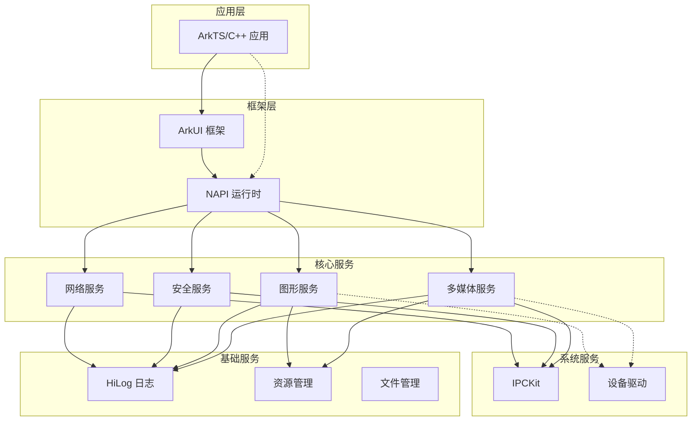
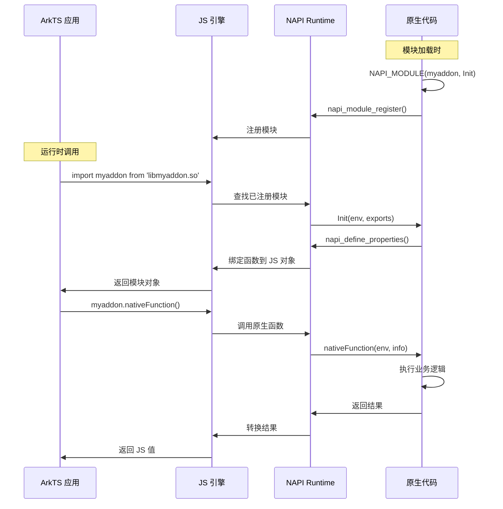
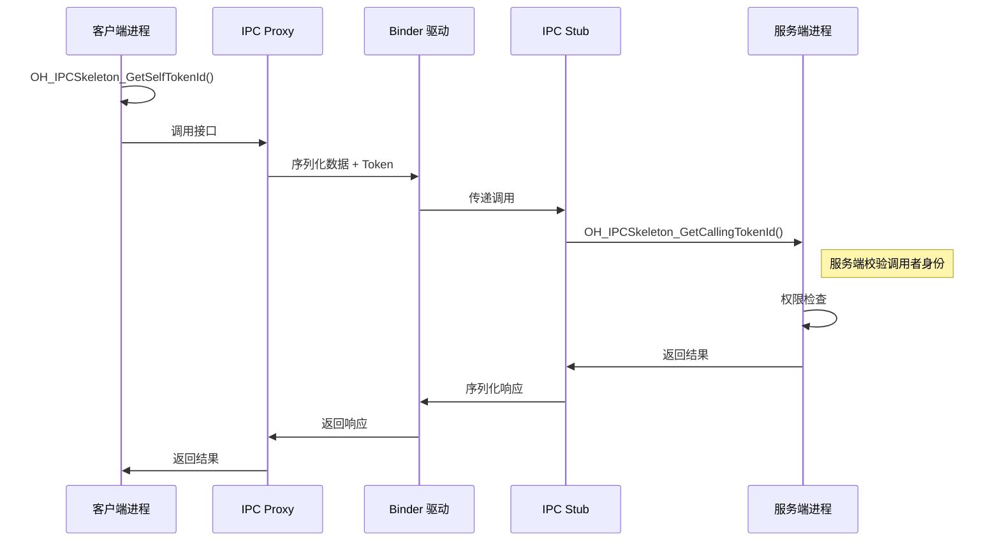

# 架构说明

> **目的**: 理解系统整体架构、组件关系、数据流和线程模型  
> **适用范围**: 架构设计者、需要理解系统内部机制的开发者  
> **生成时间**: 2025-02-06

---

## 1. 系统架构概览

### 1.1 分层架构图

```
┌─────────────────────────────────────────────────────────────────────────┐
│                              应用层 (Applications)                       │
│   ┌─────────────┐  ┌─────────────┐  ┌─────────────┐  ┌─────────────┐   │
│   │ ArkTS 应用   │  │ C++ 原生应用 │  │ Unity 游戏   │  │ Electron 应用│   │
│   └──────┬──────┘  └──────┬──────┘  └──────┬──────┘  └──────┬──────┘   │
└──────────┼────────────────┼────────────────┼────────────────┼──────────┘
           │                │                │                │
           ▼                ▼                ▼                ▼
┌─────────────────────────────────────────────────────────────────────────┐
│                           框架层 (Framework)                             │
│  ┌─────────────────────────────────────────────────────────────────┐   │
│  │                      ArkUI 框架                                  │   │
│  │  ┌─────────────┐  ┌─────────────┐  ┌─────────────┐             │   │
│  │  │ 声明式 UI   │  │ 动画系统    │  │ 事件系统    │             │   │
│  │  └──────┬──────┘  └──────┬──────┘  └──────┬──────┘             │   │
│  └─────────┼────────────────┼────────────────┼────────────────────┘   │
│            │                │                │                         │
│            ▼                ▼                ▼                         │
│  ┌─────────────────────────────────────────────────────────────────┐   │
│  │                      NAPI 运行时                                 │   │
│  │   JS 引擎 ◄──── N-API 绑定层 ────► C/C++ 原生代码                │   │
│  └─────────────────────────────────────────────────────────────────┘   │
└─────────────────────────────────────────────────────────────────────────┘
           │                │                │                │
           ▼                ▼                ▼                ▼
┌─────────────────────────────────────────────────────────────────────────┐
│                            服务层 (Services)                             │
│                                                                          │
│   ┌─────────────┐  ┌─────────────┐  ┌─────────────┐  ┌─────────────┐   │
│   │  多媒体服务  │  │  图形服务   │  │   安全服务  │  │   网络服务  │   │
│   │  audio      │  │  graphic    │  │  security   │  │   network   │   │
│   │  camera     │  │  native_    │  │  huks       │  │   netstack  │   │
│   │  player     │  │   drawing   │  │  asset      │  │   wifi      │   │
│   └─────────────┘  └─────────────┘  └─────────────┘  └─────────────┘   │
│                                                                          │
│   ┌─────────────┐  ┌─────────────┐  ┌─────────────┐  ┌─────────────┐   │
│   │ 数据服务    │  │ 资源调度    │  │ 分布式服务  │  │ 设备服务    │   │
│   │  RDB        │  │  ffrt       │  │  device_mgr │  │  sensor     │   │
│   │  preferences│  │  qos        │  │  udmf       │  │  vibrator   │   │
│   └─────────────┘  └─────────────┘  └─────────────┘  └─────────────┘   │
└─────────────────────────────────────────────────────────────────────────┘
           │                │                │                │
           ▼                ▼                ▼                ▼
┌─────────────────────────────────────────────────────────────────────────┐
│                          基础层 (Foundation)                             │
│                                                                          │
│   ┌─────────────┐  ┌─────────────┐  ┌─────────────┐  ┌─────────────┐   │
│   │   日志系统   │  │  资源管理   │  │   国际化    │  │   文件管理  │   │
│   │  hilog      │  │  resmgr     │  │  i18n       │  │  fileio     │   │
│   │  hiappevent │  │  rawfile    │  │  timezone   │  │  fileshare  │   │
│   └─────────────┘  └─────────────┘  └─────────────┘  └─────────────┘   │
└─────────────────────────────────────────────────────────────────────────┘
           │                │                │                │
           ▼                ▼                ▼                ▼
┌─────────────────────────────────────────────────────────────────────────┐
│                          系统层 (System)                                 │
│                                                                          │
│   ┌─────────────┐  ┌─────────────┐  ┌─────────────┐  ┌─────────────┐   │
│   │    IPC      │  │   驱动框架   │  │   启动      │  │    TEE      │   │
│   │  IPCKit     │  │  drivers    │  │  startup    │  │  TEEKit     │   │
│   └─────────────┘  └─────────────┘  └─────────────┘  └─────────────┘   │
└─────────────────────────────────────────────────────────────────────────┘
```

### 1.2 模块依赖关系图



---

## 2. 核心组件详解

### 2.1 NAPI 运行时架构

```
┌─────────────────────────────────────────────────────────────────┐
│                      ArkTS 应用层                                │
│                         JavaScript                               │
└─────────────────────────────┬───────────────────────────────────┘
                              │
                              ▼
┌─────────────────────────────────────────────────────────────────┐
│                     NAPI 绑定层                                  │
│  ┌─────────────────────────────────────────────────────────┐   │
│  │  Module Registration                                    │   │
│  │  NAPI_MODULE(myaddon, Init)                             │   │
│  └─────────────────────────────────────────────────────────┘   │
│  ┌─────────────────────────────────────────────────────────┐   │
│  │  Property Definition                                    │   │
│  │  napi_define_properties() / napi_define_class()         │   │
│  └─────────────────────────────────────────────────────────┘   │
└─────────────────────────────┬───────────────────────────────────┘
                              │
                              ▼
┌─────────────────────────────────────────────────────────────────┐
│                   ArkJS 引擎（Ark Runtime）                      │
│  ┌─────────────┐  ┌─────────────┐  ┌─────────────┐             │
│  │   ArkTS     │  │   ArkJS     │  │   JSVM      │             │
│  │   编译器    │  │   运行时    │  │   接口      │             │
│  └─────────────┘  └─────────────┘  └─────────────┘             │
└─────────────────────────────┬───────────────────────────────────┘
                              │
                              ▼
┌─────────────────────────────────────────────────────────────────┐
│                   C/C++ 原生实现层                               │
│  ┌─────────────┐  ┌─────────────┐  ┌─────────────┐             │
│  │  业务逻辑   │  │  系统调用   │  │  IPC 调用   │             │
│  └─────────────┘  └─────────────┘  └─────────────┘             │
└─────────────────────────────────────────────────────────────────┘
```

### 2.2 多媒体数据流

```
┌─────────────────────────────────────────────────────────────────┐
│                      媒体数据源                                  │
│  ┌──────────┐  ┌──────────┐  ┌──────────┐  ┌──────────┐        │
│  │  Camera  │  │   File   │  │ Network  │  │  Screen  │        │
│  └────┬─────┘  └────┬─────┘  └────┬─────┘  └────┬─────┘        │
└───────┼─────────────┼─────────────┼─────────────┼───────────────┘
        │             │             │             │
        ▼             ▼             ▼             ▼
┌─────────────────────────────────────────────────────────────────┐
│                      AV Source / Demuxer                         │
│              封装格式解析（MP4、TS、FLV 等）                      │
└─────────────────────────┬───────────────────────────────────────┘
                          │
                          ▼
┌─────────────────────────────────────────────────────────────────┐
│                   AV Codec（编解码器）                           │
│  ┌─────────────────────────────────────────────────────────┐   │
│  │              Video Decoder（视频解码）                    │   │
│  │   H.264/H.265/AV1 ───► YUV/RGB 帧                       │   │
│  └─────────────────────────────────────────────────────────┘   │
│  ┌─────────────────────────────────────────────────────────┐   │
│  │              Audio Decoder（音频解码）                    │   │
│  │   AAC/MP3/OPUS ───► PCM 数据                            │   │
│  └─────────────────────────────────────────────────────────┘   │
└─────────────────────────┬───────────────────────────────────────┘
                          │
          ┌───────────────┼───────────────┐
          ▼               ▼               ▼
┌─────────────────┐ ┌─────────────┐ ┌─────────────────┐
│  Video Render   │ │ Audio Render│ │  Image Process  │
│  (Surface/      │ │ (AudioTrack)│ │  (ImageEffect)  │
│   OpenGL)       │ │             │ │                 │
└─────────────────┘ └─────────────┘ └─────────────────┘
```

### 2.3 图形渲染架构

```
┌─────────────────────────────────────────────────────────────────┐
│                      应用层                                      │
│  ┌─────────────┐  ┌─────────────┐  ┌─────────────┐             │
│  │   ArkUI     │  │  Game Engine│  │   Native    │             │
│  │             │  │  (Unity/    │  │   Drawing   │             │
│  │             │  │   Cocos)    │  │             │             │
│  └──────┬──────┘  └──────┬──────┘  └──────┬──────┘             │
└─────────┼────────────────┼────────────────┼─────────────────────┘
          │                │                │
          ▼                ▼                ▼
┌─────────────────────────────────────────────────────────────────┐
│                      图形 API 层                                 │
│  ┌─────────────┐  ┌─────────────┐  ┌─────────────┐             │
│  │   Skia      │  │   OpenGL    │  │   Vulkan    │             │
│  │  (2D Draw)  │  │  ES 2.0/3.0 │  │             │             │
│  └──────┬──────┘  └──────┬──────┘  └──────┬──────┘             │
└─────────┼────────────────┼────────────────┼─────────────────────┘
          │                │                │
          ▼                ▼                ▼
┌─────────────────────────────────────────────────────────────────┐
│                      图形驱动层                                  │
│  ┌─────────────┐  ┌─────────────┐  ┌─────────────┐             │
│  │   EGL       │  │   GLES      │  │   GPU       │             │
│  │  Surface    │  │   Driver    │  │   Driver    │             │
│  └─────────────┘  └─────────────┘  └─────────────┘             │
└─────────────────────────────────────────────────────────────────┘
```

---

## 3. 线程模型

### 3.1 NAPI 异步任务模型

```
主线程 (ArkTS Thread)
┌─────────────────────────────────────────┐
│  1. napi_create_async_work()            │
│     创建异步工作任务                    │
│                                         │
│  2. napi_queue_async_work()             │
│     将任务投递到线程池                  │
│         │                               │
│         ▼                               │
│  ┌─────────────────────────────┐       │
│  │     回调到主线程             │       │
│  │  napi_complete_callback     │       │
│  │     │                       │       │
│     ▼                          │       │
│  返回结果到 JS                  │       │
└─────────────────────────────────────────┘

工作线程池 (LibUV Thread Pool)
┌─────────────────────────────────────────┐
│     ▲                                   │
│     │  执行耗时操作                      │
│  ┌─────────────────────────────┐       │
│  │  napi_async_execute_callback│       │
│  │     │                       │       │
│     ▼                          │       │
│  原生代码执行                   │       │
│  (文件IO/网络/计算等)           │       │
└─────────────────────────────────────────┘
```

### 3.2 线程安全函数

```
原生线程 (Native Thread)
┌─────────────────────────────────────────┐
│  1. napi_create_threadsafe_function()   │
│     创建线程安全函数                    │
│                                         │
│  2. napi_call_threadsafe_function()     │
│     从任意线程调用                      │
│         │                               │
│         ▼                               │
│  将任务加入队列                         │
└─────────────────────────────────────────┘

主线程事件循环
┌─────────────────────────────────────────┐
│     ▲                                   │
│     │  从队列取出任务                    │
│  ┌─────────────────────────────┐       │
│  │  call_js_cb 回调             │       │
│  │     │                       │       │
│     ▼                          │       │
│  在主线程执行 JS 回调           │       │
└─────────────────────────────────────────┘
```

### 3.3 多媒体线程模型

```
┌──────────────────────────────────────────────────────────────┐
│                        主线程                                │
│  ┌─────────────┐  ┌─────────────┐  ┌─────────────┐         │
│  │   事件循环   │  │  状态管理   │  │  回调处理   │         │
│  │  (消息处理)  │  │             │  │             │         │
│  └──────┬──────┘  └─────────────┘  └─────────────┘         │
└─────────┼────────────────────────────────────────────────────┘
          │
          ▼
┌──────────────────────────────────────────────────────────────┐
│                    编解码线程池                               │
│  ┌─────────────┐  ┌─────────────┐  ┌─────────────┐         │
│  │ VideoDecode │  │ AudioDecode │  │ AudioEncode │         │
│  │   Thread    │  │   Thread    │  │   Thread    │         │
│  └─────────────┘  └─────────────┘  └─────────────┘         │
└──────────────────────────────────────────────────────────────┘

┌──────────────────────────────────────────────────────────────┐
│                    渲染线程                                   │
│  ┌─────────────┐  ┌─────────────┐                           │
│  │ VideoRender │  │ AudioRender │                           │
│  │   Thread    │  │   Thread    │                           │
│  └─────────────┘  └─────────────┘                           │
└──────────────────────────────────────────────────────────────┘
```

---

## 4. 关键时序图

### 4.1 NAPI 模块注册与调用时序



### 4.2 IPC 调用时序



---

## 5. 代码证据

| 架构元素 | 证据文件 | 关键内容 |
|----------|----------|----------|
| NAPI 架构 | `arkui/napi/native_api.h` | 异步工作、线程安全函数 |
| IPC 机制 | `IPCKit/ipc_cskeleton.h` | Token ID、身份校验 |
| 线程模型 | `arkui/napi/native_api.h:617-630` | `napi_run_event_loop` |
| 多媒体流程 | `multimedia/av_codec/*.h` | 编解码流程定义 |
| 图形架构 | `graphic/graphic_2d/*/BUILD.gn` | 图形模块依赖关系 |

---

## 6. 相关跳转

- **上一章**: [目录结构](./01_Directory_Structure.md)
- **下一章**: [N-API 接口文档](./03_NAPI_Reference.md)
- **IPC 安全**: [安全分析 - IPC 部分](./07_Security_Analysis.md#ipc-安全)
- **返回导航**: [SUMMARY.md](./SUMMARY.md)

---

**架构说明文档 - 基于代码生成**
