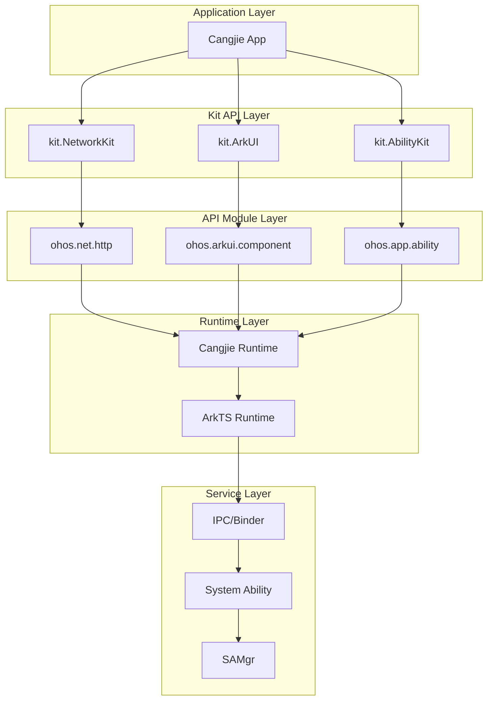
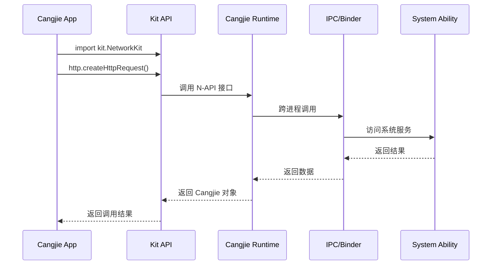

# 系统架构

## 架构概述

Cangjie SDK 采用分层架构设计，从上到下分为：

```
┌─────────────────────────────────────────────────────────────┐
│                   Cangjie Application                      │
│                  (开发者编写的业务代码)                      │
├─────────────────────────────────────────────────────────────┤
│  ┌───────────────────────────────────────────────────────┐  │
│  │                   Kit API Layer                       │  │
│  │          (Kit 聚合层：kits/*.cj.d)                    │  │
│  │     import kit.NetworkKit → 获取网络能力集合           │  │
│  └───────────────────────────────────────────────────────┘  │
│                           │                                  │
│  ┌───────────────────────────────────────────────────────┐  │
│  │                 API Module Layer                      │  │
│  │        (API 实现层：api/{Kit}/*.cj.d)                 │  │
│  │    ohos.net.http.HttpRequest → HTTP 请求类定义        │  │
│  └───────────────────────────────────────────────────────┘  │
│                           │                                  │
│  ┌───────────────────────────────────────────────────────┐  │
│  │                   Runtime Layer                        │  │
│  │        (Cangjie Runtime / ArkTS Runtime)               │  │
│  │            提供类型系统、垃圾回收、互操作等              │  │
│  └───────────────────────────────────────────────────────┘  │
│                           │                                  │
│  ┌───────────────────────────────────────────────────────┐  │
│  │              Native Service Layer                      │  │
│  │            (Native Service / System Service)           │  │
│  │           IPC, SAMgr, Native API 等底层服务              │  │
│  └───────────────────────────────────────────────────────┘  │
└─────────────────────────────────────────────────────────────┘
```

## 组件关系图



## Kit 架构设计

### Kit 聚合模式

每个 Kit 采用 **"Kit 声明 + API 模块"** 的两层设计：

```
kits/kit.NetworkKit.cj.d           # Kit 聚合声明
    └── public import ohos.net.*    # 导入 net 模块
    └── public import ohos.net.http.* # 导入 http 模块

api/NetworkKit/
    ├── ohos.net.cj.d              # 网络基础类型
    ├── ohos.net.http.cj.d         # HTTP API（1295行）
    └── ohos.net.connection.cj.d   # 连接管理 API
```

### 导入关系示例

```cangjie
// 开发者代码
import kit.NetworkKit              // 一行导入获取所有网络能力

// 等价于
import ohos.net.http.*            // HTTP 请求
import ohos.net.connection.*       // 连接管理
import ohos.net.socket.*          // Socket 通信
```

> **证据**: `kits/kit.NetworkKit.cj.d` 文件内容

## API 声明格式

### @!APILevel 注解结构

```cangjie
@!APILevel[
    since: "22",                                    // API 起始版本
    syscap: "SystemCapability.Communication.NetManager.Core", // 系统能力
    permission: "ohos.permission.GET_NETWORK_INFO",  // 权限要求
    throwexception: true                             // 是否抛出异常
]
public func getDefaultNet(): NetHandle
```

### 注解字段说明

| 字段 | 类型 | 说明 | 必填 |
|------|------|------|------|
| `since` | String | API 起始版本号 | ✅ |
| `syscap` | String | 系统能力要求 | ❌ |
| `permission` | String | 权限要求 | ❌ |
| `throwexception` | Boolean | 是否抛出异常 | ❌ |

> **证据**: `api/AbilityKit/ohos.ability_access_ctrl.cj.d` 第 36-39 行

## 数据流

### 典型 API 调用流程



### 关键数据流

| 阶段 | 涉及组件 | 说明 |
|------|---------|------|
| 导入 | Kit + Runtime | 加载 Kit 声明，初始化运行时 |
| 调用 | Kit + Runtime | 解析 API 调用，转发到 Runtime |
| 传输 | Runtime + IPC | 跨进程数据序列化 |
| 响应 | IPC + Runtime | 反序列化，返回结果 |

## 线程模型

### 线程划分

```
┌─────────────────────────────────────────────────┐
│              Main Thread (UI Thread)             │
│  • UI 渲染                                        │
│  • 用户交互响应                                    │
│  • ArkUI 组件更新                                 │
├─────────────────────────────────────────────────┤
│            Worker Thread (Runtime)               │
│  • Cangjie Runtime 执行                          │
│  • 垃圾回收                                       │
│  • 协程调度                                       │
├─────────────────────────────────────────────────┤
│           Native Thread (IPC)                   │
│  • IPC/Binder 通信                               │
│  • 系统服务调用                                   │
│  • 异步回调处理                                   │
├─────────────────────────────────────────────────┤
│           I/O Thread (Network)                  │
│  • 网络请求                                       │
│  • 文件 I/O                                      │
│  • 数据库操作                                     │
└─────────────────────────────────────────────────┘
```

### 线程约束

| 操作 | 执行线程 | 说明 |
|------|---------|------|
| UI 更新 | Main Thread | 必须主线程执行 |
| IPC 调用 | Native Thread | 异步调用，不阻塞主线程 |
| 文件 I/O | I/O Thread | 建议异步执行 |
| 定时器 | Worker Thread | Runtime 调度 |

> **注意**: 具体线程约束以各 API 的 `@!APILevel` 注解说明为准

## 系统能力映射

### syscap 分类

| 分类 | syscap 前缀 | 示例 |
|------|-------------|------|
| 通信 | `SystemCapability.Communication.*` | `IPC.Core`, `NetManager.Core` |
| 安全 | `SystemCapability.Security.*` | `AccessToken` |
| 多媒体 | `SystemCapability.Multimedia.*` | `Camera`, `Video` |
| 文件 | `SystemCapability.File.*` | `StorageManager` |
| 位置 | `SystemCapability.Location.*` | `LBS` |

> **证据**: `api/IPCKit/ohos.rpc.cj.d` 第 30 行使用 `SystemCapability.Communication.IPC.Core`

## 权限模型

### 权限校验点

```
┌─────────────────────────────────────────────────────┐
│                    Application                      │
│                   (Cangjie App)                    │
├─────────────────────────────────────────────────────┤
│                      Kit API                        │
│            (在 API 入口进行权限校验)                  │
├─────────────────────────────────────────────────────┤
│                    AtManager                        │
│         (AccessToken 权限管理)                        │
├─────────────────────────────────────────────────────┤
│                  IPC/Binder                         │
│            (向系统服务发起调用)                        │
├─────────────────────────────────────────────────────┤
│               System Ability                        │
│            (最终权限校验点)                            │
└─────────────────────────────────────────────────────┘
```

### 权限声明模式

```cangjie
// API 级别权限声明
@!APILevel[
    since: "22",
    permission: "ohos.permission.CAMERA"
]
public func getCamera(): Camera

// AccessToken 动态校验
public func checkAccessToken(
    tokenID: UInt32,
    permissionName: Permissions
): GrantStatus
```

> **证据**: `api/AbilityKit/ohos.ability_access_ctrl.cj.d` 权限管理 API

## 架构特点

### 1. 接口与实现分离

- **声明文件**: `.cj.d` 文件仅包含 API 声明，不包含实现
- **实现分离**: 实现位于各 wrapper 仓库（arkui_cangjie_wrapper 等）
- **依赖注入**: SDK 构建时链接各 wrapper 的实现库

### 2. 版本能力隔离

- **API Level**: 通过 `since` 字段隔离不同版本
- **系统能力**: 通过 `syscap` 声明所需能力
- **权限控制**: 通过 `permission` 声明运行时权限

### 3. 跨语言互操作

- **N-API**: 通过 `napi_env`、`napi_value` 类型支持 ArkTS 互操作
- **FFI**: 提供 C/C++ 外部函数接口
- **IPC**: 跨进程通信支持分布式场景

> **证据**: `api/Cangjie/ohos.ark_interop.cj.d` 定义 N-API 类型
