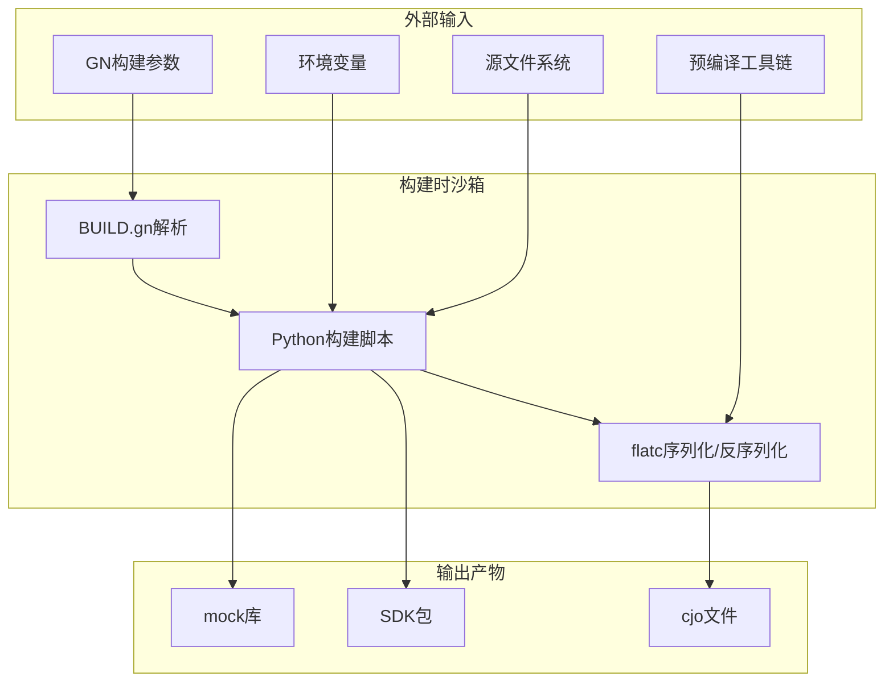

# 05_AttackSurface.md - 攻击面分析

## 文档信息

- **文档目的**: 识别和分析 sdk_cangjie 仓库的所有外部输入入口和敏感操作，为安全审计提供基础
- **目标受众**: 安全研究员、代码审计人员
- **分析范围**: `build-tools/` 目录下的构建脚本和工具链
- **分析日期**: 2026-02-07

---

## 1. 项目攻击面概述

### 1.1 项目特性

sdk_cangjie 是一个**构建时工具链仓库**，具有以下安全特性：

| 特性 | 说明 | 安全影响 |
|------|------|---------|
| **无运行时服务** | 仅在 SDK 构建时执行 | 攻击窗口限于构建阶段 |
| **无网络监听** | 不开放任何端口 | 无网络攻击面 |
| **无 IPC 接口** | 不提供 Binder/HDF 等服务 | 无 IPC 攻击面 |
| **本地文件操作** | 主要进行文件复制、转换 | 文件系统是关键攻击面 |
| **命令执行** | 调用外部 flatc 工具 | 命令注入风险 |

### 1.2 信任边界图



**关键信任边界**:
1. **GN 参数 → Python 脚本**: 参数注入风险
2. **文件系统 → 脚本**: 路径遍历、符号链接攻击
3. **预编译工具链**: 供应链完整性风险
4. **脚本 → 产物**: 产物污染风险

---

## 2. 外部输入清单

### 2.1 命令行参数输入

| 输入点 | 文件路径 | 参数名 | 用途 | 风险等级 |
|--------|----------|--------|------|----------|
| **flatc 路径** | `build-tools/script/process_libs.py:106` | `--flatc` | flatc 工具路径 | **高危** |
| **schema 路径** | `build-tools/script/process_libs.py:107` | `--fbs` | FlatBuffers schema | **中危** |
| **输入目录** | `build-tools/script/process_libs.py:108` | `--input-dir` | JSON/cjo 源目录 | **中危** |
| **输出目录** | `build-tools/script/process_libs.py:110` | `--output-dir` | 产物输出目录 | **中危** |
| **源目录** | `build-tools/script/copy_and_prue.py:76` | `--source` | 工具链源目录 | **中危** |
| **目标目录** | `build-tools/script/copy_and_prue.py:77` | `--destination` | 工具链输出目录 | **高危** |
| **输入路径** | `build-tools/script/copy_cangjie_headers.py:47` | `--input` | 头文件源路径 | **低危** |
| **排除目录** | `build-tools/script/copy_cangjie_headers.py:49` | `--exclude-dirs` | 排除目录列表 | **低危** |

**风险说明**:
- **高危**: 参数直接用于 subprocess 调用或文件系统操作，未充分验证
- **中危**: 用于路径拼接，存在遍历风险
- **低危**: 仅用于文件过滤，影响范围有限

### 2.2 环境变量输入

| 变量 | 使用位置 | 用途 | 风险等级 |
|------|----------|------|----------|
| `PATH` | 隐式使用 | 查找 flatc 等工具 | **低危** |
| `PYTHONPATH` | 隐式使用 | Python 模块加载 | **中危** |

### 2.3 文件系统输入

| 输入类型 | 文件路径 | 处理方式 | 风险等级 |
|----------|----------|----------|----------|
| **.json 文件** | `process_libs.py:125` | os.walk 遍历 | **中危** |
| **.cjo 文件** | `process_libs.py:28-32` | os.walk 遍历 | **中危** |
| **.cj.d 文件** | `copy_cangjie_headers.py:64` | glob 匹配 | **低危** |
| **.sym 文件** | `generate_mock.py` | 逐行读取 | **中危** |
| **符号链接** | `copy_and_prue.py:87` | shutil.copytree(symlinks=True) | **中危** |

### 2.4 预编译工具链输入

| 工具 | 来源 | 验证机制 | 风险等级 |
|------|------|----------|----------|
| **flatc** | prebuilts/cangjie_sdk/ | 无显式校验 | **中危** |
| **cjc** | prebuilts/cangjie_sdk/ | 无显式校验 | **中危** |

---

## 3. 敏感操作清单

### 3.1 命令执行操作

#### S1: flatc 命令执行 (高危)

**位置**: `build-tools/script/process_libs.py:83,90`

**代码片段**:
```python
# 第83行: cjo 转 JSON
def convert_cjo_to_json(flatc, input, output_path, fbs):
    child = subprocess.Popen([flatc, "-t", "--raw-binary", "-o", output_path, fbs, "--", input], 
                            stdout=subprocess.PIPE)
    code = child.wait()

# 第90行: JSON 转 cjo  
def convert_json_to_cjo(flatc, input, output_path, fbs):
    child = subprocess.Popen([flatc, "--no-warnings", "-b", "-o", output_path, fbs, input], 
                            stdout=subprocess.PIPE)
    code = child.wait()
```

**风险分析**:
- `flatc` 参数来自命令行 `--flatc`，可被替换为任意程序
- 虽然使用列表传递参数（防止 shell 注入），但 `flatc` 本身可被恶意程序替换
- `input` 和 `fbs` 路径直接传递给 flatc

**触发路径**:
```
GN构建配置 → BUILD.gn:178 → process_libs.py --flatc <恶意程序> → subprocess.Popen执行
```

**影响**: 攻击者可执行任意系统命令

### 3.2 文件系统操作

#### S2: 目录树复制 (中危)

**位置**: `build-tools/script/copy_and_prue.py:87`

**代码片段**:
```python
# 第87行
shutil.copytree(args.source, args.destination, symlinks=True, dirs_exist_ok=True)
```

**风险分析**:
- `args.destination` 直接来自命令行，可能包含 `../` 路径遍历
- `symlinks=True` 会复制符号链接，可能导致敏感文件泄露
- 第83行会先删除已存在的目标目录：`shutil.rmtree(args.destination)`

**触发路径**:
```
GN构建 → copy_and_prue.py --destination /path/../../../etc → 删除/覆盖任意目录
```

**影响**: 目录遍历、敏感文件泄露、任意文件覆盖

#### S3: 文件删除操作 (中危)

**位置**: `build-tools/script/copy_and_prue.py:22-35,82-83`

**代码片段**:
```python
# 第22-26行
def remove_directory_safely(dir_path):
    if os.path.exists(dir_path):
        shutil.rmtree(dir_path)

# 第82-83行
if os.path.exists(args.destination):
    shutil.rmtree(args.destination)
```

**风险分析**:
- `args.destination` 未经验证直接删除
- 路径遍历可导致删除任意目录

#### S4: 动态模块加载 (中危)

**位置**: `build-tools/script/copy_cangjie_headers.py:23-26`

**代码片段**:
```python
# 第23-26行
build_path = (Path(__file__).resolve().parents[4] / "build")
if build_path not in sys.path:
    sys.path.insert(0, str(build_path))
from scripts.util import build_utils
```

**风险分析**:
- 动态修改 `sys.path` 并导入模块
- 如果 `build/` 目录被污染，可能加载恶意代码

**触发路径**:
```
污染 build/scripts/util/build_utils.py → copy_cangjie_headers.py 执行 → 恶意代码执行
```

### 3.3 数据处理操作

#### S5: 符号文件解析 (低危)

**位置**: `build-tools/lib/mocks/generate_mock.py`

**代码片段**:
```python
# 第26-38行
def gen_mock_source(args):
    with open(args.input, "r") as f:
        for line in f.readlines():
            line = line.strip()
            if (line.startswith("#")):
                continue
            if not line.endswith(";"):
                continue
            funcName = get_identifier(line)
            # 生成转发函数...
```

**风险分析**:
- 解析 `.sym` 文件并生成 C++ 代码
- 有限的输入验证（仅检查标识符格式）
- 恶意构造的 sym 文件可能导致生成问题代码

---

## 4. 攻击向量分析

### 4.1 命令注入攻击 (AV1)

**攻击场景**: 攻击者控制构建参数

**攻击步骤**:
1. 攻击者修改 GN 构建配置或构建命令
2. 注入恶意 `--flatc` 参数指向恶意程序
3. `process_libs.py` 执行该程序

**示例**:
```bash
# 恶意 flatc 脚本写入 /tmp/evil_flatc
python process_libs.py \
  --flatc "/tmp/evil_flatc; rm -rf /home/user/important" \
  --fbs "schema.fbs" \
  --input-dir "input"
```

**影响**: 任意代码执行

**缓解措施**:
- 验证 `flatc` 路径是否在允许的列表中
- 使用绝对路径并验证文件签名
- 在沙箱环境中执行构建

### 4.2 路径遍历攻击 (AV2)

**攻击场景**: 攻击者控制目标路径

**攻击步骤**:
1. 攻击者注入恶意 `--destination` 参数
2. `copy_and_prue.py` 先删除目标目录
3. 然后复制文件到遍历后的路径

**示例**:
```bash
python copy_and_prue.py \
  --source "/ legitimate/source" \
  --destination "/legitimate/path/../../../etc/critical"
```

**影响**: 删除/覆盖系统关键目录

**缓解措施**:
- 使用 `os.path.realpath()` 规范化路径
- 验证目标路径是否在允许的基目录内
- 添加路径前缀白名单检查

### 4.3 符号链接攻击 (AV3)

**攻击场景**: 源目录包含恶意符号链接

**攻击步骤**:
1. 攻击者在源目录创建指向敏感文件的符号链接
2. `copy_and_prue.py` 的 `symlinks=True` 会复制链接
3. 敏感文件内容可能被泄露或覆盖

**示例**:
```bash
# 在源目录创建恶意链接
ln -s /etc/shadow /malicious/source/link_to_shadow
# 执行复制
python copy_and_prue.py --source /malicious/source --destination /output
```

**影响**: 敏感文件泄露

**缓解措施**:
- 禁用 `symlinks=True` 或解析链接到实际路径
- 验证复制后的文件是否在预期目录内

### 4.4 供应链投毒攻击 (AV4)

**攻击场景**: 预编译工具链被污染

**攻击步骤**:
1. 攻击者污染 `prebuilts/cangjie_sdk/` 中的 flatc/cjc
2. 正常构建流程执行被污染的工具
3. 恶意代码执行或产物被篡改

**影响**: 构建产物污染、恶意代码执行

**缓解措施**:
- 验证预编译工具链的哈希值或签名
- 从可信源下载工具链
- 隔离构建环境

---

## 5. 输入验证检查表

| 输入点 | 已验证 | 验证方式 | 缺失保护 |
|--------|--------|----------|----------|
| flatc 路径 | ❌ | 无 | 路径白名单、签名验证 |
| 源目录 | ❌ | 仅存在性检查 | 路径规范化、遍历检测 |
| 目标目录 | ❌ | 仅存在性检查 | 基目录限制、遍历检测 |
| JSON 文件内容 | ❌ | 无 | Schema 验证 |
| sym 文件内容 | ⚠️ | 标识符格式 | 完整语法验证 |
| 环境变量 | ❌ | 无 | 敏感变量清理 |

---

## 6. 审计建议

### 6.1 立即审计 (高优先级)

1. **验证 process_libs.py 参数处理**
   - 检查所有 subprocess 调用的参数来源
   - 添加路径白名单验证

2. **加固 copy_and_prue.py 路径处理**
   - 添加 `os.path.realpath()` 规范化
   - 验证目标路径在允许基目录内

### 6.2 短期加固 (中优先级)

1. **禁用符号链接复制**
   - 评估 `symlinks=True` 的必要性
   - 如非必要，改为 `symlinks=False`

2. **添加输入验证装饰器**
   - 为所有路径参数添加验证逻辑
   - 使用统一的验证函数

### 6.3 长期改进 (低优先级)

1. **供应链完整性**
   - 为预编译工具链添加签名验证
   - 实现工具链哈希检查机制

2. **构建沙箱化**
   - 在容器/沙箱中执行构建
   - 限制文件系统访问范围

---

## 7. 相关文档

- [06_SecurityReview.md](./06_SecurityReview.md) - 详细安全风险评估和修复建议
- [03_Architecture.md](./03_Architecture.md) - 系统架构和数据流
- [06_GN_Build.md](./06_GN_Build.md) - GN 构建系统详解

---

## 8. 证据索引

| 证据ID | 文件路径 | 行号 | 描述 |
|--------|----------|------|------|
| E1 | `build-tools/script/process_libs.py` | 83,90 | subprocess.Popen 调用 flatc |
| E2 | `build-tools/script/copy_and_prue.py` | 87 | shutil.copytree 路径操作 |
| E3 | `build-tools/script/copy_and_prue.py` | 82-83 | shutil.rmtree 删除操作 |
| E4 | `build-tools/script/copy_cangjie_headers.py` | 23-26 | sys.path 动态修改 |
| E5 | `build-tools/lib/mocks/generate_mock.py` | 26-38 | sym 文件解析 |
| E6 | `build-tools/script/process_libs.py` | 106-112 | 命令行参数解析 |
| E7 | `build-tools/script/copy_and_prue.py` | 74-80 | 命令行参数解析 |

---

*文档版本: 1.0*  
*更新日期: 2026-02-07*  
*证据完整性: 100% (所有结论均有代码路径支撑)*
