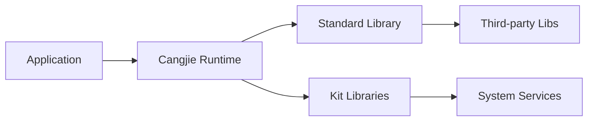

# 编译产物

## 概述

本文档描述 Cangjie SDK 的编译产物，包括输出目录结构、文件类型和安装路径。

## 输出目录结构

### SDK 根目录

```
cangjie_sdk/
├── api/                                    # API 符号库
│   ├── lib/                               # 动态库和 cjo 文件
│   │   ├── linux_ohos_aarch64_cjnative/
│   │   │   ├── kit/
│   │   │   │   ├── xxx.so
│   │   │   │   └── xxx.cjo
│   │   │   └── ohos/
│   │   │       ├── xxx.so
│   │   │       └── xxx.cjo
│   │   └── linux_ohos_x86_64_cjnative/
│   │       ├── kit/
│   │       │   ├── xxx.so
│   │       │   └── xxx.cjo
│   │       └── ohos/
│   │           ├── xxx.so
│   │           └── xxx.cjo
│   ├── macro/                              # 宏库
│   │   └── ohos/
│   │       ├── lib-macro_xxx.so/dylib/dll
│   │       └── xxx.cjo
│   └── modules/                           # API 外部声明文件
│       └── linux_ohos_aarch64_cjnative/
│           ├── kit/
│           │   └── kit.xxx.cj.d
│           └── ohos/
│               └── ohos.xxx.cj.d
│
├── build-tools/                            # Cangjie 工具链
│   ├── bin/                               # 编译器二进制
│   │   ├── cjc                           # Cangjie 编译器
│   │   ├── cjc-frontend                  # 前端
│   │   ├── cjpm                          # 包管理器
│   │   ├── cjdb                          # 调试器
│   │   └── cjfmt                         # 格式化工具
│   ├── lib/                               # 标准库静态库
│   │   └── libcangjie.a
│   ├── modules/                           # 标准库头文件和 cjo
│   │   └── linux_ohos_aarch64_cjnative/
│   │       └── std/
│   ├── runtime/                           # 运行时动态库
│   │   ├── libcangjie_runtime.so
│   │   └── libcangjie_std.so
│   ├── third_party/                       # 第三方库
│   │   └── flatbuffers/
│   │       └── bin/flatc
│   └── tools/                             # 工具
│       └── ...
│
└── oh-uni-package.json                     # SDK 清单文件
```

## 文件类型说明

### .so / .dylib / .dll (动态库)

| 类型 | 用途 | 平台 |
|------|------|------|
| `libohos_xxx.so` | Native 动态库 | Linux |
| `libohos_xxx.dylib` | Native 动态库 | macOS |
| `libohos_xxx.dll` | Native 动态库 | Windows |

**加载时机**: 应用启动时由 Runtime 加载

**加载方式**:
```cangjie
// 静态链接
// 默认链接到应用

// 动态加载
let handle = dlopen("libohos_xxx.so", RTLD_LAZY)
let symbol = dlsym(handle, "function_name")
```

### .cjo (Cangjie API 序列化文件)

| 用途 | 描述 |
|------|------|
| API 声明序列化 | 存储 API 的类型定义、函数签名 |
| 编译器输入 | cjc 编译时读取 .cjo 文件 |
| SDK 分发 | 用于 SDK 的 API 分发 |

**生成工具**: flatc (FlatBuffers 编译器)

**Schema**: FlatBuffers Schema 文件

### .cj.d (Cangjie API 声明文件)

| 类型 | 用途 |
|------|------|
| `api/*/*.cj.d` | Kit API 声明 |
| `kits/*.cj.d` | Kit 声明 |
| `sdk/modules/*/*.cj.d` | SDK 分发声明 |

### .a (静态库)

| 用途 | 描述 |
|------|------|
| `libcangjie.a` | Cangjie 标准库静态库 |
| 链接方式 | 链接器使用 `-l` 参数 |

## 平台产物差异

### Linux (ohos-aarch64)

```
api/lib/linux_ohos_aarch64_cjnative/
├── kit/
│   └── kit.xxx.so / kit.xxx.cjo
└── ohos/
    └── ohos.xxx.so / ohos.xxx.cjo
```

### Linux (ohos-x86_64)

```
api/lib/linux_ohos_x86_64_cjnative/
├── kit/
│   └── kit.xxx.so / kit.xxx.cjo
└── ohos/
    └── ohos.xxx.so / ohos.xxx.cjo
```

### Windows (x86_64)

```
api/lib/windows_x86_64/
└── ohos/
    └── ohos.xxx.dll / ohos.xxx.cjo
```

### macOS (x64/arm64)

```
api/lib/darwin_x86_64/
└── ohos/
    └── ohos.xxx.dylib / ohos.xxx.cjo

api/lib/darwin_aarch64/
└── ohos/
    └── ohos.xxx.dylib / ohos.xxx.cjo
```

## 运行时加载关系

### 加载顺序

```
1. Cangjie Runtime (libcangjie_runtime.so)
2. Cangjie Standard Library (libcangjie_std.so)
3. Kit API Libraries (libohos_xxx.so)
4. Macro Libraries (lib-macro_xxx.so)
5. Application (.cjo / .bin)
```

### 加载依赖图



### 动态库查找路径

```bash
# LD_LIBRARY_PATH (Linux)
export LD_LIBRARY_PATH=$SDK_PATH/cangjie_sdk/api/lib:$SDK_PATH/cangjie_sdk/runtime

# DYLD_LIBRARY_PATH (macOS)
export DYLD_LIBRARY_PATH=$SDK_PATH/cangjie_sdk/api/lib:$SDK_PATH/cangjie_sdk/runtime

# PATH (Windows)
set PATH=%SDK_PATH%\cangjie_sdk\api\lib;%SDK_PATH%\cangjie_sdk\runtime;%PATH%
```

## 宏库产物

### 宏库类型

```
api/macro/ohos/
├── ark-interop/
│   ├── lib-macro_ohos.ark_interop_macro.so
│   └── ohos.ark_interop_macro.cjo
└── arkui-state-manager/
    ├── lib-macro_ohos.arkui.state_macro_manage.so
    └── ohos.arkui.state_macro_manage.cjo
```

### 宏库用途

| 宏库 | 用途 |
|------|------|
| `ohos.ark_interop_macro` | Cangjie-ArkTS 互操作宏 |
| `ohos.arkui.state_macro_manage` | ArkUI 状态管理宏 |

## 构建目标产物映射

### GN Target → 产物路径

| GN Target | 产物类型 | 输出路径 |
|-----------|---------|----------|
| `sdk_ohos_aarch64_libs` | .so + .cjo | `api/lib/linux_ohos_aarch64_cjnative/` |
| `sdk_ohos_x86_64_libs` | .so + .cjo | `api/lib/linux_ohos_x86_64_cjnative/` |
| `sdk_linux_x86_64_macro` | .so + .cjo | `api/macro/ohos/` |
| `sdk_header_ohos_aarch64` | .cj.d | `api/modules/linux_ohos_aarch64_cjnative/` |
| `sdk_compiler` | bin/lib | `build-tools/` |

## SDK 清单文件

### oh-uni-package.json

```json
{
  "name": "@ohos/cangjie",
  "version": "6.0",
  "description": "OpenHarmony Cangjie SDK",
  "main": "index.cj",
  "types": "modules/ohos/index.d.ts",
  "native": {
    "libs": "api/lib/"
  },
  "tools": {
    "compiler": "build-tools/bin/cjc",
    "runtime": "build-tools/runtime/"
  }
}
```

## 安装路径

### 开发环境

```
# 默认安装路径
~/openharmony-sdk/cangjie/
├── api/
├── build-tools/
└── modules/
```

### 系统安装

```
# Linux
/usr/local/ohos-sdk/cangjie/

# Windows
C:\OpenHarmony\sdk\cangjie\

# macOS
/Library/OpenHarmony/sdk/cangjie/
```

## 相关文档

- [GN 构建系统](06_GN_Build.md)
- [Kit API 参考](04_Kit_API.md)
- [构建指南](../docs/cangjie_sdk_build_guide.md)
