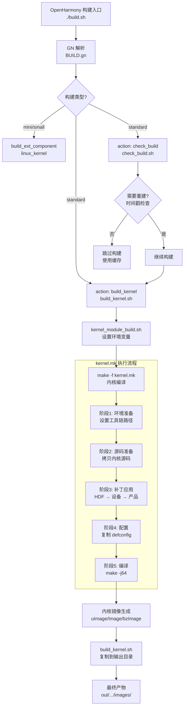

# 构建系统架构

> **更新时间**: 2026-02-06

---

## 文档目的

本文档详细说明 OpenHarmony Linux Kernel 构建系统的三层架构、构建流程和数据流，帮助理解从 GN target 到内核镜像的完整构建过程。

---

## 构建系统概述

### 三层架构

OpenHarmony Linux Kernel 构建系统采用三层架构设计：

```
┌─────────────────────────────────────────────────────────────────────┐
│                  第一层：OpenHarmony GN 构建系统                  │
│            (build.sh → ninja → BUILD.gn)                     │
└─────────────────────────────────────────────────────────────────────┘
                           │
                           ▼
┌─────────────────────────────────────────────────────────────────────┐
│                第二层：构建编排层 (Shell)                      │
│              (build_kernel.sh, kernel_module_build.sh)            │
└─────────────────────────────────────────────────────────────────────┘
                           │
                           ▼
┌─────────────────────────────────────────────────────────────────────┐
│                 第三层：内核编译层 (Make)                        │
│                (kernel.mk → make → 内核镜像)                    │
└─────────────────────────────────────────────────────────────────────┘
```

**代码证据**:
- `BUILD.gn:59-77` - 定义 `build_kernel` action 调用 `build_kernel.sh`
- `build_kernel.sh:24` - 调用 `kernel_module_build.sh`
- `kernel_module_build.sh:58` - 调用 `make -f kernel.mk`

---

## 构建流程详解

### 完整构建流程图



### 各层详细说明

#### 第一层：GN 构建系统

**入口点**:
```bash
# OpenHarmony 根目录执行
./build.sh --product-name Hi3516DV300 \
          --build-target build_kernel \
          --gn-args linux_kernel_version="linux-5.10"
```

**处理逻辑**:
1. GN 解析 `BUILD.gn` 并生成 `ninja` 构建规则
2. Ninja 执行构建目标 `:linux_kernel`
3. 触发 `build_kernel` action

**代码证据**:
```gn
// BUILD.gn:46-77
kernel_build_script_dir = "//kernel/linux/build"
kernel_source_dir = "//kernel/linux/$linux_kernel_version"

action("check_build") {
  script = "check_build.sh"
  sources = [ kernel_source_dir ]
  outputs = [ "$root_build_dir/kernel.timestamp" ]
}

action("build_kernel") {
  script = "build_kernel.sh"
  sources = [ kernel_source_dir ]
  deps = [ ":check_build" ]
  outputs = [ "$root_build_dir/packages/phone/images/$kernel_image" ]
  args = [
    rebase_path(kernel_build_script_dir, root_build_dir),
    rebase_path("$root_out_dir/../KERNEL_OBJ"),
    rebase_path("$root_build_dir/packages/phone/images"),
    build_type,
    target_cpu,
    product_path,
    device_name,
    linux_kernel_version,
  ]
}

group("linux_kernel") {
  deps = [ ":build_kernel" ]
}
```

#### 第二层：构建编排层 (Shell)

**build_kernel.sh (标准系统)**:

**功能**: 编译完成后，将内核镜像复制到输出目录

**参数**:
- `$1`: kernel_build_script_dir
- `$2`: KERNEL_OBJ_TMP_PATH (编译对象目录)
- `$3`: 输出目录 (`$root_build_dir/packages/phone/images`)
- `$4`: build_type ("standard")
- `$5`: target_cpu (arm/arm64/...)
- `$6`: product_path
- `$7`: device_name
- `$8`: kernel_version

**架构处理**:
```bash
# build_kernel.sh:29-49
kernel_image=""
if [ "$5" == "arm" ];then
    kernel_image="uImage"
elif [ "$5" == "arm64" ];then
    kernel_image="Image"
elif [ "$5" == "riscv64" ];then
    kernel_image="Image"
elif [ "$5" == "loongarch64" ];then
    kernel_image="vmlinuz.efi"
elif [ "$5" == "x86_64" ];then
    kernel_image="bzImage"
fi

# 复制内核镜像
if [ "$5" == "arm" ];then
    cp ${2}/kernel/OBJ/${8}/arch/arm/boot/uImage ${3}/uImage
    # hispark_phoenix 特殊处理
    if [ "$7" == "hispark_phoenix" ];then
        cp ${2}/kernel/OBJ/${8}/arch/arm/boot/dts/hi3751v350.dtb ${3}/dtbo.img
        cat ${2}/kernel/OBJ/${8}/arch/arm/boot/zImage ${3}/dtbo.img > ${3}/zImage-dtb
    fi
elif [ "$5" == "arm64" ];then
    cp ${2}/kernel/OBJ/${8}/arch/arm64/boot/Image ${3}/Image
fi
```

**kernel_module_build.sh (所有系统)**:

**功能**: 设置构建环境并调用 kernel.mk

**环境变量设置**:
```bash
# kernel_module_build.sh:18-44
export OUT_DIR=$1
export BUILD_TYPE=$2
export KERNEL_ARCH=$3
export PRODUCT_PATH=$4
export DEVICE_NAME=$5
export KERNEL_VERSION=$6

# 架构镜像类型判断
if [ "$KERNEL_ARCH" == "arm" ];then
    kernel_image="uImage"
elif [ "$KERNEL_ARCH" == "arm64" ];then
    kernel_image="Image"
elif [ "$KERNEL_ARCH" == "x86_64" ];then
    kernel_image="bzImage"
elif [ "$KERNEL_ARCH" == "loongarch64" ];then
    kernel_image="vmlinuz.efi"
fi
export KERNEL_IMAGE=${kernel_image}

# 特殊设备处理
if [ "$DEVICE_NAME" == "hispark_phoenix" ];then
    export SDK_SOURCE_DIR=${OHOS_ROOT_PATH}/device/soc/hisilicon/hi3751v350/sdk_linux/source
fi
```

#### 第三层：内核编译层 (Make)

**kernel.mk 详细执行流程**:

##### 阶段 1: 环境准备

```makefile
# kernel.mk:17-32
PRODUCT_NAME=$(TARGET_PRODUCT)
OHOS_BUILD_HOME := $(realpath $(shell pwd)/../../../)

KERNEL_SRC_TMP_PATH := $(OUT_DIR)/kernel/${KERNEL_VERSION}
KERNEL_OBJ_TMP_PATH := $(OUT_DIR)/kernel/OBJ/${KERNEL_VERSION}

ifeq ($(BUILD_TYPE), standard)
    BOOT_IMAGE_PATH = $(OHOS_BUILD_HOME)/device/board/hisilicon/hispark_taurus/uboot/prebuilts
    KERNEL_SRC_TMP_PATH := $(OUT_DIR)/kernel/src_tmp/${KERNEL_VERSION}
    export KERNEL_SRC_DIR=out/KERNEL_OBJ/kernel/src_tmp/${KERNEL_VERSION}
endif

KERNEL_SRC_PATH := $(OHOS_BUILD_HOME)/kernel/linux/${KERNEL_VERSION}
KERNEL_PATCH_PATH := $(OHOS_BUILD_HOME)/kernel/linux/patches/${KERNEL_VERSION}
KERNEL_CONFIG_PATH := $(OHOS_BUILD_HOME)/kernel/linux/config/${KERNEL_VERSION}
PREBUILTS_GCC_DIR := $(OHOS_BUILD_HOME)/prebuilts/gcc
CLANG_HOST_TOOLCHAIN := $(OHOS_BUILD_HOME)/prebuilts/clang/ohos/linux-x86_64/llvm/bin
KERNEL_HOSTCC := $(CLANG_HOST_TOOLCHAIN)/clang
KERNEL_PREBUILT_MAKE := make
CLANG_CC := $(CLANG_HOST_TOOLCHAIN)/clang
```

##### 阶段 2: 源码准备

```makefile
# kernel.mk:86-94
$(KERNEL_IMAGE_FILE):
	$(hide) echo "build kernel..."
ifeq ($(DEVICE_NAME), hispark_phoenix)
	$(hide) rm -rf $(KERNEL_SRC_TMP_PATH);mkdir -p $(KERNEL_SRC_TMP_PATH)
	$(hide) cp -arfP $(KERNEL_SRC_PATH)/* $(KERNEL_SRC_TMP_PATH)/
	$(hide) cd $(KERNEL_SRC_TMP_PATH)/drivers && rm -rf common && ln -s $(SDK_SOURCE_DIR)/common/drv ./common && cd -
	$(hide) cd $(KERNEL_SRC_TMP_PATH)/drivers && rm -rf msp && ln -s $(SDK_SOURCE_DIR)/msp/drv ./msp && cd -
else
	$(hide) rm -rf $(KERNEL_SRC_TMP_PATH);mkdir -p $(KERNEL_SRC_TMP_PATH);cp -arfL $(KERNEL_SRC_PATH)/* $(KERNEL_SRC_TMP_PATH)/
endif
```

##### 阶段 3: 补丁应用

```makefile
# kernel.mk:95-108
$(hide) $(OHOS_BUILD_HOME)/drivers/hdf_core/adapter/khdf/linux/patch_hdf.sh \
    $(OHOS_BUILD_HOME) $(KERNEL_SRC_TMP_PATH) $(KERNEL_PATCH_PATH) $(DEVICE_NAME)

ifeq ($(PRODUCT_PATH), vendor/hisilicon/watchos)
	$(hide) cd $(KERNEL_SRC_TMP_PATH) && patch -p1 < $(PRODUCT_PATCH_FILE)
else
	$(hide) cd $(KERNEL_SRC_TMP_PATH) && test -f $(DEVICE_PATCH_FILE) && patch -p1 < $(DEVICE_PATCH_FILE) || true
endif

ifneq ($(findstring $(BUILD_TYPE), small),)
	$(hide) cd $(KERNEL_SRC_TMP_PATH) && patch -p1 < $(SMALL_PATCH_FILE)
endif

ifeq ($(UNIFIED_COLLECTION_PATCH_FILE), $(wildcard $(UNIFIED_COLLECTION_PATCH_FILE)))
	$(hide) $(UNIFIED_COLLECTION_PATCH_FILE) $(OHOS_BUILD_HOME) $(KERNEL_SRC_TMP_PATH) $(DEVICE_NAME) $(KERNEL_VERSION)
endif
```

##### 阶段 4: 配置

```makefile
# kernel.mk:109-115
$(hide) cp -rf $(KERNEL_CONFIG_PATH)/. $(KERNEL_SRC_TMP_PATH)/
$(hide) $(KERNEL_MAKE) -C $(KERNEL_SRC_TMP_PATH) ARCH=$(KERNEL_ARCH) $(KERNEL_CROSS_COMPILE) distclean
$(hide) $(KERNEL_MAKE) -C $(KERNEL_SRC_TMP_PATH) ARCH=$(KERNEL_ARCH) $(KERNEL_CROSS_COMPILE) $(DEFCONFIG_FILE)
ifeq ($(KERNEL_VERSION), linux-5.10)
	$(hide) $(KERNEL_MAKE) -C $(KERNEL_SRC_TMP_PATH) ARCH=$(KERNEL_ARCH) $(KERNEL_CROSS_COMPILE) modules_prepare
endif
```

##### 阶段 5: 编译

```makefile
# kernel.mk:115
$(hide) $(KERNEL_MAKE) -C $(KERNEL_SRC_TMP_PATH) ARCH=$(KERNEL_ARCH) $(KERNEL_CROSS_COMPILE) -j64 $(KERNEL_IMAGE)

ifeq ($(DEVICE_NAME), hispark_phoenix)
	$(hide) $(KERNEL_MAKE) -C $(KERNEL_SRC_TMP_PATH) ARCH=$(KERNEL_ARCH) $(KERNEL_CROSS_COMPILE) dtbs
endif
```

---

## 关键组件关系

### GN Target → Shell Script → Makefile

```
GN Target (BUILD.gn)           Shell Script              Makefile (kernel.mk)
────────────────────           ────────────            ──────────────
linux_kernel (group)  →    build_kernel.sh   →    kernel_module_build.sh
                                  │                       │
                                  └───────────────┘
                                                         ↓
                                                    make -f kernel.mk
                                                         │
                                                         ↓
                                                    内核镜像生成
```

**代码证据**:
- `BUILD.gn:79-81` - `linux_kernel` group target
- `build_kernel.sh:24` - `./kernel_module_build.sh`
- `kernel_module_build.sh:58` - `make -f kernel.mk`

### 数据流：配置 → 补丁 → 编译 → 镜像

```
配置文件 (defconfig)         补丁文件 (patch)         内核源码 (source)
─────────────────           ───────────────           ─────────────
kernel/linux/config/         kernel/linux/patches/       kernel/linux/linux-5.10/
${KERNEL_VERSION}/          ${KERNEL_VERSION}/
├── arch/arm/configs/     ├── common_patch/          ├── drivers/
│   └── *defconfig       │   └── hdf.patch        │   ├── crypto/
├── arch/arm64/configs/   ├── hispark_taurus_patch/  │   ├── net/
│   └── *defconfig       │   └── hispark_taurus.patch├── mm/
│                        └── rk3568_patch/         │   └── ...
│                            ├── kernel.patch
│                            └── hdf.patch
         │                         │                     │
         └─────────┬───────────────┘───────┬─────────┘
                   │                              │
                   ▼                              ▼
           ┌──────────────────────────────────────────────────────┐
           │      内核编译 (kernel.mk)                     │
           │  1. 应用补丁                             │
           │  2. 应用配置                             │
           │  3. 编译内核                             │
           │  4. 生成镜像                             │
           └──────────────────────────────────────────────────────┘
                              │
                              ▼
                    out/.../packages/phone/images/
                    ├── uImage (arm)
                    ├── Image (arm64/riscv64)
                    ├── bzImage (x86_64)
                    └── vmlinuz.efi (loongarch64)
```

---

## 增量构建机制

### 时间戳检查

**check_build.sh** 实现增量构建：

```bash
# check_build.sh:18-30
function readfile () {
    for file in $1/*
    do
        if [ -d "$file" ];then
	    readfile $file $2 $3
        elif [ "$file" -nt "$2" ]; then
            echo $file is update
            touch $3;  # 触发重建
            return
        fi
    done
}

echo $1 for check kernel dir
echo $2 for output image
echo $3 for timestamp
if [ -e "$2" ]; then
    readfile $1 $2 $3
    if [ "$3" -nt "$2" ]; then
        echo "need update $2"
        rm -rf $2;  # 删除旧镜像
    fi
fi
```

**逻辑**:
- 遍历内核源码目录
- 检查是否有文件比输出镜像新
- 如果有新文件，触发重建

**代码证据**:
- `BUILD.gn:51-52` - 输出 `kernel.timestamp`
- `build_kernel.sh:26` - 删除 `kernel.timestamp`

---

## 构建系统特性

### 1. 并行编译

使用 `make -j64` 实现 64 并行编译任务。

**代码证据**:
```makefile
# kernel.mk:115
$(hide) $(KERNEL_MAKE) -C $(KERNEL_SRC_TMP_PATH) ARCH=$(KERNEL_ARCH) $(KERNEL_CROSS_COMPILE) -j64 $(KERNEL_IMAGE)
```

### 2. 交叉编译

支持多种架构的交叉编译：

| 架构 | 交叉编译器 | 目标平台 |
|--------|----------|---------|
| arm | arm-linux-gnueabi-gcc | ARM 32位 |
| arm64 | aarch64-linux-gnu-gcc | ARM 64位 |
| riscv64 | clang (LLVM) | RISC-V 64位 |
| x86_64 | gcc | x86_64 |
| loongarch64 | loongarch64-linux-gnu-gcc | LoongArch 64位 |

**代码证据**:
- `kernel.mk:36-56` - 工具链路径配置
- `kernel_build.py:367-375` - Python CI 构建使用交叉编译器

### 3. 构建类型变体

支持两种构建变体：

| 构建类型 | 输出目录 | 配置文件 |
|---------|---------|---------|
| small | `out/kernel/${KERNEL_VERSION}` | `${DEVICE_NAME}_small_defconfig` |
| standard | `out/kernel/src_tmp/${KERNEL_VERSION}` | `${DEVICE_NAME}_standard_defconfig` |

**代码证据**:
- `kernel.mk:23-25` - small 系统输出路径
- `kernel.mk:21-23` - standard 系统输出路径

---

## 相关文档

- [项目概览](01_Project_Overview.md) - 项目定位与核心能力
- [GN Targets](04_GN_Targets.md) - GN 构建目标清单
- [构建脚本](05_Build_Scripts.md) - 脚本详细分析
- [内核配置](06_Kernel_Configuration.md) - defconfig 管理机制
- [补丁管理](07_Patch_Management.md) - 补丁应用机制详解
