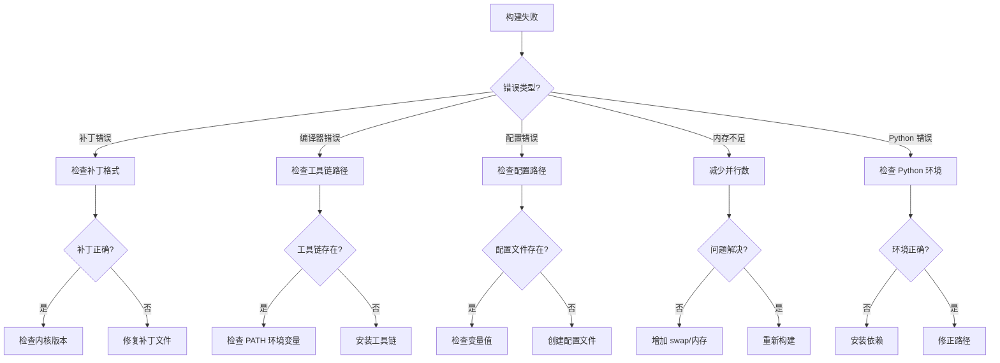

# 故障排查

> **更新时间**: 2026-02-06

---

## 文档目的

本文档提供 OpenHarmony Linux Kernel 构建系统的常见问题诊断和解决方案，包括构建错误、配置问题和调试技巧。

---

## 常见构建错误

### 错误 1: 补丁应用失败

**错误信息**:
```
patching file drivers/xxx/xxx.c
Hunk #1 FAILED at ...
```

**原因**:
- 补丁与当前内核版本不匹配
- 源码已被其他补丁修改
- 补丁格式错误

**代码证据**:
```makefile
# kernel.mk:97-101 - 补丁应用位置
$(hide) cd $(KERNEL_SRC_TMP_PATH) && test -f $(DEVICE_PATCH_FILE) && patch -p1 < $(DEVICE_PATCH_FILE) || true
```

**定位步骤**:

1. **检查补丁格式**:
```bash
# 验证补丁文件
patch --dry-run -p1 < patch_file
```

2. **检查内核版本**:
```bash
# 查看内核版本
cd ${KERNEL_SRC_TMP_PATH}
make kernelversion
```

3. **检查源码状态**:
```bash
# 检查文件是否已被修改
cd ${KERNEL_SRC_TMP_PATH}
git status drivers/xxx/xxx.c
```

**解决方案**:

- 如果版本不匹配：使用对应内核版本的补丁
- 如果源码已修改：回滚已修改的文件或创建合并补丁
- 如果格式错误：修复补丁文件

---

### 错误 2: 编译器未找到

**错误信息**:
```
make: arm-linux-gnueabi-gcc: Command not found
```

**原因**:
- 工具链路径配置错误
- 工具链未安装
- PATH 环境变量错误

**代码证据**:
```makefile
# kernel.mk:30-56 - 工具链路径配置
KERNEL_TARGET_TOOLCHAIN := $(PREBUILTS_GCC_DIR)/linux-x86/arm/gcc-linaro-7.5.0-arm-linux-gnueabi/bin
KERNEL_TARGET_TOOLCHAIN_PREFIX := $(KERNEL_TARGET_TOOLCHAIN)/arm-linux-gnueabi-
```

**定位步骤**:

1. **检查工具链路径**:
```bash
# 验证工具链路径
ls -la ${PREBUILTS_GCC_DIR}/linux-x86/arm/gcc-linaro-7.5.0-arm-linux-gnueabi/bin/
```

2. **检查 PATH 环境变量**:
```bash
# 查看 PATH
echo $PATH | tr ':' '\n' | grep clang
```

3. **检查工具链符号链接**:
```bash
# 检查 arm-linux-gnueabi-gcc
which arm-linux-gnueabi-gcc
```

**解决方案**:

- 确认 `PREBUILTS_GCC_DIR` 路径正确
- 安装缺失的工具链
- 修复 PATH 环境变量
- 重新运行 `./build/prebuilts_download.py`（如果可用）

---

### 错误 3: 配置文件不存在

**错误信息**:
```
make: *** No rule to make target 'xxx_defconfig'
make: *** No rule to make target 'menuconfig'
```

**原因**:
- defconfig 文件路径错误
- 配置文件命名不符合规则
- 内核源码目录未正确设置

**代码证据**:
```makefile
# kernel.mk:81 - defconfig 文件名定义
DEFCONFIG_FILE := $(DEVICE_NAME)_$(BUILD_TYPE)_defconfig
```

**定位步骤**:

1. **检查配置路径**:
```bash
# 验证配置目录
ls -la ${KERNEL_CONFIG_PATH}/arch/${KERNEL_ARCH}/configs/
```

2. **检查变量值**:
```bash
# 打印关键变量
echo "KERNEL_VERSION=$KERNEL_VERSION"
echo "DEVICE_NAME=$DEVICE_NAME"
echo "BUILD_TYPE=$BUILD_TYPE"
```

3. **检查文件是否存在**:
```bash
# 验证配置文件
test -f ${KERNEL_CONFIG_PATH}/${DEVICE_NAME}_${BUILD_TYPE}_defconfig
```

**解决方案**:

- 确认配置文件存在于正确路径
- 检查 `DEVICE_NAME` 和 `BUILD_TYPE` 变量
- 创建缺失的配置文件（可基于通用配置）

---

### 错误 4: 内存不足

**错误信息**:
```
cc1: out of memory allocating ...
make: *** [build_name] Internal error
```

**原因**:
- 并行编译数量过多
- 系统内存不足
- 单个编译单元过大

**代码证据**:
```makefile
# kernel.mk:115 - 并行编译配置
$(hide) $(KERNEL_MAKE) -C $(KERNEL_SRC_TMP_PATH) ARCH=$(KERNEL_ARCH) $(KERNEL_CROSS_COMPILE) -j64 $(KERNEL_IMAGE)
```

**定位步骤**:

1. **查看系统内存**:
```bash
# 查看内存使用
free -h
```

2. **查看编译进程**:
```bash
# 查看活跃的编译进程
ps aux | grep cc1
```

3. **检查 swap 空间**:
```bash
# 查看 swap
swapon --show
```

**解决方案**:

- 减少并行编译数量（修改 `-j64` 为 `-j16` 或 `-j$(nproc)`）
- 增加 swap 空间
- 增加系统内存
- 在 `kernel.mk` 中添加 `make -j$(shell nproc)`

---

### 错误 5: Python 构建脚本失败

**错误信息**:
```
kernel_build.py: FileNotFoundError: [Errno 2] No such file or directory
```

**原因**:
- 内核源码路径未设置
- Python 脚本版本不兼容
- 依赖库缺失

**代码证据**:
```python
# kernel_build.py:360-361 - 内核路径定义
config_path = './kernel/linux/config/linux-5.10/arch/{0}/{1}'
knl_path = './kernel/linux/linux-5.10'
```

**定位步骤**:

1. **检查 Python 环境**:
```bash
# 验证 Python 和依赖
python3 --version
python3 -c "import subprocess, sys, re, os, time, logging"
```

2. **检查路径定义**:
```bash
# 验证路径是否存在
ls -la ./kernel/linux/config/linux-5.10/
ls -la ./kernel/linux/linux-5.10/
```

3. **运行脚本调试模式**:
```bash
# 启用详细输出
python3 -u kernel_build.py
```

**解决方案**:

- 确保内核源码已下载
- 安装缺失的 Python 依赖
- 修正脚本中的路径定义

---

## 调试技巧

### 启用详细输出

#### kernel.mk 详细模式

**方法**: 移除 `@$(hide)` 前缀

**代码证据**:
```makefile
# kernel.mk:86-115 - 当前使用 @$(hide) 隐藏输出
$(hide) echo "build kernel..."

# 临时修改为详细输出
# echo "build kernel..."
```

**操作**: 编辑 `kernel.mk`，注释或删除所有 `@$(hide)` 前缀

#### Shell 脚本详细模式

**方法**: 添加 `set -x` 或 `bash -x`

**代码证据**:
```bash
# build_kernel.sh:16 - 当前不启用详细模式
set -e

# 临时启用详细模式
# set -xe
```

**操作**: 在脚本开头添加 `set -x`，或用 `bash -x` 执行

### 构建日志收集

#### 记录 make 输出

**方法**: 重定向 make 输出到日志文件

```bash
# 在 kernel.mk 中修改
$(hide) $(KERNEL_MAKE) -C $(KERNEL_SRC_TMP_PATH) ARCH=$(KERNEL_ARCH) $(KERNEL_CROSS_COMPILE) -j64 $(KERNEL_IMAGE) 2>&1 | tee $(OUT_DIR)/kernel_build.log
```

#### 记录环境变量

**方法**: 在构建开始时导出关键变量

```bash
# 在 kernel_module_build.sh 中添加
echo "=== Environment Variables ===" > $(OUT_DIR)/build_env.log
echo "KERNEL_VERSION=$KERNEL_VERSION" >> $(OUT_DIR)/build_env.log
echo "KERNEL_ARCH=$KERNEL_ARCH" >> $(OUT_DIR)/build_env.log
echo "BUILD_TYPE=$BUILD_TYPE" >> $(OUT_DIR)/build_env.log
```

### 检查中间产物

#### 查看编译对象

```bash
# 检查编译生成的对象
ls -la ${KERNEL_OBJ_TMP_PATH}/drivers/xxx/
```

#### 查看符号表

```bash
# 提取并查看内核符号
nm ${KERNEL_OBJ_TMP_PATH}/vmlinux | grep -E " (T|D) "
```

#### 查看模块

```bash
# 查看编译的内核模块
ls -la ${KERNEL_OBJ_TMP_PATH}/drivers/*.ko
```

---

## 诊断流程图



---

## 日志分析

### 编译警告分析

**使用 kernel_build.py 警告解析器**:

```bash
# 运行 Python 构建脚本
python3 kernel_build.py

# 脚本自动解析警告并分类
# - 已知警告（可忽略）
# - 新警告（需修复）
```

**代码证据**:
```python
# kernel_build.py:24-33 - 已知警告列表
ignores = [
    "include/trace/events/eas_sched.h: warning: format '%d' expects argument of type 'int'...",
    "drivers/block/zram/zram_drv.c: warning: left shift count >= width of type",
]
```

### 编译错误分析

**常见错误模式**:

| 错误模式 | 原因 | 解决方案 |
|---------|------|---------|
| `error: implicit declaration` | 缺少头文件 | 添加 `#include` |
| `error: 'xxx' undeclared` | 符号未定义 | 添加声明或链接 |
| `error: conflicting types` | 类型冲突 | 使用不同的名称或类型转换 |
| `error: 'xxx' redeclared` | 重复声明 | 删除重复定义 |

### 日志文件位置

| 日志类型 | 路径 | 用途 |
|---------|------|--------|
| 构建日志 | `$(OUT_DIR)/kernel_build.log` | make 输出 |
| 环境日志 | `$(OUT_DIR)/build_env.log` | 环境变量 |
| 警告日志 | `$(OUT_DIR)/kernel_warnings.txt` | 编译警告 |
| 时间戳 | `$(OUT_DIR)/kernel.timestamp` | 增量构建状态 |

---

## 常用调试命令

### 清理构建

```bash
# 完全清理
cd ${KERNEL_SRC_TMP_PATH}
make ARCH=${KERNEL_ARCH} distclean

# 仅清理对象
make ARCH=${KERNEL_ARCH} clean
```

### 单独编译模块

```bash
# 编译特定模块
cd ${KERNEL_SRC_TMP_PATH}
make ARCH=${KERNEL_ARCH} drivers/xxx/xxx.o

# 编译特定子目录
make ARCH=${KERNEL_ARCH} M=drivers/net/ethernet
```

### 查看配置

```bash
# 查看当前配置
cd ${KERNEL_SRC_TMP_PATH}
make ARCH=${KERNEL_ARCH} savedefconfig

# 图形化配置
make ARCH=${KERNEL_ARCH} menuconfig
```

### 验证内核

```bash
# 验证内核镜像
file ${KERNEL_OBJ_TMP_PATH}/arch/arm/boot/uImage

# 提取内核信息
extract-ikconfig ${KERNEL_OBJ_TMP_PATH}/arch/arm/boot/uImage > /tmp/config
cat /tmp/config | grep CONFIG_
```

---

## 性能优化

### 加速构建

1. **启用 ccache**:
```bash
# 设置 CCACHE
export CCACHE_DIR=/path/to/ccache
export CC="ccache gcc"
```

2. **优化并行编译**:
```makefile
# kernel.mk:115 - 根据核心数调整
$(hide) $(KERNEL_MAKE) -C $(KERNEL_SRC_TMP_PATH) ARCH=$(KERNEL_ARCH) $(KERNEL_CROSS_COMPILE) -j$(shell nproc) $(KERNEL_IMAGE)
```

3. **使用分布式编译**:
```bash
# 如果可用，使用 distcc
export DISTCC_HOSTS="host1,host2"
make ARCH=${KERNEL_ARCH} CC=distcc
```

### 减小镜像大小

1. **启用压缩**:
```kconfig
# 使用压缩内核
CONFIG_KERNEL_GZIP=y
CONFIG_KERNEL_XZ=y
```

2. **禁用不需要的模块**:
```kconfig
# 禁用不需要的驱动
# CONFIG_WLAN=n
# CONFIG_SOUND=n
```

3. **优化编译选项**:
```kconfig
# 启用 LTO
CONFIG_LTO=y
CONFIG_LTO_CLANG=y
```

---

## 获取帮助

### 官方资源

- [OpenHarmony 文档](https://gitee.com/openharmony/docs)
- [问题追踪](https://gitee.com/openharmony/issues)
- [社区论坛](https://developer.huawei.com/consumer/cn/forum/home)

### 构建相关仓库

- [kernel_linux_build](https://gitee.com/openharmony/kernel_linux_build)
- [kernel_linux_patches](https://gitee.com/openharmony/kernel_linux_patches)
- [kernel_linux_config](https://gitee.com/openharmony/kernel_linux_config)

### 工具文档

- [Make 文档](https://www.gnu.org/software/make/manual/)
- [patch 文档](https://man7.org/linux/man-pages/man1/patch.1.html)
- [Kconfig 文档](https://www.kernel.org/doc/html/latest/kbuild/kconfig-language.html)

---

## 相关文档

- [项目概览](01_Project_Overview.md) - 项目定位与核心能力
- [构建系统架构](03_Build_System_Architecture.md) - 构建流程详解
- [构建脚本](05_Build_Scripts.md) - Shell 脚本详细分析
- [内核配置](06_Kernel_Configuration.md) - defconfig 管理机制
- [安全评审](09_Security_Review.md) - 安全风险分析
