# 架构图与数据流

## 概述

本文档使用 Mermaid 图表展示 OpenHarmony Linux Kernel 5.10 的架构、数据流和线程模型。

## 1. 整体架构图

### 1.1 内核架构概览

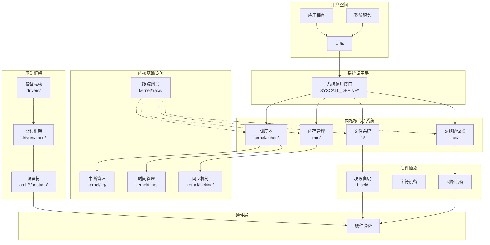

### 1.2 OpenHarmony 特有组件

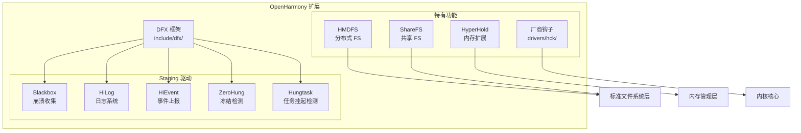

## 2. 数据流图

### 2.1 系统调用处理流程

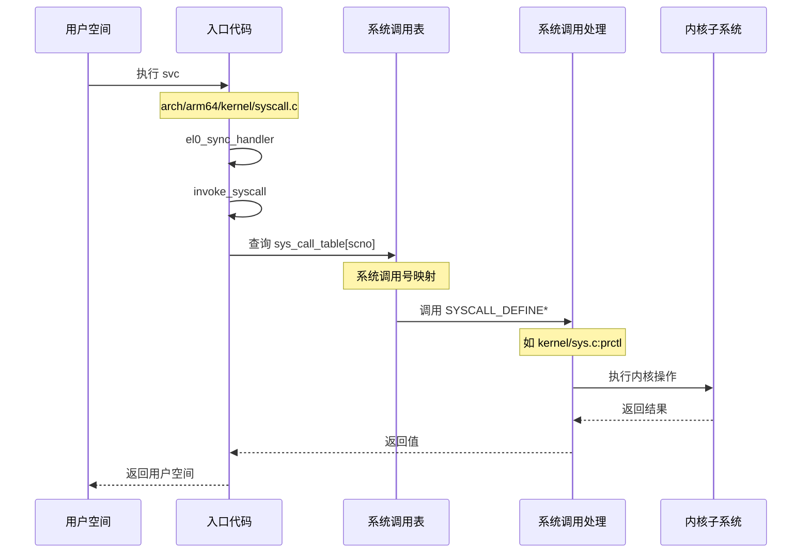

### 2.2 内存管理数据流

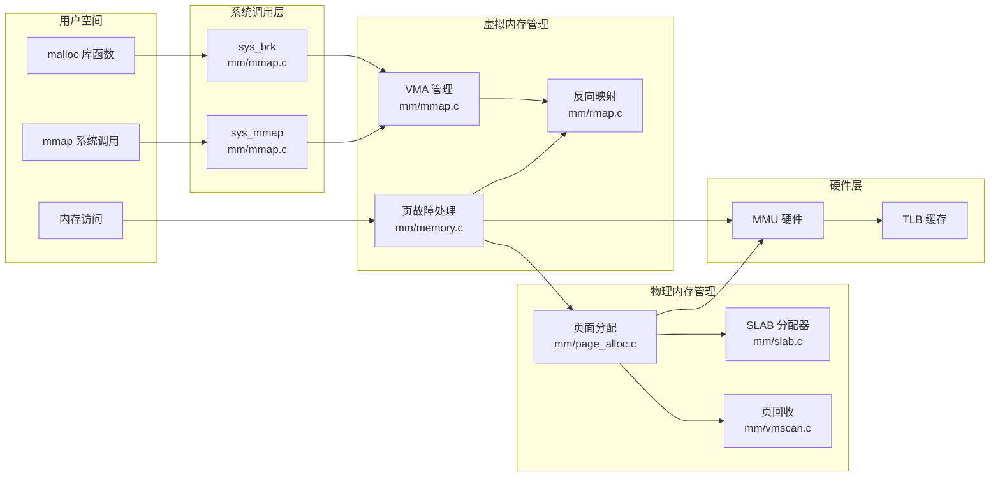

### 2.3 文件系统数据流

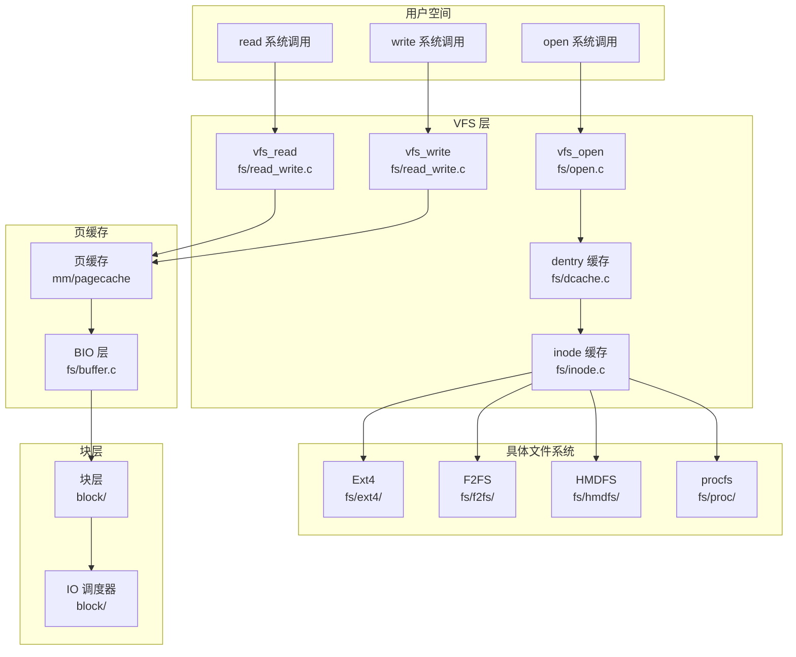

### 2.4 网络数据流

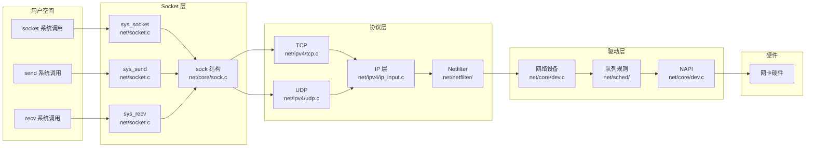

## 3. 线程模型

### 3.1 调度器架构

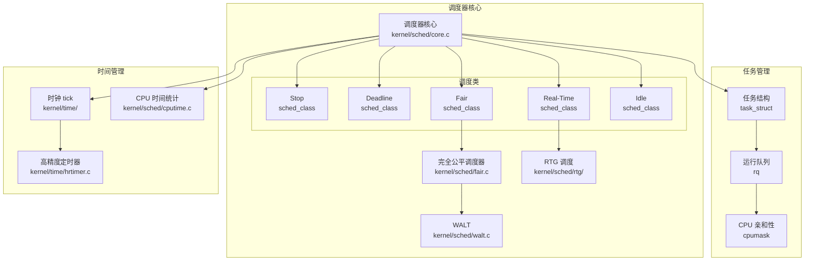

### 3.2 中断处理流程

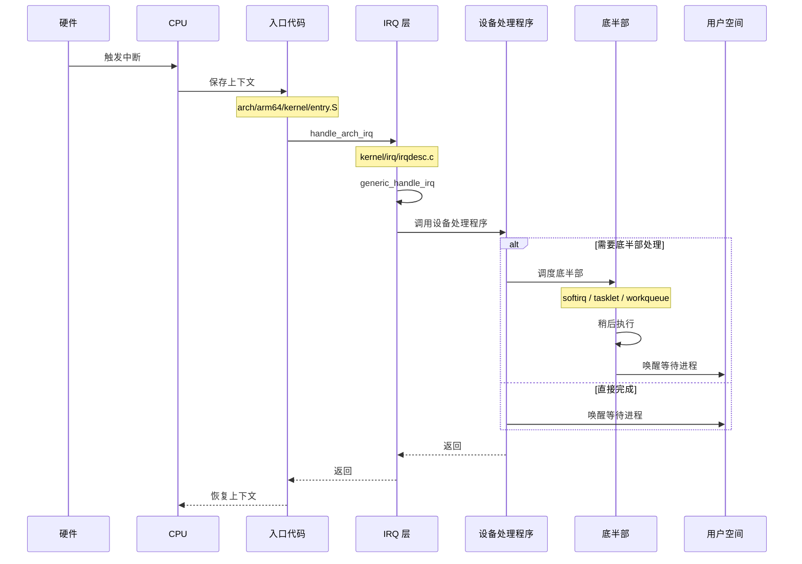

### 3.3 工作队列模型

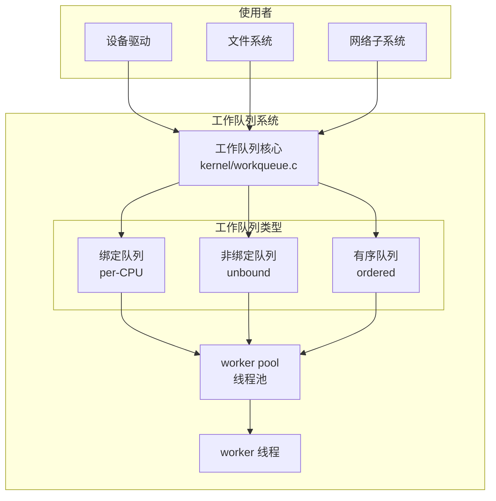

## 4. 内存映射关系

### 4.1 内核地址空间布局 (ARM64)

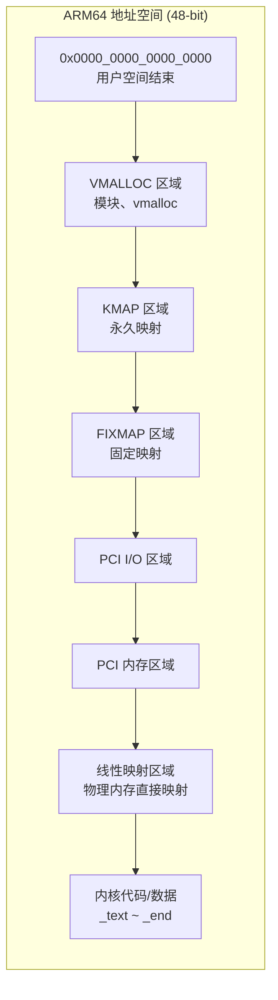

### 4.2 物理内存管理

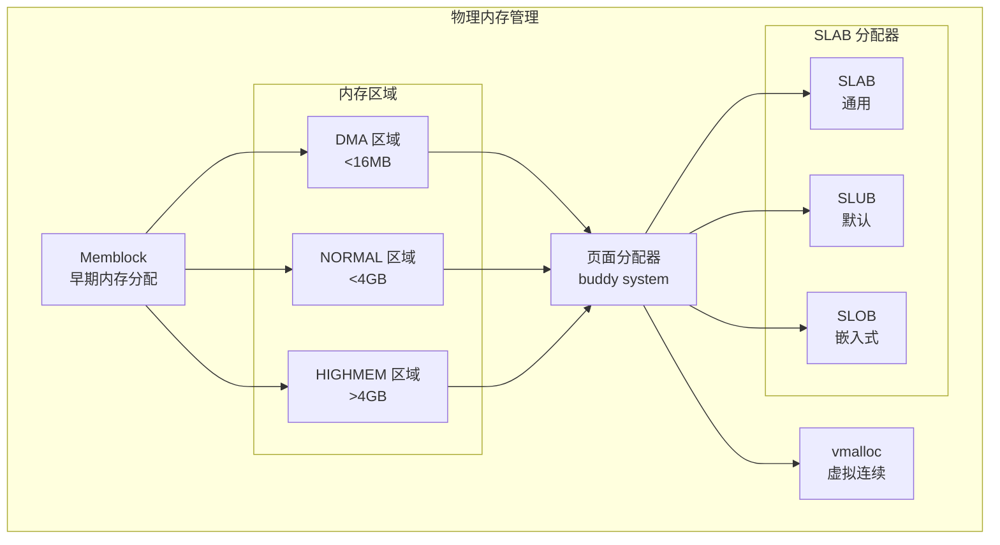

## 5. 安全架构

### 5.1 LSM 框架

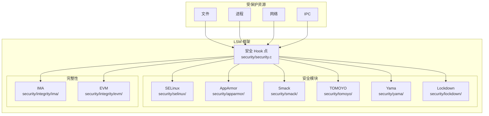

## 6. 设备驱动模型

### 6.1 驱动框架架构

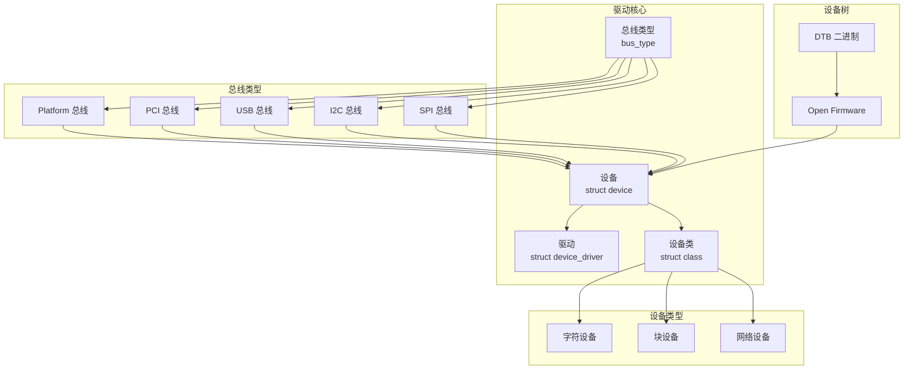

---

*生成时间: 2026-02-06*
