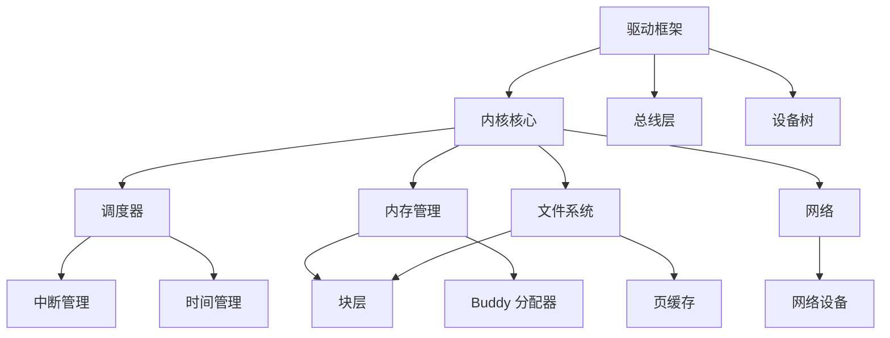

# 内部 API 文档

## 概述

本文档描述 OpenHarmony Linux Kernel 5.10 内部模块间的接口、依赖关系和稳定性等级。

## 1. 模块接口分类

### 1.1 接口稳定性等级

| 等级 | 说明 | 示例 |
|------|------|------|
| **Stable** | 跨版本保持稳定 | 系统调用接口 |
| **Unstable** | 可能变化 | 内核内部函数 |
| **Internal** | 仅限内部使用 | 静态函数、私有头文件 |
| **Deprecated** | 已弃用 | 标记为废弃的函数 |

### 1.2 头文件层级

```
include/
├── linux/              # 内核内部 API
│   ├── export.h        # EXPORT_SYMBOL 定义
│   ├── module.h        # 模块 API
│   └── ...
├── uapi/linux/         # 用户空间 API (稳定)
│   ├── unistd.h        # 系统调用号
│   ├── ioctl.h         # ioctl 定义
│   └── ...
└── asm-generic/        # 通用汇编 API
```

## 2. 核心子系统接口

### 2.1 进程调度接口

**头文件**: `include/linux/sched.h`, `kernel/sched/sched.h`

| 函数 | 功能 | 稳定性 |
|------|------|--------|
| `wake_up_process()` | 唤醒进程 | Stable |
| `schedule()` | 调度器入口 | Stable |
| `set_task_state()` | 设置任务状态 | Stable |
| `find_task_by_vpid()` | 通过 PID 查找任务 | Unstable |

**调度类接口** (`kernel/sched/sched.h`):
```c
const struct sched_class fair_sched_class;
const struct sched_class rt_sched_class;
const struct sched_class dl_sched_class;
const struct sched_class stop_sched_class;
const struct sched_class idle_sched_class;
```

**OpenHarmony 扩展**:
- `kernel/sched/rtg/` - RTG 调度接口
- `kernel/sched/walt.c` - WALT 负载跟踪

### 2.2 内存管理接口

**头文件**: `include/linux/mm.h`, `include/linux/gfp.h`

| 函数 | 功能 | 稳定性 |
|------|------|--------|
| `kmalloc()` / `kfree()` | 内核内存分配/释放 | Stable |
| `vmalloc()` / `vfree()` | 虚拟内存分配/释放 | Stable |
| `__get_free_pages()` | 分配物理页面 | Stable |
| `mmap()` / `munmap()` | 内存映射 | Stable |
| `kmem_cache_alloc()` | SLAB 分配 | Stable |

**页面分配标志** (`include/linux/gfp.h`):
```c
GFP_KERNEL      // 标准内核分配
GFP_ATOMIC      // 原子分配（不睡眠）
GFP_DMA         // DMA 可用内存
GFP_USER        // 用户空间内存
GFP_HIGHUSER    // 高端内存
```

**OpenHarmony 扩展**:
- `mm/purgeable.c` - Purgeable 内存接口
- `drivers/hyperhold/` - HyperHold 接口

### 2.3 文件系统接口

**VFS 接口** (`include/linux/fs.h`):

| 结构体 | 功能 | 稳定性 |
|--------|------|--------|
| `struct file_operations` | 文件操作 | Stable |
| `struct inode_operations` | inode 操作 | Stable |
| `struct super_operations` | 超级块操作 | Stable |
| `struct address_space_operations` | 页缓存操作 | Stable |

**常用 VFS 函数**:
```c
// 文件操作
vfs_read(), vfs_write()
vfs_open(), vfs_close()

// inode 操作
lookup_one_len(), lookup_hash()

// 超级块操作
mount_bdev(), kill_block_super()
```

### 2.4 网络子系统接口

**核心结构** (`include/linux/net.h`, `include/net/sock.h`):

| 结构体 | 功能 | 稳定性 |
|--------|------|--------|
| `struct sock` | 套接字结构 | Stable |
| `struct sk_buff` | Socket 缓冲区 | Stable |
| `struct net_device` | 网络设备 | Stable |
| `struct packet_type` | 协议处理 | Stable |

**网络 API**:
```c
// Socket 创建
sock_create(), sock_release()

// 数据包处理
skb_alloc(), skb_free()
netif_rx(), netif_receive_skb()

// 设备操作
register_netdev(), unregister_netdev()
```

## 3. 驱动框架接口

### 3.1 设备模型接口

**头文件**: `include/linux/device.h`

| 结构体 | 功能 | 稳定性 |
|--------|------|--------|
| `struct device` | 设备对象 | Stable |
| `struct device_driver` | 驱动对象 | Stable |
| `struct bus_type` | 总线类型 | Stable |
| `struct class` | 设备类 | Stable |

**设备注册 API**:
```c
// 设备注册
int device_register(struct device *dev);
void device_unregister(struct device *dev);

// 驱动注册
int driver_register(struct device_driver *drv);
void driver_unregister(struct device_driver *drv);
```

### 3.2 字符设备接口

**头文件**: `include/linux/fs.h`, `include/linux/cdev.h`

```c
// 字符设备注册
int register_chrdev_region(dev_t from, unsigned count, const char *name);
int alloc_chrdev_region(dev_t *dev, unsigned baseminor, unsigned count, const char *name);
int register_chrdev(unsigned int major, const char *name, const struct file_operations *fops);

// cdev 操作
void cdev_init(struct cdev *cdev, const struct file_operations *fops);
int cdev_add(struct cdev *cdev, dev_t dev, unsigned count);
void cdev_del(struct cdev *cdev);
```

### 3.3 块设备接口

**头文件**: `include/linux/genhd.h`, `include/linux/blkdev.h`

```c
// 块设备注册
int register_blkdev(unsigned int major, const char *name);
void unregister_blkdev(unsigned int major, const char *name);

// 磁盘管理
struct gendisk *alloc_disk(int minors);
void add_disk(struct gendisk *disk);
void del_gendisk(struct gendisk *disk);

// 请求队列
struct request_queue *blk_init_queue(request_fn_proc *rfn, spinlock_t *lock);
void blk_cleanup_queue(struct request_queue *q);
```

### 3.4 平台设备接口

**头文件**: `include/linux/platform_device.h`

```c
// 平台设备注册
int platform_driver_register(struct platform_driver *drv);
void platform_driver_unregister(struct platform_driver *drv);

// 平台设备管理
struct platform_device *platform_device_register_simple(const char *name, int id,
    struct resource *res, unsigned int num);
void platform_device_unregister(struct platform_device *pdev);
```

## 4. 同步机制接口

### 4.1 锁机制

**头文件**: `include/linux/spinlock.h`, `include/linux/mutex.h`, `include/linux/rwsem.h`

| 类型 | 用途 | API |
|------|------|-----|
| **自旋锁** | 短临界区，不可睡眠 | `spin_lock()`, `spin_unlock()` |
| **互斥锁** | 长临界区，可睡眠 | `mutex_lock()`, `mutex_unlock()` |
| **读写锁** | 读多写少场景 | `read_lock()`, `write_lock()` |
| **信号量** | 资源计数 | `down()`, `up()` |
| **RCU** | 读多写少，无锁读 | `rcu_read_lock()`, `synchronize_rcu()` |

### 4.2 等待队列

**头文件**: `include/linux/wait.h`

```c
// 初始化
init_waitqueue_head(&wq);

// 等待事件
wait_event(wq, condition);
wait_event_timeout(wq, condition, timeout);
wait_event_interruptible(wq, condition);

// 唤醒
wake_up(&wq);
wake_up_all(&wq);
wake_up_interruptible(&wq);
```

### 4.3 完成量

**头文件**: `include/linux/completion.h`

```c
// 初始化
init_completion(&comp);

// 等待完成
wait_for_completion(&comp);
wait_for_completion_timeout(&comp, timeout);

// 完成
complete(&comp);
complete_all(&comp);
```

## 5. 中断和时间接口

### 5.1 中断管理

**头文件**: `include/linux/interrupt.h`

```c
// 中断注册
int request_irq(unsigned int irq, irq_handler_t handler, unsigned long flags,
                const char *name, void *dev);
void free_irq(unsigned int irq, void *dev);

// 中断处理
enable_irq(unsigned int irq);
disable_irq(unsigned int irq);
disable_irq_nosync(unsigned int irq);
```

### 5.2 定时器

**头文件**: `include/linux/timer.h`, `include/linux/hrtimer.h`

```c
// 标准定时器
struct timer_list timer;
setup_timer(&timer, callback, data);
mod_timer(&timer, jiffies + msecs_to_jiffies(100));
del_timer(&timer);

// 高精度定时器
struct hrtimer hr_timer;
hrtimer_init(&hr_timer, CLOCK_MONOTONIC, HRTIMER_MODE_REL);
hrtimer_start(&hr_timer, ms_to_ktime(100), HRTIMER_MODE_REL);
hrtimer_cancel(&hr_timer);
```

### 5.3 工作队列

**头文件**: `include/linux/workqueue.h`

```c
// 定义工作
struct work_struct my_work;
INIT_WORK(&my_work, work_handler);

// 调度工作
schedule_work(&my_work);
schedule_delayed_work(&my_work, delay);

// 取消工作
cancel_work_sync(&my_work);
```

## 6. 安全模块接口

### 6.1 LSM Hook 接口

**头文件**: `include/linux/security.h`

```c
// 安全模块注册
int security_init(void);
int security_module_enable(const char *module);

// 常用 Hooks
int security_file_permission(struct file *file, int mask);
int security_inode_permission(struct inode *inode, int mask);
int security_task_create(unsigned long clone_flags);
int security_socket_create(int family, int type, int protocol, int kern);
```

### 6.2 能力检查

**头文件**: `include/linux/capability.h`

```c
// 能力检查
bool capable(int cap);
bool ns_capable(struct user_namespace *ns, int cap);
bool file_ns_capable(const struct file *file, struct user_namespace *ns, int cap);

// 常用能力
CAP_SYS_ADMIN      // 系统管理
CAP_SYS_MODULE     // 加载模块
CAP_NET_ADMIN      // 网络管理
CAP_SYS_PTRACE     // ptrace
```

## 7. OpenHarmony 特有接口

### 7.1 DFX 框架接口

**头文件**: `include/dfx/`

```c
// hiview_hisysevent.h - 事件上报
int hisysevent_write(const char *domain, const char *name, int type, ...);

// hungtask 检测
void hung_task_check(void);

// ZeroHung 检测
void zrhung_send_event(int event, const char *msg);
```

### 7.2 Blackbox 接口

**位置**: `drivers/staging/blackbox/`

```c
// 注册模块操作
int bbox_register_module_ops(int module_id, struct module_ops *ops);

// 通知错误事件
void bbox_notify_error(int event, const char *msg);

// 错误事件类型
#define EVENT_PANIC          0
#define EVENT_OOPS           1
#define EVENT_HUNGTASK       2
#define EVENT_SYS_WATCHDOG   3
```

### 7.3 HiLog 接口

**位置**: `drivers/staging/hilog/`

```c
// 日志级别
#define LOG_LEVEL_DEBUG   3
#define LOG_LEVEL_INFO    4
#define LOG_LEVEL_WARN    5
#define LOG_LEVEL_ERROR   6
#define LOG_LEVEL_FATAL   7

// 日志写入
int hilog_write(int type, int level, const char *tag, const char *msg);
```

### 7.4 HyperHold 接口

**位置**: `drivers/hyperhold/`

```c
// HyperHold 内存管理
int hyperhold_init(void);
void hyperhold_release(void);
int hyperhold_store_page(struct page *page);
struct page *hyperhold_load_page(int id);
```

## 8. 导出符号

### 8.1 符号导出宏

```c
// 导出到所有模块
EXPORT_SYMBOL(symbol);
EXPORT_SYMBOL_GPL(symbol);      // GPL 模块
EXPORT_SYMBOL_NS(symbol, namespace);  // 命名空间

// 导出类型
EXPORT_TYPE(type);
```

### 8.2 常用导出符号

查看 `Module.symvers` 获取完整列表：
```bash
cat Module.symvers | head -20
```

## 9. 依赖关系

### 9.1 模块依赖图



### 9.2 初始化顺序

```
early_initcall()      // 早期初始化
core_initcall()       // 核心初始化
postcore_initcall()   // 核心后初始化
arch_initcall()       // 架构初始化
subsys_initcall()     // 子系统初始化
fs_initcall()         // 文件系统初始化
device_initcall()     // 设备初始化
late_initcall()       // 晚期初始化
```

---

*生成时间: 2026-02-06*

**注意**: 内部 API 可能随内核版本变化，开发模块时应注意兼容性。
