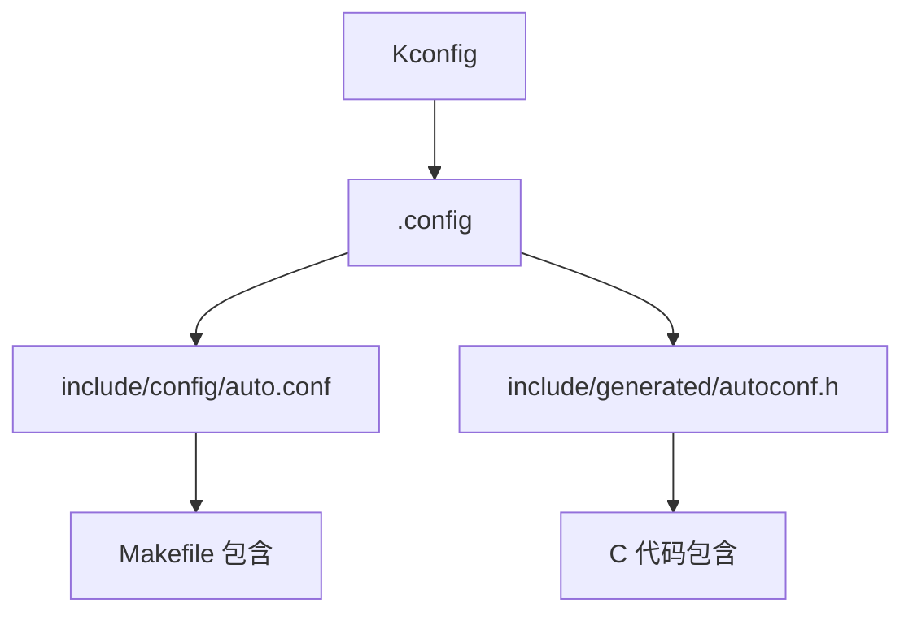
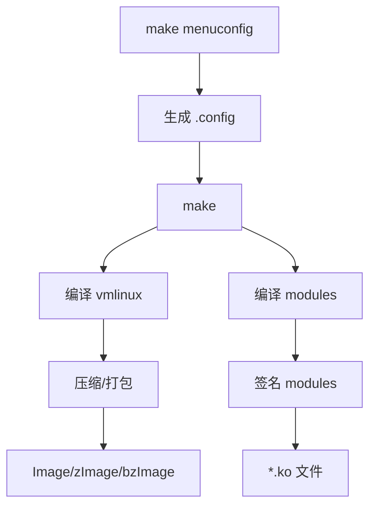

# 构建系统文档

## 概述

OpenHarmony Linux Kernel 5.10 使用标准的 Linux Kbuild 构建系统，通过 Kconfig 进行配置管理，Makefile 定义编译规则。

## 1. 构建系统核心文件

### 1.1 根目录构建文件

| 文件 | 功能 |
|------|------|
| `Kconfig` | 根 Kconfig，包含所有子系统配置入口 |
| `Makefile` | 主 Makefile，定义内核版本和编译规则 |
| `Kbuild` | Kbuild 系统入口文件 |

### 1.2 内核版本定义

**文件**: `Makefile` (第 1-7 行)

```makefile
VERSION = 5
PATCHLEVEL = 10
SUBLEVEL = 210
EXTRAVERSION =
NAME = Dare mighty things
```

- **内核版本**: 5.10.210
- **代号**: Dare mighty things

## 2. Kconfig 配置系统

### 2.1 根 Kconfig 结构

**文件**: `Kconfig`

```kconfig
mainmenu "Linux/$(ARCH) $(KERNELVERSION) Kernel Configuration"

source "scripts/Kconfig.include"
source "init/Kconfig"
source "kernel/Kconfig.freezer"
source "fs/Kconfig.binfmt"
source "mm/Kconfig"
source "net/Kconfig"
source "drivers/Kconfig"
source "fs/Kconfig"
source "security/Kconfig"
source "crypto/Kconfig"
source "lib/Kconfig"
source "lib/Kconfig.debug"
source "Documentation/Kconfig"
source "vendor/Kconfig"          <-- OpenHarmony 特有
```

### 2.2 子系统 Kconfig 入口

| 子系统 | Kconfig 路径 |
|--------|-------------|
| 初始化 | `init/Kconfig` |
| 进程冻结 | `kernel/Kconfig.freezer` |
| 二进制格式 | `fs/Kconfig.binfmt` |
| 内存管理 | `mm/Kconfig` |
| 网络 | `net/Kconfig` |
| 驱动 | `drivers/Kconfig` |
| 文件系统 | `fs/Kconfig` |
| 安全 | `security/Kconfig` |
| 加密 | `crypto/Kconfig` |
| 库 | `lib/Kconfig` |
| 调试 | `lib/Kconfig.debug` |
| 文档 | `Documentation/Kconfig` |
| 厂商定制 | `vendor/Kconfig` |

### 2.3 模块配置选项

**文件**: `init/Kconfig`

| 配置项 | 说明 |
|--------|------|
| `CONFIG_MODULES` | 启用可加载模块支持 |
| `CONFIG_MODULE_FORCE_LOAD` | 强制模块加载 |
| `CONFIG_MODULE_UNLOAD` | 模块卸载支持 |
| `CONFIG_MODULE_FORCE_UNLOAD` | 强制模块卸载 |
| `CONFIG_MODVERSIONS` | 模块版本支持 |
| `CONFIG_MODULE_SIG` | 模块签名验证 |
| `CONFIG_MODULE_COMPRESS` | 模块压缩 |
| `CONFIG_MODULE_COMPRESS_GZIP` | GZIP 压缩 |
| `CONFIG_MODULE_COMPRESS_XZ` | XZ 压缩 |

### 2.4 OpenHarmony 特有配置

**文件**: `vendor/Kconfig` (引用，目录可能为空)

**OpenHarmony 特有脚本**:
- `scripts/ohos-check-dir.sh` - OpenHarmony 目录检查脚本
- `OAT.xml` - OpenHarmony 合规性配置文件

## 3. Makefile 结构

### 3.1 主要编译目标

| 目标 | 说明 |
|------|------|
| `all` | 编译所有目标（默认） |
| `vmlinux` | ELF 格式内核 |
| `modules` | 编译所有模块 |
| `bzImage` | x86 压缩内核 |
| `Image` | ARM64 原始内核 |
| `zImage` | ARM 压缩内核 |
| `uImage` | U-Boot 格式镜像 |
| `dtbs` | 编译设备树 |
| `clean` | 清理生成文件 |
| `mrproper` | 彻底清理 |
| `distclean` | 完整清理 |

### 3.2 常用构建命令

```bash
# 配置
make menuconfig                    # 图形化配置
make defconfig                     # 使用默认配置
make oldconfig                     # 更新配置
make xconfig                       # Qt 图形配置
make gconfig                       # GTK 图形配置

# 编译
make                               # 编译所有目标
make vmlinux                       # 仅编译内核
make modules                       # 编译模块
make -j$(nproc)                    # 并行编译

# 架构特定编译
make ARCH=arm64 CROSS_COMPILE=aarch64-linux-gnu-
make ARCH=arm CROSS_COMPILE=arm-linux-gnueabihf-
make ARCH=x86_64

# 安装
make modules_install               # 安装模块到 /lib/modules/
make install                       # 安装内核

# 清理
make clean                         # 清理生成文件
make mrproper                      # 彻底清理（包括 .config）
make distclean                     # 完整清理
```

### 3.3 构建输出目录

```
$(KBUILD_OUTPUT)/
├── .config              # 配置文件
├── include/config/      # 配置头文件
├── include/generated/   # 生成的头文件
├── vmlinux              # ELF 内核
├── System.map           # 符号表
├── arch/$(ARCH)/boot/   # 启动镜像
│   ├── Image/zImage/bzImage
│   └── dts/*.dtb        # 设备树二进制
└── *.ko                 # 模块文件
```

## 4. 默认配置文件

### 4.1 支持的架构

支持 27 个架构：
- alpha, arc, arm, arm64, c6x, csky, h8300, hexagon
- ia64, loongarch, m68k, microblaze, mips, nds32
- nios2, openrisc, parisc, powerpc, riscv
- s390, sh, sparc, um, x86, xtensa

### 4.2 主要默认配置文件

| 架构 | 默认配置 | 路径 |
|------|---------|------|
| **ARM** | multi_v7_defconfig | `arch/arm/configs/multi_v7_defconfig` |
| | 107+ defconfig | `arch/arm/configs/` |
| **x86** | x86_64_defconfig | `arch/x86/configs/x86_64_defconfig` |
| | i386_defconfig | `arch/x86/configs/i386_defconfig` |
| **RISC-V** | rv32_defconfig | `arch/riscv/configs/rv32_defconfig` |
| | defconfig | `arch/riscv/configs/defconfig` |
| **PowerPC** | 多个 defconfig | `arch/powerpc/configs/` |
| **MIPS** | 多个 defconfig | `arch/mips/configs/` |

### 4.3 ARM64 默认配置示例

**文件**: `arch/arm64/configs/defconfig` (部分)

```
CONFIG_SYSVIPC=y
CONFIG_POSIX_MQUEUE=y
CONFIG_AUDIT=y
CONFIG_NO_HZ_IDLE=y
CONFIG_HIGH_RES_TIMERS=y
CONFIG_PREEMPT=y
CONFIG_IRQ_TIME_ACCOUNTING=y
CONFIG_BSD_PROCESS_ACCT=y
CONFIG_BSD_PROCESS_ACCT_V3=y
CONFIG_TASK_XACCT=y
CONFIG_TASK_IO_ACCOUNTING=y
CONFIG_IKCONFIG=y
CONFIG_IKCONFIG_PROC=y
CONFIG_NUMA_BALANCING=y
CONFIG_MEMCG=y
CONFIG_BLK_CGROUP=y
CONFIG_CGROUP_PIDS=y
CONFIG_CPUSETS=y
CONFIG_CGROUP_DEVICE=y
CONFIG_CGROUP_CPUACCT=y
CONFIG_CGROUP_PERF=y
CONFIG_USER_NS=y
CONFIG_SCHED_AUTOGROUP=y
CONFIG_BLK_DEV_INITRD=y
CONFIG_KALLSYMS_ALL=y
CONFIG_PROFILING=y
CONFIG_ARCH_ACTIONS=y
CONFIG_ARCH_SUNXI=y
CONFIG_ARCH_HISI=y
CONFIG_ARCH_MEDIATEK=y
CONFIG_ARCH_QCOM=y
CONFIG_ARCH_ROCKCHIP=y
CONFIG_ARCH_BRCMSTB=y
CONFIG_ARCH_EXYNOS=y
CONFIG_ARCH_THUNDER=y
```

## 5. 编译产物

### 5.1 内核镜像类型

| 产物 | 说明 | 架构 |
|------|------|------|
| `vmlinux` | ELF 格式内核（所有架构） | 通用 |
| `Image` | ARM64 原始内核镜像 | arm64 |
| `zImage` | ARM 压缩内核 | arm |
| `uImage` | U-Boot 格式镜像 | arm/powerpc |
| `bzImage` | x86 压缩内核 | x86 |
| `vmlinuz` | 压缩内核（带头） | 通用 |
| `System.map` | 内核符号表 | 通用 |

### 5.2 架构特有产物

**ARM64** (`arch/arm64/Makefile`):
- `Image` — 原始内核镜像
- `Image.gz` — GZIP 压缩镜像

**ARM** (`arch/arm/Makefile`):
- `zImage` — 压缩内核
- `uImage` — U-Boot 镜像
- `xipImage` — XIP (eXecute In Place) 镜像

### 5.3 模块产物

| 产物 | 说明 |
|------|------|
| `*.ko` | 内核模块文件 |
| `modules.order` | 模块编译顺序 |
| `modules.builtin` | 内置模块列表 |
| `Module.symvers` | 符号版本 |

### 5.4 设备树产物

| 产物 | 说明 |
|------|------|
| `*.dtb` | 设备树二进制文件 |
| `*.dtbo` | 设备树覆盖层 |

## 6. 设备树支持

### 6.1 设备树源文件位置

| 架构 | DTS 路径 |
|------|----------|
| ARM64 | `arch/arm64/boot/dts/` |
| ARM | `arch/arm/boot/dts/` |
| RISC-V | `arch/riscv/boot/dts/` |
| PowerPC | `arch/powerpc/boot/dts/` |

### 6.2 ARM64 DTS 供应商目录

**路径**: `arch/arm64/boot/dts/`

主要供应商目录：
- `actions/` - 炬力
- `allwinner/` - 全志
- `amazon/` - 亚马逊
- `amd/` - AMD
- `amlogic/` - 晶晨
- `apm/` - Applied Micro
- `arm/` - ARM 参考设计
- `broadcom/` - 博通
- `freescale/` - 飞思卡尔
- `hisilicon/` - 海思 (华为)
- `intel/` - 英特尔
- `marvell/` - 美满电子
- `mediatek/` - 联发科
- `nvidia/` - 英伟达
- `qcom/` - 高通
- `realtek/` - 瑞昱
- `renesas/` - 瑞萨
- `rockchip/` - 瑞芯微
- `samsung/` - 三星
- `ti/` - 德州仪器
- `xilinx/` - 赛灵思

**ARM DTS 文件数量**: 2000+ 个 .dts/.dtsi 文件

## 7. 关键构建脚本

| 脚本 | 功能 |
|------|------|
| `scripts/kconfig/Makefile` | Kconfig 配置系统 |
| `scripts/link-vmlinux.sh` | 链接 vmlinux |
| `scripts/merge_config.sh` | 合并配置 |
| `scripts/mkmakefile` | 生成输出目录 Makefile |
| `scripts/depmod.sh` | 生成模块依赖 |
| `scripts/ohos-check-dir.sh` | OpenHarmony 目录检查 |
| `scripts/sign-file` | 模块签名 |
| `scripts/modules-check.sh` | 模块检查 |

## 8. 模块编译变量

**定义**: 根 `Makefile`

```makefile
KBUILD_AFLAGS_MODULE  := -DMODULE
KBUILD_CFLAGS_MODULE  := -DMODULE
KBUILD_LDFLAGS_MODULE :=
```

模块编译时定义 `MODULE` 宏，用于条件编译。

## 9. 配置依赖关系



## 10. 构建流程



---

*生成时间: 2026-02-06*
