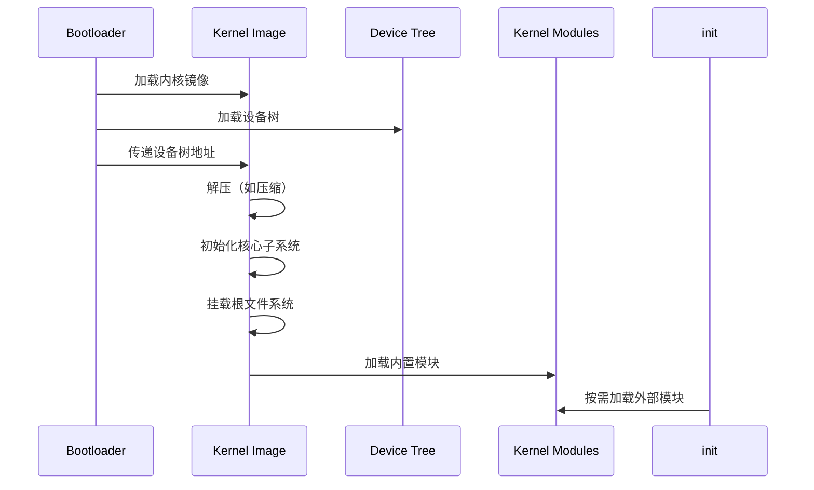

# 编译产物文档

## 概述

本文档详细列出 OpenHarmony Linux Kernel 5.10 的编译产物类型、输出路径和运行时加载关系。

## 1. 内核镜像产物

### 1.1 内核镜像类型

| 产物名称 | 格式 | 适用架构 | 说明 |
|----------|------|----------|------|
| **vmlinux** | ELF | 所有架构 | 未压缩的 ELF 格式内核映像，包含完整符号信息 |
| **Image** | 二进制 | arm64 | ARM64 原始内核镜像，未压缩 |
| **Image.gz** | 压缩 | arm64 | ARM64 GZIP 压缩内核镜像 |
| **zImage** | 压缩 | arm | ARM 压缩内核，自解压 |
| **uImage** | 打包 | arm, powerpc | 带 U-Boot 头的内核镜像 |
| **bzImage** | 压缩 | x86 | x86 大压缩内核 |
| **vmlinuz** | 压缩 | 通用 | 压缩内核（带头信息） |
| **System.map** | 文本 | 所有架构 | 内核符号表 |

### 1.2 产物生成路径

```
$(KBUILD_OUTPUT)/
├── vmlinux              # ELF 内核（所有架构）
├── System.map           # 符号表
└── arch/$(ARCH)/boot/
    ├── Image            # arm64 原始镜像
    ├── Image.gz         # arm64 压缩镜像
    ├── zImage           # arm 压缩镜像
    ├── uImage           # U-Boot 镜像
    ├── bzImage          # x86 压缩镜像
    └── dts/
        └── *.dtb        # 设备树二进制
```

### 1.3 产物大小参考

| 产物 | 典型大小 | 说明 |
|------|----------|------|
| vmlinux | 50-200 MB | 包含调试信息 |
| Image | 20-50 MB | arm64 未压缩 |
| Image.gz | 5-15 MB | arm64 压缩 |
| zImage | 3-10 MB | arm 压缩 |
| bzImage | 5-15 MB | x86 压缩 |

## 2. 内核模块产物

### 2.1 模块文件格式

| 产物 | 扩展名 | 说明 |
|------|--------|------|
| 内核模块 | `.ko` | 可加载内核模块 |
| 模块列表 | `modules.order` | 模块编译顺序 |
| 内置模块 | `modules.builtin` | 内置模块列表 |
| 符号版本 | `Module.symvers` | 模块符号版本 |

### 2.2 模块生成路径

```
$(KBUILD_OUTPUT)/
├── *.ko                 # 顶层模块
├── drivers/
│   └── */*.ko          # 驱动模块
├── fs/
│   └── */*.ko          # 文件系统模块
├── net/
│   └── */*.ko          # 网络模块
├── sound/
│   └── */*.ko          # 音频模块
├── crypto/
│   └── *.ko            # 加密模块
├── lib/
│   └── *.ko            # 库模块
├── modules.order        # 模块编译顺序
├── modules.builtin      # 内置模块列表
└── Module.symvers       # 符号版本
```

### 2.3 模块安装路径

```bash
make modules_install
```

安装路径：
```
/lib/modules/$(KERNELRELEASE)/
├── kernel/
│   ├── drivers/        # 驱动模块
│   ├── fs/            # 文件系统模块
│   ├── net/           # 网络模块
│   ├── sound/         # 音频模块
│   └── ...
├── modules.alias       # 别名规则
├── modules.dep         # 依赖关系
├── modules.symbols     # 符号映射
└── build -> 源码目录   # 符号链接
```

## 3. 设备树产物

### 3.1 设备树二进制文件

| 产物 | 扩展名 | 说明 |
|------|--------|------|
| 设备树二进制 | `.dtb` | 编译后的设备树 |
| 设备树覆盖层 | `.dtbo` | 设备树覆盖层 |

### 3.2 设备树生成路径

```
$(KBUILD_OUTPUT)/arch/$(ARCH)/boot/dts/
├── vendor/
│   └── board.dtb      # 具体板级设备树
├── *.dtb              # 其他设备树
└── overlays/
    └── *.dtbo         # 设备树覆盖层
```

### 3.3 ARM64 设备树供应商目录

**源文件位置**: `arch/arm64/boot/dts/`

```
arch/arm64/boot/dts/
├── actions/           # 炬力
├── allwinner/         # 全志
├── amlogic/           # 晶晨
├── arm/               # ARM 参考
├── broadcom/          # 博通
├── freescale/         # 飞思卡尔
├── hisilicon/         # 海思
├── marvell/           # 美满电子
├── mediatek/          # 联发科
├── nvidia/            # 英伟达
├── qcom/              # 高通
├── realtek/           # 瑞昱
├── renesas/           # 瑞萨
├── rockchip/          # 瑞芯微
├── samsung/           # 三星
├── ti/                # 德州仪器
├── xilinx/            # 赛灵思
└── ...
```

## 4. 头文件产物

### 4.1 生成头文件

| 产物 | 路径 | 说明 |
|------|------|------|
| 配置头文件 | `include/generated/autoconf.h` | 从 .config 生成 |
| 版本头文件 | `include/generated/uapi/linux/version.h` | 内核版本 |
| 编译头文件 | `include/generated/compile.h` | 编译信息 |
| 绑定头文件 | `include/generated/bindings.h` | 设备树绑定 |

### 4.2 用户空间 API 头文件

**位置**: `include/uapi/`

```
include/uapi/
├── linux/             # Linux UAPI
│   ├── *.h           # 系统调用、ioctl 定义
│   └── ...
├── asm-generic/       # 通用汇编 UAPI
└── ...
```

## 5. 构建辅助产物

### 5.1 配置文件产物

| 产物 | 路径 | 说明 |
|------|------|------|
| 内核配置 | `.config` | 当前配置 |
| 自动配置 | `include/config/auto.conf` | Makefile 使用的配置 |
| 头文件配置 | `include/generated/autoconf.h` | C 代码使用的配置 |

### 5.2 依赖文件

| 产物 | 路径 | 说明 |
|------|------|------|
| 模块依赖 | `modules.dep` | 模块间依赖 |
| 符号版本 | `Module.symvers` | 模块符号版本 |
| 别名规则 | `modules.alias` | 模块别名 |

## 6. 运行时加载关系

### 6.1 启动流程



### 6.2 内核镜像加载

| 平台 | 加载方式 | 典型路径 |
|------|----------|----------|
| **ARM64** | 直接加载 | `/boot/Image` 或 `/boot/Image.gz` |
| **ARM** | 直接/UBoot | `/boot/zImage` 或 `/boot/uImage` |
| **x86** | GRUB 加载 | `/boot/vmlinuz-$(VERSION)` |

### 6.3 模块加载机制

```
用户空间触发
    ↓
modprobe / insmod
    ↓
sys_init_module()
    ↓
load_module()
    ↓
检查签名 (CONFIG_MODULE_SIG)
    ↓
检查版本 (CONFIG_MODVERSIONS)
    ↓
解析依赖 (modules.dep)
    ↓
分配内存并加载
    ↓
执行模块初始化函数
```

### 6.4 设备树加载

**启动时加载**:
1. Bootloader 加载内核镜像
2. Bootloader 加载设备树二进制 (DTB)
3. Bootloader 传递 DTB 物理地址给内核
4. 内核解析设备树，初始化硬件

**运行时覆盖**:
```bash
# 加载设备树覆盖层
echo overlay.dtbo > /sys/kernel/config/device-tree/overlays/overlay/path
```

## 7. 安装路径

### 7.1 标准安装路径

| 产物 | 安装路径 | 说明 |
|------|----------|------|
| 内核镜像 | `/boot/` | 启动分区 |
| 内核模块 | `/lib/modules/$(KERNELRELEASE)/` | 模块目录 |
| 头文件 | `/usr/src/linux-headers-$(KERNELRELEASE)/` | 开发头文件 |
| System.map | `/boot/System.map-$(KERNELRELEASE)` | 符号表 |
| 配置 | `/boot/config-$(KERNELRELEASE)` | 配置文件 |

### 7.2 OpenHarmony 特有路径

**HiLog 设备**:
- 设备节点: `/dev/hilog`
- 主设备号: 245

**Blackbox 日志**:
- 存储路径: 通常在 `/data/blackbox/` 或持久存储分区

## 8. 产物映射表

### 8.1 Build Target -> 产物映射

| Make 目标 | 产物 | 路径 |
|-----------|------|------|
| `vmlinux` | ELF 内核 | `./vmlinux` |
| `Image` | ARM64 镜像 | `./arch/arm64/boot/Image` |
| `Image.gz` | 压缩镜像 | `./arch/arm64/boot/Image.gz` |
| `zImage` | ARM 压缩 | `./arch/arm/boot/zImage` |
| `bzImage` | x86 压缩 | `./arch/x86/boot/bzImage` |
| `modules` | `.ko` 文件 | `./drivers/*.ko` 等 |
| `dtbs` | `.dtb` 文件 | `./arch/arm64/boot/dts/*.dtb` |
| `System.map` | 符号表 | `./System.map` |

### 8.2 配置文件映射

| 源文件 | 生成文件 |
|--------|----------|
| `.config` | `include/generated/autoconf.h` |
| `.config` | `include/config/auto.conf` |
| `Makefile` | `include/generated/compile.h` |
| `Kbuild` | 模块 Makefile |

## 9. 产物验证

### 9.1 检查内核镜像

```bash
# 查看 vmlinux 信息
file vmlinux
readelf -h vmlinux

# 查看符号表
nm vmlinux | head

# 查看压缩镜像
file arch/arm64/boot/Image.gz
```

### 9.2 检查模块

```bash
# 查看模块信息
modinfo ./drivers/net/ethernet/realtek/r8169.ko

# 查看模块依赖
cat modules.dep

# 检查模块符号
nm ./drivers/net/ethernet/realtek/r8169.ko
```

### 9.3 检查设备树

```bash
# 反编译设备树
dtc -I dtb -O dts arch/arm64/boot/dts/qcom/sm8150-mtp.dtb

# 查看设备树信息
fdtdump arch/arm64/boot/dts/qcom/sm8150-mtp.dtb | head -50
```

## 10. 清理产物

### 10.1 清理命令

```bash
# 清理编译产物（保留 .config）
make clean

# 彻底清理（删除 .config）
make mrproper

# 完整清理（包括备份文件）
make distclean
```

### 10.2 清理范围

| 命令 | 保留 | 删除 |
|------|------|------|
| `make clean` | .config, 源代码 | *.o, *.ko, vmlinux, 镜像 |
| `make mrproper` | 源代码 | .config, 所有生成文件 |
| `make distclean` | 源代码 | 所有生成文件 + 备份 |

---

*生成时间: 2026-02-06*
