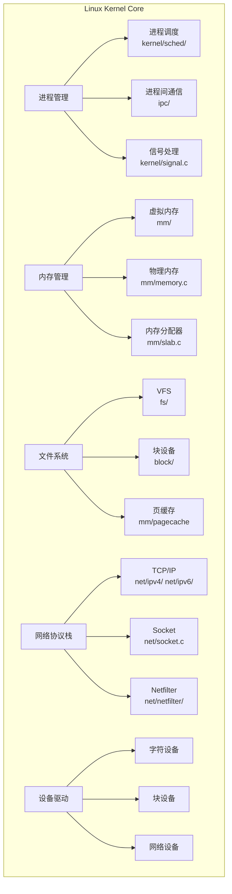
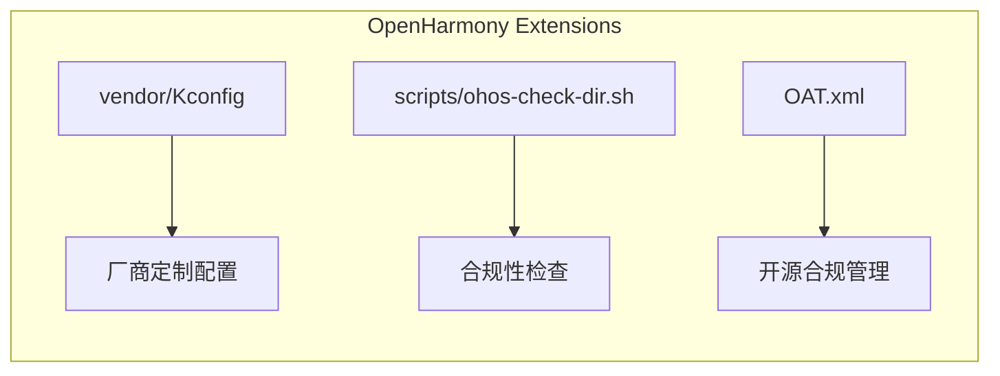

# OpenHarmony Linux Kernel 5.10 首页

## 项目定位

**OpenHarmony Linux Kernel 5.10** 是 OpenHarmony 操作系统的内核层核心组件，基于 Linux 5.10 LTS 内核版本构建。

### 版本信息

| 属性 | 值 |
|------|-----|
| **内核版本** | Linux 5.10.210 LTS |
| **代号** | Dare mighty things |
| **License** | GPL-2.0+ |
| **上游来源** | [Linux Stable 5.10.y](https://git.kernel.org/pub/scm/linux/kernel/git/stable/linux.git/log/?h=linux-5.10.y) |
| **维护者** | liuyu82@huawei.com |

## 核心能力

### 1. 操作系统基础能力



### 2. OpenHarmony 特有扩展



## 运行环境

### 支持的硬件架构

| 架构 | 主要用途 |
|------|----------|
| **ARM64** | 移动设备、服务器（OpenHarmony 主要目标平台） |
| **ARM** | 嵌入式设备、IoT |
| **x86_64** | 开发主机、模拟器 |
| **RISC-V** | 新兴架构支持 |

### 支持的芯片平台

**ARM64 平台（部分）：**
- HiSilicon (海思)
- Qualcomm (高通)
- MediaTek (联发科)
- Rockchip (瑞芯微)
- Amlogic
- Broadcom
- Samsung

## 关键概念

### 1. 内核空间 vs 用户空间

```
+---------------------+
|     User Space      |  <-- 应用程序、系统服务
|   (OpenHarmony)     |
+---------------------+
|     System Call     |  <-- 系统调用接口
|     Interface       |
+---------------------+
|     Kernel Space    |  <-- 本仓库内容
|   (Linux Kernel)    |
+---------------------+
|     Hardware        |  <-- 硬件抽象层
+---------------------+
```

### 2. 内核子系统关系

```mermaid
flowchart TB
    subgraph "用户空间接口层"
        SYSCALL[系统调用<br/>SYSCALL_DEFINE*]
        PROC[/proc]
        SYSFS[/sys]
        DEVFS[/dev]
    end
    
    subgraph "核心子系统"
        SCHED[调度器<br/>kernel/sched/]
        MM[内存管理<br/>mm/]
        FS[文件系统<br/>fs/]
        NET[网络<br/>net/]
    end
    
    subgraph "驱动框架"
        DD[设备驱动<br/>drivers/]
        BUS[总线框架<br/>drivers/base/]
        DT[设备树<br/>arch/*/boot/dts/]
    end
    
    subgraph "硬件层"
        HW[硬件设备]
    end
    
    SYSCALL --> SCHED & MM & FS & NET
    PROC --> KERNEL[kernel/]
    SYSFS --> DD
    DEVFS --> DD
    SCHED & MM --> DD
    FS --> BLOCK[block/]
    NET --> NETDEV[网络驱动]
    DD --> BUS
    BUS --> DT
    DT --> HW
    NETDEV --> HW
    BLOCK --> HW
```

### 3. 配置系统 (Kconfig)

内核功能通过 Kconfig 配置系统启用/禁用：

```
根 Kconfig
├── init/Kconfig        (基本初始化选项)
├── kernel/Kconfig      (核心功能)
├── mm/Kconfig          (内存管理)
├── net/Kconfig         (网络)
├── drivers/Kconfig     (驱动)
├── fs/Kconfig          (文件系统)
├── security/Kconfig    (安全)
├── crypto/Kconfig      (加密)
└── vendor/Kconfig      (OpenHarmony 扩展)
```

### 4. 模块化设计

内核支持三种组件类型：

| 类型 | 说明 | 配置选项 |
|------|------|----------|
| **Built-in** | 静态编译进内核 | `CONFIG_XXX=y` |
| **Module** | 动态加载的模块 | `CONFIG_XXX=m` |
| **Disabled** | 禁用功能 | `# CONFIG_XXX is not set` |

## 项目边界

### 包含在本仓库

- 进程调度与管理
- 内存管理 (mm/)
- 虚拟文件系统 (fs/)
- 网络协议栈 (net/)
- 设备驱动框架 (drivers/)
- 安全模块 (security/)
- 加密子系统 (crypto/)
- 块设备层 (block/)
- 内核基础库 (lib/)

### 不包含在本仓库

- OpenHarmony 用户空间组件（ACE、ARK 等）
- HAL (Hardware Abstraction Layer) 服务
- 系统服务框架
- 应用框架
- 测试代码（不包括 test/、tests/ 目录）

## 相关链接

- [OpenHarmony 官网](https://www.openharmony.cn)
- [内核邮件列表](https://lists.openatom.io/postorius/lists/kernel.openharmony.io/)
- [Linux 内核文档](https://www.kernel.org/doc/html/latest/)
- [DCO 签署](https://dco.openharmony.io/sign-dco)

---

*生成时间: 2026-02-06*
