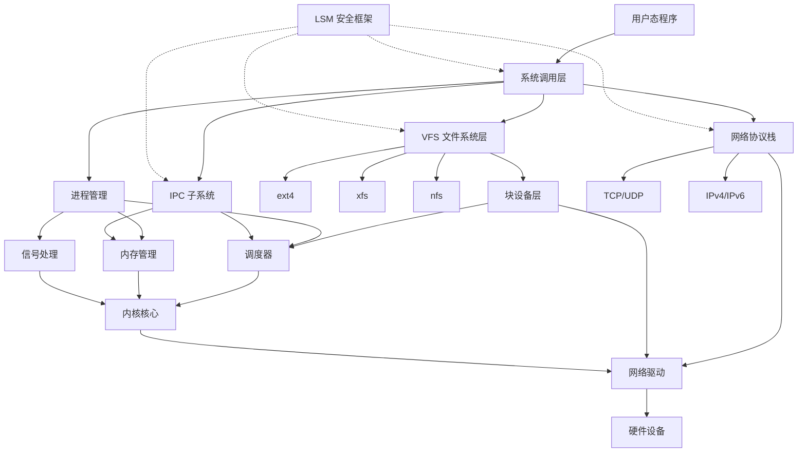
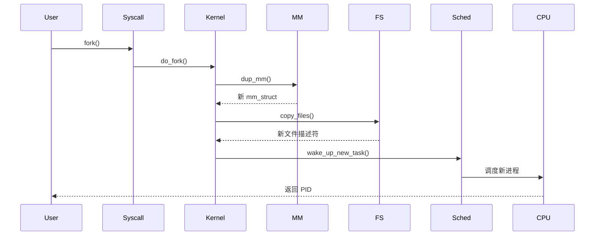
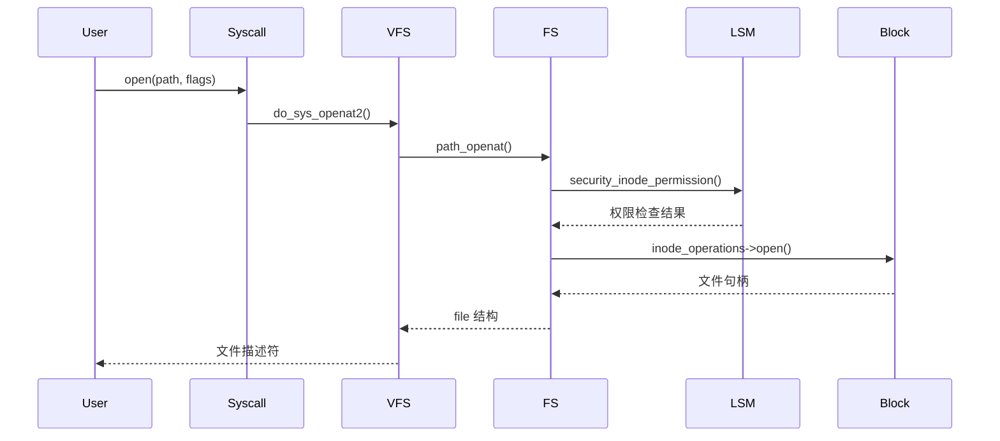
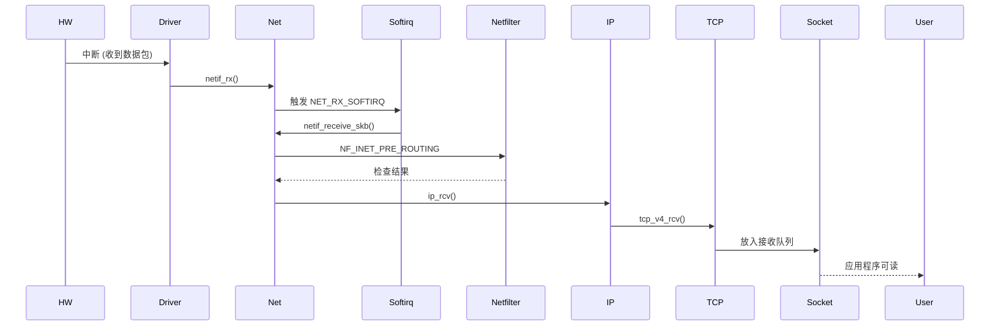
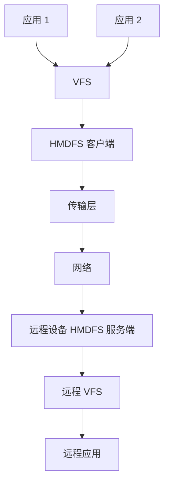

# 架构说明

## 目的

本文档说明 Linux 内核 6.6 的架构，包括组件关系、数据流、线程模型和关键时序。

## 适用范围

- 读者目标：内核开发者、架构师、系统集成工程师
- 核心版本：Linux 6.6

---

## 组件关系图



---

## 子系统边界与依赖

### 进程调度 (kernel/sched/)

**职责**: 管理进程/线程的执行，决定哪个进程在 CPU 上运行。

**依赖**:
- **被依赖**: 所有需要执行的子系统（网络、块设备、文件系统）
- **依赖**: 内存管理（分配 task_struct）、中断管理（时钟中断）

**关键组件**:
- `struct task_struct` - 进程描述符
- `struct rq` - 运行队列
- `schedule()` - 主调度函数
- `CFS 调度器` - 完全公平调度器
- `RT 调度器` - 实时调度器
- `WALT RTG` - OpenHarmony 特定（kernel/sched/rtg/）

**证据**:
- `kernel/sched/core.c:6556` - `schedule()` 函数
- `kernel/sched/fair.c` - CFS 实现

**稳定接口**:
- `schedule()` - 调度器入口
- `wake_up_process()` - 唤醒进程

---

### 内存管理 (mm/)

**职责**: 管理物理和虚拟内存，分配/回收页面。

**依赖**:
- **被依赖**: 所有内核子系统（都需要分配内存）
- **依赖**: 进程调度（内核线程如 kswapd）、架构（页表）

**关键组件**:
- Buddy 分配器 (`mm/page_alloc.c`) - 物理页面分配
- SLUB 分配器 (`mm/slub.c`) - 对象分配
- 页面回收 (`mm/vmscan.c`) - kswapd 守护进程
- 交换 (`mm/swap*.c`) - 交换空间管理
- 内存映射 (`mm/mmap.c`) - 用户态映射

**证据**:
- `mm/page_alloc.c:3864` - `__alloc_pages_nodemask()`
- `mm/slub.c:3923` - `kmem_cache_alloc()`

**稳定接口**:
- `kmalloc()` / `kfree()` - 小内存分配
- `vmalloc()` / `vfree()` - 虚拟内存分配
- `alloc_pages()` / `free_pages()` - 页面分配

---

### 文件系统 (fs/)

**职责**: VFS 层抽象，统一不同文件系统接口。

**依赖**:
- **被依赖**: 用户态 I/O 操作
- **依赖**: 内存管理（页面缓存）、块设备层（存储）、LSM（权限）

**关键组件**:
- VFS 核心 (`fs/` 顶层文件)
- 具体文件系统 (`fs/ext4/`, `fs/xfs/`, `fs/nfs/`)
- Dentry 缓存 (`fs/dcache.c`)
- Inode 缓存 (`fs/inode.c`)
- 页面缓存 (在 mm/ 中)

**证据**:
- `fs/open.c` - `do_sys_open()`
- `fs/read_write.c` - `vfs_read()`, `vfs_write()`

**稳定接口**:
- `vfs_open()`, `vfs_read()`, `vfs_write()`
- 文件操作结构 `file_operations`

---

### 网络协议栈 (net/)

**职责**: 处理网络数据包，实现 TCP/IP 协议栈。

**依赖**:
- **被依赖**: 网络应用程序
- **依赖**: 驱动模型（网络设备）、内存管理（SKB 分配）、LSM（网络过滤）

**关键组件**:
- Socket 层 (`net/core/sock.c`)
- 协议栈 (`net/ipv4/`, `net/ipv6/`)
- 网络设备 (`net/core/dev.c`)
- Netfilter (`net/netfilter/`)
- SKB 管理 (`net/core/skbuff.c`)

**证据**:
- `net/ipv4/tcp.c` - TCP 实现
- `net/netfilter/core.c` - Netfilter 核心

**稳定接口**:
- `sock_create_kern()` - 创建 socket
- `dev_queue_xmit()` - 发送数据包
- `netif_rx()` - 接收数据包

---

### 驱动模型 (drivers/base/)

**职责**: 设备和驱动的绑定、匹配、生命周期管理。

**依赖**:
- **被依赖**: 所有设备驱动
- **依赖**: 内核核心（kobject）、sysfs（设备展示）

**关键组件**:
- 设备注册 (`drivers/base/core.c`)
- 驱动注册 (`drivers/base/driver.c`)
- 总线管理 (`drivers/base/bus.c`)
- 设备类 (`drivers/base/class.c`)

**证据**:
- `drivers/base/core.c` - `device_register()`
- `drivers/base/dd.c` - `driver_probe_device()`

**稳定接口**:
- `device_register()` / `device_unregister()`
- `driver_register()` / `driver_unregister()`
- `platform_driver_register()` - 平台驱动

---

### 安全框架 (security/)

**职责**: LSM hooks，在关键操作点执行安全检查。

**依赖**:
- **被依赖**: 所有需要权限检查的子系统
- **依赖**: 无（纯检查机制）

**关键组件**:
- LSM 核心 (`security/security.c`)
- Capability (`security/commoncap.c`)
- SELinux (`security/selinux/`)
- AppArmor (`security/apparmor/`)

**证据**:
- `security/security.c` - Hook 调度器
- `include/linux/lsm_hooks.h` - Hook 定义

**稳定接口**:
- `security_inode_permission()` - 文件权限检查
- `security_socket_create()` - Socket 创建检查
- `capable()` - Capability 检查

---

## 线程模型

### 内核线程

**定义**: 独立于用户态进程的内核线程，执行后台任务。

**创建方式**:
```c
struct task_struct *kthread_create(int (*threadfn)(void *data),
                             void *data,
                             const char namefmt[], ...);
void wake_up_process(struct task_struct *tsk);
```

**常见内核线程**:

| 线程 | 位置 | 职责 |
|--------|------|------|
| kswapd | `mm/vmscan.c` | 页面回收 |
| ksoftirqd | `kernel/softirq.c` | 软中断处理 |
| kworker/* | `kernel/workqueue.c` | 工作队列执行 |
| rcu_gp/* | `kernel/rcu/` | RCU Grace Period |
| kblockd | `block/blk-core.c` | 块设备延迟处理 |

**证据**:
- `kernel/kthread.c` - 内核线程核心

### 工作队列 (Workqueue)

**定义**: 进程上下文延迟执行任务。

**关键 API**:
```c
struct workqueue_struct *create_workqueue(const char *name);
INIT_WORK(&work, handler);
schedule_work(&work);
flush_work(&work);
```

**使用场景**:
- 不需要中断上下文
- 允许睡眠
- 需要内存分配

**证据**:
- `kernel/workqueue.c` - 工作队列实现

### 软中断 (Softirq)

**定义**: 中断下半部，硬中断处理后执行。

**关键 API**:
```c
void open_softirq(int nr, void (*action)(struct softirq_action *));
void raise_softirq(unsigned int nr);
```

**常见软中断**:
- `HI_SOFTIRQ` - 高优先级
- `NET_RX_SOFTIRQ` - 网络接收
- `NET_TX_SOFTIRQ` - 网络发送
- `TASKLET_SOFTIRQ` - Tasklet

**证据**:
- `kernel/softirq.c` - 软中断核心

### Tasklet

**定义**: 软中断的变体，保证顺序执行。

**关键 API**:
```c
void tasklet_init(struct tasklet_struct *t,
               void (*func)(unsigned long), unsigned long data);
tasklet_schedule(&t);
```

**证据**:
- `include/linux/interrupt.h` - Tasklet 定义

### RCU (Read-Copy-Update)

**定义**: 无锁同步，允许多读者并发。

**关键 API**:
```c
rcu_read_lock();
// 读取共享数据
rcu_read_unlock();

synchronize_rcu();  // 等待读者完成
```

**证据**:
- `kernel/rcu/` - RCU 实现

---

## 关键时序

### 进程创建时序



**证据**:
- `kernel/fork.c:2250` - `do_fork()` 函数

---

### 文件打开时序



**证据**:
- `fs/open.c:437` - `do_sys_openat2()`
- `include/linux/lsm_hook_defs.h` - Hook 定义

---

### 网络包接收时序



**证据**:
- `net/core/dev.c:4263` - `netif_rx()`
- `net/ipv4/af_inet.c:2000` - `ip_rcv()`

---

### 内核启动时序

```mermaid
graph LR
    A[Bootloader] --> B[start_kernel]
    B --> C[setup_arch]
    C --> D[trap_init]
    D --> E[mm_init]
    E --> F[sched_init]
    F --> G[early_irq_init]
    G --> H[init_IRQ]
    H --> I[console_init]
    I --> J[rest_init]
    J --> K[kernel_init]
    K --> L[do_basic_setup]
    L --> M[run_init_process]
    M --> N[/sbin/init]
```

**initcall 顺序** (证据: `include/linux/init.h`):
1. `early_initcall` - 早期初始化
2. `core_initcall` - 核心组件（调度器、RCU）
3. `postcore_initcall` - 后核心（审计）
4. `arch_initcall` - 架构特定
5. `subsys_initcall` - 子系统（内存、网络）
6. `fs_initcall` - 文件系统
7. `device_initcall` - 设备驱动
8. `late_initcall` - 晚期初始化

**证据**:
- `init/main.c:652` - `start_kernel()`
- `include/linux/init.h:234` - initcall 定义

---

## 数据流

### 文件读操作

```
用户态 read()
    ↓
sys_read()
    ↓
vfs_read() [fs/read_write.c]
    ↓
file->f_op->read() [具体文件系统]
    ↓
mapping->a_ops->readpage() [页缓存]
    ↓
submit_bio() [块设备层]
    ↓
块驱动
    ↓
硬件设备
```

**证据**:
- `fs/read_write.c:411` - `vfs_read()`
- `mm/filemap.c:2630` - `filemap_read()`

---

### 网络发送

```
用户态 sendto()
    ↓
sys_sendto()
    ↓
sock_sendmsg() [net/socket.c]
    ↓
inet_sendmsg() [net/ipv4/af_inet.c]
    ↓
tcp_sendmsg() [net/ipv4/tcp.c]
    ↓
skb 分配 [net/core/skbuff.c]
    ↓
ip_queue_xmit() [net/ipv4/ip_output.c]
    ↓
dev_queue_xmit() [net/core/dev.c]
    ↓
驱动->ndo_start_xmit()
    ↓
硬件发送
```

**证据**:
- `net/socket.c:2000` - `sock_sendmsg()`
- `net/ipv4/tcp.c:1230` - `tcp_sendmsg()`

---

## OpenHarmony 架构扩展

### HMDFS 架构



**组件** (`fs/hmdfs/`):
- `client/` - 客户端实现
- `server/` - 服务端实现
- `transport/` - 网络传输
- `auth/` - 认证模块

**证据**:
- `fs/hmdfs/` - HMDFS 目录结构

---

## 相关跳转

- [00_Overview.md](00_Overview.md) - 核心概念
- [01_Directory_Structure.md](01_Directory_Structure.md) - 目录详解
- [04_Internal_APIs.md](04_Internal_APIs.md) - 内部 API
- [appendix/Callgraphs.md](appendix/Callgraphs.md) - 调用链详情

---

**最后更新**: 2026-02-06
**文档版本**: v1.0
