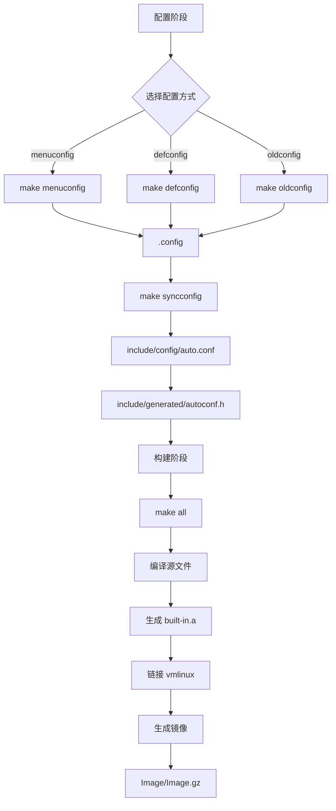

# 构建系统

## 目的

本文档说明 Linux 内核 6.6 的 Kbuild 构建系统和 Kconfig 配置系统。

## 适用范围

- 读者目标：内核开发者、构建工程师
- 核心版本：Linux 6.6

---

## 构建系统概述

**Kbuild**: Linux 内核的递归 Makefile 构建系统。

**关键文件**:
- `Makefile` - 根构建文件（~1800 行）
- `Kbuild` - 顶层源文件列表
- `scripts/Kbuild.include` - 通用构建定义
- `scripts/Makefile.build` - 编译规则
- `scripts/link-vmlinux.sh` - 链接脚本（306 行）

**证据**:
- `Makefile` - 主构建编排
- `Kbuild` - 顶层源定义

---

## 构建流程

### 完整流程图



---

## Makefile 结构

### 根 Makefile 关键部分

**证据**: `Makefile`

| 部分 | 说明 | 关键变量 |
|------|------|---------|
| PHONY 目标 | 构建目标 | `all`, `vmlinux`, `modules`, `clean` |
| 顶层源文件 | 顶层目录源 | `core-y`, `libs-y` |
| 架构支持 | 特定架构规则 | `$(ARCH)/Makefile` |
| 模块规则 | 模块编译 | `obj-m`, `modules` |

**关键目标**:

| 目标 | 说明 | 命令 |
|------|------|------|
| `all` | 构建所有 | `make` 或 `make all` |
| `vmlinux` | 内核 ELF 镜像 | `make vmlinux` |
| `modules` | 内核模块 | `make modules` |
| `clean` | 清理构建产物 | `make clean` |
| `mrproper` | 完全清理 | `make mrproper` |

---

## Kbuild Makefile 语法

### 基本规则

```makefile
# 内置对象 (编译到 vmlinux)
obj-y += foo.o

# 模块 (编译为 .ko)
obj-m += bar.o

# 条件编译
obj-$(CONFIG_FOO) += foo.o

# 复合对象 (链接多个 .o)
foo-objs := foo-main.o foo-helper.o

# 子目录递归
obj-y += subdir/

# 头文件路径
ccflags-y += -I$(src)/include

# 库文件
lib-y += helper.o
```

**证据**: `scripts/Kbuild.include` - Kbuild 宏定义

### 示例：drivers/Makefile

```makefile
# 平台驱动
obj-$(CONFIG_PLATFORM_DRIVER) += platform/

# 字符设备
obj-$(CONFIG_TTY) += char/
```

---

## Kconfig 配置系统

### Kconfig 文件结构

**顶层**: `Kconfig`

**证据**: `Kconfig`

```kconfig
mainmenu "Linux Kernel Configuration"

source "arch/$SRCARCH/Kconfig"
source "kernel/Kconfig"
source "mm/Kconfig"
source "fs/Kconfig"
source "drivers/Kconfig"
source "net/Kconfig"
```

### Kconfig 语法

#### 基本选项

```kconfig
config FOO
    bool "Enable Foo support"
    depends on BAR
    default y
    help
      This is Foo support.
```

#### Tristate (内置/模块/不编译)

```kconfig
config DRIVER_X
    tristate "Driver X support"
    depends on PCI && NET
    help
      Driver X for PCI devices.
```

#### Choice (互斥选项)

```kconfig
choice
    prompt "Compression algorithm"
    default GZIP

config GZIP
    bool "gzip"
    select ZLIB

config LZ4
    bool "lz4"
    select LZ4_DECOMPRESS
endchoice
```

#### Menu (组织)

```kconfig
menu "Device Drivers"

source "drivers/gpio/Kconfig"
source "drivers/pinctrl/Kconfig"

endmenu
```

**证据**: `Documentation/kbuild/kconfig-language.rst` - 语法文档

---

## 配置工具

| 工具 | 文件 | 说明 |
|------|------|------|
| `menuconfig` | `scripts/kconfig/mconf.c` | NCurses 菜单 |
| `nconfig` | `scripts/kconfig/nconf.c` | NCurses 新菜单 |
| `xconfig` | `scripts/kconfig/qconf.cc` | Qt 图形界面 |
| `gconfig` | `scripts/kconfig/gconf.c` | GTK 图形界面 |
| `oldconfig` | `scripts/kconfig/conf.c` | 命令行更新 |
| `defconfig` | - | 加载默认配置 |

---

## 输出目录结构

```
$(KBUILD_OUTPUT)/
├── .config                      # 用户配置
├── include/
│   ├── config/
│   │   ├── auto.conf            # Makefile 配置
│   │   ├── auto.conf.cmd        # 依赖文件
│   │   └── kernel.release      # 版本字符串
│   └── generated/
│       ├── autoconf.h           # C 宏定义
│       ├── compile.h            # 编译信息
│       ├── utsrelease.h        # UTS 版本
│       └── vdso-offsets.h      # VDSO 偏移
├── vmlinux                       # ELF 内核镜像
├── vmlinux.o                     # 预链接对象
├── vmlinux.a                     # 内置对象归档
├── System.map                    # 符号表
├── modules.order                 # 模块顺序
├── Module.symvers                # 模块符号版本
└── arch/arm64/boot/
    ├── Image                    # ARM64 未压缩镜像
    └── Image.gz                 # ARM64 压缩镜像
```

**证据**: `scripts/Makefile.vmlinux` - 链接规则

---

## 典型构建命令

### ARM64 构建

```bash
# 配置
make ARCH=arm64 defconfig

# 交互配置
make ARCH=arm64 menuconfig

# 构建
make ARCH=arm64 CROSS_COMPILE=aarch64-linux-gnu- -j$(nproc)

# 构建模块
make ARCH=arm64 modules

# 安装模块
make ARCH=arm64 INSTALL_MOD_PATH=/path/to/rootfs modules_install

# 清理
make clean        # 保留 .config
make mrproper     # 删除所有生成文件
```

### x86 构建

```bash
make x86_64_defconfig
make -j$(nproc)
```

---

## 关键构建变量

| 变量 | 说明 | 示例 |
|------|------|------|
| `ARCH` | 目标架构 | `arm64`, `x86`, `riscv` |
| `CROSS_COMPILE` | 交叉编译前缀 | `aarch64-linux-gnu-` |
| `KBUILD_OUTPUT` / `O=` | 输出目录 | `O=build/` |
| `CC` | C 编译器 | `gcc`, `clang` |
| `KBUILD_VERBOSE` / `V=1` | 详细输出 | `make V=1` |
| `INSTALL_MOD_PATH` | 模块安装路径 | `/path/to/rootfs` |

**证据**: `Makefile` - 变量定义

---

## OpenHarmony 特定配置

### Hyperhold

**配置选项** (`drivers/hyperhold/Kconfig`):
```kconfig
config HYPERHOLD
    bool "Hyperhold memory driver"
    depends on ZRAM && SWAP
    help
      Enable Hyperhold for memory compression.
```

### HMDFS

**配置选项** (`fs/hmdfs/Kconfig`):
```kconfig
config HMDFS_FS
    tristate "HMDFS support"
    select CRYPTO
    select CRYPTO_AES
    help
      Harmony Distributed File System.
```

**证据**:
- `drivers/hyperhold/Kconfig` - Hyperhold 配置
- `fs/hmdfs/Kconfig` - HMDFS 配置

---

## 相关跳转

- [06_Build_Artifacts.md](06_Build_Artifacts.md) - 编译产物
- [appendix/Config_Flags.md](appendix/Config_Flags.md) - 配置选项详解
- [01_Directory_Structure.md](01_Directory_Structure.md) - 目录结构

---

**最后更新**: 2026-02-06
**文档版本**: v1.0
