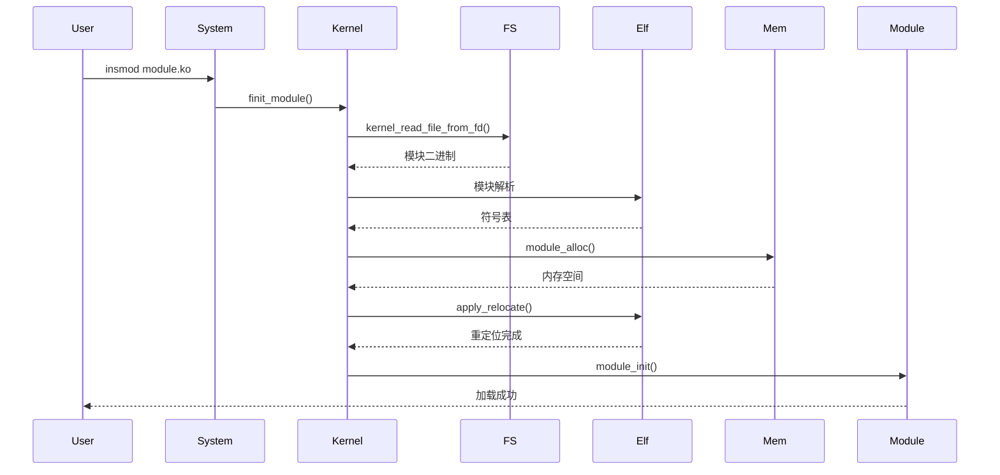

# 编译产物

## 目的

本文档说明 Linux 内核 6.6 的编译产物，包括文件类型、安装路径和运行时加载关系。

## 适用范围

- 读者目标：系统集成工程师、构建工程师
- 核心版本：Linux 6.6

---

## 产物类型

### 内核镜像

**vmlinux** - ELF 格式的内核镜像

- **位置**: `$(KBUILD_OUTPUT)/vmlinux`
- **大小**: 通常 10-50 MB
- **格式**: ELF (可调试)
- **用途**: 调试、符号分析

**证据**:
- `scripts/Makefile.vmlinux` - 链接规则

### 压缩镜像

**Image** - 未压缩内核镜像（ARM64）

- **位置**: `$(KBUILD_OUTPUT)/arch/arm64/boot/Image`
- **格式**: 原始二进制
- **大小**: 通常 5-20 MB

**Image.gz** - GZIP 压缩镜像

- **位置**: `$(KBUILD_OUTPUT)/arch/arm64/boot/Image.gz`
- **格式**: gzip 压缩
- **大小**: 通常 2-8 MB

**bzImage** - x86 压缩镜像

- **位置**: `$(KBUILD_OUTPUT)/arch/x86/boot/bzImage`
- **格式**: bz2 压缩
- **大小**: 通常 2-6 MB

**证据**:
- `arch/arm64/boot/Makefile` - ARM64 镜像规则

### 内核模块

**.ko 文件** - 内核模块对象

- **位置**: `$(KBUILD_OUTPUT)/` 各子目录
- **格式**: ELF 重定位对象
- **用途**: 动态加载驱动

**示例**:
```
drivers/gpu/drm/amd/amdgpu.ko
fs/ext4/ext4.ko
net/ipv4/tcp_bbr.ko
```

**证据**:
- `scripts/Makefile.modfinal` - 模块链接规则

### 设备树

**.dtb 文件** - 设备树二进制

- **位置**: `$(KBUILD_OUTPUT)/arch/arm64/boot/dts/`
- **格式**: Flattened Device Tree Blob
- **用途**: 硬件描述

**证据**:
- `scripts/dtc/` - 设备树编译器

---

## 安装路径

### 标准路径

| 文件 | 安装路径 | 命令 |
|------|----------|------|
| 内核镜像 | `/boot/vmlinuz-<version>` | `make install` |
| System.map | `/boot/System.map-<version>` | `make install` |
| 模块 | `/lib/modules/<version>/` | `make modules_install` |
| 设备树 | `/boot/dtb-<version>/` | 手动安装 |

### 模块安装结构

```
/lib/modules/<kernel-version>/
├── modules.dep                 # 模块依赖
├── modules.dep.bin            # 依赖二进制
├── modules.alias             # 别名映射
├── modules.alias.bin        # 别名二进制
├── modules.symbols           # 符号表
├── modules.symbols.bin      # 符号二进制
├── modules.builtin          # 内置模块
├── modules.order            # 编译顺序
└── kernel/
    ├── fs/
    │   ├── ext4.ko
    │   └── xfs.ko
    ├── drivers/
    │   ├── gpu/
    │   │   └── amdgpu.ko
    │   └── net/
    │       └── wireless.ko
    └── net/
        ├── ipv4/
        │   └── tcp_bbr.ko
        └── wireless/
            └── cfg80211.ko
```

**证据**:
- `scripts/depmod.sh` - 依赖生成

---

## 运行时加载关系

### 内核启动流程

```mermaid
graph TD
    A[Bootloader] -->|加载| B[Image.gz]
    B -->|解压| C[Image]
    C -->|加载| D[vmlinux ELF]
    D -->|初始化| E[start_kernel]
    E -->|加载| F[.dtb 设备树]
    E -->|挂载| G[rootfs]
    G -->|启动| H[/sbin/init]
    H -->|insmod| I[必需模块]
    H -->|modprobe| J[按需模块]
```

**证据**:
- `init/main.c:652` - `start_kernel()`

### 模块加载流程



**证据**:
- `kernel/module/main.c` - `finit_module()`

### 符号解析

**导出符号**:
```c
EXPORT_SYMBOL(printk);        // 非专有
EXPORT_SYMBOL_GPL(kmalloc);   // GPL 专有
```

**模块依赖**:
- `modules.dep` - 模块依赖图
- `modprobe` - 自动解析依赖

**证据**:
- `kernel/module/main.c` - 符号解析

---

## OpenHarmony 特定产物

### EPFS 模块

**产物**: `fs/epfs/epfs.ko`

**安装路径**: `/lib/modules/<version>/kernel/fs/`

**加载时机**: 内核启动后或按需

**证据**:
- `fs/epfs/main.c` - `module_init(epfs_init)`

### HMDFS 模块

**产物**: `fs/hmdfs/hmdfs.ko`

**安装路径**: `/lib/modules/<version>/kernel/fs/`

**加载时机**: 内核启动后

**子模块**:
```
fs/hmdfs/
├── hmdfs.ko                 # 主模块
├── hmdfs_inode.ko           # Inode 管理
├── hmdfs_client.ko          # 客户端
└── hmdfs_server.ko          # 服务端
```

**证据**:
- `fs/hmdfs/Kconfig` - 配置选项

### Hyperhold 驱动

**产物**: `drivers/hyperhold/hyperhold.ko`

**安装路径**: `/lib/modules/<version>/kernel/drivers/`

**加载时机**: 内核启动后（依赖 zram）

**证据**:
- `drivers/hyperhold/Kconfig` - 配置选项

---

## 验证和调试

### 检查内核信息

```bash
# 查看内核版本
uname -r

# 查看编译参数
cat /proc/version

# 查看加载的模块
lsmod

# 查看模块信息
modinfo module_name
```

### 检查模块依赖

```bash
# 查看模块依赖
modprobe --show-depends module_name

# 查看依赖文件
cat /lib/modules/$(uname -r)/modules.dep
```

---

## 压缩与签名

### Initramfs

**定义**: 初始 RAM 文件系统，提供早期用户态。

**生成**:
```bash
make modules_install
make install
# 自动生成 initramfs
```

**位置**: `/boot/initramfs-<version>.img`

**用途**:
- 早期设备驱动加载
- 根文件系统挂载前配置

### 内核签名

**目的**: 验证内核完整性（Secure Boot）。

**产物**:
- `vmlinuz-<version>.sig` - 签名文件

**证据**:
- `scripts/sign-file.c` - 签名工具

---

## 相关跳转

- [05_Build_System.md](05_Build_System.md) - 构建系统详解
- [01_Directory_Structure.md](01_Directory_Structure.md) - 目录结构
- [appendix/Config_Flags.md](appendix/Config_Flags.md) - 配置选项

---

**最后更新**: 2026-02-06
**文档版本**: v1.0
