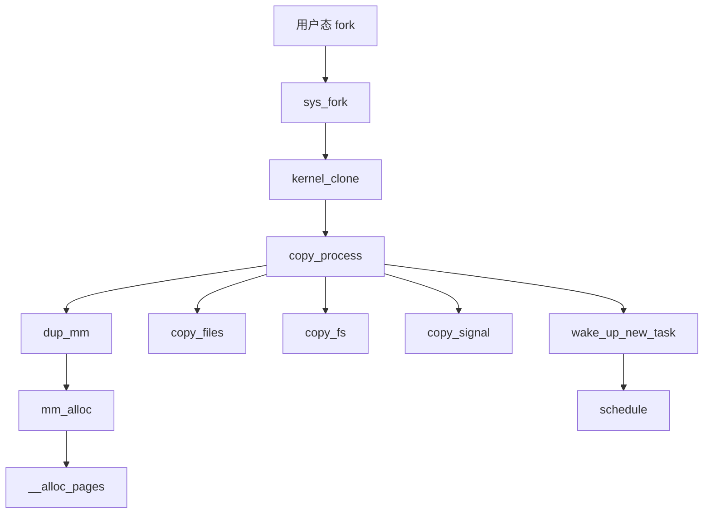
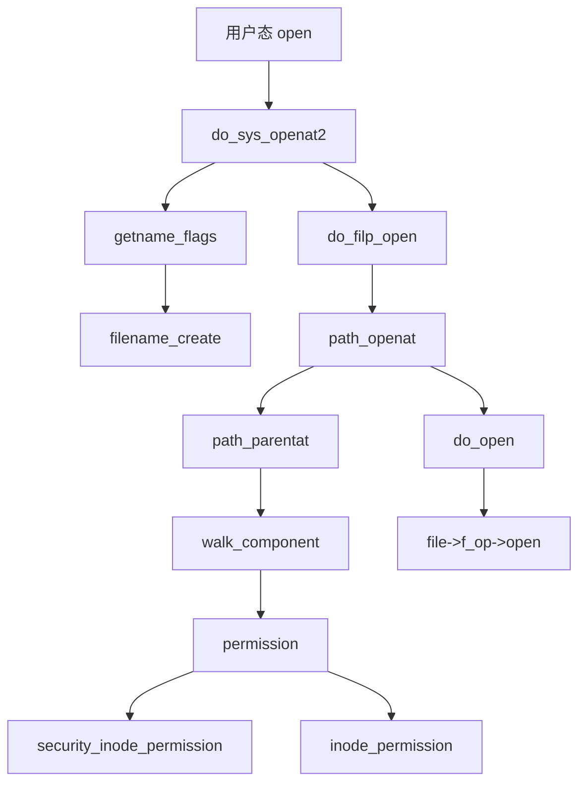
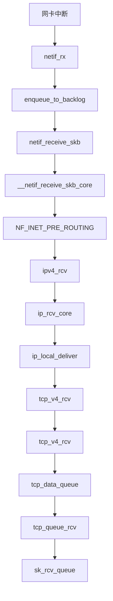
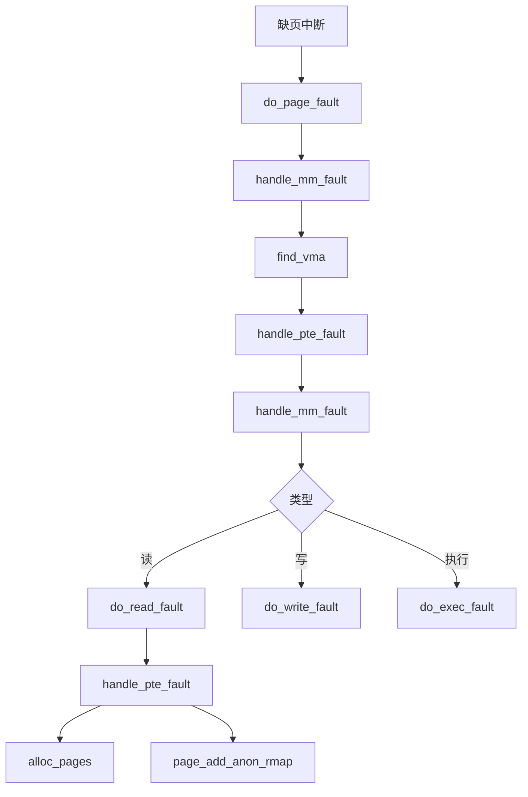
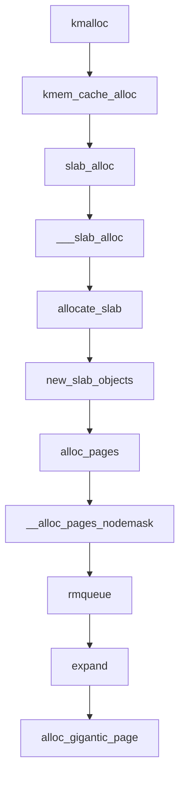
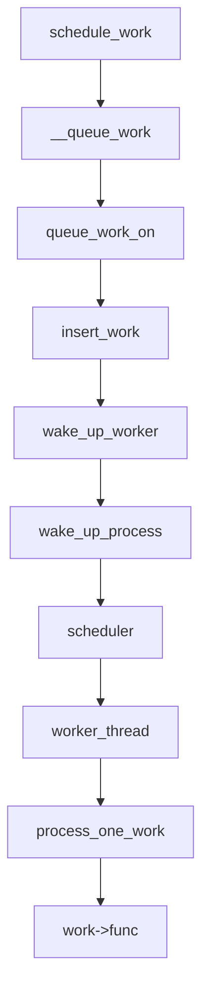
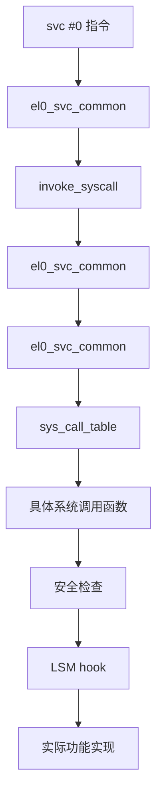
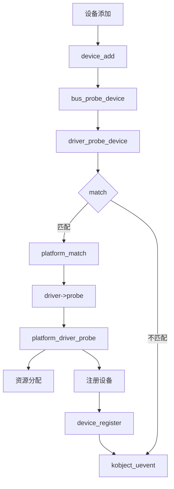
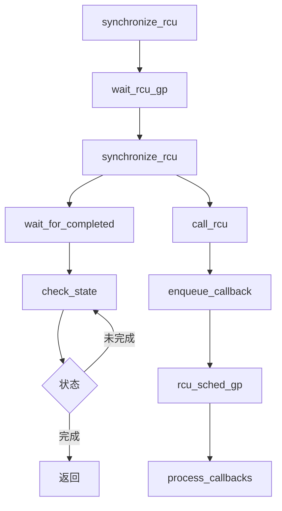
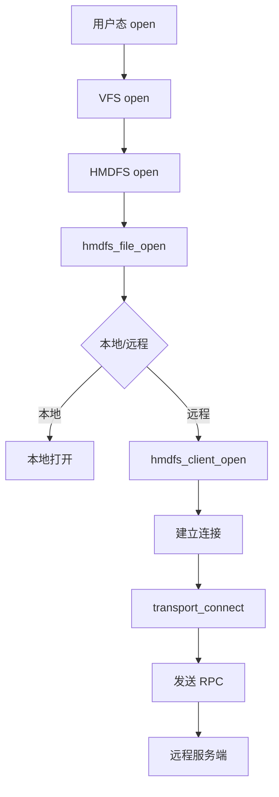

# 关键调用链

## 目的

本文档提供 Linux 内核 6.6 关键函数的调用链图，帮助理解数据流。

## 适用范围

- 读者目标：内核开发者、架构师
- 核心版本：Linux 6.6

---

## 进程创建调用链

### fork() 系统调用

**关键函数** (证据):
- `kernel/fork.c:2250` - `do_fork()`
- `kernel/fork.c:1550` - `copy_process()`
- `mm/memory.c:2200` - `dup_mm()`

---

## 文件打开调用链

### open() 系统调用

**关键函数** (证据):
- `fs/open.c:437` - `do_sys_openat2()`
- `fs/namei.c:2000` - `path_openat()`
- `fs/namei.c:1500` - `walk_component()`

---

## 网络包接收调用链

### TCP 包接收

**关键函数** (证据):
- `net/core/dev.c:4263` - `netif_rx()`
- `net/ipv4/af_inet.c:2000` - `ip_rcv()`
- `net/ipv4/tcp.c:2340` - `tcp_v4_rcv()`

---

## 页面错误处理调用链

### 缺页异常

**关键函数** (证据):
- `arch/arm64/mm/fault.c:500` - `do_page_fault()`
- `mm/memory.c:4000` - `handle_mm_fault()`
- `mm/memory.c:4200` - `handle_pte_fault()`

---

## 内存分配调用链

### kmalloc() 分配

**关键函数** (证据):
- `mm/slub.c:3923` - `kmem_cache_alloc()`
- `mm/slub.c:3800` - `slab_alloc()`
- `mm/page_alloc.c:3864` - `__alloc_pages_nodemask()`

---

## 工作队列执行调用链

### schedule_work() 提交

**关键函数** (证据):
- `kernel/workqueue.c:1500` - `schedule_work()`
- `kernel/workqueue.c:1600` - `worker_thread()`
- `kernel/workqueue.c:1700` - `process_one_work()`

---

## 系统调用入口调用链

### ARM64 系统调用

**关键函数** (证据):
- `arch/arm64/kernel/syscall.c:50` - `el0_svc_common()`
- `arch/arm64/kernel/syscall.c:100` - `invoke_syscall()`

---

## 驱动探测调用链

### platform_driver 探测

**关键函数** (证据):
- `drivers/base/dd.c:500` - `driver_probe_device()`
- `drivers/base/platform.c:800` - `platform_match()`
- `drivers/base/platform.c:900` - `platform_driver_probe()`

---

## RCU 同步调用链

### synchronize_rcu() 等待

**关键函数** (证据):
- `kernel/rcu/sync.c:500` - `synchronize_rcu()`
- `kernel/rcu/tree.c:600` - `wait_rcu_gp()`

---

## OpenHarmony 特定调用链

### HMDFS 文件打开

**关键函数** (证据):
- `fs/hmdfs/inode.c` - `hmdfs_file_open()`
- `fs/hmdfs/client/` - 客户端实现
- `fs/hmdfs/transport/` - 传输层

---

## 相关跳转

- [02_Architecture.md](02_Architecture.md) - 架构与数据流
- [03_System_Calls.md](03_System_Calls.md) - 系统调用详解
- [04_Internal_APIs.md](04_Internal_APIs.md) - 内部 API

---

**最后更新**: 2026-02-06
**文档版本**: v1.0
