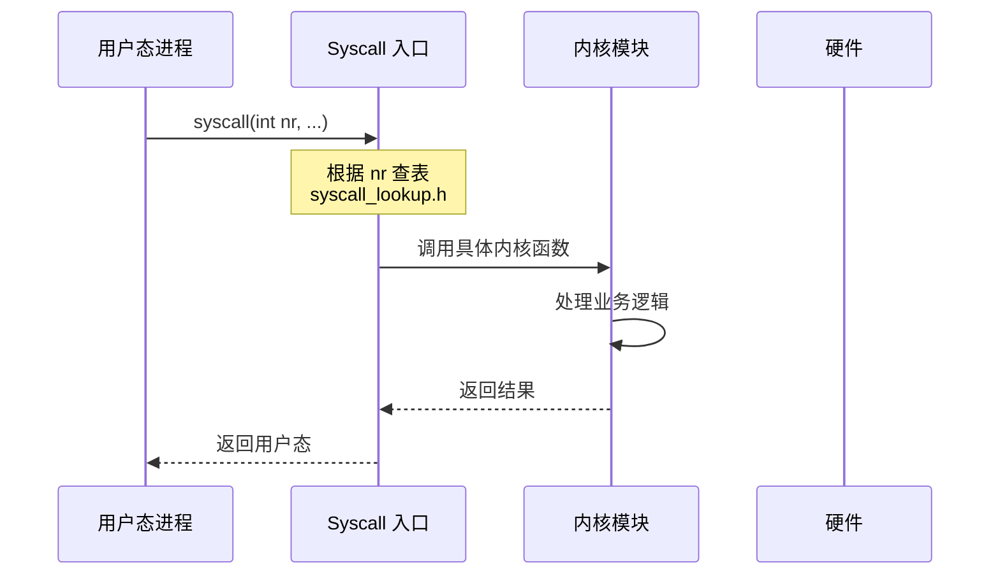
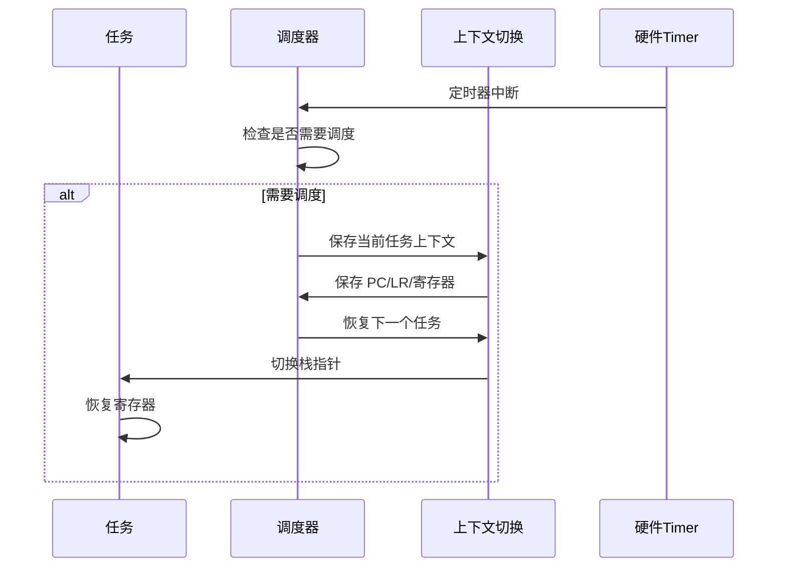

# 架构说明

## 整体架构图

```
+-----------------------------------------------------------------------+
|                         User Space                                    |
|  +------------------+  +------------------+  +---------------------+ |
|  |   Applications   |  |   Shell(cmds)    |  |   Init Process      | |
|  +------------------+  +------------------+  +---------------------+ |
+-----------------------------------------------------------------------+
                              | syscall
                              ↓
+-----------------------------------------------------------------------+
|                         Kernel Space                                  |
|                                                                       |
|  +-------------+  +-------------+  +-------------+  +-------------+  |
|  |  Process/   |  |  Memory     |  |    IPC      |  |   File      |  |
|  |  Task Mgmt  |  |  Management |  |             |  |   System    |  |
|  |  & Sched    |  |  & VM       |  |             |  |             |  |
|  +-------------+  +-------------+  +-------------+  +-------------+  |
|                                                                       |
|  +-------------+  +-------------+  +-------------+  +-------------+  |
|  |   Network   |  |   Drivers    |  |  Security   |  |  Platform   |  |
|  |   Stack     |  |  (HDF/Char)  |  |  (Cap/VID)  |  |  (SOC)      |  |
|  +-------------+  +-------------+  +-------------+  +-------------+  |
|                                                                       |
|  +-------------+  +-------------+  +-------------+  +-------------+  |
|  |  Extended   |  |   Arch       |  |  Syscall    |  |   Common    |  |
|  |  Features   |  |  (ARM)       |  |  Interface  |  |   Utils     |  |
|  +-------------+  +-------------+  +-------------+  +-------------+  |
+-----------------------------------------------------------------------+
                              | HAL
                              ↓
+-----------------------------------------------------------------------+
|                         Hardware Layer                                |
|            CPU (ARM Cortex-A) / Memory / Devices / Peripherals        |
+-----------------------------------------------------------------------+
```

## 组件职责

### 进程/任务管理
**代码位置**: `kernel/base/core/los_process.c`, `kernel/base/core/los_task.c`

| 功能 | 说明 |
|------|------|
| **进程控制块 (PCB)** | `LosProcessCB` 管理进程状态 |
| **任务控制块 (TCB)** | `LosTaskCB` 管理线程状态 |
| **调度策略** | 支持优先级/时间片调度 |
| **上下文切换** | ARM 架构寄存器保存/恢复 |

### 内存管理
**代码位置**: `kernel/base/mem/`, `kernel/base/vm/`

| 子模块 | 职责 |
|--------|------|
| **TLSF 分配器** | 动态内存分配 |
| **MemBox** | 固定大小内存池 |
| **虚拟内存 (VM)** | 内存映射/页表管理 |
| **内存统计** | 内存使用追踪 |

### IPC 机制
**代码位置**: `kernel/base/ipc/`

| 机制 | 用途 |
|------|------|
| **Event** | 事件通知 |
| **Mutex** | 互斥锁 (支持递归) |
| **Semaphore** | 信号量 |
| **Queue** | 消息队列 |
| **Futex** | 快速用户态锁 |
| **LiteIPC** | 轻量级进程间通信 |

### 文件系统
**代码位置**: `fs/`

- **VFS 层**: 统一文件系统接口
- **FAT**: 闪存/SD 卡文件系统
- **JFFS2**: NAND 闪存日志文件系统
- **ProcFS**:  proc 文件系统
- **RAMFS**: RAM 虚拟文件系统
- **NFS**: 网络文件系统

### 网络栈
**代码位置**: `net/` (基于 lwIP)

- TCP/IP 协议栈
- Socket API
- 网络设备驱动接口

### 设备驱动
**代码位置**: `drivers/`, `bsd/`

- **HDF**: Hardware Driver Foundation 框架
- **字符设备**: `/dev/mem`, `/dev/random`, Framebuffer
- **USB**: FreeBSD 驱动适配

## 数据流

### 系统调用流程


### 任务调度流程


## 线程模型

### SMP 支持
**代码位置**: `kernel/include/los_smp.h`

- **对称多处理器**: 支持多核 CPU
- **负载均衡**: 任务在核间迁移
- **IPI 中断**: 核间通信

### 线程状态机
```
                    +-------+
    创建 -------->  | Ready |  <------- 唤醒
                    +-------+
                     |     ↑
                     |     |
                     ↓     |
    退出 --------+  +-------+  +---------+  超时
    终止        |  | Run   |  | Pending |  --------
               +->+-------+  +---------+<--------+
                  ↑                              |
                  |                              |
                  |          +---------+          |
    信号/时间片   |          | Suspend |  -------+
                  +----------+---------+<--------+
                              |     ↑
                              |     |
                              ↓     |
                          +---------+
                          | Stopped |
                          +---------+
```

## 关键机制

### 系统启动流程
1. **汇编入口**: `arch/arm/arm/src/startup/`
2. **C 入口**: `kernel/base/core/los_init.c`
3. **Init 进程**: `apps/init/`
4. **Shell 启动**: `apps/shell/`

### 中断处理
**代码位置**: `arch/arm/include/los_hwi.h`

- **硬件中断**: GIC 中断控制器
- **软件中断**: 系统调用入口 (`SVC`)
- **中断嵌套**: 支持优先级抢占

### 内存布局 (典型)
```
+----------------------+ 0x40000000
|      Kernel          |  (代码/数据)
+----------------------+
|   Kernel Heap        |
+----------------------+
|   User Space         |
+----------------------+ 0x00000000
```

## 相关文档

- [项目概览](/00_Overview.md)
- [目录结构](/01_Directory_Structure.md)
- [内核模块详解](/04_Kernel_Modules.md)
- [系统调用接口](/05_Syscall_API.md)
