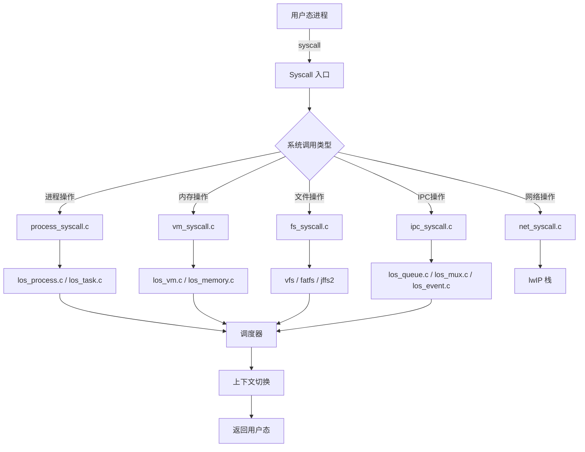

# 关键调用链

## 系统调用入口路径

### 1. 通用 Syscall 入口

```
用户态进程 (libc)
    │
    ├─→ write(fd, buf, count)
    │
    └─→ SVC #0 (软中断)
              │
              ↓
       arch/arm/arm/src/syscall.S
       (OsArm32SyscallHandle / OsArmAarch64SyscallHandle)
              │
              ↓
       syscall/los_syscall.c:LosSyscallHandle
              │
              ├─→ syscall_lookup.h (查表)
              │         │
              │         └─→ SysWrite (write syscall handler)
              │
              ↓
       fs_syscall.c:SysWrite
              │
              ├─→ fs/fs.c:vfs_write()
              │         │
              │         └─→ 具体文件系统驱动
              │
              └─→ 返回用户态
```

### 2. 进程创建 (fork)

```
用户态
    │
    ├─→ fork()
    │
    └─→ SVC #0
              │
              ↓
       OsArmSyscallHandle
              │
              ↓
       syscall_lookup.h → SysFork
              │
              ↓
       syscall/process_syscall.c:SysFork
              │
              ├─→ kernel/base/core/los_process.c:OsForkParent()
              │         │
              │         ├─→ LOS_MemAlloc()  // 分配 PCB
              │         ├─→ OsTaskSchedule() // 调度准备
              │
              └─→ 返回子进程 PID
```

### 3. 任务创建 (LOS_TaskCreate)

```
用户态/内核态
    │
    ├─→ LOS_TaskCreate()
    │
    └─→ kernel/base/core/los_task.c:LOS_TaskCreate
              │
              ├─→ LOS_MemAlloc()  // 分配 TCB
              │
              ├─→ OsStackInit()   // 初始化栈
              │
              ├─→ OsSchedTaskAdd() // 加入调度队列
              │
              └─→ return taskID
```

### 4. 内存分配 (LOS_MemAlloc)

```
用户态
    │
    ├─→ malloc() → brk()/mmap()
    │
    └─→ Syscall: mmap2 / brk
              │
              ├─→ SysMmap / SysBrk
              │
              ├─→ kernel/base/vm/los_vm.c:OsMmap()
              │         │
              │         ├─→ LOS_VMMap()
              │         │
              │         └─→ LOS_MemAlloc()  // 实际分配
              │
              └─→ kernel/base/mem/tlsf/los_memory.c
                        │
                        └─→ TLSF_Alloc()  // TLSF 分配器
```

### 5. 互斥锁操作 (LOS_MuxLock)

```
用户态
    │
    ├─→ pthread_mutex_lock()
    │
    └─→ LOS_MuxLock()
              │
              ├─→ kernel/base/ipc/los_mux.c:OsMuxLock
              │
              ├─→ LOS_SpinLock()  // 自旋锁
              │
              ├─→ 检查持有者
              │    │
              │    ├─→ 自己持有 → 递归计数++
              │    │
              │    ├─→ 空闲 → 加锁
              │    │
              │    └─→ 他人持有 → 阻塞等待
              │
              └─→ LOS_SpinUnlock()
```

### 6. 消息队列 (LOS_QueueCreate)

```
用户态
    │
    ├─→ mq_open()
    │
    └─→ Syscall: mq_open
              │
              ├─→ SysMqOpen
              │
              ├─→ kernel/base/ipc/los_queue.c:LOS_QueueCreate
              │         │
              │         ├─→ LOS_MemAlloc()  // 分配队列控制块
              │         │
              │         ├─→ OsQueueInit()
              │         │
              │         └─→ 返回队列 ID
              │
              └─→ 返回 mqd_t
```

### 7. 文件打开 (open)

```
用户态
    │
    ├─→ open(path, flags, mode)
    │
    └─→ Syscall: openat
              │
              ├─→ SysOpenat
              │
              ├─→ fs_syscall.c:SysOpenat
              │         │
              │         ├─→ CHECK_ASPACE()  // 参数校验
              │         │
              │         ├─→ DUP_FROM_USER() // 拷贝路径
              │         │
              │         └─→ fs/fs.c:openat()
              │                   │
              │                   ├─→ vfs/vfs.c:open()
              │                   │
              │                   ├─→ 具体文件系统驱动
              │                   │
              │                   └─→ 返回 fd
              │
              └─→ 返回 fd
```

### 8. 中断处理

```
硬件中断 (GIC)
    │
    ├─→ arch/arm/arm/src/exception.S
    │         │
    │         └─→ OsHalHwiDefaultHandler()
    │
    ├─→ arch/arm/include/los_hwi.h
    │         │
    │         └─→ OsInterruptHandler()
    │
    ├─→ 查找中断号对应的处理函数
    │
    ├─→ 调用设备驱动中断处理
    │
    └─→ EOI (End of Interrupt)
```

### 9. 调度器触发

```
硬件定时器中断
    │
    ├─→ arch_timer_handler()
    │
    ├─→ kernel/base/core/los_swtmr.c:OsSwtmrTask()
    │         │
    │         └─→ 检查时间片
    │
    ├─→ kernel/base/core/los_sched.c:OsSchedResched()
    │         │
    │         ├─→ LOS_TaskYield()  // 让出 CPU
    │         │
    │         └─→ OsTaskSchedule() // 选择下一个任务
    │
    └─→ 上下文切换
```

### 10. Init 进程启动

```
硬件上电
    │
    ├─→ arch/arm/arm/src/startup/reset_vector_up.S
    │         │
    │         └─→ _Reset
    │
    ├─→ arch_entry()
    │         │
    ├─→ kernel/base/core/los_init.c:OsMain()
    │         │
    │         ├─→ OsKernelInit()  // 内核初始化
    │         │         │
    │         │         ├─→ OsSetupStart()
    │         │         └─→ 其他子系统初始化
    │         │
    │         └─→ apps/init/los_init.c:AppInitMain()
    │                   │
    │                   ├─→ LOS_DoExecvFile()  // 执行 init
    │                   │
    │                   └─→ shell 启动
```

## 调用链图示



## 相关文档

- [系统调用接口](/05_Syscall_API.md)
- [内核模块详解](/04_Kernel_Modules.md)
- [架构说明](/02_Architecture.md)
