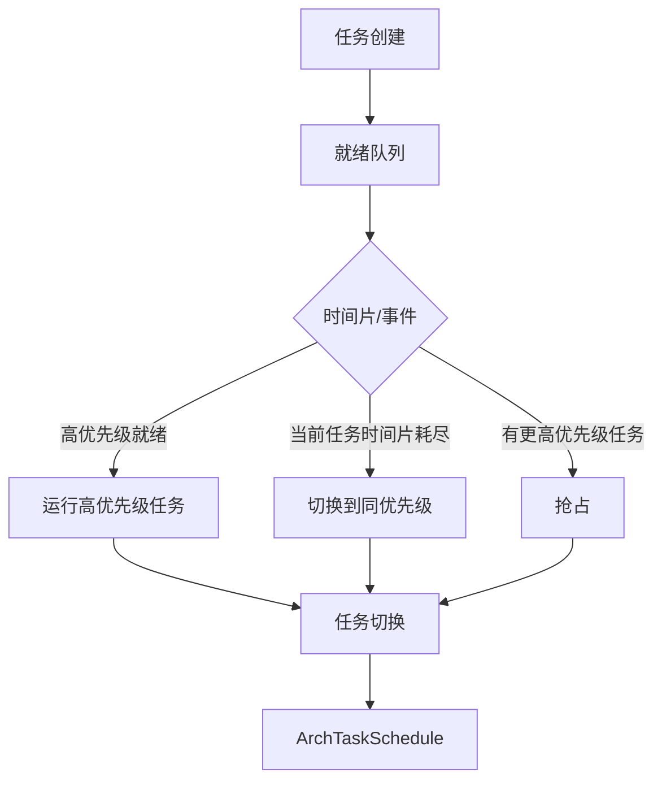

# 架构说明 - 03_Architecture

## 整体架构

```
+----------------------------------------------------------+
|                    应用层 (可选)                          |
+----------------------------------------------------------+
                          ↓
+-------------------+-------------------+-------------------+
|    CMSIS-RTOS     |     POSIX         |    Native API     |
|   (kal/cmsis/)    |   (kal/posix/)   |   (kernel/include/)|
+-------------------+-------------------+-------------------+
                          ↓
+----------------------------------------------------------+
|                   LiteOS-M Kernel                         |
+-------------------+-------------------+-------------------+
|   任务管理        |   IPC 机制        |   时间管理         |
|   (los_task)     |   (queue/sem/mux)|   (tick/swtmr)    |
+-------------------+-------------------+-------------------+
|   调度器         |   内存管理       |   异常处理         |
|   (los_sched)    |   (mm/)          |   (arch/)         |
+-------------------+-------------------+-------------------+
                          ↓
+----------------------------------------------------------+
|                   硬件抽象层 (HAL)                         |
+----------------------------------------------------------+
                          ↓
+-------------------+-------------------+-------------------+
|       ARM         |      RISC-V       |      其他架构      |
|   (arch/arm/)     |   (arch/risc-v/)  |   (arch/*/)       |
+-------------------+-------------------+-------------------+
```

## 核心数据流

### 任务创建流程

```
LOS_TaskCreate()
    ↓
[参数校验] → los_task.c:500+
    ↓
[内存分配] → 任务控制块 (TCB)
    ↓
[链表挂载] → g_taskCBArray (任务链表)
    ↓
[调度就绪] → LosSchedReady()
    ↓
[任务切换] → ArchTaskSchedule()
```

### 消息队列流程

```
LOS_QueueCreate()
    ↓
[队列控制块初始化]
    ↓
LOS_QueueWrite()
    ↓
[消息入队]
    ↓
LOS_QueueRead()
    ↓
[消息出队]
```

## 线程模型

### 任务状态机

```
                    +-----------+
    创建 ------------→ |   Ready   | ------------→ 运行
                    +-----------+                 |
                         | ↑                       |
                         | |                       |
        时间片耗尽/抢占 | | | 阻塞/休眠            | 挂起
                         | |                       ↓
                    +-----------+            +-----------+
                    |  Pending  | ←--------- |  Suspend  |
                    +-----------+     恢复   +-----------+
                         |
        超时/事件触发 | |
                         ↓
                    +-----------+
                    |   Exit    | ------------→ 销毁
                    +-----------+
```

### 任务优先级

- **优先级范围**: 0 ~ 31（可配置）
- **优先级数值越小**: 优先级越高
- **空闲任务**: 优先级最低 (31)

## 关键组件交互

### 调度器交互



### 中断处理

1. 硬件中断触发
2. `arch_interrupt_handler()` (arch/ 相关代码)
3. 设置任务唤醒/事件标志
4. 调度器检查是否需要任务切换

## 内核初始化流程

```
main()
    ↓
OsMain()  [los_init.c]
    ↓
1. ArchInit()         → 架构初始化
    ↓
2. OsTickInit()       → 系统节拍初始化
    ↓
3. OsKernelInit()     → 内核模块初始化
    - 任务初始化 (OsTaskInit)
    - 队列初始化 (OsQueueInit)
    - 内存初始化 (OsMemInit)
    ↓
4. OsStart()          → 启动调度器
```

## 内存布局（典型）

```
+-------------------+ 0x00000000
|   向量表           |
+-------------------+
|   .text           |  代码段
+-------------------+
|   .rodata         |  只读数据
+-------------------+
|   .data           |  已初始化数据
+-------------------+
|   .bss            |  未初始化数据
+-------------------+
|   堆 (Heap)       |  动态内存
+-------------------+
|   内核栈          |
+-------------------+ 0x20000000+
|   用户栈 (可选)    |
+-------------------+
```

## 相关文档

- [项目概览](01_Overview.md)
- [目录结构](02_Directory_Structure.md)
- [内核 API](04_Kernel_API.md)
