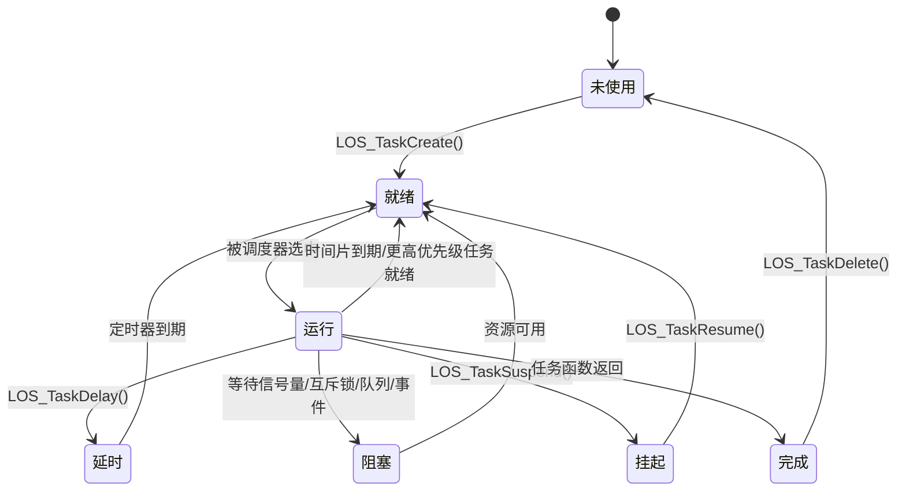

# 内部实现细节

> 核心数据结构、内部 API 契约、资源生命周期

**最后更新**：2026-02-07
**适用人群**：高级开发者、安全研究员
**证据来源**：代码结构分析

---

## 核心数据结构

### 1. 任务控制块（Task Control Block）

**定义位置**：`kernel/include/los_task.h`

**结构体**：`LosTaskCB`

```c
// 伪代码，基于典型 RTOS 设计
typedef struct {
    UINT32 taskStatus;          // 任务状态
    UINT16 taskPrio;            // 任务优先级（0-31，0 最高）
    UINT16 basePrio;            // 基础优先级
    UINT32 stackPointer;         // 栈指针
    UINT32 stackSize;           // 栈大小
    UINT32 taskId;              // 任务 ID
    UINTPTR *topOfStack;        // 栈顶地址
    TSK_ENTRY_FUNC taskEntry;    // 任务入口函数
    UINTPTR taskSem;            // 持有的信号量
    UINTPTR taskMux;            // 持有的互斥锁
    UINTPTR eventMask;          // 事件掩码
    UINT32 event;               // 事件值
    UINT32 waitFlags;           // 等待标志
    UINTPTR args[4];            // 任务参数
    CHAR taskName[OS_TCB_NAME_LEN];  // 任务名称
#ifdef LOSCFG_KERNEL_SMP
    UINT32 cpuAffiMask;        // CPU 亲和性掩码（SMP）
#endif
#ifdef LOSCFG_KERNEL_SMP_TASK_SYNC
    UINT32 magic;              // 魔数（调试）
#endif
} LosTaskCB;
```

**关键成员说明**：

| 成员 | 类型 | 说明 |
|------|------|------|
| `taskStatus` | UINT32 | 任务状态（运行、就绪、挂起、阻塞等） |
| `taskPrio` | UINT16 | 当前优先级（动态调整） |
| `basePrio` | UINT16 | 基础优先级（避免优先级反转） |
| `stackPointer` | UINT32 | 当前栈指针（用于上下文切换） |
| `topOfStack` | UINTPTR* | 栈顶地址（用于栈溢出检测） |
| `taskEntry` | 函数指针 | 任务入口函数 |
| `taskSem` | UINTPTR | 阻塞时等待的信号量 |
| `taskMux` | UINTPTR | 持有的互斥锁（用于优先级继承） |

**任务状态**：

```c
// 任务状态标志（伪代码）
#define OS_TASK_STATUS_UNUSED      0x0001  // 未使用
#define OS_TASK_STATUS_READY       0x0002  // 就绪
#define OS_TASK_STATUS_RUNNING     0x0004  // 运行中
#define OS_TASK_STATUS_SUSPENDED   0x0008  // 挂起
#define OS_TASK_STATUS_DELAYED     0x0010  // 延时中
#define OS_TASK_STATUS_PEND        0x0020  // 阻塞中
#define OS_TASK_STATUS_PEND_TIME   0x0040  // 带超时阻塞
```

**证据**：
- `kernel/include/los_task.h` - 任务控制块定义
- `kernel/src/los_task.c` - 任务管理实现

---

### 2. 内存池控制块

**定义位置**：`kernel/include/los_membox.h`

**结构体**：`LOS_MEMBOX_INFO`

```c
// 伪代码
typedef struct {
    VOID *uwBoxBase;           // 内存池起始地址
    UINT32 uwBlkSize;          // 每个块的大小
    UINT32 uwBlkNum;           // 总块数
    UINT32 uwBlkCnt;           // 已分配块数
    UINT32 uwFreeBlk;           // 空闲块数
    UINT32 *pstFreeList;        // 空闲链表头
    UINT32 uwBlkLog2;          // 块大小的 log2（用于计算）
    UINT32 uwMemSize;           // 内存池总大小
} LOS_MEMBOX_INFO;
```

**特点**：
- 静态分配：内存池在编译时或启动时分配
- 固定大小：每个块大小相同（避免碎片）
- 快速分配：链表管理，O(1) 时间复杂度

**证据**：
- `kernel/include/los_membox.h` - 内存池定义
- `kernel/src/los_membox.c` - 内存池实现

---

### 3. 信号量控制块

**定义位置**：`kernel/include/los_sem.h`

**结构体**：`LosSemCB`

```c
// 伪代码
typedef struct {
    UINT32 semCount;           // 信号量计数（二值/计数）
    UINT32 semId;              // 信号量 ID
    UINT16 semStat;            // 信号量状态（使用/未使用）
    LOS_DL_LIST pendList;       // 阻塞任务链表
} LosSemCB;
```

**类型**：
- 二值信号量（计数为 0 或 1）
- 计数信号量（计数可大于 1）

**证据**：
- `kernel/include/los_sem.h` - 信号量定义
- `kernel/src/los_sem.c` - 信号量实现

---

### 4. 互斥锁控制块

**定义位置**：`kernel/include/los_mux.h`

**结构体**：`LosMuxCB`

```c
// 伪代码
typedef struct {
    UINT32 muxId;              // 互斥锁 ID
    UINT16 muxStat;            // 状态（使用/未使用）
    UINT16 priority;           // 持有任务优先级（用于优先级继承）
    UINT32 count;              // 递归锁计数
    LosTaskCB *owner;         // 持有任务
    LOS_DL_LIST pendList;       // 阻塞任务链表
} LosMuxCB;
```

**优先级继承**：
- 当高优先级任务等待低优先级任务持有的互斥锁时
- 临时提升低优先级任务的优先级到高优先级
- 避免优先级反转

**证据**：
- `kernel/include/los_mux.h` - 互斥锁定义
- `kernel/src/los_mux.c` - 互斥锁实现

---

### 5. 消息队列控制块

**定义位置**：`kernel/include/los_queue.h`

**结构体**：`LosQueueCB`

```c
// 伪代码
typedef struct {
    UINT32 queueId;            // 队列 ID
    UINT16 queueState;         // 状态（使用/未使用）
    UINT16 queueLen;           // 队列长度
    UINT16 queueSize;          // 每条消息大小
    UINT16 head;               // 队头索引
    UINT16 tail;               // 队尾索引
    UINT16 readWriteableCnt[2]; // [0]=可读数, [1]=可写数
    VOID *queueHandle;         // 队列缓冲区地址
    LOS_DL_LIST readWriteList[2]; // [0]=读阻塞链表, [1]=写阻塞链表
    LOS_DL_LIST memList;        // 内存管理链表
} LosQueueCB;
```

**环形缓冲区**：
- 使用 `head` 和 `tail` 索引实现环形队列
- 避免频繁的内存拷贝

**证据**：
- `kernel/include/los_queue.h` - 队列定义
- `kernel/src/los_queue.c` - 队列实现

---

### 6. 事件控制块

**定义位置**：`kernel/include/los_event.h`

**结构体**：`LosEventCB`

```c
// 伪代码
typedef struct {
    UINT32 uwEventID;          // 事件 ID（位掩码）
    UINT32 uwEventMask;        // 等待的事件掩码
} LosEventCB;
```

**位掩码**：
- 每个位代表一个事件
- 支持同时等待多个事件（OR）
- 支持等待所有事件（AND）

**证据**：
- `kernel/include/los_event.h` - 事件定义
- `kernel/src/los_event.c` - 事件实现

---

### 7. 软件定时器控制块

**定义位置**：`kernel/include/los_swtmr.h`

**结构体**：`LosSwtmrCB`

```c
// 伪代码
typedef struct {
    UINT8 timerState;          // 定时器状态
    UINT8 timerMode;           // 定时器模式（单次/周期）
    UINT16 timerId;            // 定时器 ID
    UINT16 timerName[OS_TCB_NAME_LEN]; // 名称
    UINT32 interval;           // 定时间隔（tick）
    UINT32 expiryTime;         // 到期时间
    SWTMR_PROC_FUNC handler;    // 处理函数
    UINT_PTR args;             // 参数
    LOS_DL_LIST sortList;       // 排序链表（按到期时间）
} LosSwtmrCB;
```

**排序链表**：
- 按到期时间排序，最近的在前
- 高效检查到期的定时器

**证据**：
- `kernel/include/los_swtmr.h` - 软件定时器定义
- `kernel/src/los_swtmr.c` - 软件定时器实现

---

### 8. 沙箱控制块

**定义位置**：`components/security/box/los_box.h`

**结构体**：`LosBoxCB`

```c
// 伪代码
typedef struct {
    UINTPTR textAddr;          // 代码段起始地址
    UINT32 textSize;           // 代码段大小
    UINTPTR roAddr;           // 只读数据段起始地址
    UINT32 roSize;             // 只读数据段大小
    UINTPTR heapAddr;          // 堆起始地址
    UINT32 heapSize;           // 堆大小
    UINTPTR stackAddr;         // 栈起始地址
    UINT32 stackSize;          // 栈大小
} LosBoxCB;
```

**安全边界**：
- 定义用户态任务的地址空间
- 用于 MPU/TrustZone 配置

**证据**：
- `components/security/box/los_box.h` - 沙箱定义
- `components/security/box/los_box.c` - 沙箱实现

---

### 9. 动态链接对象

**定义位置**：`components/dynlink/los_dynlink.h`

**结构体**：`LosDynList`

```c
// 伪代码
typedef struct {
    VOID *loadAddr;            // 加载地址
    UINT32 loadSize;           // 加载大小
    UINT32 dynSize;            // 动态段大小
    CHAR *fileName;            // 文件名
    Elf_Ehdr *ehdr;            // ELF 头指针
    Elf_Phdr *phdr;            // 程序头指针
    VOID *pool;                // 内存池
    LOS_DL_LIST list;           // 链表节点
} LosDynList;
```

**证据**：
- `components/dynlink/los_dynlink.h` - 动态链接定义
- `components/dynlink/los_dynlink.c` - 动态链接实现

---

## 内部 API 契约

### 稳定接口（Public API）

这些接口是稳定的，对外暴露，保证向后兼容。

| 模块 | 头文件 | 说明 |
|------|--------|------|
| 任务管理 | `kernel/include/los_task.h` | `LOS_Task*()` 系列 API |
| 信号量 | `kernel/include/los_sem.h` | `LOS_Sem*()` 系列 API |
| 互斥锁 | `kernel/include/los_mux.h` | `LOS_Mux*()` 系列 API |
| 队列 | `kernel/include/los_queue.h` | `LOS_Queue*()` 系列 API |
| 事件 | `kernel/include/los_event.h` | `LOS_Event*()` 系列 API |
| 内存 | `kernel/include/los_memory.h` | `LOS_Mem*()` 系列 API |
| 内存池 | `kernel/include/los_membox.h` | `LOS_Membox*()` 系列 API |
| 软件定时器 | `kernel/include/los_swtmr.h` | `LOS_Swtmr*()` 系列 API |
| 中断 | `kernel/include/los_interrupt.h` | `LOS_Hwi*()` 系列 API |
| 时钟 | `kernel/include/los_tick.h` | `LOS_Tick*()` 系列 API |

**使用示例**：

```c
// 创建任务（稳定接口）
UINT32 taskId;
TSK_INIT_PARAM_S taskInit = {
    .pfnTaskEntry = MyTaskEntry,
    .usTaskPrio = 10,
    .uwStackSize = 0x1000,
    .pcName = "MyTask",
};
LOS_TaskCreate(&taskId, &taskInit);
```

---

### 内部实现接口（Internal API）

这些接口仅供内核内部使用，可能随时更改。

| 模块 | 前缀 | 说明 |
|------|------|------|
| 任务管理 | `OsTask*()` | 内部任务管理函数 |
| 调度器 | `OsSched*()` | 内部调度函数 |
| 内存 | `OsMem*()` | 内部内存管理函数 |
| 中断 | `ArchInt*()` | 架构相关中断函数 |
| 上下文切换 | `ArchContext*()` | 架构相关上下文切换 |

**使用限制**：
- ⚠️ **禁止**在应用代码中调用这些接口
- ⚠️ 这些接口可能在不同版本间更改
- ⚠️ 可能破坏系统稳定性

**示例**：

```c
// 内部函数（不对外暴露）
VOID OsTaskSuspend(LosTaskCB *taskCB);  // 内部挂起任务
VOID OsTaskResume(LosTaskCB *taskCB);   // 内部恢复任务
```

**证据**：
- `kernel/src/` - 内部实现文件
- `arch/` - 架构相关内部函数

---

## 资源生命周期

### 任务生命周期

```
创建（LOS_TaskCreate）
    ↓
初始化
    ↓
就绪（READY）
    ↓
[调度器选择] → 运行（RUNNING）
    ↓
    ├─→ 延时（DELAYED） → [时间到] → 就绪
    ├─→ 阻塞（PENDING） → [资源可用] → 就绪
    ├─→ 挂起（SUSPENDED） → [恢复] → 就绪
    └─→ 完成 → 删除（DELETE）
```

**状态转换图**：



**关键函数**：

| 函数 | 功能 | 文件位置 |
|------|------|---------|
| `LOS_TaskCreate()` | 创建任务 | `kernel/src/los_task.c` |
| `LOS_TaskDelete()` | 删除任务 | `kernel/src/los_task.c` |
| `LOS_TaskSuspend()` | 挂起任务 | `kernel/src/los_task.c` |
| `LOS_TaskResume()` | 恢复任务 | `kernel/src/los_task.c` |
| `LOS_TaskDelay()` | 延时任务 | `kernel/src/los_task.c` |
| `OsTaskEntry()` | 任务入口包装器 | `kernel/src/los_task.c` |

**证据**：
- `kernel/src/los_task.c` - 任务生命周期管理

---

### 内存块生命周期

#### 动态堆内存

```
分配（LOS_MemAlloc）
    ↓
初始化元数据
    ↓
[使用中]
    ↓
释放（LOS_MemFree）
    ↓
合并相邻空闲块
    ↓
返回到空闲链表
```

**内存布局**：

```
+------------------+
|  块元数据        |
+------------------+
|  用户数据        |
|  (用户可访问）   |
+------------------+
|  对齐填充        |
+------------------+
```

**关键函数**：

| 函数 | 功能 | 文件位置 |
|------|------|---------|
| `LOS_MemAlloc()` | 分配内存 | `kernel/src/los_memory.c` |
| `LOS_MemAllocAlign()` | 分配对齐内存 | `kernel/src/los_memory.c` |
| `LOS_MemRealloc()` | 重新分配 | `kernel/src/los_memory.c` |
| `LOS_MemFree()` | 释放内存 | `kernel/src/los_memory.c` |

---

#### 静态内存池

```
创建（LOS_MemboxInit）
    ↓
初始化空闲链表
    ↓
分配（LOS_MemboxAlloc）
    ↓
[使用中]
    ↓
释放（LOS_MemboxFree）
    ↓
返回到空闲链表
```

**关键函数**：

| 函数 | 功能 | 文件位置 |
|------|------|---------|
| `LOS_MemboxInit()` | 初始化内存池 | `kernel/src/los_membox.c` |
| `LOS_MemboxAlloc()` | 分配块 | `kernel/src/los_membox.c` |
| `LOS_MemboxFree()` | 释放块 | `kernel/src/los_membox.c` |
| `LOS_MemboxClr()` | 清空内存池 | `kernel/src/los_membox.c` |

**证据**：
- `kernel/src/los_memory.c` - 堆内存实现
- `kernel/src/los_membox.c` - 内存池实现

---

### 信号量生命周期

```
创建（LOS_SemCreate）
    ↓
初始化计数（二值=0/1，计数=指定值）
    ↓
[使用中]
    ↓
等待（LOS_SemPend）
    ↓
[阻塞或获取信号量]
    ↓
释放（LOS_SemPost）
    ↓
[唤醒等待任务或增加计数]
    ↓
删除（LOS_SemDelete）
```

**关键函数**：

| 函数 | 功能 | 文件位置 |
|------|------|---------|
| `LOS_SemCreate()` | 创建信号量 | `kernel/src/los_sem.c` |
| `LOS_SemDelete()` | 删除信号量 | `kernel/src/los_sem.c` |
| `LOS_SemPend()` | 等待信号量 | `kernel/src/los_sem.c` |
| `LOS_SemPost()` | 释放信号量 | `kernel/src/los_sem.c` |

**证据**：
- `kernel/src/los_sem.c` - 信号量实现

---

### 互斥锁生命周期

```
创建（LOS_MuxCreate）
    ↓
初始化（无持有者，无递归计数）
    ↓
[使用中]
    ↓
锁定（LOS_MuxLock）
    ↓
    ├─→ [无持有者] → 获取锁
    └─→ [有持有者] → [递归锁] → 增加计数
               └─→ [非递归锁] → 阻塞（优先级继承）
    ↓
解锁（LOS_MuxUnlock）
    ↓
    ├─→ [递归计数>1] → 减少计数
    └─→ [递归计数=1] → 释放锁，唤醒等待任务，恢复优先级
    ↓
删除（LOS_MuxDelete）
```

**优先级继承流程**：

```
任务 A（低优先级）持有互斥锁
    ↓
任务 B（高优先级）尝试锁定同一互斥锁
    ↓
任务 B 阻塞，优先级继承机制启动
    ↓
任务 A 的优先级临时提升到任务 B 的优先级
    ↓
任务 A 执行，完成临界区
    ↓
任务 A 解锁
    ↓
任务 A 的优先级恢复到原始优先级
    ↓
任务 B 被唤醒，获取锁
```

**关键函数**：

| 函数 | 功能 | 文件位置 |
|------|------|---------|
| `LOS_MuxCreate()` | 创建互斥锁 | `kernel/src/los_mux.c` |
| `LOS_MuxDelete()` | 删除互斥锁 | `kernel/src/los_mux.c` |
| `LOS_MuxLock()` | 锁定互斥锁 | `kernel/src/los_mux.c` |
| `LOS_MuxUnlock()` | 解锁互斥锁 | `kernel/src/los_mux.c` |

**证据**：
- `kernel/src/los_mux.c` - 互斥锁实现

---

### 消息队列生命周期

```
创建（LOS_QueueCreate）
    ↓
分配队列缓冲区
    ↓
初始化队头、队尾、读写计数
    ↓
[使用中]
    ↓
写入（LOS_QueueWrite）
    ↓
    ├─→ [队列未满] → 写入数据，更新队尾，可读数++
    └─→ [队列已满] → 阻塞（等待读出）
    ↓
读取（LOS_QueueRead）
    ↓
    ├─→ [队列非空] → 读取数据，更新队头，可写数++
    └─→ [队列已空] → 阻塞（等待写入）
    ↓
删除（LOS_QueueDelete）
    ↓
释放队列缓冲区
```

**关键函数**：

| 函数 | 功能 | 文件位置 |
|------|------|---------|
| `LOS_QueueCreate()` | 创建队列 | `kernel/src/los_queue.c` |
| `LOS_QueueDelete()` | 删除队列 | `kernel/src/los_queue.c` |
| `LOS_QueueWrite()` | 写入队列 | `kernel/src/los_queue.c` |
| `LOS_QueueRead()` | 读取队列 | `kernel/src/los_queue.c` |
| `LOS_QueueBufferRead()` | 从缓冲区读取 | `kernel/src/los_queue.c` |
| `LOS_QueueBufferWrite()` | 写入缓冲区 | `kernel/src/los_queue.c` |

**证据**：
- `kernel/src/los_queue.c` - 队列实现

---

### 软件定时器生命周期

```
创建（LOS_SwtmrCreate）
    ↓
初始化定时器参数
    ↓
启动（LOS_SwtmrStart）
    ↓
插入到排序链表（按到期时间）
    ↓
[运行中]
    ↓
时钟中断
    ↓
检查到期定时器
    ↓
[到期] → 执行处理函数
    ↓
    ├─→ [单次模式] → 停止定时器
    └─→ [周期模式] → 重新计算到期时间，重新插入链表
    ↓
停止（LOS_SwtmrStop）
    ↓
从排序链表移除
    ↓
删除（LOS_SwtmrDelete）
```

**关键函数**：

| 函数 | 功能 | 文件位置 |
|------|------|---------|
| `LOS_SwtmrCreate()` | 创建定时器 | `kernel/src/los_swtmr.c` |
| `LOS_SwtmrDelete()` | 删除定时器 | `kernel/src/los_swtmr.c` |
| `LOS_SwtmrStart()` | 启动定时器 | `kernel/src/los_swtmr.c` |
| `LOS_SwtmrStop()` | 停止定时器 | `kernel/src/los_swtmr.c` |

**证据**：
- `kernel/src/los_swtmr.c` - 软件定时器实现

---

## 调度器内部机制

### 调度策略

LiteOS-M 使用**抢占式优先级调度**，支持时间片轮转。

**调度原则**：

1. **优先级优先**：高优先级任务优先执行
2. **时间片轮转**：同优先级任务按时间片轮转
3. **抢占式**：高优先级任务就绪时，抢占低优先级任务
4. **优先级继承**：互斥锁持有者优先级临时提升

**就绪队列**：

```c
// 每个优先级一个就绪队列
LOS_DL_LIST g_taskReadyList[LOSCFG_BASE_CORE_TSK_LIMIT];
```

**调度流程**：

```
时钟中断
    ↓
检查时间片到期
    ↓
[到期] → 当前任务移到就绪队列尾部
    ↓
查找最高优先级就绪任务
    ↓
[找到] → 上下文切换到新任务
```

**关键函数**：

| 函数 | 功能 | 文件位置 |
|------|------|---------|
| `LOS_Schedule()` | 触发调度 | `kernel/src/los_sched.c` |
| `OsTaskSchedule()` | 内部调度函数 | `kernel/src/los_sched.c` |
| `OsHighestReadyTaskGet()` | 获取最高优先级就绪任务 | `kernel/src/los_sched.c` |

**证据**：
- `kernel/src/los_sched.c` - 调度器实现

---

## 中断处理机制

### 中断优先级

LiteOS-M 支持多级中断优先级，中断优先级高于任务优先级。

**中断嵌套**：

```
任务运行（优先级 10）
    ↓
中断 A（优先级 5）触发
    ↓
保存任务上下文
    ↓
执行中断 A 处理程序
    ↓
    ↓ 中断 B（优先级 3）触发（中断嵌套）
    ↓
    保存中断 A 上下文
    ↓
    执行中断 B 处理程序
    ↓
    恢复中断 A 上下文
    ↓
    继续执行中断 A 处理程序
    ↓
恢复任务上下文
    ↓
继续执行任务
```

**关键函数**：

| 函数 | 功能 | 文件位置 |
|------|------|---------|
| `LOS_HwiCreate()` | 创建中断 | `kernel/src/los_interrupt.c` |
| `LOS_HwiDelete()` | 删除中断 | `kernel/src/los_interrupt.c` |
| `ArchIntLock()` | 关中断（架构相关） | `arch/*/gcc/los_interrupt.c` |
| `ArchIntUnlock()` | 开中断（架构相关） | `arch/*/gcc/los_interrupt.c` |

**证据**：
- `kernel/src/los_interrupt.c` - 中断管理
- `arch/*/gcc/los_interrupt.c` - 架构相关中断实现

---

## 上下文切换机制

### 上下文切换时机

1. **任务调度**：`LOS_Schedule()` 触发
2. **中断返回**：从中断返回时检查是否需要调度
3. **时间片到期**：时钟中断时检查时间片

### 上下文切换流程

```
任务 A 运行
    ↓
触发调度（时间片到期/高优先级任务就绪）
    ↓
保存任务 A 上下文到任务 A 的栈
    ↓
选择任务 B（最高优先级就绪任务）
    ↓
从任务 B 的栈恢复上下文
    ↓
跳转到任务 B 的 PC
    ↓
任务 B 运行
```

**保存的上下文**（架构相关）：

- 通用寄存器（R0-R15）
- 程序计数器（PC）
- 链接寄存器（LR）
- 状态寄存器（PSR）
- 栈指针（SP）

**关键函数**：

| 函数 | 功能 | 文件位置 |
|------|------|---------|
| `ArchTaskContextSwitch()` | 任务上下文切换（架构相关） | `arch/*/gcc/los_context.c` |
| `ArchIntContextSwitch()` | 中断上下文切换（架构相关） | `arch/*/gcc/los_interrupt.c` |

**证据**：
- `arch/*/gcc/los_context.c` - 上下文切换实现
- `arch/*/gcc/los_interrupt.c` - 中断上下文切换

---

## 系统调用机制

### 系统调用触发

用户态通过 **SVC（Supervisor Call）指令** 触发系统调用。

**调用流程**：

```
用户态应用
    ↓
执行 SVC 指令
    ↓
切换到内核态
    ↓
保存上下文
    ↓
调用 OsSyscallHandle(args)
    ↓
    ├─→ 调用号边界检查
    ├─→ 参数数量检查
    └─→ 调用系统调用处理函数
    ↓
返回结果到用户态
    ↓
恢复上下文
    ↓
返回用户态
```

**关键函数**：

| 函数 | 功能 | 文件位置 |
|------|------|---------|
| `OsSyscallHandle()` | 系统调用处理入口 | `components/security/syscall/los_syscall.c` |
| `OsSyscallHandleInit()` | 初始化系统调用表 | `components/security/syscall/los_syscall.c` |

**证据**：
- `components/security/syscall/los_syscall.c` - 系统调用实现

---

## 内存对齐和布局

### 栈对齐

**要求**：
- ARM Cortex-M：栈指针必须 8 字节对齐
- RISC-V：栈指针必须 16 字节对齐

**实现**：

```c
// 任务栈对齐
UINTPTR stackPtr = (UINTPTR)stackBuffer;
stackPtr = (stackPtr + alignment - 1) & ~(alignment - 1);
```

---

### 内存池对齐

**要求**：
- 内存块必须按照对齐要求分配
- 避免对齐错误导致的性能下降或崩溃

---

## 调试和诊断

### 栈溢出检测

**实现方式**：
1. **Canary 机制**：在栈底写入 magic 值，检查是否被破坏
2. **栈指针检查**：检查栈指针是否超出合法范围
3. **硬件栈指针限制**：使用 ARM 的 PSP（Process Stack Pointer）限制

**关键函数**：

```c
// 栈溢出检查
BOOL OsCheckStackOverflow(LosTaskCB *taskCB) {
    return (taskCB->stackPointer < taskCB->topOfStack);
}
```

---

### 内存泄漏检测

**LMS（Lite Memory Sanitizer）**：
- 启用 `LOSCFG_KERNEL_LMS`
- 跟踪内存分配和释放
- 检测泄漏和双重释放

---

### 死锁检测

**实现**：
- 跟踪任务等待关系
- 检测循环等待

---

**下一节**：[构建与内部实现](07_Build.md) - 了解构建系统和配置选项
