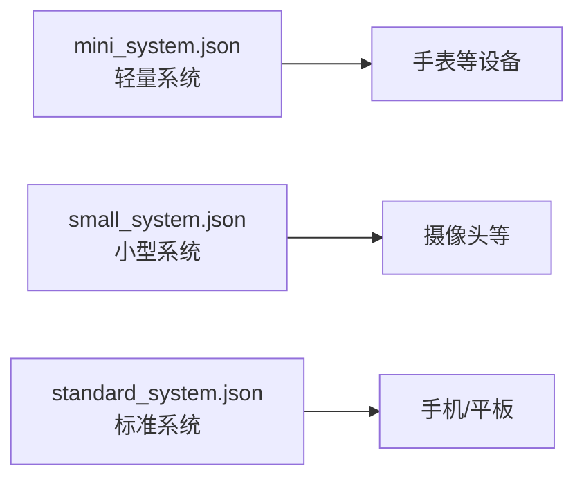
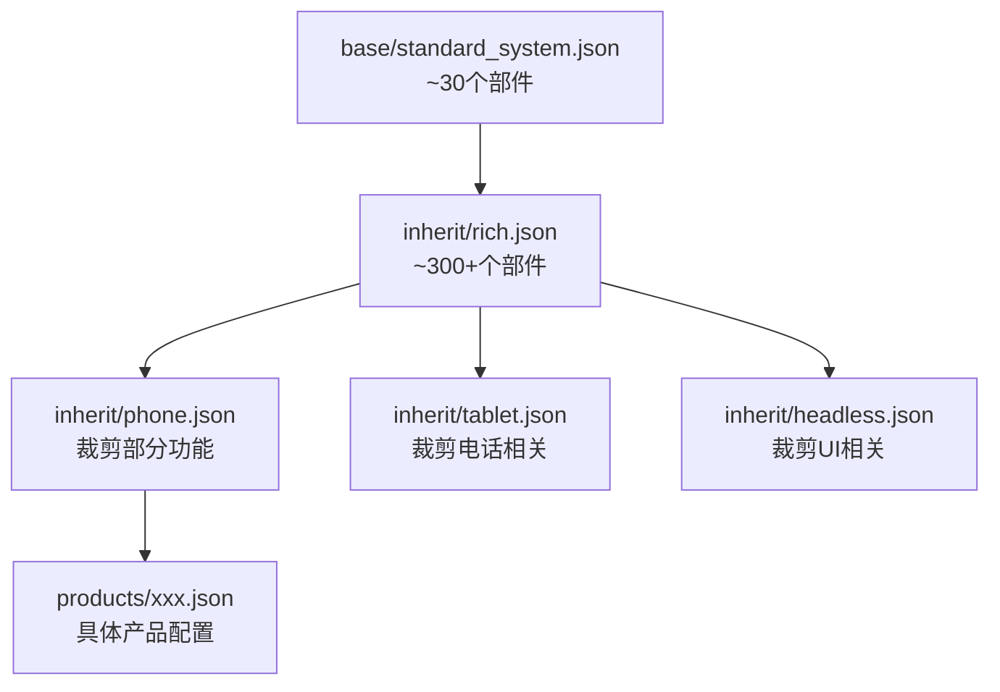
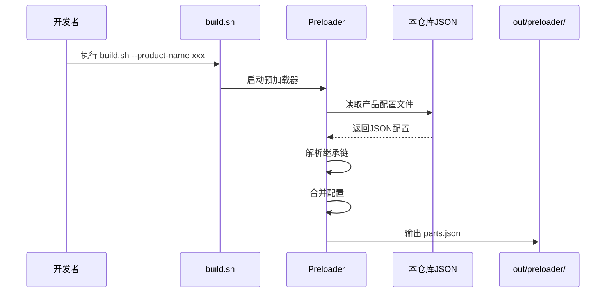
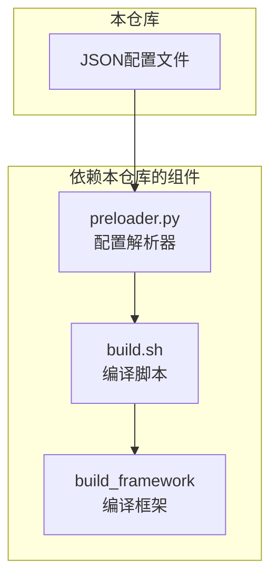

# 项目概览

## 目的

本文档阐述 `productdefine/common` 仓库的**项目定位、边界范围、核心能力、运行环境**以及**关键概念**，帮助开发者建立对本仓库的整体认知。

**适用范围**: 所有需要理解和维护 OpenHarmony 产品形态配置的开发者。

---

## 项目定位

### 在 OpenHarmony 体系中的位置

```mermaid
graph TB
    subgraph "OpenHarmony 编译体系"
        direction TB
        
        subgraph "产品定义层"
            A1[芯片组件配置<br/>vendor/{company}/{product}/]
            A2[**系统组件配置**<br/>**productdefine/common/**]
        end
        
        subgraph "编译框架层"
            B[build/<br/>编译脚本和工具]
        end
        
        subgraph "输出层"
            C[out/<br/>编译产物]
        end
        
        A1 --> B
        A2 --> B
        B --> C
    end
```

### 核心职责

本仓库的核心职责是**定义与芯片无关的通用系统组件形态配置**：

| 职责 | 说明 | 示例 |
|------|------|------|
| 定义子系统列表 | 声明产品包含哪些子系统 | `security`、`arkui`、`multimedia` |
| 定义部件组成 | 声明每个子系统包含的部件 | `security` 包含 `huks`、`access_token` |
| 配置部件特性 | 设置部件的 Feature 开关 | `wifi_feature_non_seperate_p2p=true` |
| 建立继承关系 | 通过继承复用配置 | `inherit/rich.json` 被多个产品继承 |

### 边界范围

**本仓库负责（In Scope）**:
- ✅ 系统组件（与芯片无关）的形态配置
- ✅ 子系统/部件的声明和组合
- ✅ 部件 Feature 的配置
- ✅ 配置文件的继承和合并

**本仓库不负责（Out of Scope）**:
- ❌ 芯片组件配置（位于 `vendor/` 目录）
- ❌ 具体部件实现代码（位于各部件仓库）
- ❌ 构建脚本和规则（位于 `build/` 目录）
- ❌ 编译产物生成逻辑（编译框架处理）

---

## 核心能力

### 1. 多系统类型支持

支持三种系统类型的基础配置：



**配置位置**: `base/{mini_system,small_system,standard_system}.json`

### 2. 配置继承与复用

通过继承机制实现配置的层级复用：



### 3. Feature 动态配置

支持通过 Feature 开关动态调整部件行为：

```json
{
  "component": "wifi",
  "features": [
    "wifi_feature_non_seperate_p2p=true",
    "wifi_feature_non_hdf_driver=true",
    "wifi_feature_p2p_random_mac_addr=false"
  ]
}
```

### 4. 多产品形态支持

支持多种设备类型的产品定义：

| 设备类型 | 继承文件 | 典型产品 |
|----------|----------|----------|
| 手机 | `inherit/phone.json` | 智能手机 |
| 平板 | `inherit/tablet.json` | 平板电脑 |
| 手表 | `inherit/watch.json` | 运动手表 |
| PC | `inherit/pc.json` TODO | 个人电脑 |
| IP摄像头 | `inherit/ipcamera.json` | 智能摄像头 |
| 无头设备 | `inherit/headless.json` | 虚拟机/服务器 |

---

## 运行环境

### 编译时环境

本仓库在**编译阶段**被解析：



### 依赖关系



### 输出产物

编译时本仓库配置被解析为：

| 输出文件 | 路径 | 内容 |
|----------|------|------|
| parts.json | `out/preloader/{product}/parts.json` | 完整的部件列表 |
| 部件配置 | `out/preloader/{product}/` | 各部件详细配置 |

---

## 关键概念

### 配置文件（Profile）

JSON 格式的配置定义，版本为 3.0。

**位置**: `base/*.json`、`inherit/*.json`、`products/*.json`

**结构**:
```json
{
  "version": "3.0",
  "product_name": "system-arm64-default",  // products/ 特有
  "device_company": "ohos",                 // products/ 特有
  "target_cpu": "arm64",                    // products/ 特有
  "type": "standard",                       // products/ 特有
  "inherit": ["..."],                       // 继承列表
  "subsystems": [...]                       // 子系统列表
}
```

### 子系统（Subsystem）

功能模块的高层组织单元。

**示例**: `arkui`、`security`、`multimedia`、`communication`

**定义**:
```json
{
  "subsystem": "security",
  "components": [...]
}
```

### 部件（Component）

子系统的具体实现单元，对应源码仓库中的模块。

**示例**: 
- `security` 子系统包含 `huks`、`access_token`、`appverify`
- `arkui` 子系统包含 `ace_engine`、`napi`

**定义**:
```json
{
  "component": "huks",
  "features": [...]
}
```

### 特性/Feature

部件的可配置特性，格式为 `{component_name}_{feature_name}={value}`。

**类型**:
- 布尔值: `"wifi_feature_non_seperate_p2p=true"`
- 字符串: `"graphic_2d_feature_use_texgine=true"`

**作用**: 控制部件编译时的功能开关，不修改源码即可调整行为。

### 继承（Inheritance）

配置文件的复用机制，支持全量继承和部分继承。

**示例**:
```json
{
  "inherit": [
    "productdefine/common/inherit/rich.json"
  ]
}
```

**规则**:
1. 先加载 inherit 中的配置
2. 再加载当前文件的 subsystems
3. 后加载的配置覆盖先加载的同名配置

### 系统类型（System Type）

| 类型 | 配置 | 资源占用 | 典型设备 |
|------|------|----------|----------|
| mini | `base/mini_system.json` | 最低 | 轻量手表 |
| small | `base/small_system.json` | 较低 | IP摄像头 |
| standard | `base/standard_system.json` | 较高 | 手机/平板/PC |

---

## 相关跳转

- [目录结构](02_Structure.md) - 了解目录组织
- [配置继承](03_Inheritance.md) - 学习继承机制
- [产品配置](04_Products.md) - 查看具体配置
- [附录：配置字段参考](appendix/Config_Reference.md) - 字段详细说明
