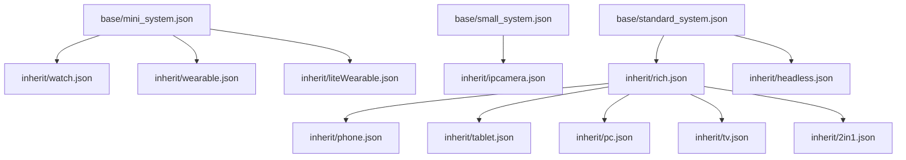

# 目录结构与模块职责

## 目的

本文档详细说明 `productdefine/common` 仓库的**目录组织、文件职责、命名规范**，帮助开发者快速定位和理解配置文件。

**适用范围**: 需要查看、修改或新增配置文件的开发者。

---

## 顶层目录结构

```
productdefine/common/
├── base/                    # 最小系统部件集合
├── inherit/                 # 可继承的部件模版
├── products/                # 具体产品形态配置
├── README_zh.md             # 中文项目说明
└── LICENSE                  # 许可证文件
```

### 目录职责对照表

| 目录 | 职责 | 文件数量 | 典型文件 |
|------|------|----------|----------|
| `base/` | 定义三种系统类型的最小部件集合 | 3 | `mini_system.json` |
| `inherit/` | 定义可复用的部件模版 | 10+ | `rich.json`, `phone.json` |
| `products/` | 定义具体产品的完整配置 | 3 | `system-arm64-default.json` |

---

## base/ 目录详解

### 目录定位

定义**最小系统**的基础部件集合，是构建任何产品的起点。

### 文件列表

| 文件 | 系统类型 | 部件数量 | 适用场景 |
|------|----------|----------|----------|
| `mini_system.json` | 轻量系统 (mini) | ~15 | 资源极度受限设备 |
| `small_system.json` | 小型系统 (small) | ~20 | 中等资源设备 |
| `standard_system.json` | 标准系统 (standard) | ~25 | 富设备基础 |

### 文件结构

```json
{
  "subsystems": [
    {
      "subsystem": "hiviewdfx",
      "components": [
        { "component": "hilog_lite" },
        { "component": "hievent_lite" }
      ]
    },
    // ... 其他子系统
  ]
}
```

**注意**: `base/` 下的文件**不包含** `version`、`product_name` 等字段，仅定义子系统列表。

### 部件清单对比

| 子系统 | mini | small | standard |
|--------|------|-------|----------|
| hiviewdfx | hilog_lite, hievent_lite, hiview_lite | hilog_lite | hilog, hitrace, hisysevent... |
| startup | bootstrap_lite, init | init, appspawn | init |
| communication | dsoftbus, ipc | dsoftbus, ipc | ipc, dsoftbus |
| security | device_auth, huks | device_auth, huks | access_token, huks, device_auth... |
| thirdparty | 8个库 | 11个库 | 16个库 |

---

## inherit/ 目录详解

### 目录定位

定义**可继承的部件模版**，用于产品配置的复用和扩展。

### 文件列表

| 文件 | 用途 | 继承来源 | 典型部件数 |
|------|------|----------|------------|
| `rich.json` | 标准系统全量功能 | `base/standard_system.json` | ~350+ |
| `phone.json` | 手机配置（原default.json） | `rich.json` | ~200+ |
| `tablet.json` | 平板配置 | `rich.json` | ~250+ |
| `pc.json` | PC配置 TODO | `rich.json` | - |
| `headless.json` | 无头系统（无UI） | `base/standard_system.json` | ~80 |
| `ipcamera.json` | IP摄像头 | `base/small_system.json` | ~120 |
| `watch.json` | 运动表 | `base/mini_system.json` | ~60 |
| `2in1.json` | 2合1设备 | `rich.json` | ~280 |
| `tv.json` | TV设备 | `rich.json` | ~200 |
| `wearable.json` | 可穿戴设备 | `base/mini_system.json` | ~80 |
| `liteWearable.json` | 轻量级可穿戴 | `base/mini_system.json` | ~50 |
| `chipset_common.json` | 芯片组件依赖 | - | ~40 |

### 文件结构

```json
{
  "version": "3.0",
  "subsystems": [
    {
      "subsystem": "security",
      "components": [
        {
          "component": "huks",
          "features": []
        }
      ]
    }
  ]
}
```

**注意**: `inherit/` 文件包含 `version` 字段，**不包含** `product_name`、`target_cpu` 等产品特有字段。

### 继承关系图



### 功能裁剪对比

| 模版 | 相比 rich 裁剪的功能 |
|------|----------------------|
| `phone.json` | NFC、打印框架、数据泄露保护、MSDP、人脸/指纹认证 |
| `tablet.json` | 电话和位置子系统的所有部件 |
| `headless.json` | 图形、UI、多媒体等界面相关部件 |
| `ipcamera.json` | 电话、多模输入、大量富设备功能 |

---

## products/ 目录详解

### 目录定位

定义**具体产品**的完整配置，包含继承声明和产品特有配置。

### 文件列表

| 文件 | 产品名称 | 系统类型 | 指令集 | 继承文件 |
|------|----------|----------|--------|----------|
| `system-arm64-default.json` | system-arm64-default | standard | arm64 | rich.json |
| `system-arm-default.json` | system-arm-default | standard | arm | rich.json |
| `ohos-sdk.json` | ohos-sdk | standard | - | - |

### 文件结构

```json
{
  "product_name": "system-arm64-default",
  "device_company": "ohos",
  "target_cpu": "arm64",
  "board": "arm64",
  "type": "standard",
  "version": "3.0",
  "enable_ramdisk": true,
  "build_selinux": true,
  "inherit": [
    "productdefine/common/inherit/rich.json"
  ],
  "subsystems": [
    // 产品特有配置，可覆盖继承的配置
  ]
}
```

### 关键字段说明

| 字段 | 必填 | 说明 | 示例 |
|------|------|------|------|
| `product_name` | ✅ | 产品名称，编译参数 | `system-arm64-default` |
| `device_company` | ✅ | 设备厂商 | `ohos` |
| `target_cpu` | ✅ | 目标指令集 | `arm64`, `arm` |
| `board` | ✅ | 与 target_cpu 相同 | `arm64` |
| `type` | ✅ | 系统类型 | `mini`, `small`, `standard` |
| `version` | ✅ | 配置格式版本 | `3.0` |
| `inherit` | ✅ | 继承的模版列表 | `["..."]` |
| `subsystems` | ✅ | 子系统配置 | `[...]` |
| `enable_ramdisk` | ❌ | 是否启用 ramdisk | `true` |
| `build_selinux` | ❌ | 是否编译 SELinux | `true` |

---

## 文件命名规范

### JSON 配置文件

```
{product-or-type}-{cpu}-{variant}.json
```

**示例**:
- `system-arm64-default.json` - 标准系统，ARM64，默认配置
- `mini_system.json` - 轻量系统基础配置
- `rich.json` - 全量功能模版

### 命名约定

| 类型 | 命名风格 | 示例 |
|------|----------|------|
| 产品配置 | 小写，连字符分隔 | `system-arm64-default.json` |
| 基础配置 | 下划线分隔 | `mini_system.json` |
| 继承模版 | 小写 | `rich.json`, `phone.json` |

---

## 配置文件格式规范

### JSON Schema（推断）

```json
{
  "version": "3.0",                    // 必填，固定值
  "product_name": "string",            // products/ 必填
  "device_company": "string",          // products/ 必填
  "target_cpu": "string",              // products/ 必填
  "board": "string",                   // products/ 必填
  "type": "mini|small|standard",       // products/ 必填
  "inherit": ["string"],               // 可选
  "subsystems": [                      // 必填
    {
      "subsystem": "string",           // 子系统名
      "components": [                  // 部件列表
        {
          "component": "string",       // 部件名
          "features": ["string"],      // 可选，特性列表
          "syscap": ["string"]         // 可选，系统能力
        }
      ]
    }
  ]
}
```

### Feature 格式规范

格式: `{component_name}_{feature_name}={value}`

**示例**:
- `"wifi_feature_non_seperate_p2p=true"`
- `"graphic_2d_feature_ace_enable_gpu=true"`
- `"memmgr_purgeable_memory=true"`

### 子系统命名规范

| 子系统 | 说明 |
|--------|------|
| `arkui` | ArkUI 框架 |
| `security` | 安全子系统 |
| `communication` | 通信子系统 |
| `multimedia` | 多媒体子系统 |
| `hiviewdfx` | 调测子系统 |
| `startup` | 启动子系统 |
| `distributeddatamgr` | 分布式数据管理 |
| `bundlemanager` | 包管理子系统 |
| `ability` | Ability 框架 |
| `hdf` | 硬件驱动框架 |

---

## 相关跳转

- [项目概览](01_Overview.md) - 理解项目定位
- [配置继承](03_Inheritance.md) - 学习继承机制
- [产品配置](04_Products.md) - 查看具体配置
- [附录：配置字段参考](appendix/Config_Reference.md) - 字段详细说明
