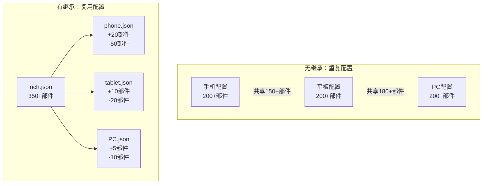
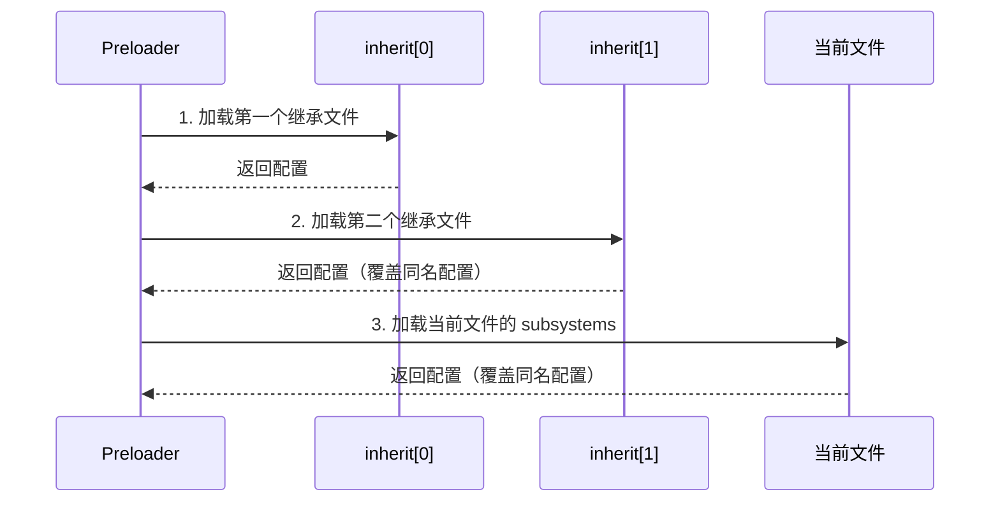
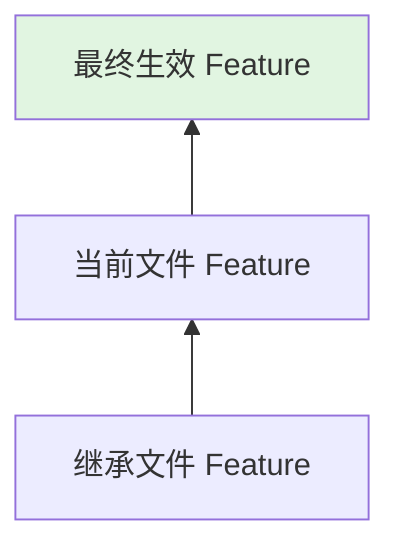
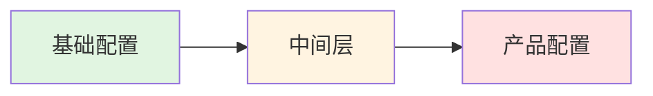

# 配置继承与合并机制

## 目的

本文档详细说明 `productdefine/common` 仓库的**配置继承机制、合并规则、Feature 重载策略**，帮助开发者理解和正确使用配置继承。

**适用范围**: 需要创建新产品配置或修改现有继承关系的开发者。

---

## 继承机制概述

### 为什么需要继承



### 继承的好处

1. **减少重复**: 共同配置集中定义，避免复制粘贴
2. **易于维护**: 修改一处，多处生效
3. **清晰层次**: 明确产品间的派生关系
4. **灵活裁剪**: 通过 Feature 重载实现差异化

---

## 继承类型

### 全量继承

直接继承模版中的所有部件和 Feature 配置。

**配置示例**:
```json
{
  "version": "3.0",
  "product_name": "my-product",
  "inherit": [
    "productdefine/common/inherit/rich.json"
  ],
  "subsystems": []
}
```

**效果**: 产品完全使用 `rich.json` 中的所有配置。

### 部分继承（Feature 重载）

继承模版的同时，覆盖或修改特定 Feature。

**配置示例**:
```json
{
  "version": "3.0",
  "inherit": [
    "productdefine/common/inherit/phone.json"
  ],
  "subsystems": [
    {
      "subsystem": "arkui",
      "components": [
        {
          "component": "ace_engine",
          "features": [
            "ace_engine_feature_enable_web=false",
            "ace_engine_feature_enable_accessibility=true"
          ]
        }
      ]
    }
  ]
}
```

**效果**: 继承 `phone.json` 的所有配置，但 `ace_engine` 的 Feature 使用本文件定义的值。

---

## 合并规则详解

### 合并顺序



### 合并规则表

| 场景 | 规则 | 示例 |
|------|------|------|
| 同子系统+同部件 | 后加载覆盖先加载 | inherit 中定义 A，当前文件定义 A' → 使用 A' |
| 同子系统+不同部件 | 合并部件列表 | inherit 有 [A,B]，当前文件有 [C] → 结果 [A,B,C] |
| 同部件+不同 Feature | Feature 合并，同名覆盖 | inherit: f1=v1, 当前: f1=v2 → f1=v2 |
| 不同子系统 | 合并子系统列表 | inherit 有 S1，当前文件有 S2 → 结果 [S1,S2] |

### 代码示例

**继承文件** (`inherit/base.json`):
```json
{
  "subsystems": [
    {
      "subsystem": "security",
      "components": [
        {
          "component": "huks",
          "features": ["huks_feature_a=true", "huks_feature_b=false"]
        },
        {
          "component": "access_token",
          "features": []
        }
      ]
    }
  ]
}
```

**当前文件**:
```json
{
  "inherit": ["productdefine/common/inherit/base.json"],
  "subsystems": [
    {
      "subsystem": "security",
      "components": [
        {
          "component": "huks",
          "features": ["huks_feature_a=false", "huks_feature_c=true"]
        },
        {
          "component": "appverify",
          "features": []
        }
      ]
    },
    {
      "subsystem": "arkui",
      "components": [...]
    }
  ]
}
```

**合并结果**:
```json
{
  "subsystems": [
    {
      "subsystem": "security",
      "components": [
        {
          "component": "huks",
          "features": ["huks_feature_a=false", "huks_feature_b=false", "huks_feature_c=true"]
        },
        {
          "component": "access_token",
          "features": []
        },
        {
          "component": "appverify",
          "features": []
        }
      ]
    },
    {
      "subsystem": "arkui",
      "components": [...]
    }
  ]
}
```

---

## Feature 重载机制

### Feature 格式

```
{component_name}_{feature_name}={value}
```

**示例**:
- `wifi_feature_non_seperate_p2p=true`
- `graphic_2d_feature_ace_enable_gpu=true`
- `memmgr_purgeable_memory=true`

### 重载优先级



**规则**: 同名 Feature，后加载的覆盖先加载的。

### 典型重载场景

#### 场景 1：修改 WiFi 特性

```json
{
  "inherit": ["productdefine/common/inherit/phone.json"],
  "subsystems": [
    {
      "subsystem": "communication",
      "components": [
        {
          "component": "wifi",
          "features": [
            "wifi_feature_non_seperate_p2p=true",
            "wifi_feature_p2p_random_mac_addr=true"
          ]
        }
      ]
    }
  ]
}
```

#### 场景 2：裁剪图形功能

```json
{
  "inherit": ["productdefine/common/inherit/rich.json"],
  "subsystems": [
    {
      "subsystem": "graphic",
      "components": [
        {
          "component": "graphic_2d",
          "features": [
            "graphic_2d_feature_ace_enable_gpu=false"
          ]
        }
      ]
    }
  ]
}
```

#### 场景 3：添加新部件

```json
{
  "inherit": ["productdefine/common/inherit/rich.json"],
  "subsystems": [
    {
      "subsystem": "security",
      "components": [
        {
          "component": "selinux_adapter",
          "features": []
        }
      ]
    }
  ]
}
```

---

## 继承链分析

### 典型继承链

#### 标准手机产品

```
base/standard_system.json
    ↓
inherit/rich.json
    ↓
inherit/phone.json
    ↓
products/system-arm64-default.json
```

#### 无头系统产品

```
base/standard_system.json
    ↓
inherit/headless.json
```

### 继承深度限制

建议继承链深度 **不超过 3 层**：



**原因**:
- 继承过深会增加理解难度
- 配置冲突时难以定位问题
- 编译解析时间增加

---

## 配置冲突处理

### 冲突类型

| 冲突类型 | 说明 | 处理结果 |
|----------|------|----------|
| 同名子系统 | 多次定义同一 subsystem | 合并部件列表 |
| 同名部件 | 同一 subsystem 中多次定义 component | 后加载覆盖先加载 |
| 同名 Feature | 同一 component 中多次定义 feature | 后加载覆盖先加载 |

### 冲突示例与解决

#### 冲突示例

**继承文件**:
```json
{
  "subsystems": [{
    "subsystem": "security",
    "components": [{
      "component": "huks",
      "features": ["feature_a=true"]
    }]
  }]
}
```

**当前文件**:
```json
{
  "subsystems": [{
    "subsystem": "security",
    "components": [{
      "component": "huks",
      "features": ["feature_a=false", "feature_b=true"]
    }]
  }]
}
```

**合并结果**:
```json
{
  "subsystems": [{
    "subsystem": "security",
    "components": [{
      "component": "huks",
      "features": ["feature_a=false", "feature_b=true"]
    }]
  }]
}
```

### 避免冲突的建议

1. **命名规范**: Feature 名使用 `{component}_{feature}` 格式
2. **最小覆盖**: 只重载需要修改的 Feature
3. **文档注释**: 在 JSON 中添加注释说明重载原因（支持 // 注释）

---

## 验证继承结果

### 查看最终部件列表

编译后查看输出文件：

```bash
# 最终部件列表
cat out/preloader/{product_name}/parts.json

# 格式化查看
python3 -m json.tool out/preloader/{product_name}/parts.json | less
```

### 验证继承链

使用 Python 脚本验证：

```python
import json

def load_config(path):
    """加载配置文件"""
    with open(path) as f:
        return json.load(f)

def merge_configs(base, override):
    """合并配置（简化版）"""
    result = base.copy()
    # 实际合并逻辑更复杂
    return result

# 验证示例
config = load_config('products/system-arm64-default.json')
print(f"继承文件: {config.get('inherit', [])}")
print(f"子系统数: {len(config.get('subsystems', []))}")
```

---

## 最佳实践

### DO（推荐做法）

✅ **使用继承减少重复**
```json
{
  "inherit": ["productdefine/common/inherit/rich.json"]
}
```

✅ **只重载需要修改的 Feature**
```json
{
  "subsystems": [{
    "components": [{
      "features": ["only_modify_this=true"]
    }]
  }]
}
```

✅ **保持继承链简洁**
```
基础 → 模版 → 产品（最多3层）
```

✅ **使用有意义的配置名**
```json
{
  "product_name": "tablet-arm64-hd"
}
```

### DON'T（避免做法）

❌ **过度继承**
```json
{
  "inherit": [
    "a.json",
    "b.json",  // 继承过多文件
    "c.json",
    "d.json"
  ]
}
```

❌ **重复定义相同部件**
```json
{
  "subsystems": [
    {"components": [{"component": "huks"}]},
    {"components": [{"component": "huks"}]}  // 重复！
  ]
}
```

❌ **Feature 名不规范**
```json
{
  "features": ["random_name=true"]  // 应使用 component_feature 格式
}
```

---

## 相关跳转

- [项目概览](01_Overview.md) - 理解项目定位
- [目录结构](02_Structure.md) - 了解目录组织
- [产品配置](04_Products.md) - 查看具体配置
- [附录：继承关系图](appendix/Inheritance_Graph.md) - 可视化继承关系
