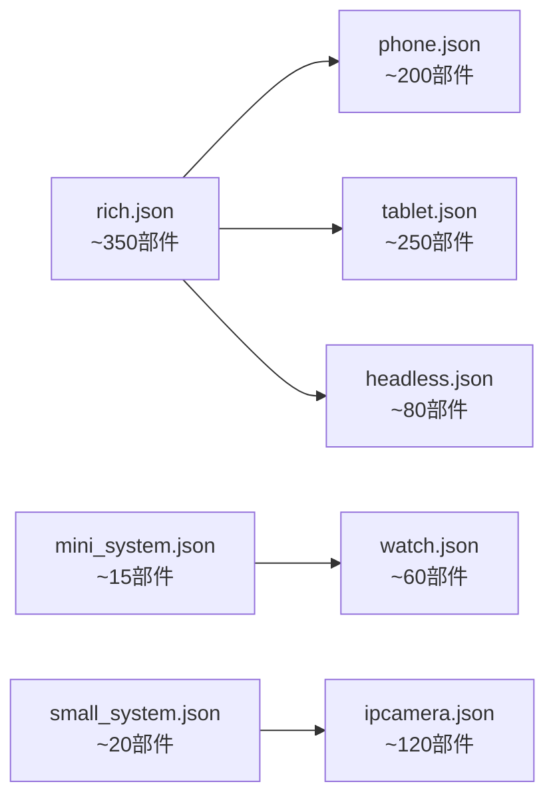

# 产品配置详解

## 目的

本文档详细说明 `productdefine/common` 仓库中各**产品形态的具体配置**，包括继承关系、部件组成、Feature 配置等。

**适用范围**: 需要了解或参考特定产品形态配置的开发者。

---

## 产品形态总览

### 产品类型矩阵

| 产品类型 | 配置文件 | 系统类型 | 目标设备 | 继承链 |
|----------|----------|----------|----------|--------|
| 标准64位系统 | `system-arm64-default.json` | standard | 开发板 | rich.json |
| 标准32位系统 | `system-arm-default.json` | standard | 开发板 | rich.json |
| SDK | `ohos-sdk.json` | standard | SDK工具 | - |

### 设备类型模版

| 设备类型 | 配置文件 | 适用场景 |
|----------|----------|----------|
| 全量功能 | `inherit/rich.json` | 基础模版 |
| 手机 | `inherit/phone.json` | 智能手机 |
| 平板 | `inherit/tablet.json` | 平板电脑 |
| PC | `inherit/pc.json` | 个人电脑 |
| 无头系统 | `inherit/headless.json` | 虚拟机/服务器 |
| IP摄像头 | `inherit/ipcamera.json` | 智能摄像头 |
| 运动表 | `inherit/watch.json` | 轻量手表 |
| 可穿戴 | `inherit/wearable.json` | 智能穿戴 |
| 2合1 | `inherit/2in1.json` | 二合一设备 |
| TV | `inherit/tv.json` | 智能电视 |

---

## 标准系统产品

### system-arm64-default.json

**文件路径**: `products/system-arm64-default.json`

**配置内容**:
```json
{
  "product_name": "system-arm64-default",
  "device_company": "ohos",
  "target_cpu": "arm64",
  "board": "arm64",
  "type": "standard",
  "version": "3.0",
  "enable_ramdisk": true,
  "build_selinux": true,
  "inherit": [
    "productdefine/common/inherit/rich.json"
  ],
  "subsystems": [
    {
      "subsystem": "security",
      "components": [
        { "component": "selinux_adapter", "features": [] }
      ]
    },
    {
      "subsystem": "hdf",
      "components": [
        { "component": "drivers_peripheral_codec", "features": [] },
        { "component": "drivers_peripheral_display", "features": [] },
        { 
          "component": "drivers_peripheral_input",
          "features": ["drivers_peripheral_input_feature_model=true"]
        }
      ]
    }
  ]
}
```

**关键配置说明**:

| 字段 | 值 | 说明 |
|------|-----|------|
| `product_name` | system-arm64-default | 产品标识名 |
| `target_cpu` | arm64 | 64位ARM架构 |
| `type` | standard | 标准系统 |
| `enable_ramdisk` | true | 启用ramdisk |
| `build_selinux` | true | 编译SELinux |
| `inherit` | rich.json | 继承全量功能 |

**产品特有配置**:
- 添加 `selinux_adapter` 安全部件
- 添加显示驱动相关外设
- 启用输入设备的 model 特性

---

### system-arm-default.json

**文件路径**: `products/system-arm-default.json`

**与 arm64 的区别**:
- `target_cpu`: `arm` (32位)
- `board`: `arm`
- 其他配置基本相同

**适用场景**: 32位ARM处理器设备

---

### ohos-sdk.json

**文件路径**: `products/ohos-sdk.json`

**特点**:
- 不继承其他模版（`inherit: []`）
- 定义 SDK 工具所需的部件
- 包含编译工具链和开发工具

**典型部件**:
- `build_framework` - 编译框架
- `toolchain` - 工具链
- `hdc` - 调试工具
- `syscap_codec` - 系统能力编码

---

## 设备类型模版详解

### rich.json（全量功能模版）

**定位**: 标准系统的全量功能集合，作为大多数产品的继承基础。

**文件路径**: `inherit/rich.json`

**子系统数量**: ~60+ 个子系统

**部件数量**: ~350+ 个部件

#### 主要子系统组成

| 子系统 | 部件数量 | 主要部件 |
|--------|----------|----------|
| `thirdparty` | ~80 | musl, openssl, skia, ffmpeg... |
| `hdf` | ~50 | 各类驱动接口和实现 |
| `security` | ~15 | huks, access_token, appverify... |
| `communication` | ~15 | wifi, bluetooth, dsoftbus... |
| `multimedia` | ~15 | audio, camera, media, drm... |
| `arkui` | ~5 | ace_engine, napi, ui_appearance... |
| `distributeddatamgr` | ~10 | kv_store, relational_store, udmf... |
| `bundlemanager` | ~5 | bundle_framework, bundle_tool... |
| `ability` | ~5 | ability_runtime, form_fwk, dmsfwk... |
| `resourceschedule` | ~10 | memmgr, ffrt, work_scheduler... |

#### 关键 Feature 配置

```json
{
  "component": "dsoftbus",
  "features": [
    "dsoftbus_feature_coap=true",
    "dsoftbus_feature_vtp=true",
    "dsoftbus_feature_dfile=true",
    "dsoftbus_feature_disc_ble=true",
    "dsoftbus_feature_conn_br=true",
    "dsoftbus_feature_conn_ble=true"
  ]
}
```

**使用产品**: rk3568, hispark_phoenix 等标准开发板

---

### phone.json（手机模版）

**定位**: 手机设备的标准配置，相比 rich.json 裁剪了部分功能。

**文件路径**: `inherit/phone.json`

**继承**: `rich.json`

#### 与 rich.json 的差异

**裁剪的功能**:
- NFC 相关部件
- 打印框架 (print_fwk)
- 数据泄露保护 (dlp_permission_service)
- MSDP (device_status)
- 人脸认证 (face_auth)
- 指纹认证 (fingerprint_auth)

**典型 Feature 配置**:

```json
{
  "component": "wifi",
  "features": [
    "wifi_feature_non_seperate_p2p=true",
    "wifi_feature_non_hdf_driver=true",
    "wifi_feature_p2p_random_mac_addr=false"
  ]
}
```

**电话相关部件**:
- `core_service` - 核心服务
- `ril_adapter` - RIL适配
- `cellular_call` - 蜂窝通话
- `cellular_data` - 蜂窝数据
- `sms_mms` - 短信彩信
- `call_manager` - 通话管理

---

### tablet.json（平板模版）

**定位**: 平板设备的标准配置，相比 rich.json 裁剪了电话功能。

**文件路径**: `inherit/tablet.json`

**继承**: `rich.json`

#### 与 rich.json 的差异

**裁剪的功能**:
- 电话子系统全部部件 (telephony)
- 位置子系统的部分部件

**保留的核心功能**:
- 完整的 UI 框架
- 多媒体功能
- 分布式能力
- 网络通信

#### 与 phone.json 的差异

| 功能 | phone.json | tablet.json |
|------|------------|-------------|
| 电话 | ✅ | ❌ |
| NFC | ❌ | ❌ |
| 打印 | ❌ | ❌ |
| MSDP | ❌ | ❌ |
| 位置 | 完整 | 部分裁剪 |

---

### headless.json（无头系统模版）

**定位**: 无显示界面的系统配置，适用于虚拟机、服务器等场景。

**文件路径**: `inherit/headless.json`

**继承**: `base/standard_system.json`

#### 核心特点

**裁剪的功能**:
- 图形子系统 (graphic)
- 窗口管理 (window_manager)
- 多媒体框架 (multimedia)
- 相机框架 (camera_framework)
- 输入方法框架 (imf)
- 主题/壁纸 (screenlock_mgr, wallpaper_mgr)

**保留的核心功能**:
- 启动系统
- 安全框架
- 通信能力
- 分布式数据
- 包管理

#### 关键 Feature

```json
{
  "component": "ability_runtime",
  "features": [
    "ability_runtime_power=false",
    "ability_runtime_graphics=false"
  ]
}
```

**使用场景**: qemu-arm-linux-headless 虚拟机平台

---

### ipcamera.json（IP摄像头模版）

**定位**: 智能摄像头设备的标准配置。

**文件路径**: `inherit/ipcamera.json`

**继承**: `base/small_system.json`

#### 核心特点

**针对摄像头的优化**:
- 轻量级系统基础
- 完整的相机框架
- 视频编解码能力
- 网络传输能力
- 分布式相机支持

**包含的关键部件**:
```json
{
  "subsystem": "multimedia",
  "components": [
    { "component": "media_foundation" },
    { "component": "player_framework" },
    { "component": "av_codec" },
    { "component": "camera_framework" },
    { "component": "image_framework" },
    { "component": "media_library" }
  ]
}
```

---

### watch.json（运动表模版）

**定位**: 轻量级运动手表的配置，资源占用极低。

**文件路径**: `inherit/watch.json`

**继承**: `base/mini_system.json`

#### 核心特点

**极简配置**:
- 仅包含最基础功能
- 轻量级 UI 框架
- 传感器支持
- 电源管理
- 蓝牙通信

**典型部件数**: ~60 个

---

## 部件差异对比

### 不同产品类型的部件数量



### 功能模块覆盖矩阵

| 功能模块 | rich | phone | tablet | headless | ipcamera | watch |
|----------|------|-------|--------|----------|----------|-------|
| 图形/显示 | ✅ | ✅ | ✅ | ❌ | ✅ | ⚠️ |
| 电话 | ✅ | ✅ | ❌ | ❌ | ❌ | ❌ |
| 相机 | ✅ | ✅ | ✅ | ❌ | ✅ | ❌ |
| 多媒体 | ✅ | ✅ | ✅ | ❌ | ✅ | ⚠️ |
| 蓝牙 | ✅ | ✅ | ✅ | ✅ | ⚠️ | ✅ |
| WiFi | ✅ | ✅ | ✅ | ✅ | ✅ | ⚠️ |
| 分布式 | ✅ | ✅ | ✅ | ✅ | ✅ | ⚠️ |
| NFC | ✅ | ❌ | ❌ | ❌ | ❌ | ❌ |
| 打印 | ✅ | ❌ | ❌ | ❌ | ❌ | ❌ |
| 指纹/人脸 | ✅ | ❌ | ⚠️ | ❌ | ❌ | ❌ |

**图例**:
- ✅ 完整支持
- ⚠️ 部分支持
- ❌ 不支持

---

## 创建新产品配置

### 步骤 1: 选择继承模版

根据产品类型选择合适的继承模版：

```json
{
  "inherit": [
    "productdefine/common/inherit/rich.json"  // 富设备
    // 或
    "productdefine/common/inherit/phone.json"  // 手机
    // 或
    "productdefine/common/inherit/headless.json"  // 无头
  ]
}
```

### 步骤 2: 定义产品基础信息

```json
{
  "product_name": "my-custom-product",
  "device_company": "my-company",
  "target_cpu": "arm64",
  "board": "arm64",
  "type": "standard",
  "version": "3.0"
}
```

### 步骤 3: 添加特有配置

```json
{
  "subsystems": [
    {
      "subsystem": "security",
      "components": [
        {
          "component": "my_custom_component",
          "features": ["feature_x=true"]
        }
      ]
    }
  ]
}
```

### 步骤 4: 验证配置

```bash
# 验证 JSON 语法
python3 -m json.tool products/my-custom-product.json

# 编译测试
./build.sh --product-name my-custom-product --ccache
```

---

## 相关跳转

- [项目概览](01_Overview.md) - 理解项目定位
- [目录结构](02_Structure.md) - 了解目录组织
- [配置继承](03_Inheritance.md) - 学习继承机制
- [附录：配置字段参考](appendix/Config_Reference.md) - 字段详细说明
