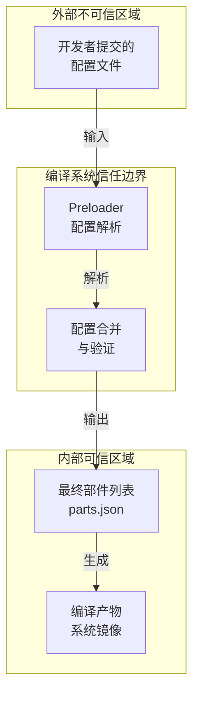
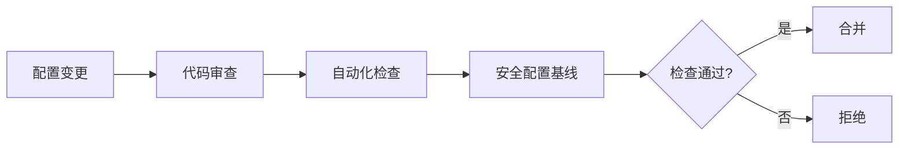

# 安全风险评审

## 目的

本文档对 `productdefine/common` 仓库进行**安全风险评审**，识别潜在的安全隐患，提供风险评估和修复建议。

**适用范围**: 安全工程师、系统架构师、配置维护者。

**评审范围**: 本仓库所有 JSON 配置文件及配置机制。

---

## 威胁模型

### 信任边界



### 攻击面识别

| 攻击面 | 描述 | 风险等级 |
|--------|------|----------|
| 配置文件注入 | 恶意修改 JSON 配置 | 🔴 高 |
| 继承链劫持 | 篡改继承文件路径 | 🔴 高 |
| Feature 注入 | 注入恶意 Feature 配置 | 🟡 中 |
| 敏感信息泄露 | 配置中硬编码敏感信息 | 🟡 中 |
| 拒绝服务 | 构造导致解析失败的配置 | 🟢 低 |

---

## 风险分析

### 风险 1: 配置文件注入攻击

**风险 ID**: CONF-001  
**风险等级**: 🔴 高  
**CVSS 估算**: 7.5 (High)

#### 描述

攻击者如果能提交恶意配置文件，可能：
- 添加恶意部件到系统
- 禁用关键安全部件
- 修改安全相关 Feature 开关

#### 证据

配置文件直接定义系统包含的部件，无额外签名验证：

```json
// products/system-arm64-default.json:10-20
{
  "inherit": ["productdefine/common/inherit/rich.json"],
  "subsystems": [
    {
      "subsystem": "security",
      "components": [
        {"component": "selinux_adapter", "features": []}
      ]
    }
  ]
}
```

#### 触发路径

1. 攻击者获取代码仓库写权限
2. 修改 JSON 配置文件
3. 提交恶意配置（如禁用 `selinux_adapter`）
4. 编译系统解析配置
5. 生成缺少安全部件的系统镜像

#### 影响

- 系统安全机制被绕过
- 恶意代码可能以系统权限执行
- 用户数据泄露风险

#### 修复建议

1. **代码审查**: 所有配置变更必须经过代码审查
2. **签名验证**: 对关键配置文件进行签名验证
3. **基线检查**: 建立安全配置基线，自动化检查偏离
4. **权限控制**: 限制配置文件的修改权限

```bash
# 建议：配置基线检查脚本
#!/bin/bash
# 检查关键安全部件是否被移除
grep -q "selinux_adapter" products/*.json || exit 1
grep -q "access_token" inherit/*.json || exit 1
grep -q "huks" inherit/*.json || exit 1
```

---

### 风险 2: 继承链劫持

**风险 ID**: CONF-002  
**风险等级**: 🔴 高  
**CVSS 估算**: 8.0 (High)

#### 描述

`inherit` 字段指定的继承路径可能被篡改，导致加载恶意配置。

#### 证据

```json
// products/system-arm64-default.json:10
{
  "inherit": ["productdefine/common/inherit/rich.json"]
}
```

#### 触发路径

1. 攻击者创建恶意继承文件
2. 修改产品的 `inherit` 指向恶意文件
3. 产品加载恶意配置

#### 影响

- 继承链被完全控制
- 系统功能被篡改
- 引入未审核的部件

#### 修复建议

1. **路径白名单**: 只允许继承 `productdefine/common/` 下的文件
2. **完整性检查**: 对继承文件进行哈希校验
3. **层级限制**: 限制继承深度，防止过度嵌套

---

### 风险 3: Feature 注入

**风险 ID**: CONF-003  
**风险等级**: 🟡 中  
**CVSS 估算**: 5.3 (Medium)

#### 描述

Feature 配置直接影响部件行为，恶意 Feature 可能：
- 关闭安全功能（如 `selinux`）
- 启用调试功能（如 `debug_mode=true`）
- 修改网络行为（如关闭证书验证）

#### 证据

```json
// inherit/phone.json:316-320
{
  "component": "wifi",
  "features": [
    "wifi_feature_non_seperate_p2p=true",
    "wifi_feature_non_hdf_driver=true",
    "wifi_feature_p2p_random_mac_addr=false"
  ]
}
```

#### 触发路径

1. 攻击者修改 Feature 配置
2. 编译时 Feature 被传递给部件
3. 部件按恶意 Feature 编译/运行

#### 影响

- 安全功能被削弱
- 攻击面扩大
- 隐私保护失效

#### 修复建议

1. **Feature 白名单**: 建立允许的 Feature 列表
2. **敏感 Feature 审计**: 标记可能影响安全的 Feature
3. **配置审查**: Feature 变更必须审查

```python
# 建议：敏感 Feature 检查脚本
SENSITIVE_FEATURES = [
    "*debug*",
    "*disable_security*",
    "*no_verify*",
    "selinux*=false"
]
```

---

### 风险 4: 敏感信息泄露

**风险 ID**: CONF-004  
**风险等级**: 🟡 中  
**CVSS 估算**: 4.3 (Medium)

#### 描述

配置文件中可能意外包含敏感信息：
- 硬编码密钥
- 内部路径信息
- 调试日志开关

#### 检查方法

```bash
# 检查潜在的敏感信息模式
grep -rE "(password|secret|key|token|api_key)" --include="*.json" .
grep -rE "(debug|verbose).*=.*true" --include="*.json" .
```

#### 修复建议

1. **敏感词扫描**: CI 流程中加入敏感信息检测
2. **配置审查**: 禁止提交包含敏感信息的配置
3. **分离配置**: 敏感配置放在单独的安全存储中

---

### 风险 5: 配置循环依赖

**风险 ID**: CONF-005  
**风险等级**: 🟢 低  
**CVSS 估算**: 3.1 (Low)

#### 描述

配置文件 A 继承 B，B 又继承 A，导致循环依赖。

#### 检查方法

```python
# 检测循环继承的伪代码
def detect_cycle(config_path, visited=None):
    if visited is None:
        visited = set()
    if config_path in visited:
        return True  # 发现循环
    visited.add(config_path)
    config = load_json(config_path)
    for inherit in config.get("inherit", []):
        if detect_cycle(inherit, visited.copy()):
            return True
    return False
```

#### 影响

- 编译系统挂起或崩溃
- 配置解析失败
- 拒绝服务

#### 修复建议

1. **循环检测**: Preloader 中添加循环依赖检测
2. **深度限制**: 限制继承链最大深度（建议 ≤3）
3. **超时机制**: 配置解析添加超时保护

---

### 风险 6: 部件版本不匹配

**风险 ID**: CONF-006  
**风险等级**: 🟡 中  
**CVSS 估算**: 5.0 (Medium)

#### 描述

配置文件中声明的部件版本与实际源码版本不匹配，可能导致：
- 已知漏洞的部件被使用
- API 不兼容导致系统不稳定
- 缺少安全补丁

#### 修复建议

1. **版本声明**: 配置文件中声明部件版本要求
2. **版本检查**: 编译时验证部件版本
3. **依赖管理**: 建立部件依赖版本矩阵

---

## 安全加固建议

### 配置管理流程



### 建议的安全措施

| 措施 | 优先级 | 实施难度 | 效果 |
|------|--------|----------|------|
| 代码审查强制 | 🔴 高 | 低 | ⭐⭐⭐⭐⭐ |
| 敏感 Feature 清单 | 🔴 高 | 低 | ⭐⭐⭐⭐ |
| 安全配置基线 | 🔴 高 | 中 | ⭐⭐⭐⭐⭐ |
| 继承路径白名单 | 🟡 中 | 低 | ⭐⭐⭐⭐ |
| 配置签名验证 | 🟡 中 | 高 | ⭐⭐⭐⭐⭐ |
| 敏感信息扫描 | 🟡 中 | 低 | ⭐⭐⭐ |
| 循环依赖检测 | 🟢 低 | 低 | ⭐⭐ |

### 安全配置基线示例

```python
# secure_baseline.py
REQUIRED_COMPONENTS = [
    "access_token",    # 访问令牌管理
    "huks",           # 通用密钥库
    "selinux_adapter", # SELinux适配
    "appverify",      # 应用验证
]

FORBIDDEN_FEATURES = [
    "*debug=true",
    "*disable*security*=true",
    "selinux*=false",
]

def check_baseline(config_path):
    config = load_json(config_path)
    components = extract_components(config)
    features = extract_features(config)
    
    # 检查必需部件
    for comp in REQUIRED_COMPONENTS:
        if comp not in components:
            raise SecurityError(f"Missing required component: {comp}")
    
    # 检查禁止的 Feature
    for feat in features:
        for pattern in FORBIDDEN_FEATURES:
            if fnmatch(feat, pattern):
                raise SecurityError(f"Forbidden feature: {feat}")
```

---

## 局限性说明

### 评审范围局限

本评审仅覆盖 `productdefine/common` 仓库，不包括：
- 具体部件实现代码的安全问题
- 编译框架 (build/) 的安全问题
- 芯片组件配置 (vendor/) 的安全问题
- 运行时安全问题

### 证据局限

部分风险评估基于配置文件的静态分析，实际风险可能因以下因素变化：
- 编译框架的实现细节
- 部件的具体实现
- 运行时环境配置

### 建议的后续工作

1. **动态测试**: 在实际编译流程中测试配置安全性
2. **渗透测试**: 对配置注入攻击进行渗透测试
3. **威胁建模**: 与编译框架团队联合进行完整威胁建模

---

## 相关跳转

- [项目概览](01_Overview.md) - 理解项目定位
- [常见问题](06_FAQ.md) - 调试和问题排查
- [配置继承](03_Inheritance.md) - 理解配置机制
