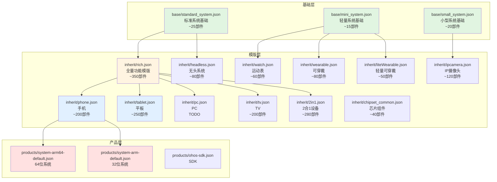
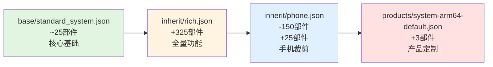
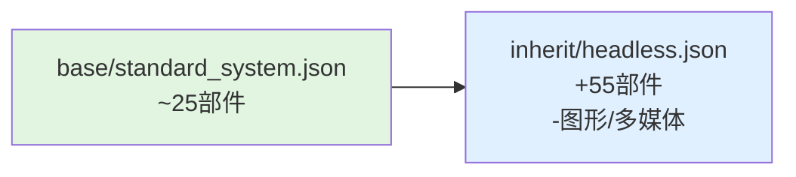
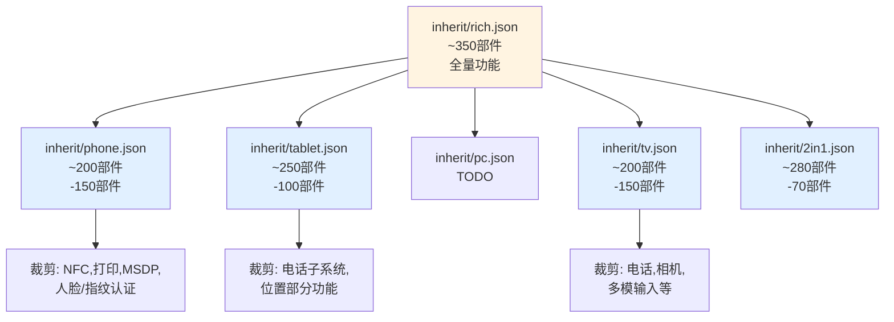
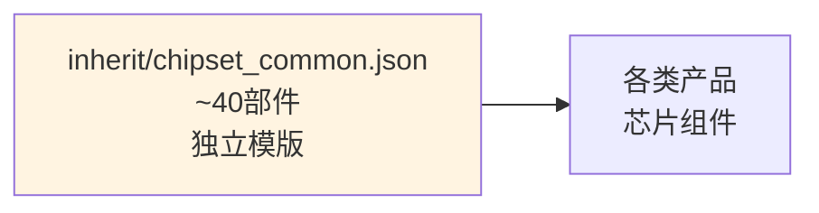

# 继承关系图

## 目的

本文档以可视化方式展示 `productdefine/common` 仓库中各配置文件的**继承关系**，帮助理解配置层级和依赖。

---

## 整体继承架构

---

## 标准系统继承链

### 标准系统产品（system-arm64-default）

**继承详情**:

| 层级 | 文件 | 部件数 | 主要作用 |
|------|------|--------|----------|
| 1 | `base/standard_system.json` | ~25 | 最小基础：启动、通信、安全基础 |
| 2 | `inherit/rich.json` | ~350 | 全量功能：所有标准部件 |
| 3 | `inherit/phone.json` | ~200 | 手机裁剪：移除NFC、打印等 |
| 4 | `products/system-arm64-default.json` | ~203 | 产品定制：添加selinux等 |

---

## 轻量系统继承链

### 运动表产品（watch）

**继承详情**:

| 层级 | 文件 | 部件数 | 主要作用 |
|------|------|--------|----------|
| 1 | `base/mini_system.json` | ~15 | 最轻量基础 |
| 2 | `inherit/watch.json` | ~60 | 手表功能：传感器、蓝牙、轻量UI |

---

## 小型系统继承链

### IP摄像头产品（ipcamera）

**继承详情**:

| 层级 | 文件 | 部件数 | 主要作用 |
|------|------|--------|----------|
| 1 | `base/small_system.json` | ~20 | 小型系统基础 |
| 2 | `inherit/ipcamera.json` | ~120 | 摄像头功能：相机、编解码、网络 |

---

## 特殊系统继承链

### 无头系统（headless）

**继承详情**:

| 层级 | 文件 | 部件数 | 主要作用 |
|------|------|--------|----------|
| 1 | `base/standard_system.json` | ~25 | 标准基础 |
| 2 | `inherit/headless.json` | ~80 | 无头裁剪：移除UI、图形、多媒体 |

### SDK（ohos-sdk）

**说明**: `ohos-sdk.json` 不继承任何模版，独立定义 SDK 所需部件。

---

## 设备类型对比

### 从 rich.json 派生的设备类型

### 功能裁剪对比表

| 功能 | rich | phone | tablet | headless | ipcamera | watch |
|------|------|-------|--------|----------|----------|-------|
| 电话 | ✅ | ✅ | ❌ | ❌ | ❌ | ❌ |
| NFC | ✅ | ❌ | ❌ | ❌ | ❌ | ❌ |
| 打印 | ✅ | ❌ | ❌ | ❌ | ❌ | ❌ |
| 图形/显示 | ✅ | ✅ | ✅ | ❌ | ✅ | ⚠️ |
| 相机 | ✅ | ✅ | ✅ | ❌ | ✅ | ❌ |
| 多媒体 | ✅ | ✅ | ✅ | ❌ | ✅ | ⚠️ |
| 人脸/指纹 | ✅ | ❌ | ⚠️ | ❌ | ❌ | ❌ |
| MSDP | ✅ | ❌ | ❌ | ❌ | ❌ | ❌ |

---

## 芯片组件模版

### chipset_common.json

**说明**: `chipset_common.json` 定义芯片组件依赖的最小部件集合，通常被 vendor 目录下的芯片配置继承。

---

## 继承深度统计

### 各产品继承深度

| 产品/模版 | 继承深度 | 继承链 |
|-----------|----------|--------|
| `system-arm64-default` | 3 | base/standard → inherit/rich → inherit/phone → product |
| `system-arm-default` | 3 | base/standard → inherit/rich → inherit/phone → product |
| `inherit/phone` | 2 | base/standard → inherit/rich → inherit/phone |
| `inherit/tablet` | 2 | base/standard → inherit/rich → inherit/tablet |
| `inherit/headless` | 2 | base/standard → inherit/headless |
| `inherit/ipcamera` | 2 | base/small → inherit/ipcamera |
| `inherit/watch` | 2 | base/mini → inherit/watch |
| `ohos-sdk` | 1 | 独立配置 |

### 继承深度建议

**最佳实践**:
- 推荐深度：2-3 层
- 最大深度：不超过 4 层
- 原因：过深的继承链增加理解和维护难度

---

## 相关跳转

- [项目概览](01_Overview.md) - 理解项目定位
- [目录结构](02_Structure.md) - 了解目录组织
- [配置继承](03_Inheritance.md) - 学习继承机制
- [产品配置](04_Products.md) - 查看具体配置
