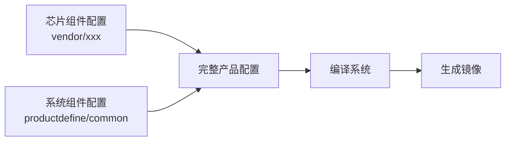
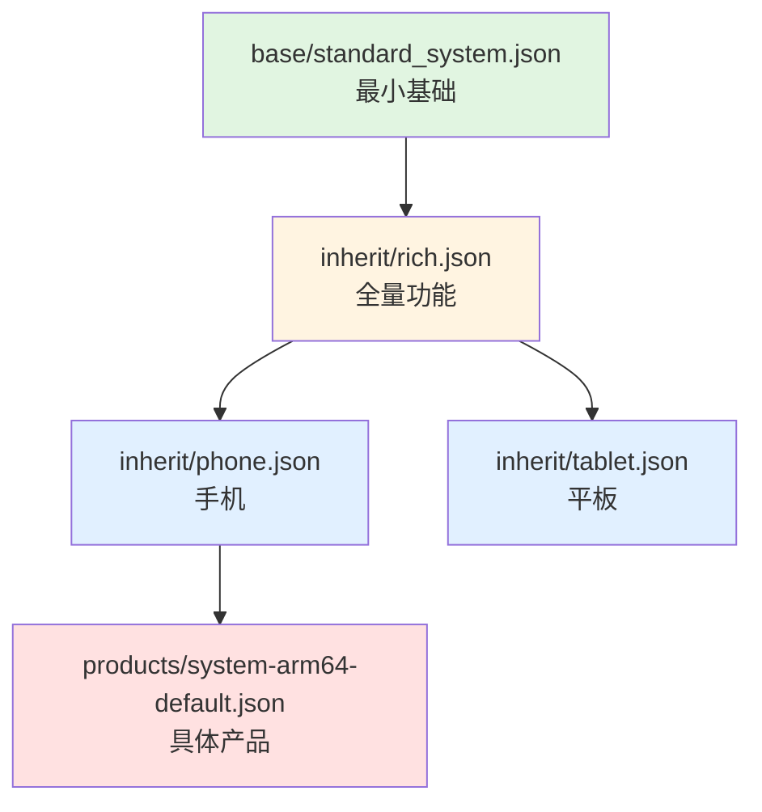

# OpenHarmony 公共产品形态配置

## 简介

`productdefine/common` 仓库定义了 **OpenHarmony 系统组件的通用形态配置**，是编译框架解析产品定义的核心数据来源。

## 核心作用



本仓库聚焦于 **B：系统组件配置**，定义：
- 系统支持的子系统列表
- 每个子系统包含的部件
- 部件的特性（Feature）配置
- 产品形态间的继承关系

## 仓库结构概览

```
productdefine/common/
├── base/                    # 最小系统部件集合
│   ├── mini_system.json     # 轻量系统
│   ├── small_system.json    # 小型系统
│   └── standard_system.json # 标准系统
├── inherit/                 # 可继承的部件模版
│   ├── rich.json            # 全量功能
│   ├── phone.json           # 手机
│   ├── tablet.json          # 平板
│   ├── headless.json        # 无头系统
│   └── ...
└── products/                # 具体产品配置
    ├── system-arm64-default.json
    ├── system-arm-default.json
    └── ohos-sdk.json
```

## 关键概念

### 子系统（Subsystem）

功能模块的高层组织单元，如 `arkui`、`security`、`multimedia`。

```json
{
  "subsystem": "security",
  "components": [...]
}
```

### 部件（Component）

子系统的具体实现单元，如 `huks`、`access_token`。对应源码仓库中的具体模块。

```json
{
  "component": "huks",
  "features": [...]
}
```

### 特性（Feature）

部件的可配置开关，格式为 `{component_name}_{feature_name}={value}`。

```json
{
  "features": [
    "os_account_multiple_active_accounts=false",
    "wifi_feature_non_seperate_p2p=true"
  ]
}
```

## 配置继承关系



继承规则：
1. 子配置可以覆盖父配置的 Feature
2. 子配置可以新增/删除部件
3. 后加载的配置覆盖先加载的同名配置

## 快速示例

### 添加新部件到产品

编辑 `products/system-arm64-default.json`：

```json
{
  "product_name": "system-arm64-default",
  "inherit": ["productdefine/common/inherit/rich.json"],
  "subsystems": [
    {
      "subsystem": "security",
      "components": [
        {
          "component": "selinux_adapter",
          "features": []
        }
      ]
    }
  ]
}
```

### 创建新继承模版

在 `inherit/my-product.json` 创建：

```json
{
  "version": "3.0",
  "subsystems": [
    {
      "subsystem": "arkui",
      "components": [
        {
          "component": "ace_engine",
          "features": ["ace_engine_feature_enable_web=true"]
        }
      ]
    }
  ]
}
```

## 系统类型

| 类型 | 配置文件 | 适用场景 |
|------|----------|----------|
| 轻量系统 | `base/mini_system.json` | 资源受限设备（手表等） |
| 小型系统 | `base/small_system.json` | 中等资源设备 |
| 标准系统 | `base/standard_system.json` | 手机、平板等富设备 |

## 常用操作

### 查看产品最终部件列表

编译后查看输出文件：
```bash
out/preloader/{product_name}/parts.json
```

### 验证配置语法

使用 JSON 语法检查：
```bash
python3 -m json.tool products/system-arm64-default.json
```

## 相关链接

- [项目概览](01_Overview.md) - 详细了解项目定位
- [目录结构](02_Structure.md) - 了解目录组织
- [配置继承](03_Inheritance.md) - 学习继承机制
- [产品配置](04_Products.md) - 查看具体配置

---

**下一步**: [项目概览](01_Overview.md)
