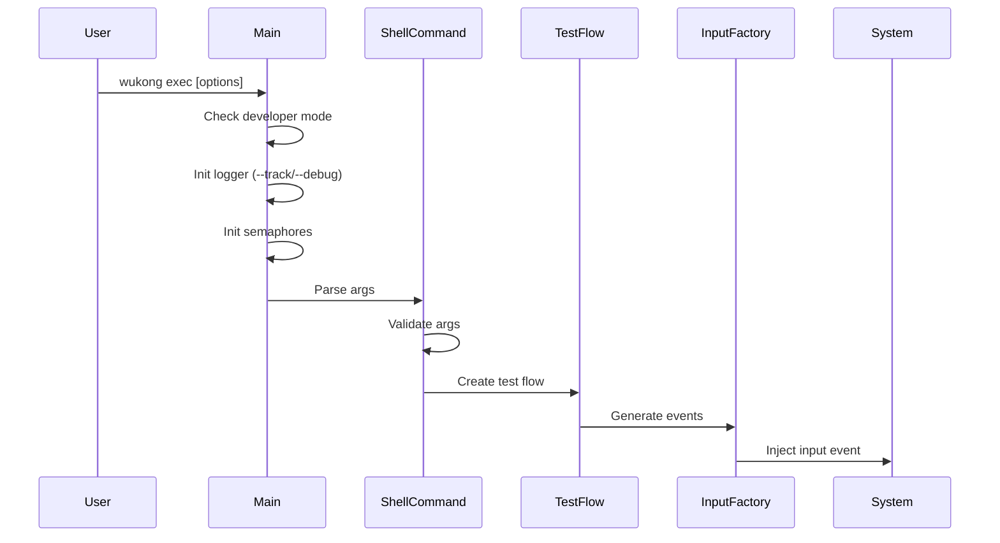

# WuKong 架构说明

## 组件架构图

```
┌─────────────────────────────────────────────────────────────────┐
│                        WuKong CLI                               │
│                   (shell_command/)                              │
├─────────────────────────────────────────────────────────────────┤
│  ┌─────────────────┐  ┌─────────────────┐  ┌────────────────┐ │
│  │  Test Flow      │  │  Report          │  │  Common         │ │
│  │  (test_flow/)   │  │  (report/)       │  │  (common/)      │ │
│  │                 │  │                 │  │                 │ │
│  │  - random_test │  │  - statistics    │  │  - app_manager  │ │
│  │  - special_test│  │  - exception     │  │  - component_   │ │
│  │  - focus_test  │  │  - format        │  │    manager      │ │
│  └────────┬────────┘  └────────┬────────┘  └────────┬────────┘ │
│           │                    │                    │          │
│           └────────────────────┼────────────────────┘          │
│                                │                                │
│                 ┌──────────────┴──────────────┐                 │
│                 │    Input Factory           │                 │
│                 │    (input_factory/)         │                 │
│                 │                             │                 │
│                 │  - touch/swap/mouse/keyboard│                 │
│                 │  - hardkey/rotate/appswitch │                 │
│                 │  - component/input_factory  │                 │
│                 └──────────────┬──────────────┘                 │
│                                │                                │
│                 ┌──────────────┴──────────────┐                 │
│                 │    Component Event          │                 │
│                 │    (component_event/)        │                 │
│                 │                             │                 │
│                 │  - ability/page/component    │                 │
│                 │    tree structures          │                 │
│                 │  - tree traversal/manipulation│                │
│                 └─────────────────────────────┘                 │
└─────────────────────────────────────────────────────────────────┘
```

## 模块职责

### shell_command（命令行）
- **职责**: 命令行解析、命令路由
- **入口**: `wukong_main.cpp:130` - `int main(int argc, char* argv[])`
- **依赖**: 所有其他模块

### test_flow（测试流程）
- **职责**: 测试执行流程控制
- **子类**:
  - `RandomTestFlow`: 随机测试
  - `SpecialTestFlow`: 专项测试
  - `FocusTestFlow`: 专注测试

### input_factory（输入工厂）
- **职责**: 生成各种输入事件
- **支持事件类型**:
  - 触摸: `touch_input.h`
  - 滑动: `swap_input.h`
  - 键盘: `keyboard_input.h`
  - 鼠标: `mouse_input.h`
  - 硬键: `hardkey_input.h`
  - 旋转: `rotate_input.h`
  - 应用切换: `appswitch_input.h`
  - 组件操作: `component_input.h`
  - 指关节: `knuckle_input.h`
  - 捏合: `pinch_input.h`
  - 手表相关: `watch_*_input.h`
  - 浮窗/折叠: `float_split_input.h`, `collapse_input.h`
  - 录制回放: `record_input.h`

### component_event（组件事件）
- **职责**: UI 组件树结构管理
- **树类型**:
  - `AbilityTree`: Ability 树
  - `PageTree`: Page 树
  - `ComponentTree`: 组件树
  - `WuKongTree`: WuKong 树

### report（报告）
- **职责**: 统计信息收集、异常监控、报告生成
- **功能模块**:
  - `Statistics`: 统计基类
  - `StatisticsEvent`: 事件统计
  - `StatisticsAbility`: 能力统计
  - `StatisticsComponment`: 组件统计
  - `StatisticsException`: 异常统计
  - `StatisticsCoverage`: 覆盖率统计
  - `Format`: 报告格式（terminal/html/csv/json）
  - `ExceptionManager`: 异常管理
  - `SysEventListener`: 系统事件监听

### common（公共模块）
- **职责**: 公共功能与管理器
- **管理器**:
  - `AppManager`: 应用管理
  - `ComponentManager`: 组件管理
  - `MultimodeManager`: 多模管理
  - `ExceptionManager`: 异常管理
  - `TreeManager`: 树管理
  - `Report`: 报告管理

## 线程模型

### 单主线程架构

WuKong 采用**单主线程**架构：

```
Main Thread
├── Command Parse (shell_command)
├── Test Flow Loop (test_flow)
│   ├── Event Generation (input_factory)
│   ├── Tree Operations (component_event)
│   └── Statistics Update (report)
└── Resource Cleanup
```

### 同步机制

| 机制 | 用途 | 代码位置 |
|------|------|----------|
| 信号量 | 防止重复运行 | `semRun` |
| 倒计时锁 | 线程同步 | `CountDownLatch` |

```cpp
// 证据: shell_command/src/wukong_main.cpp:156-168
NamedSemaphore semRun(SEMPHORE_RUN_NAME, 1);
InitSemaphore(semRun, 1);
if (IsRunning(semRun)) {
    ERROR_LOG("error: wukong has running, allow one program run.");
} else {
    semRun.Open();
    semRun.Wait();
    std::cout << cmd.ExecCommand();
    semRun.Post();
    semRun.Close();
}
```

## 数据流

```
┌─────────────┐     ┌─────────────┐     ┌─────────────┐
│   CLI Input │────▶│  Parse &    │────▶│   Test Flow │
│  (argv)     │     │  Validate   │     │   Dispatch  │
└─────────────┘     └─────────────┘     └──────┬──────┘
                                               │
              ┌────────────┬───────────┬───────┴───────┬────────────┐
              ▼            ▼           ▼               ▼            ▼
       ┌──────────┐ ┌──────────┐ ┌──────────┐  ┌──────────┐  ┌──────────┐
       │  Input   │ │ Component│ │ App/Ability│ │  Event   │ │ Statistics│
       │  Factory │ │  Tree    │ │  Manager │  │ Monitor  │ │  Report  │
       └──────────┘ └──────────┘ └──────────┘  └──────────┘ └──────────┘
```

## 关键时序

### 启动流程



## 稳定性设计

### 单实例运行

```cpp
// 证据: shell_command/src/wukong_main.cpp:90-128
static bool IsRunning(NamedSemaphore& sem)
{
    // 检查信号量值和 pidof
    // 防止多个 wukong 实例同时运行
}
```

### 资源清理

```cpp
// 证据: shell_command/src/wukong_main.cpp:39-50
static bool FreeSingtion()
{
    AppManager::DestroyInstance();
    ComponentManager::DestroyInstance();
    ExceptionManager::DestroyInstance();
    MultimodeManager::DestroyInstance();
    Report::DestroyInstance();
    SceneDelegate::DestroyInstance();
    TreeManager::DestroyInstance();
    WuKongUtil::DestroyInstance();
    return true;
}
```

## 相关文档

- [命令行接口](02_CommandLine.md)
- [模块详情](03_Module_Details.md)
- [安全评审](05_Security_Review.md)
