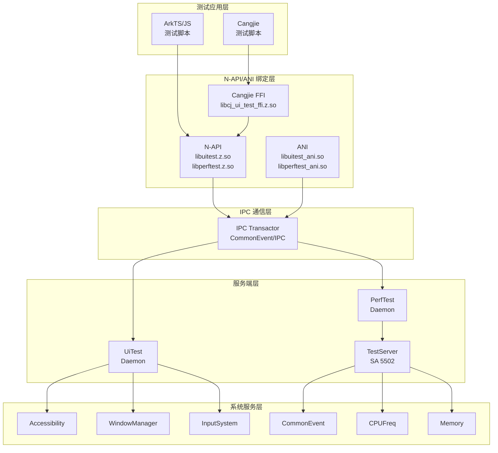
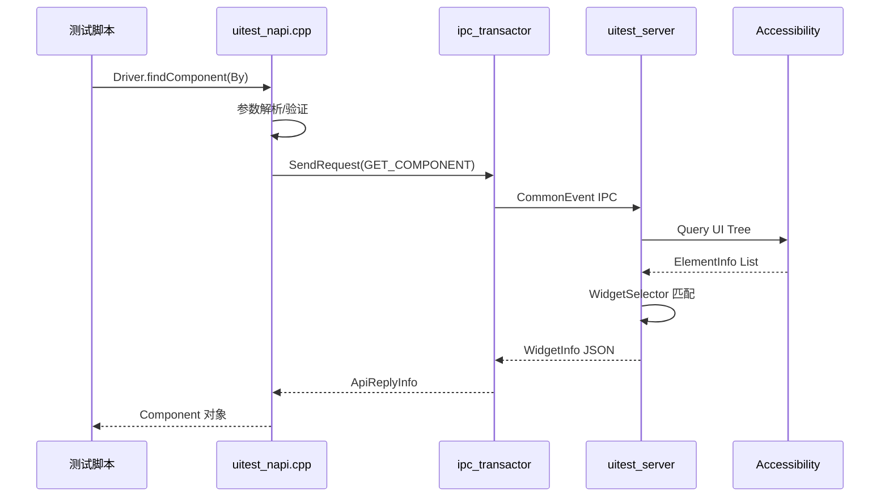
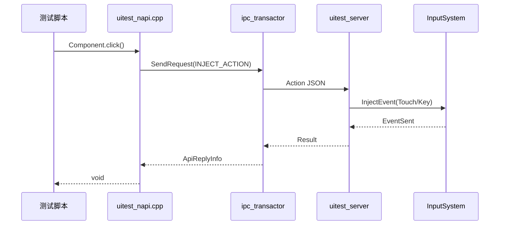
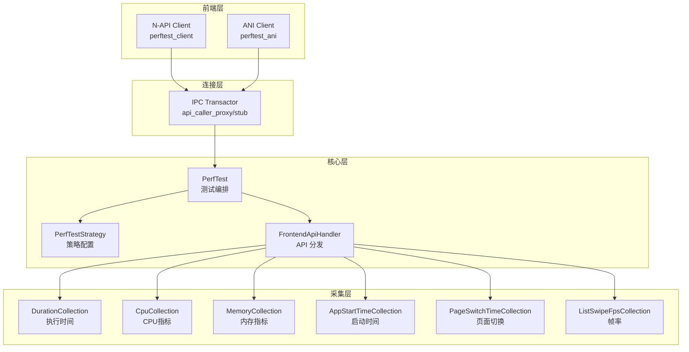
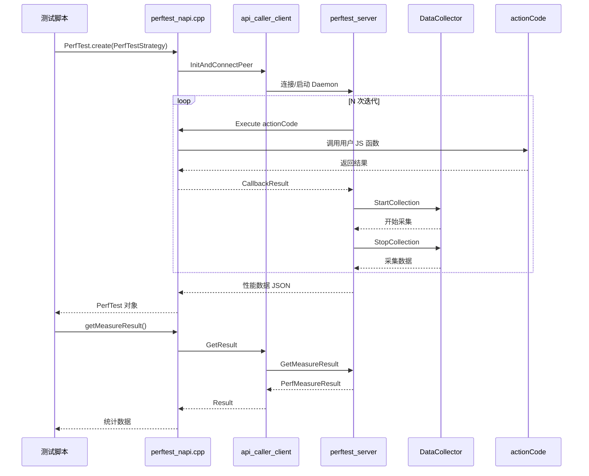
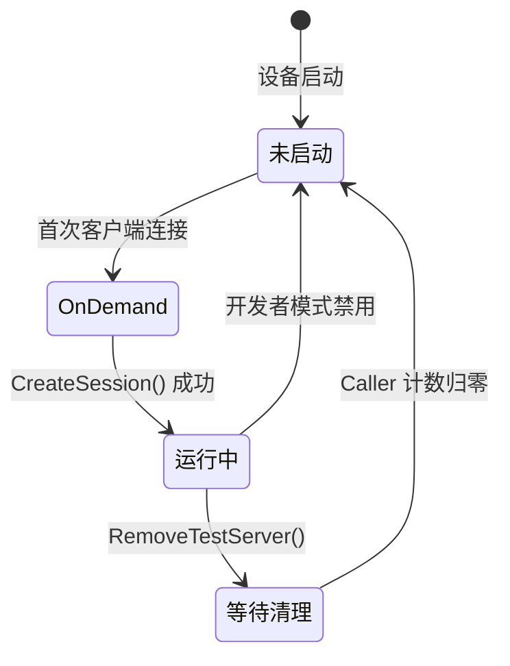
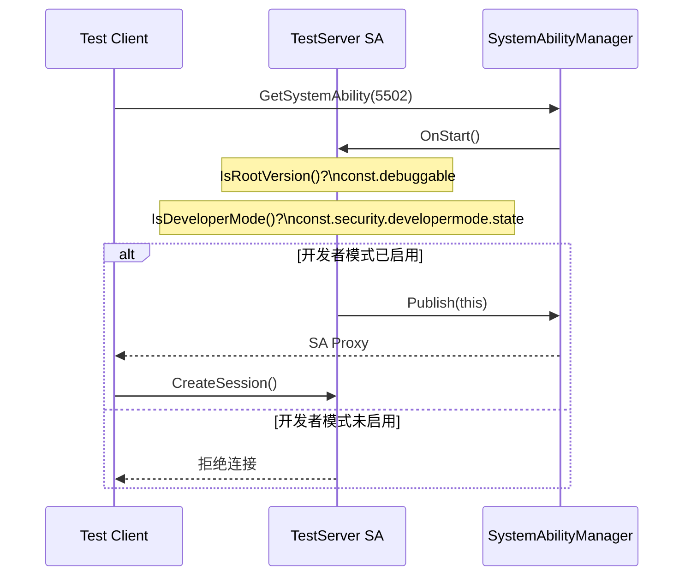
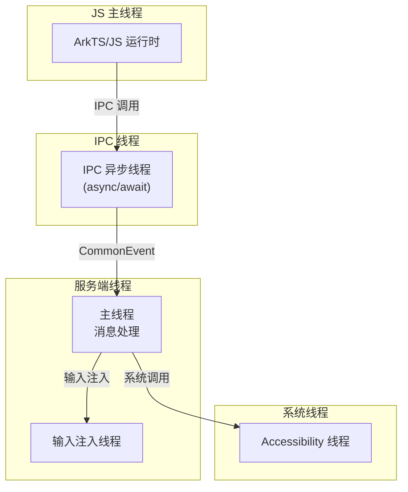
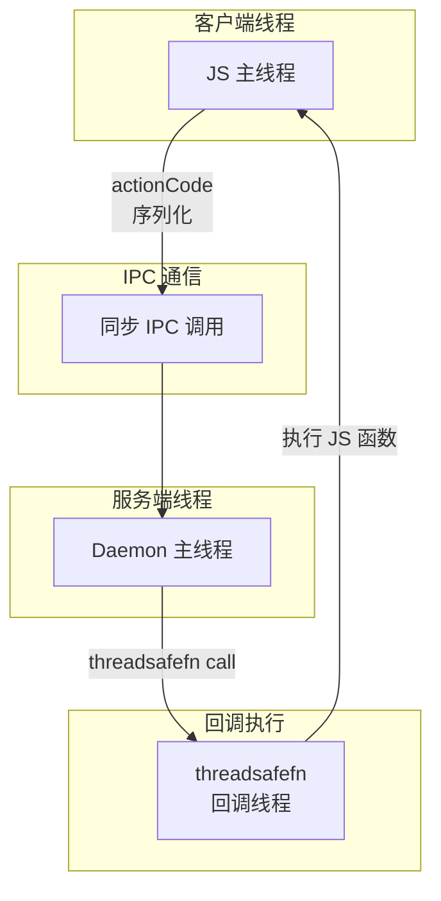

# 架构设计

## 整体架构

ArkXtest 采用分层客户端-服务器架构，支持多语言绑定，通过 IPC 通信实现测试框架与系统服务的交互。

### 架构图



## UiTest 架构

### 组件图

```mermaid
graph TB
    subgraph "客户端"
        Driver["Driver\nUiDriver.create()"]
        By["By/On\n控件选择器"]
        Component["Component\n控件对象"]
        UiWindow["UiWindow\n窗口对象"]
        Observer["UIEventObserver\n事件监听器"]
    end

    subgraph "N-API 绑定"
        NAPI["napi/\nuitest_napi.cpp"]
    end

    subgraph "IPC"
        IPC["connection/\nipc_transactor.cpp"]
    end

    subgraph "服务端核心"
        Selector["WidgetSelector\n控件选择器"]
        Operator["WidgetOperator\n控件操作"]
        WindowOp["WindowOperator\n窗口操作"]
        UIAction["UiAction\n输入注入"]
        Dump["DumpHandler\n布局导出"]
    end

    Driver --> By
    Driver --> Component
    Driver --> UiWindow
    Driver --> Observer
    
    By --> NAPI
    Component --> NAPI
    UiWindow --> NAPI
    Observer --> NAPI
    
    NAPI --> IPC
    IPC --> Selector
    IPC --> Operator
    IPC --> WindowOp
    IPC --> UIAction
    IPC --> Dump
```

### 目录职责

| 目录 | 职责 | 关键文件 |
|------|------|----------|
| `core/` | 核心逻辑：控件选择、组件操作、窗口管理 | `widget_selector.cpp`, `widget_operator.cpp` |
| `server/` | 服务端守护进程 | `server_main.cpp`, `system_ui_controller.cpp` |
| `connection/` | IPC 通信 | `ipc_transactor.cpp` |
| `input/` | 输入事件注入 | `ui_input.cpp` |
| `record/` | 录制回放 | `ui_record.cpp`, `pointer_tracker.cpp` |
| `addon/` | 扩展功能：截图 | `screen_copy.cpp` |
| `napi/` | ArkTS-Dynamic 绑定 | `uitest_napi.cpp` |
| `ets/ani/` | ArkTS-Static 绑定 | `uitest_ani.cpp` |
| `cj/` | Cangjie FFI | `uitest_ffi.cpp` |

**证据**: `uitest/BUILD.gn:30-246` 定义了各模块 targets

### 关键时序

#### 控件查找流程



#### 输入事件流程



## PerfTest 架构

### 三层架构



### 目录职责

| 目录 | 职责 | 关键文件 |
|------|------|----------|
| `core/` | 测试编排、策略配置、API 处理 | `perf_test.cpp`, `perf_test_strategy.cpp` |
| `collection/` | 数据采集器 | `duration_collection.cpp`, `cpu_collection.cpp` |
| `connection/` | IPC 通信 | `api_caller_client.cpp`, `ipc_transactor.cpp` |
| `napi/` | ArkTS-Dynamic 绑定 | `perftest_napi.cpp` |
| `ani/` | ArkTS-Static 绑定 | `perftest_ani.cpp` |

**证据**: `perftest/BUILD.gn:32-68` 定义了核心 targets

### 测试执行时序



## TestServer SA 架构

### SA 生命周期



### 权限验证流程



**证据**: `testserver/src/service/test_server_service.cpp:92-104` 实现了权限检查

### IPC 接口定义

| 方法 | 功能 | 权限要求 |
|------|------|----------|
| `CreateSession` | 创建会话，追踪客户端 | 无 |
| `SetPasteData` | 设置剪贴板 | `ARKXTEST_PASTEBOARD_ENABLE` |
| `ChangeWindowMode` | 窗口模式切换 | 无 |
| `TerminateWindow` | 终止窗口 | 无 |
| `MinimizeWindow` | 最小化窗口 | 无 |
| `PublishCommonEvent` | 发布系统事件 | `ohos.permission.PUBLISH_SYSTEM_COMMON_EVENT` |
| `FrequencyLock` | CPU 频率锁定 | `ohos.permission.MANAGE_SECURE_SETTINGS` |
| `CollectProcessMemory` | 采集内存 | 无 |
| `CollectProcessCpu` | 采集 CPU | 无 |
| `SpDaemonProcess` | SmartPerf 控制 | 无 |

**证据**: `testserver/src/ITestServerInterface.idl` 定义了 IPC 接口

## 线程模型

### UiTest 线程模型



### PerfTest 回调线程模型



**证据**: `perftest/napi/src/callback_code_napi.cpp` 使用 `napi_call_threadsafe_function`

## 数据流

### UiTest 数据流

```
测试脚本 → N-API → IPC → 服务端 → Accessibility/Input → 系统 → 返回结果
```

| 阶段 | 数据格式 | 说明 |
|------|----------|------|
| JS → N-API | JS Object | 方法参数 |
| N-API → IPC | JSON | ApiCallInfo 序列化 |
| IPC 传输 | Parcel | IPC 消息 |
| IPC → 服务端 | JSON | ApiReplyInfo 反序列化 |
| 服务端 → 系统 | 系统 API 调用 | 无 |
| 返回 | 逆向传递 | 同样的路径返回 |

**证据**: `uitest/connection/include/ipc_transactor.h` 定义了 `ApiCallInfo` 和 `ApiReplyInfo`

### PerfTest 性能数据流

```
测试策略 → IPC → 服务端 → 数据采集器 → 统计分析 → 返回
```

| 阶段 | 数据内容 | 说明 |
|------|----------|------|
| PerfTestStrategy | 配置信息 | 指标类型、迭代次数、超时等 |
| actionCode | JS 函数引用 | 用于回调执行 |
| 采集数据 | 原始性能数据 | 时间戳、数值 |
| 统计结果 | 最大/最小/平均值 | PerfMeasureResult |
