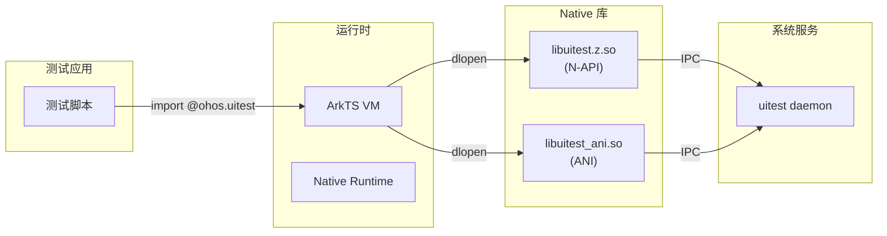
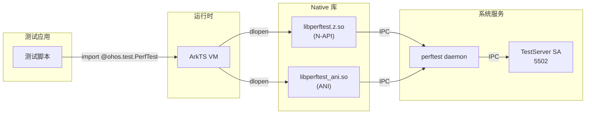

# 编译产物文档

本文档描述 ArkXtest 各组件的编译产物、安装路径和运行时加载关系。

## 产物总览

| 组件 | 产物类型 | 产物名 | 用途 |
|------|----------|--------|------|
| UiTest | 可执行文件 | `uitest` | 服务端守护进程 |
| UiTest | 共享库 | `libuitest.z.so` | N-API 客户端 |
| UiTest | 共享库 | `libuitest_ani.so` | ANI 绑定 |
| UiTest | ABC | `@ohos.UiTest.abc` | ArkTS 静态模块 |
| PerfTest | 可执行文件 | `perftest` | 服务端守护进程 |
| PerfTest | 共享库 | `libperftest.z.so` | N-API 客户端 |
| PerfTest | 共享库 | `libperftest_ani.so` | ANI 绑定 |
| PerfTest | ABC | `@ohos.test.PerfTest.abc` | ArkTS 静态模块 |
| TestServer | 共享库 | `libtest_server_service.z.so` | SA 服务端 |
| TestServer | 共享库 | `libtest_server_client.z.so` | SA 客户端 |

---

## UiTest 产物

### 服务端

| 属性 | 值 |
|------|-----|
| **产物类型** | 可执行文件 |
| **产物名** | `uitest` |
| **Build Target** | `uitest_server` |
| **输出路径** | `out/<product>/testfwk/arkxtest/uitest` |
| **安装路径** | `/system/bin/uitest` |

**依赖模块**:
- `libtest_server_client.z.so`
- `libuitest_core.a`
- `libuitest_ipc.a`
- `libuitest_addon.a`
- `libuitest_input.a`
- `libuitest_record.a`

### N-API 客户端库

| 属性 | 值 |
|------|-----|
| **产物类型** | 共享库 (N-API) |
| **产物名** | `libuitest.z.so` |
| **Build Target** | `uitest_client` |
| **输出路径** | `out/<product>/testfwk/arkxtest/libuitest.z.so` |
| **安装路径** | `/system/lib/module/libuitest.z.so` |

### ANI 绑定库

| 属性 | 值 |
|------|-----|
| **产物类型** | 共享库 (ANI) |
| **产物名** | `libuitest_ani.so` |
| **Build Target** | `uitest_ani` |
| **输出路径** | `out/<product>/testfwk/arkxtest/libuitest_ani.so` |
| **安装路径** | `/system/lib/libuitest_ani.so` |

### ABC 模块

| 属性 | 值 |
|------|-----|
| **产物类型** | ArkTS ByteCode |
| **产物名** | `@ohos.UiTest.abc` |
| **Build Target** | `uitest_etc` |
| **输出路径** | `out/<product>/obj/test/testfwk/arkxtest/uitest/@ohos.UiTest.abc` |
| **安装路径** | `/system/framework/@ohos.UiTest.abc` |

### Cangjie FFI

| 属性 | 值 |
|------|-----|
| **产物类型** | 共享库 (FFI) |
| **产物名** | `libcj_ui_test_ffi.z.so` |
| **Build Target** | `cj_ui_test_ffi` |
| **输出路径** | `out/<product>/testfwk/arkxtest/libcj_ui_test_ffi.z.so` |
| **安装路径** | `/system/lib/platformsdk/libcj_ui_test_ffi.z.so` |

---

## PerfTest 产物

### 服务端

| 属性 | 值 |
|------|-----|
| **产物类型** | 可执行文件 |
| **产物名** | `perftest` |
| **Build Target** | `perftest_server` |
| **输出路径** | `out/<product>/testfwk/arkxtest/perftest` |
| **安装路径** | `/system/bin/perftest` |

**注意**: Watch/Glasses 产品不安装此组件

### N-API 客户端库

| 属性 | 值 |
|------|-----|
| **产物类型** | 共享库 (N-API) |
| **产物名** | `libperftest.z.so` |
| **Build Target** | `perftest_client` |
| **输出路径** | `out/<product>/testfwk/arkxtest/libperftest.z.so` |
| **安装路径** | `/system/lib/module/test/libperftest.z.so` |

### ANI 绑定库

| 属性 | 值 |
|------|-----|
| **产物类型** | 共享库 (ANI) |
| **产物名** | `libperftest_ani.so` |
| **Build Target** | `perftest_ani` |
| **输出路径** | `out/<product>/testfwk/arkxtest/libperftest_ani.so` |
| **安装路径** | `/system/lib/libperftest_ani.so` |

### ABC 模块

| 属性 | 值 |
|------|-----|
| **产物类型** | ArkTS ByteCode |
| **产物名** | `@ohos.test.PerfTest.abc` |
| **Build Target** | `perftest_etc` |
| **输出路径** | `out/<product>/obj/test/testfwk/arkxtest/perftest/@ohos.test.PerfTest.abc` |
| **安装路径** | `/system/framework/@ohos.test.PerfTest.abc` |

**注意**: Watch/Glasses 产品不安装此组件

---

## TestServer 产物

### SA 服务端库

| 属性 | 值 |
|------|-----|
| **产物类型** | 共享库 (SA) |
| **产物名** | `libtest_server_service.z.so` |
| **Build Target** | `test_server_service` |
| **输出路径** | `out/<product>/testfwk/arkxtest/libtest_server_service.z.so` |
| **安装路径** | `/system/lib/libtest_server_service.z.so` |

### SA 客户端库

| 属性 | 值 |
|------|-----|
| **产物类型** | 共享库 |
| **产物名** | `libtest_server_client.z.so` |
| **Build Target** | `test_server_client` |
| **输出路径** | `out/<product>/testfwk/arkxtest/libtest_server_client.z.so` |
| **安装路径** | `/system/lib/libtest_server_client.z.so` |

### SA 配置文件

| 属性 | 值 |
|------|-----|
| **文件类型** | JSON 配置 |
| **文件名** | `5502.json` |
| **Build Target** | `testserver_sa_profile` |
| **输出路径** | `out/<product>/obj/test/testfwk/arkxtest/testserver/sa_profile/profiles/5502.json` |
| **安装路径** | `/system/profile/testserver.json` |

### 服务初始化配置

| 属性 | 值 |
|------|-----|
| **文件类型** | cfg 配置 |
| **文件名** | `testserver.cfg` |
| **Build Target** | `testserver_etc` |
| **输出路径** | `out/<product>/obj/test/testfwk/arkxtest/testserver/init/testserver.cfg` |
| **安装路径** | `/system/etc/init/testserver.cfg` |

---

## 运行时加载关系

### UiTest 加载流程



### PerfTest 加载流程



### 库依赖关系

#### libuitest.z.so 依赖

```
ldd libuitest.z.so
├── libnapi.so          # N-API 框架
├── libtest_server_client.z.so  # SA 客户端
├── libuv.so            # 事件循环
├── libhilog.so         # 日志
└── libc++.so          # C++ 标准库
```

#### libuitest_ani.so 依赖

```
ldd libuitest_ani.so
├── libani.so           # ANI 框架
├── libarkruntime.so    # ArkTS 运行时
├── libtest_server_client.z.so
└── libhilog.so
```

#### uitest daemon 依赖

```
ldd uitest
├── libtest_server_client.z.so
├── libaccessibility.so      # 无障碍服务
├── libwindow_manager.so     # 窗口管理
├── libmmi-client.so         # 输入服务
└── libimage_native.so       # 图像处理
```

---

## 部署命令

### UiTest 部署

```bash
# 推送服务端
hdc file send out/rk3568/testfwk/arkxtest/uitest /system/bin/uitest
hdc shell chmod +x /system/bin/uitest

# 推送 N-API 客户端
hdc file send out/rk3568/testfwk/arkxtest/libuitest.z.so /system/lib/module/libuitest.z.so

# 推送 ANI 客户端
hdc file send out/rk3568/testfwk/arkxtest/libuitest_ani.so /system/lib/libuitest_ani.so

# 推送 ABC 模块
hdc file send out/rk3568/obj/test/testfwk/arkxtest/uitest/@ohos.UiTest.abc /system/framework/@ohos.UiTest.abc
```

### PerfTest 部署

```bash
# 推送服务端
hdc file send out/rk3568/testfwk/arkxtest/perftest /system/bin/perftest
hdc shell chmod +x /system/bin/perftest

# 推送 N-API 客户端
hdc file send out/rk3568/testfwk/arkxtest/libperftest.z.so /system/lib/module/test/libperftest.z.so

# 推送 ANI 客户端
hdc file send out/rk3568/testfwk/arkxtest/libperftest_ani.so /system/lib/libperftest_ani.so
```

### TestServer 部署

```bash
# 推送 SA 配置文件
hdc file send out/rk3568/obj/test/testfwk/arkxtest/testserver/sa_profile/profiles/5502.json /system/profile/testserver.json

# 推送初始化配置
hdc file send out/rk3568/obj/test/testfwk/arkxtest/testserver/init/testserver.cfg /system/etc/init/testserver.cfg

# 推送 SA 库
hdc file send out/rk3568/testfwk/arkxtest/libtest_server_service.z.so /system/lib/libtest_server_service.z.so

# 推送客户端库
hdc file send out/rk3568/testfwk/arkxtest/libtest_server_client.z.so /system/lib/libtest_server_client.z.so
```

---

## 产物验证

### UiTest 验证

```bash
# 检查服务端
ls -la /system/bin/uitest

# 检查客户端库
ls -la /system/lib/module/libuitest.z.so
ls -la /system/lib/libuitest_ani.so

# 检查 ABC 模块
ls -la /system/framework/@ohos.UiTest.abc

# 启动服务端
hdc shell uitest start-daemon test@1234@1000@0
```

### PerfTest 验证

```bash
# 检查服务端
ls -la /system/bin/perftest

# 检查客户端库
ls -la /system/lib/module/test/libperftest.z.so
ls -la /system/lib/libperftest_ani.so

# 检查 ABC 模块
ls -la /system/framework/@ohos.test.PerfTest.abc
```

### TestServer 验证

```bash
# 检查 SA 配置文件
ls -la /system/profile/testserver.json

# 检查初始化配置
ls -la /system/etc/init/testserver.cfg

# 检查 SA 是否注册
hdc shell smgr list | grep 5502

# 检查服务端日志
hdc shell hilog | grep TestServer
```
