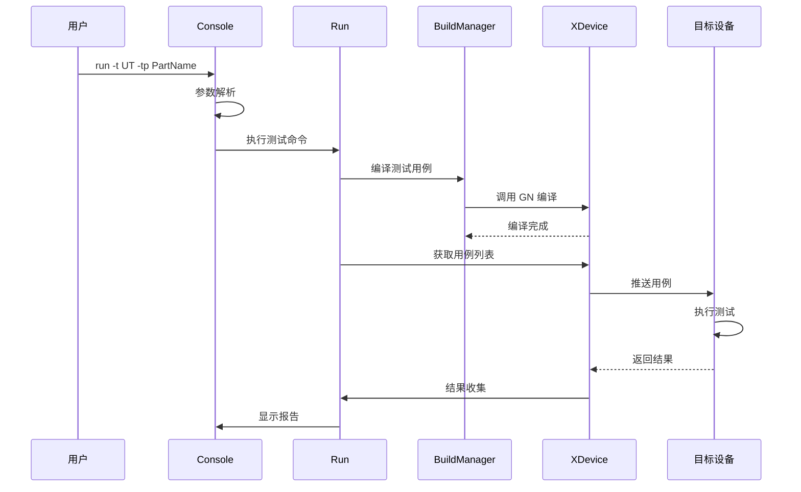

# 系统架构

## 2.1 整体架构图

```
┌─────────────────────────────────────────────────────────────────────┐
│                        Developer Test Framework                       │
├─────────────────────────────────────────────────────────────────────┤
│  ┌───────────────────────────────────────────────────────────────┐  │
│  │                        入口层 (src/main)                       │  │
│  │  __main__.py → Console.console(sys.argv)                      │  │
│  └───────────────────────────────────────────────────────────────┘  │
│                              ↓                                       │
│  ┌───────────────────────────────────────────────────────────────┐  │
│  │                      命令层 (src/core/command)                 │  │
│  │  ┌──────────┐ ┌──────────┐ ┌──────────┐ ┌──────────────────┐ │  │
│  │  │ console  │ │   run    │ │   gen    │ │ distribute_*     │ │  │
│  │  │ 交互入口 │ │ 执行命令 │ │ 生成命令 │ │ 分布式执行        │ │  │
│  │  └──────────┘ └──────────┘ └──────────┘ └──────────────────┘ │  │
│  └───────────────────────────────────────────────────────────────┘  │
│                              ↓                                       │
│  ┌───────────────────────────────────────────────────────────────┐  │
│  │                       核心服务层 (src/core)                     │  │
│  │  ┌──────────┐ ┌──────────┐ ┌──────────┐ ┌──────────────────┐ │  │
│  │  │  build/  │ │ driver/  │ │ config/  │ │    testcase/     │ │  │
│  │  │  构建管理 │ │ 设备驱动 │ │ 配置管理 │ │   用例管理        │ │  │
│  │  └──────────┘ └──────────┘ └──────────┘ └──────────────────┘ │  │
│  └───────────────────────────────────────────────────────────────┘  │
│                              ↓                                       │
│  ┌───────────────────────────────────────────────────────────────┐  │
│  │                       适配层 (libs/, aw/)                       │  │
│  │  ┌──────────┐ ┌──────────┐ ┌──────────┐ ┌──────────────────┐ │  │
│  │  │  fuzzlib │ │ benchmark│ │js_template│ │   aw/cxx/*       │ │  │
│  │  │ 模糊测试 │ │ 性能测试 │ │JS测试模板 │ │  C++测试库       │ │  │
│  │  └──────────┘ └──────────┘ └──────────┘ └──────────────────┘ │  │
│  └───────────────────────────────────────────────────────────────┘  │
└─────────────────────────────────────────────────────────────────────┘
                              ↓
┌─────────────────────────────────────────────────────────────────────┐
│                         XDevice (外部依赖)                            │
│  插件管理、设备管理、执行调度、日志系统                                 │
└─────────────────────────────────────────────────────────────────────┘
```

## 2.2 组件职责

### 2.2.1 入口层 (src/main)

| 文件 | 职责 |
|------|------|
| `__main__.py:33-38` | 创建 Console 实例，初始化日志，执行控制台循环 |
| `_init_global_config.py` | 全局配置初始化 |

### 2.2.2 命令层 (src/core/command)

| 文件/类 | 职责 |
|---------|------|
| `console.py:53` | `Console` 类 - 用户交互入口，参数解析 |
| `run.py:50` | `Run` 类 - 测试执行命令处理 |
| `gen.py` | `Gen` 类 - 生成命令处理 |
| `display.py` | 显示命令处理（help, show） |
| `parameter.py` | 命令参数定义与解析 |
| `distribute_execute.py` | 分布式测试执行 |
| `distribute_utils.py` | 分布式测试工具 |

### 2.2.3 构建层 (src/core/build)

| 文件/类 | 职责 |
|---------|------|
| `build_manager.py:40` | `BuildManager` 类 - 构建管理入口 |
| `build_testcases.py` | 测试用例构建 |
| `build_lite_manager.py` | Lite 设备构建 |
| `select_targets.py` | 目标选择 |
| `pretreat_targets.py` | 目标预处理 |

### 2.2.4 设备驱动层 (src/core/driver)

| 文件/类 | 职责 |
|---------|------|
| `drivers.py:74` | `CppTestDriver`, `JSUnitTestDriver` - 测试驱动 |
| `openharmony.py` | OpenHarmony 标准设备驱动 |
| `lite_driver.py` | Lite 设备驱动 |
| `parser.py` | 结果解析器 |

### 2.2.5 配置层 (src/core/config)

| 文件/类 | 职责 |
|---------|------|
| `config_manager.py:42` | `UserConfigManager`, `FrameworkConfigManager` |
| `resource_manager.py` | 资源配置管理 |
| `parse_parts_config.py` | 部件配置解析 |

## 2.3 数据流

### 2.3.1 测试执行数据流

```
┌──────────┐     ┌──────────┐     ┌──────────┐     ┌──────────┐
│   用户   │────▶│ Console  │────▶│  Run     │────▶│ BuildMgr │
│   输入   │     │ 参数解析 │     │ 逻辑分发  │     │ 编译用例 │
└──────────┘     └──────────┘     └──────────┘     └──────────┘
                                                    │
                                                    ↓
┌──────────┐     ┌──────────┐     ┌──────────┐     ┌──────────┐
│   报告   │◀────│  Report  │◀────│ Drivers  │◀────│ XDevice  │
│   生成   │     │  生成    │     │ 设备执行  │     │ 调度执行 │
└──────────┘     └──────────┘     └──────────┘     └──────────┘
```

### 2.3.2 关键调用链

**启动流程**:
```
start.sh → src/main/__main__.py:33 → Console.__init__() → console.console(sys.argv)
```

**测试执行流程** (来自 `src/core/command/run.py:70-82`):
```
Run._build_test_cases() → BuildManager.build_testcases() → BuildTestcases.build_testcases()
→ Run._execute_tests() → TestCaseManager.execute() → Drivers.execute()
```

## 2.4 线程模型

### 2.4.1 主线程

框架使用单主线程处理用户交互，通过 `Console` 类（`src/core/command/console.py:53`）管理。

### 2.4.2 异步执行

- 测试用例在设备端执行（多线程）
- 设备通信使用异步回调（`ShellHandler`）
- 支持多设备并行执行

### 2.4.3 多线程测试支持

框架支持 C++ 多线程测试用例（来自 `README_zh.md:226-289`）:

```cpp
#include <gtest/hwext/gtest-multithread.h>

// 设置线程数
SET_THREAD_NUM(4);

// 多线程执行
GTEST_RUN_TASK(task_function);

// 或使用 HWMTEST_F
HWMTEST_F(TestSuite, test_name, Level1, 4)
```

## 2.5 模块依赖关系

```
                    ┌─────────────────┐
                    │   src/main      │
                    │   (入口)         │
                    └────────┬────────┘
                             │
                    ┌────────▼────────┐
                    │  src/core/command│
                    │   (命令处理)     │
                    └────────┬────────┘
                             │
        ┌────────────────────┼────────────────────┐
        │                    │                    │
┌───────▼───────┐    ┌───────▼───────┐    ┌───────▼───────┐
│ src/core/build│    │src/core/driver│    │src/core/config│
│   (构建)      │    │   (设备)      │    │   (配置)      │
└───────┬───────┘    └───────┬───────┘    └───────┬───────┘
        │                    │                    │
        │                    │                    │
        └────────────────────┼────────────────────┘
                             │
                    ┌────────▼────────┐
                    │   XDevice       │
                    │  (外部依赖)      │
                    └─────────────────┘
```

## 2.6 关键时序图

### 2.6.1 测试用例执行时序



## 2.7 扩展点

### 2.7.1 新增测试类型

1. 在 `config/framework_config.xml` 添加测试类型定义
2. 在 `src/core/driver/` 实现对应的 Driver
3. 在 `src/core/command/` 添加命令支持

### 2.7.2 新增设备支持

1. 在 `src/core/driver/` 继承 `IDriver`
2. 在 `config/user_config.xml` 添加设备配置
3. 实现设备连接和通信接口

## 2.8 相关文档

- [01_Overview.md](01_Overview.md) - 项目概览
- [03_Directory_Structure.md](03_Directory_Structure.md) - 目录结构
- [04_Configuration.md](04_Configuration.md) - 配置说明
- [06_Usage_Guide.md](06_Usage_Guide.md) - 使用指南
