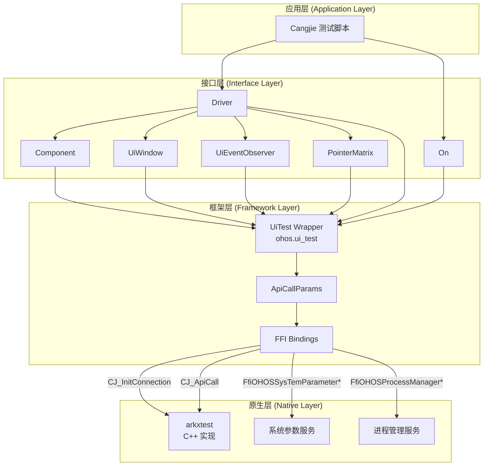
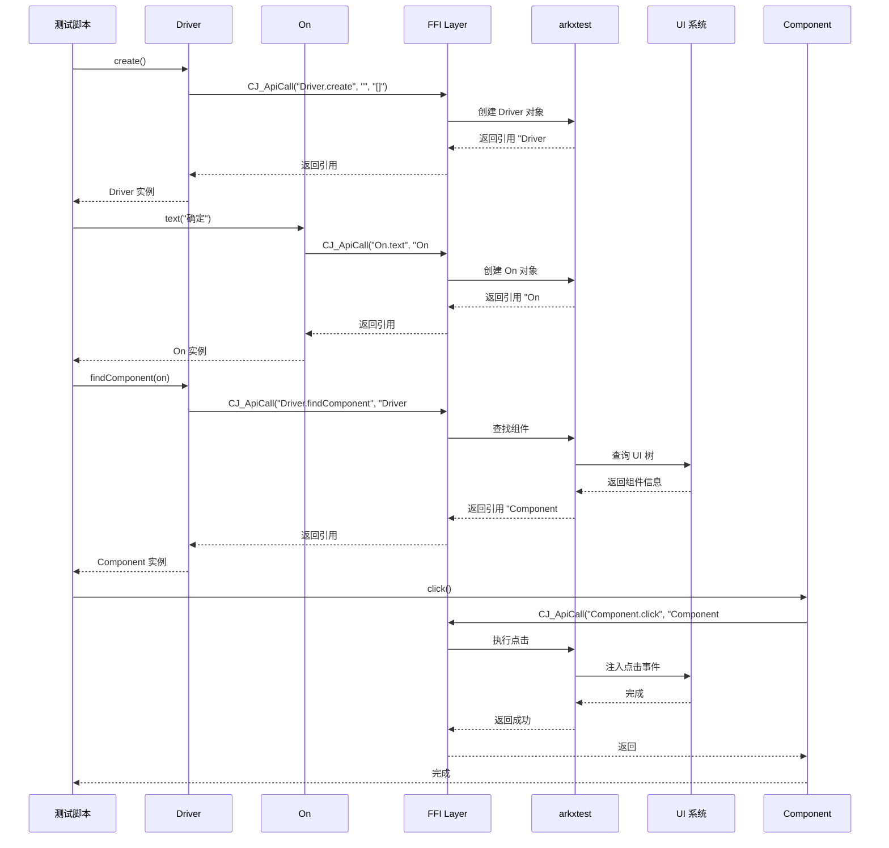
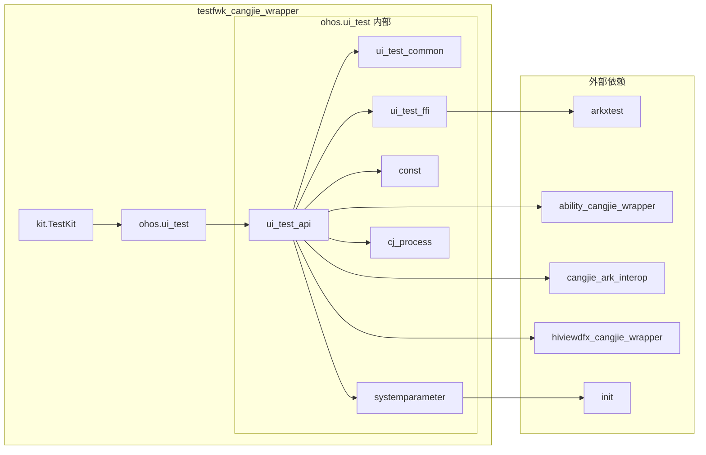
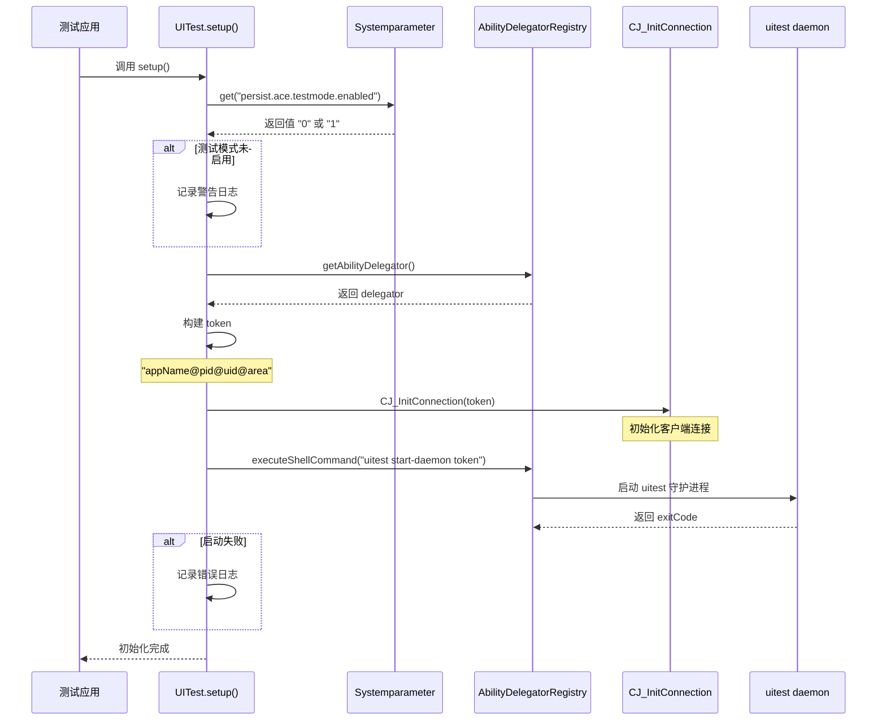
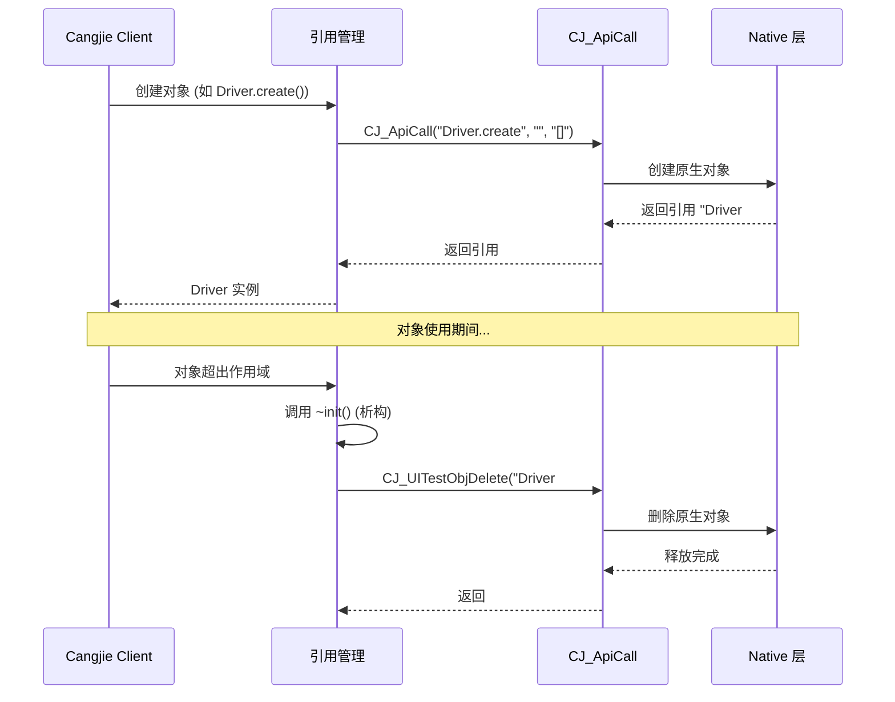

# 架构设计

**文档目的**: 描述 testfwk_cangjie_wrapper 的分层架构、模块职责、数据流和关键时序  
**目标读者**: 架构师、核心模块开发者  
**阅读时间**: 约 15 分钟

---

## 1. 架构总览

### 1.1 分层架构图



### 1.2 架构说明

| 层级 | 职责 | 主要模块 | 技术 |
|------|------|----------|------|
| **应用层** | 编写测试用例 | 开发者测试脚本 | Cangjie |
| **接口层** | 提供友好的测试 API | Driver, On, Component, UiWindow | Cangjie Class |
| **框架层** | API 封装、参数转换、错误处理 | ohos.ui_test 模块 | Cangjie + FFI |
| **原生层** | UI 测试核心实现、系统服务 | arkxtest, init | C++ |

---

## 2. 模块职责

### 2.1 模块清单

| 模块 | 文件路径 | 职责 | 代码行数 |
|------|----------|------|----------|
| **ui_test_api** | `ohos/ui_test/ui_test_api.cj` | 核心 API 类实现 (Driver, On, Component, UiWindow 等) | ~2000 |
| **ui_test_common** | `ohos/ui_test/ui_test_common.cj` | 公共类型定义 (枚举、Point、Rect 等) | 709 |
| **ui_test_ffi** | `ohos/ui_test/ui_test_ffi.cj` | FFI 函数声明和 ApiCallParams 结构体 | 82 |
| **const** | `ohos/ui_test/const.cj` | API 操作字符串常量 | 124 |
| **systemparameter** | `ohos/ui_test/systemparameter.cj` | 系统参数 get/set 封装 | 101 |
| **cj_process** | `ohos/ui_test/cj_process.cj` | 进程信息获取 (uid, pid, tid) | 51 |
| **TestKit** | `kit/TestKit/index.cj` | 公共 API 导出 | 23 |

### 2.2 模块详细职责

#### ui_test_api.cj（核心 API 模块）

**位置**: `ohos/ui_test/ui_test_api.cj:1`

**职责**:
- 实现 `Driver` 类：44+ 个方法，包括组件查找、手势操作、按键、显示控制
- 实现 `On` 类：16+ 个方法，组件选择器构建
- 实现 `Component` 类：21+ 个方法，组件操作和属性获取
- 实现 `UiWindow` 类：14+ 个方法，窗口操作
- 实现 `UiEventObserver` 类：事件监听
- 实现 `PointerMatrix` 类：多指手势定义
- 提供 `UITest.setup()` 初始化入口

**关键函数**:
```cangjie
// 行 75-84: 统一的 FFI 调用封装
func getData(params: ApiCallParams, api: String): String

// 行 51-72: 框架初始化
class UITest { static func setup(): Unit }

// 行 86-92: 对象引用释放
func releaseRef(ref: String)

// 行 97-101: 引用有效性校验
func checkRef(ref: String)
```

#### ui_test_ffi.cj（FFI 绑定层）

**位置**: `ohos/ui_test/ui_test_ffi.cj:1`

**职责**:
- 声明 FFI 函数原型
- 定义 C 结构体 `ApiCallParams`
- 提供内存管理辅助函数

**核心 FFI 函数**:
```cangjie
// 行 23: 初始化连接
foreign func CJ_InitConnection(token: CString): Unit

// 行 25: API 调用入口（所有操作通过此函数）
foreign func CJ_ApiCall(param: ApiCallParams): RetDataCString

// 行 27: 对象删除
foreign func CJ_UITestObjDelete(ref: CString): Unit
```

**ApiCallParams 结构体** (行 39-73):
```cangjie
@C
struct ApiCallParams {
    let apiId: CString       // API 标识符 (如 "Driver.create")
    let callerObjRef: CString // 调用者对象引用
    let params: CString      // JSON 格式参数
    
    init(id: String, ref: String, param: String) { ... }
    func free(): Unit        // 释放内存
}
```

#### ui_test_common.cj（公共类型）

**位置**: `ohos/ui_test/ui_test_common.cj:1`

**职责**:
- 定义枚举类型：MatchPattern, DisplayRotation, WindowMode, ResizeDirection, UiDirection, MouseButton
- 定义数据类：Point, Rect, WindowFilter, UiElementInfo
- 提供 JSON 解析方法

**枚举定义**:
```cangjie
// 行 31-84: 字符串匹配模式
enum MatchPattern { Equals | Contains | StartsWith | EndsWith }

// 行 93-153: 显示旋转方向
enum DisplayRotation { Rotation0 | Rotation90 | Rotation180 | Rotation270 }

// 行 162-200: 窗口模式
enum WindowMode { Fullscreen | Primary | Secondary | Floating }
```

**数据类**:
```cangjie
// 行 292-338: 坐标点
class Point { var x: Int32; var y: Int32; var displayId: ?Int32 }

// 行 661-729: 矩形区域
class Rect { var left, top, right, bottom: Int32; var displayId: ?Int32 }
```

---

## 3. 数据流

### 3.1 典型调用链：查找并点击组件



### 3.2 数据流说明

1. **引用传递**: 所有对象通过字符串引用（如 `"Driver#123"`）传递，而非对象实例
2. **JSON 序列化**: 参数通过 JSON 字符串传递
3. **统一入口**: 所有操作通过 `CJ_ApiCall` 单一 FFI 函数
4. **错误处理**: 通过返回码 `RetDataCString.code` 判断成功/失败

---

## 4. 依赖关系

### 4.1 模块依赖图



### 4.2 外部依赖详情

| 依赖 | 用途 | 使用位置 |
|------|------|----------|
| **arkxtest:cj_ui_test_ffi** | UI 测试 FFI 实现 | `ui_test_ffi.cj:25` |
| **init:cj_system_parameter_enhance_ffi** | 系统参数 FFI | `systemparameter.cj:25` |
| **ability_cangjie_wrapper:ui_ability** | UI Ability 支持 | `ui_test_api.cj:24` |
| **ability_cangjie_wrapper:ability_delegator_registry** | 测试委托注册 | `ui_test_api.cj:24` |
| **cangjie_ark_interop:ffi** | FFI 基础 | `ui_test_ffi.cj:20` |
| **cangjie_ark_interop:business_exception** | 异常处理 | `ui_test_api.cj:27` |
| **hiviewdfx_cangjie_wrapper:hilog** | 日志打印 | `ui_test_api.cj:23` |

**证据**: `ohos/ui_test/BUILD.gn:32-47`

---

## 5. 关键时序

### 5.1 框架初始化时序



**证据**: `ui_test_api.cj:42-73`

### 5.2 对象生命周期



**证据**: `ui_test_api.cj:86-92`, `ui_test_api.cj:115-123`

---

## 6. 线程模型

### 6.1 Worker 线程支持

大部分 UI 操作 API 标记为可在 Worker 线程执行：

```cangjie
@!APILevel[
    since: "22",
    syscap: "SystemCapability.Test.UiTest",
    throwexception: true,
    workerthread: true  // <-- 支持 Worker 线程
]
public func findComponent(on: On): ?Component
```

**证据**: `ui_test_api.cj:166-171`

### 6.2 线程安全考虑

| 方面 | 说明 |
|------|------|
| **setup() 调用** | 使用 `AtomicBool` 确保只执行一次 |
| **FFI 调用** | 依赖底层 arkxtest 的线程安全 |
| **对象引用** | 引用是字符串，无并发修改问题 |

**证据**: `ui_test_api.cj:31`, `ui_test_api.cj:52`

---

## 7. 跨平台支持

### 7.1 条件编译

```gn
# ohos/ui_test/BUILD.gn:19-30
if (is_mingw || is_mac) {
    sources = [ "../../mock/ohos.ui_test.cj" ]  // Mock 实现
} else {
    sources = [
        "cj_process.cj",
        "const.cj",
        "ui_test_api.cj",
        ...
    ]
}
```

### 7.2 Mock 实现

`mock/ohos.ui_test.cj` 提供空实现，使代码能在 Windows/Mac 编译通过：

```cangjie
public class Driver {
    public static func create(): Driver { return Driver() }
    public func click(x: Int32, y: Int32): Unit { return () }
    // ... 所有方法返回默认值
}
```

**证据**: `mock/ohos.ui_test.cj`

---

## 8. 下一步阅读

- **[API 参考](20_API_Reference.md)** - 完整 API 清单和调用链
- **[构建系统](30_Build_System.md)** - GN 目标和依赖关系
- **[安全分析](40_Security.md)** - FFI 边界安全和信任模型

---

*本文档基于代码仓库静态分析生成*  
*证据位置: ohos/ui_test/*.cj, kit/TestKit/*.cj, mock/*.cj*
