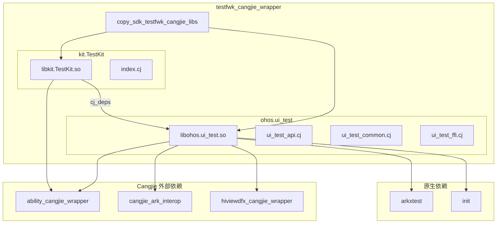

# 构建系统

**文档目的**: 描述 GN 构建系统配置、targets、依赖关系和编译产物  
**目标读者**: 构建工程师、集成开发者  
**阅读时间**: 约 15 分钟

---

## 1. 构建系统总览

### 1.1 构建工具链

| 组件 | 用途 | 版本/说明 |
|------|------|-----------|
| **GN** | 元构建系统（生成 Ninja 文件） | OpenHarmony 标准 |
| **Ninja** | 实际构建执行 | 由 GN 生成配置 |
| **CJC** | Cangjie 编译器 | 模板：`//build/templates/cangjie/cjc.gni` |
| **模板** | `ohos_cangjie_shared_library` | 仓颉共享库标准模板 |

### 1.2 构建文件清单

| 文件路径 | 用途 |
|----------|------|
| `BUILD.gn` | 根构建配置，聚合子目标 |
| `ohos/ui_test/BUILD.gn` | UI 测试库构建配置 |
| `kit/TestKit/BUILD.gn` | Test Kit 库构建配置 |
| `bundle.json` | OpenHarmony 组件清单 |

**证据**: 全局搜索 BUILD.gn 结果

---

## 2. GN Targets 详细说明

### 2.1 Target: copy_sdk_testfwk_cangjie_libs

**位置**: `BUILD.gn:20-23`  
**类型**: `copy_ohos_cangjie_sdk_api_lib` (自定义复制模板)  
**用途**: 聚合并复制 SDK 库文件到输出目录

```gn
copy_ohos_cangjie_sdk_api_lib("copy_sdk_testfwk_cangjie_libs") {
  ohos_inputs = [ "//test/testfwk/testfwk_cangjie_wrapper/ohos/ui_test:ohos.ui_test" ]
  kit_inputs = [ "//test/testfwk/testfwk_cangjie_wrapper/kit/TestKit:kit.TestKit" ]
}
```

**输入**:
- `ohos_inputs`: ohos.ui_test 库
- `kit_inputs`: kit.TestKit 库

**输出**: 复制到 SDK 输出目录的库文件

**Inner Kits 注册** (bundle.json:41-45):
```json
"inner_kits": [
  { "name": "//test/testfwk/testfwk_cangjie_wrapper:copy_sdk_testfwk_cangjie_libs" },
  { "name": "//test/testfwk/testfwk_cangjie_wrapper:copy_sdk_testfwk_cangjie_libs_kit" }
]
```

---

### 2.2 Target: ohos.ui_test

**位置**: `ohos/ui_test/BUILD.gn:18`  
**类型**: `ohos_cangjie_shared_library`  
**输出**: `libohos.ui_test.so`

```gn
ohos_cangjie_shared_library("ohos.ui_test") {
  # 平台条件编译
  if (is_mingw || is_mac) {
    sources = [ "../../mock/ohos.ui_test.cj" ]
  } else {
    sources = [
      "cj_process.cj",
      "const.cj",
      "ui_test_api.cj",
      "ui_test_common.cj",
      "ui_test_ffi.cj",
      "systemparameter.cj",
    ]
  }

  cj_external_deps = [
    "ability_cangjie_wrapper:ohos.app.ability.ui_ability",
    "ability_cangjie_wrapper:ohos.app.ability.context_constant",
    "ability_cangjie_wrapper:ohos.app.ability.ability_delegator_registry",
    "cangjie_ark_interop:ohos.business_exception",
    "cangjie_ark_interop:ohos.callback_invoke",
    "cangjie_ark_interop:ohos.encoding.json",
    "cangjie_ark_interop:ohos.ffi",
    "hiviewdfx_cangjie_wrapper:ohos.hilog",
    "cangjie_ark_interop:ohos.labels",
  ]

  external_deps = [
    "arkxtest:cj_ui_test_ffi",
    "init:cj_system_parameter_enhance_ffi",
  ]

  subsystem_name = "testfwk"
  part_name = "testfwk_cangjie_wrapper"
}
```

#### 源码文件

| 文件 | 行数 | 说明 |
|------|------|------|
| `cj_process.cj` | 51 | 进程信息 FFI |
| `const.cj` | 124 | API 常量 |
| `ui_test_api.cj` | ~2000 | 核心 API 实现 |
| `ui_test_common.cj` | 709 | 公共类型定义 |
| `ui_test_ffi.cj` | 82 | FFI 绑定 |
| `systemparameter.cj` | 101 | 系统参数访问 |

#### 依赖详情

**cj_external_deps** (Cangjie 外部依赖):

| 依赖 | 用途 | 使用位置 |
|------|------|----------|
| ability_cangjie_wrapper:ui_ability | UI Ability 支持 | ui_test_api.cj:24 |
| ability_cangjie_wrapper:context_constant | 上下文常量 | - |
| ability_cangjie_wrapper:ability_delegator_registry | 测试委托注册 | ui_test_api.cj:24 |
| cangjie_ark_interop:business_exception | 异常处理 | ui_test_api.cj:27 |
| cangjie_ark_interop:callback_invoke | 回调调用 | - |
| cangjie_ark_interop:encoding.json | JSON 编码 | ui_test_api.cj:21 |
| cangjie_ark_interop:ffi | FFI 基础 | ui_test_ffi.cj:20 |
| hiviewdfx_cangjie_wrapper:hilog | 日志打印 | ui_test_api.cj:23 |
| cangjie_ark_interop:labels | API 标签 | ui_test_api.cj:25 |

**external_deps** (原生依赖):

| 依赖 | 用途 |
|------|------|
| arkxtest:cj_ui_test_ffi | UI 测试 FFI 实现 |
| init:cj_system_parameter_enhance_ffi | 系统参数 FFI |

**证据**: `ohos/ui_test/BUILD.gn:32-50`

---

### 2.3 Target: kit.TestKit

**位置**: `kit/TestKit/BUILD.gn:18`  
**类型**: `ohos_cangjie_shared_library`  
**输出**: `libkit.TestKit.so`

```gn
ohos_cangjie_shared_library("kit.TestKit") {
  sources = ["index.cj"]

  cj_deps = ["../../ohos/ui_test:ohos.ui_test"]

  cj_external_deps = [
    "ability_cangjie_wrapper:ohos.app.ability.ui_ability",
    "ability_cangjie_wrapper:ohos.application.test_runner",
    "ability_cangjie_wrapper:ohos.app.ability.ability_delegator_registry",
  ]

  subsystem_name = "testfwk"
  part_name = "testfwk_cangjie_wrapper"
}
```

#### 源码文件

| 文件 | 行数 | 说明 |
|------|------|------|
| `index.cj` | 23 | 公共 API 导出 |

**导出内容** (index.cj:20-22):
```cangjie
public import ohos.app.ability.ability_delegator_registry.*
public import ohos.application.test_runner.*
public import ohos.ui_test.*
```

#### 依赖详情

| 类型 | 依赖 | 说明 |
|------|------|------|
| cj_deps | ohos.ui_test | 内部依赖 UI 测试库 |
| cj_external_deps | ability_cangjie_wrapper:ui_ability | Ability 支持 |
| cj_external_deps | ability_cangjie_wrapper:test_runner | 测试运行器 |
| cj_external_deps | ability_cangjie_wrapper:ability_delegator_registry | 委托注册 |

**证据**: `kit/TestKit/BUILD.gn:18-31`

---

## 3. 依赖关系图

### 3.1 完整依赖图



### 3.2 构建顺序

```
1. ohos.ui_test (共享库)
   └── 依赖: arkxtest, init, ability_cangjie_wrapper, cangjie_ark_interop, hiviewdfx_cangjie_wrapper

2. kit.TestKit (共享库)
   └── 依赖: ohos.ui_test, ability_cangjie_wrapper

3. copy_sdk_testfwk_cangjie_libs (复制)
   └── 依赖: ohos.ui_test, kit.TestKit
```

---

## 4. 编译产物

### 4.1 产物清单

| Target | 产物类型 | 产物名称 | 安装路径 |
|--------|----------|----------|----------|
| ohos.ui_test | Shared Library | `libohos.ui_test.so` | `/system/lib/` 或 SDK 目录 |
| kit.TestKit | Shared Library | `libkit.TestKit.so` | `/system/lib/` 或 SDK 目录 |
| copy_sdk_testfwk_cangjie_libs | 复制操作 | 上述 so 文件 | SDK 输出目录 |

### 4.2 运行时加载

```
应用启动
  └── 加载 libkit.TestKit.so (如使用 TestKit)
       └── 依赖加载 libohos.ui_test.so
            └── 依赖加载 libarkxtest.so (系统提供)
            └── 依赖加载 libability_cangjie_wrapper.so
            └── 依赖加载 libcangjie_ark_interop.so
```

### 4.3 bundle.json 中的产物定义

```json
{
  "build": {
    "sub_component": [
      "//test/testfwk/testfwk_cangjie_wrapper/ohos/ui_test:ohos.ui_test",
      "//test/testfwk/testfwk_cangjie_wrapper/kit/TestKit:kit.TestKit"
    ],
    "inner_kits": [
      { "name": "//test/testfwk/testfwk_cangjie_wrapper/ohos/ui_test:ohos.ui_test" },
      { "name": "//test/testfwk/testfwk_cangjie_wrapper:copy_sdk_testfwk_cangjie_libs" },
      { "name": "//test/testfwk/testfwk_cangjie_wrapper:copy_sdk_testfwk_cangjie_libs_kit" }
    ]
  }
}
```

**证据**: `bundle.json:32-48`

---

## 5. 平台适配

### 5.1 条件编译配置

```gn
# ohos/ui_test/BUILD.gn:19-30
if (is_mingw || is_mac) {
  sources = [ "../../mock/ohos.ui_test.cj" ]
} else {
  sources = [
    "cj_process.cj",
    "const.cj",
    "ui_test_api.cj",
    ...
  ]
}
```

| 平台 | 源文件 | 说明 |
|------|--------|------|
| Linux (标准) | 6 个 .cj 文件 | 完整实现 |
| MinGW/Windows | `mock/ohos.ui_test.cj` | Mock 空实现 |
| macOS | `mock/ohos.ui_test.cj` | Mock 空实现 |

### 5.2 Mock 实现内容

`mock/ohos.ui_test.cj` 提供空实现，确保代码在 Windows/Mac 能编译：

```cangjie
public class Driver {
    public static func create(): Driver { return Driver() }
    public func click(x: Int32, y: Int32): Unit { return () }
    // ... 所有方法返回默认值
}
```

---

## 6. 构建命令参考

### 6.1 完整构建

```bash
# 使用 hb 工具构建整个组件
hb build //test/testfwk/testfwk_cangjie_wrapper:copy_sdk_testfwk_cangjie_libs

# 或构建子目标
hb build //test/testfwk/testfwk_cangjie_wrapper/ohos/ui_test:ohos.ui_test
hb build //test/testfwk/testfwk_cangjie_wrapper/kit/TestKit:kit.TestKit
```

### 6.2 构建参数

| 参数 | 说明 |
|------|------|
| `subsystem_name = "testfwk"` | 所属子系统 |
| `part_name = "testfwk_cangjie_wrapper"` | 所属部件 |

---

## 7. 配置开关

### 7.1 当前配置

本项目暂无 feature flags，所有功能默认启用。

### 7.2 系统参数控制

| 参数 | 默认值 | 说明 |
|------|--------|------|
| `persist.ace.testmode.enabled` | "0" | 测试模式开关（运行时） |

**注意**: 此参数在运行时检查，非编译时配置。

**证据**: `const.cj:26`, `ui_test_api.cj:55-58`

---

## 8. 集成指南

### 8.1 在项目中使用

```gn
# 在其他 BUILD.gn 中添加依赖
cj_external_deps += [
    "testfwk_cangjie_wrapper:ohos.ui_test",
]
```

### 8.2 导入 API

```cangjie
// 方式 1：使用 TestKit（推荐）
import kit.TestKit.*

// 方式 2：直接使用 ui_test
import ohos.ui_test.*
```

---

## 9. 下一步阅读

- **[安全分析](40_Security.md)** - 了解构建产物的安全边界
- **[问题排查](50_Troubleshooting.md)** - 构建问题定位

---

*本文档基于代码仓库静态分析生成*  
*证据位置: BUILD.gn, ohos/ui_test/BUILD.gn, kit/TestKit/BUILD.gn, bundle.json*
