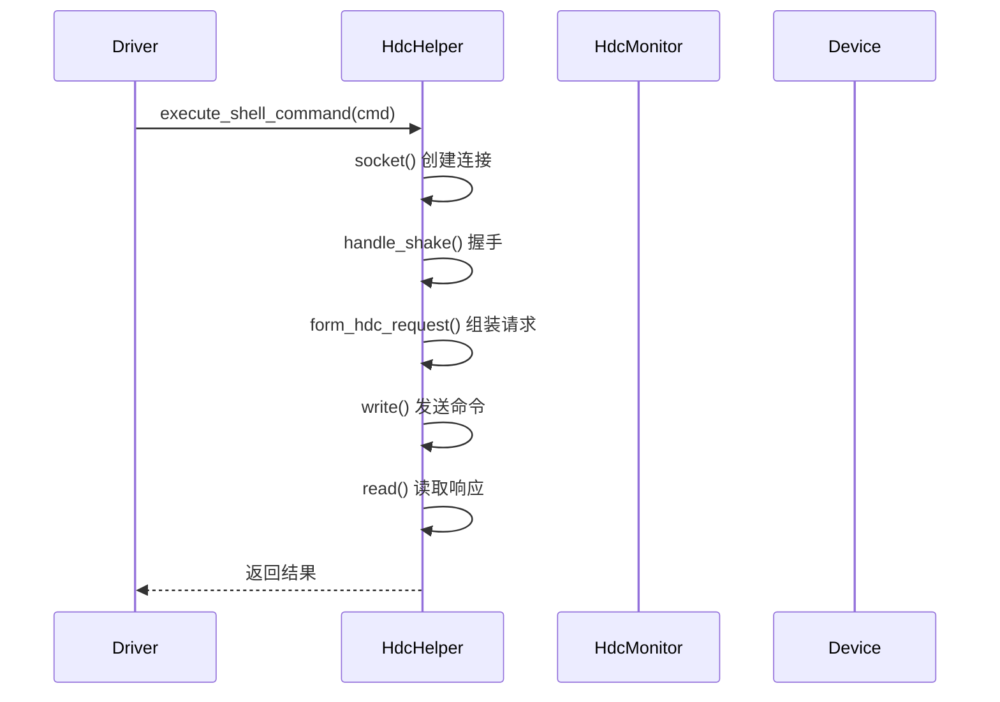

# XDevice 架构说明

## 1. 系统架构概览

```
┌─────────────────────────────────────────────────────────────────────────────┐
│                          XDevice 测试框架架构                                │
├─────────────────────────────────────────────────────────────────────────────┤
│                                                                              │
│  ┌─────────────────────────────────────────────────────────────────────┐   │
│  │                        用户交互层                                      │   │
│  │    ┌─────────┐  ┌─────────┐  ┌─────────┐  ┌─────────┐              │   │
│  │    │ run.sh  │  │ run.bat │  │ CLI命令 │  │  API   │              │   │
│  │    └─────────┘  └─────────┘  └─────────┘  └─────────┘              │   │
│  └─────────────────────────────────────────────────────────────────────┘   │
│                                    │                                          │
│                                    ▼                                          │
│  ┌─────────────────────────────────────────────────────────────────────┐   │
│  │                       命令解析层 (Console)                            │   │
│  │    • argument_parser() - argparse 参数解析                            │   │
│  │    • command_parser() - 命令分发处理                                 │   │
│  │    • SplicingAction - 多值参数处理                                  │   │
│  └─────────────────────────────────────────────────────────────────────┘   │
│                                    │                                          │
│                                    ▼                                          │
│  ┌─────────────────────────────────────────────────────────────────────┐   │
│  │                      任务调度层 (Scheduler)                           │   │
│  │    ┌─────────────┐  ┌─────────────┐  ┌─────────────┐                │   │
│  │    │ 发现测试    │  │ 分配设备    │  │ 执行调度    │                │   │
│  │    │ __discover__│  │ __allocate__│  │ __execute__ │                │   │
│  │    └─────────────┘  └─────────────┘  └─────────────┘                │   │
│  └─────────────────────────────────────────────────────────────────────┘   │
│                                    │                                          │
│         ┌──────────────────────────┼──────────────────────────┐            │
│         ▼                          ▼                          ▼            │
│  ┌─────────────┐          ┌─────────────┐          ┌─────────────┐      │
│  │  驱动执行层  │          │  设备管理层  │          │  报告生成层  │      │
│  │ DriversThread│          │ Environment  │          │ ResultReporter│      │
│  │ ModuleThread │          │ Manager      │          │ SuiteReporter │      │
│  └─────────────┘          └─────────────┘          └─────────────┘      │
│         │                          │                          │            │
│         ▼                          ▼                          ▼            │
│  ┌─────────────────────────────────────────────────────────────────────┐   │
│  │                        通信适配层                                      │   │
│  │    ┌─────────┐  ┌─────────┐  ┌─────────┐  ┌─────────┐            │   │
│  │    │  HDC    │  │ pySerial│  │ Paramiko│  │  Shell  │            │   │
│  │    │ 协议    │  │  串口   │  │  SSH   │  │  命令   │            │   │
│  │    └─────────┘  └─────────┘  └─────────┘  └─────────┘            │   │
│  └─────────────────────────────────────────────────────────────────────┘   │
│                                    │                                          │
│                                    ▼                                          │
│  ┌─────────────────────────────────────────────────────────────────────┐   │
│  │                        设备层                                        │   │
│  │    ┌─────────┐  ┌─────────┐  ┌─────────┐  ┌─────────┐            │   │
│  │    │ 标准设备 │  │ Lite设备 │  │ NFS服务器│  │ 远程设备 │            │   │
│  │    │(OHOS)   │  │(WiFiIoT)│  │(SFTP)   │  │(Telnet) │            │   │
│  │    └─────────┘  └─────────┘  └─────────┘  └─────────┘            │   │
│  └─────────────────────────────────────────────────────────────────────┘   │
│                                                                              │
└─────────────────────────────────────────────────────────────────────────────┘
```

---

## 2. 核心组件图

### 2.1 命令与调度组件

```
┌─────────────────────────────────────────────────────────────────┐
│                         Console (command)                         │
│                  单例模式，主控制台入口                            │
└─────────────────────────────────────────────────────────────────┘
                              │
                              │ get_plugin(Plugin.SCHEDULER)
                              ▼
┌─────────────────────────────────────────────────────────────────┐
│                         Scheduler (executor)                      │
│              @Plugin(type=Plugin.SCHEDULER) 注册                  │
├─────────────────────────────────────────────────────────────────┤
│  ┌─────────────────┐  ┌─────────────────┐  ┌─────────────────┐   │
│  │ Task            │  │ Concurrent      │  │ Request         │   │
│  │ 任务描述符树     │  │ 并发控制器      │  │ 执行请求对象     │   │
│  └─────────────────┘  └─────────────────┘  └─────────────────┘   │
│                                                                 │
│  ┌─────────────────┐  ┌─────────────────┐                       │
│  │ DriversThread   │  │ ModuleThread    │                       │
│  │ 设备测试线程     │  │ 模块级线程       │                       │
│  └─────────────────┘  └─────────────────┘                       │
└─────────────────────────────────────────────────────────────────┘
                              │
              ┌───────────────┼───────────────┐
              ▼               ▼               ▼
┌─────────────────┐ ┌─────────────────┐ ┌─────────────────┐
│   IDriver       │ │   IDevice       │ │   IListener     │
│   测试驱动接口    │ │   设备接口       │ │   监听器接口     │
└─────────────────┘ └─────────────────┘ └─────────────────┘
```

### 2.2 设备管理组件

```
┌─────────────────────────────────────────────────────────────────┐
│                    EnvironmentManager (environment)               │
│                       环境管理器                                  │
├─────────────────────────────────────────────────────────────────┤
│  ┌─────────────────┐  ┌─────────────────┐                       │
│  │ DeviceSelection │  │ DeviceSelector  │                       │
│  │ Option         │  │ 设备选择器       │                       │
│  └─────────────────┘  └─────────────────┘                       │
└─────────────────────────────────────────────────────────────────┘
                              │
                              │ 设备发现
                              ▼
┌─────────────────────────────────────────────────────────────────┐
│                         EnvPool                                  │
│                    设备连接池                                    │
├─────────────────────────────────────────────────────────────────┤
│  ┌─────────────────┐  ┌─────────────────┐  ┌─────────────────┐   │
│  │ DeviceNode      │  │ DeviceState     │  │ HdcMonitor      │   │
│  │ 设备节点        │  │ 设备状态枚举     │  │ HDC 监控器      │   │
│  └─────────────────┘  └─────────────────┘  └─────────────────┘   │
└─────────────────────────────────────────────────────────────────┘
                              │
              ┌───────────────┼───────────────┐
              ▼               ▼               ▼
┌─────────────────┐ ┌─────────────────┐ ┌─────────────────┐
│   HdcHelper     │ │   ComController │ │   RemoteControl │
│   HDC 命令助手   │ │   串口控制器     │ │   远程控制器     │
└─────────────────┘ └─────────────────┘ └─────────────────┘
```

---

## 3. 数据流分析

### 3.1 测试执行数据流

```
┌──────────┐    ┌──────────┐    ┌──────────┐    ┌──────────┐
│  用户输入  │───►│ 参数解析  │───►│ 任务发现 │───►│ 设备分配 │
│ run命令   │    │ argparse │    │ Descriptor│    │ EnvPool  │
└──────────┘    └──────────┘    └──────────┘    └──────────┘
                                                      │
                                                      ▼
┌──────────┐    ┌──────────┐    ┌──────────┐    ┌──────────┐
│ 生成报告  │◄───│ 结果收集 │◄───│ 驱动执行 │◄───│ 创建线程 │
│ HTML/XML │    │ Queue    │    │ Driver   │    │ Thread   │
└──────────┘    └──────────┘    └──────────┘    └──────────┘
                                                      │
                                                      ▼
                                               ┌──────────┐
                                               │ 设备通信  │
                                               │ HDC/Serial│
                                               └──────────┘
```

### 3.2 核心数据对象

| 对象 | 类型 | 说明 |
|------|------|------|
| `Task` | 任务描述符 | 包含测试套件、测试用例、设备配置等信息 |
| `Request` | 执行请求 | 传递给驱动的执行参数 |
| `Descriptor` | 树形结构 | 测试用例的层级描述 |
| `DeviceNode` | 设备节点 | 设备连接信息和状态 |
| `CaseResult` | 结果枚举 | PASSED/FAILED/BLOCKED/IGNORED |
| `SuiteResult` | 套件结果 | 包含多个 CaseResult |

---

## 4. 线程/并发模型

### 4.1 线程架构

```
┌─────────────────────────────────────────────────────────────────────────┐
│                           主线程 (Main Thread)                          │
│                    Console.main_loop() - 用户交互主循环                    │
└─────────────────────────────────────────────────────────────────────────┘
                                    │
                                    ▼
┌─────────────────────────────────────────────────────────────────────────┐
│                     Scheduler 执行线程                                   │
│              Scheduler._do_execute_() - 任务调度执行                      │
└─────────────────────────────────────────────────────────────────────────┘
                                    │
                    ┌───────────────┴───────────────┐
                    ▼                               ▼
        ┌───────────────────┐           ┌───────────────────┐
        │ QueueMonitorThread │           │  任务线程池         │
        │ (守护线程)          │           │  DriversThread    │
        │ • 监控结果队列      │           │  ModuleThread    │
        │ • 收集执行结果      │           └───────────────────┘
        └────────┬──────────┘                    │
                 │                               │
                 │    ┌──────────┬──────────┬──┴──┬──────────┐
                 │    ▼          ▼          ▼          ▼
                 │ ┌──────┐  ┌──────┐  ┌──────┐  ┌──────┐
                 │ │Thread│  │Thread│  │Thread│  │Thread│
                 │ │  #1  │  │  #2  │  │  #3  │  │  #N  │
                 │ └──┬───┘  └──┬───┘  └──┬───┘  └──┬───┘
                 │    │         │         │         │
                 │    ▼         ▼         ▼         ▼
                 │ ┌─────────────────────────────────────────────┐
                 │ │              设备通信线程                     │
                 │ │   HdcHelper / ComController / SSHClient      │
                 │ └─────────────────────────────────────────────┘
                 │
                 ▼
        ┌─────────────────────────────────────────────────────────────────┐
        │                       结果处理                                     │
        │              ReportListener.on_test_ended()                     │
        └─────────────────────────────────────────────────────────────────┘
```

### 4.2 并发控制机制

| 机制 | 用途 | 实现 |
|------|------|------|
| `max_driver_threads_size()` | 最大并发线程数 | 从配置读取，默认 5 |
| `threading.Lock()` | 线程同步 | ModuleThread 保护共享数据 |
| `queue.Queue()` | 结果传递 | 生产者-消费者模式 |
| `threading.Thread()` | 线程创建 | DriversThread / ModuleThread |
| `threading.Thread(daemon=True)` | 守护线程 | QueueMonitorThread |

---

## 5. 关键调用时序

### 5.1 测试执行时序图

```mermaid
sequenceDiagram
    participant User as 用户
    participant Console as Console
    participant Scheduler as Scheduler
    participant DriverThread as DriversThread
    participant Driver as IDriver
    participant Device as IDevice
    participant Reporter as ResultReporter

    User->>Console: run acts -l module1;module2
    Console->>Scheduler: get_plugin(SCHEDULER)
    Scheduler->>Scheduler: _do_execute_(task)
    Scheduler->>Scheduler: __discover__() 发现测试
    Scheduler->>EnvironmentManager: __allocate_environment__()
    EnvironmentManager->>EnvPool: 申请设备
    EnvPool-->>Scheduler: 返回 DeviceNode
    
    loop 设备数
        Scheduler->>DriverThread: run_dynamic_concurrent()
        DriverThread->>Driver: __execute__(request)
        Driver->>Device: execute_shell_command()
        Device-->>Driver: 返回结果
        Driver-->>DriverThread: 返回 XML 路径
        DriverThread->>DriverThread: put_result_queue()
    end
    
    DriverThread->>Reporter: __ended__(LifeCycle.TestTask)
    Reporter->>Reporter: __generate_reports__()
    Reporter-->>User: 生成 HTML/XML 报告
```

### 5.2 设备连接时序图



---

## 6. 插件系统架构

### 6.1 插件注册机制

```
┌─────────────────────────────────────────────────────────────────┐
│                    插件注册与加载架构                              │
├─────────────────────────────────────────────────────────────────┤
│                                                                 │
│  ┌─────────────────┐  ┌─────────────────┐  ┌─────────────────┐   │
│  │ @Plugin 装饰器  │  │ setup.py        │  │ __init__.py     │   │
│  │ (定义插件元数据) │  │ (entry_points)  │  │ (加载入口点)    │   │
│  └────────┬────────┘  └────────┬────────┘  └────────┬────────┘   │
│           │                    │                    │              │
│           └────────────────────┼────────────────────┘              │
│                                ▼                                  │
│                    ┌─────────────────────┐                        │
│                    │  Plugin Registry    │                        │
│                    │   插件注册表         │                        │
│                    │  • type            │                        │
│                    │  • id              │                        │
│                    │  • class           │                        │
│                    └─────────────────────┘                        │
│                                │                                  │
│                                ▼                                  │
│                    ┌─────────────────────┐                        │
│                    │ get_plugin()        │                        │
│                    │  动态加载插件        │                        │
│                    └─────────────────────┘                        │
│                                                                 │
└─────────────────────────────────────────────────────────────────┘
```

### 6.2 插件类型映射

| 插件类型 | 接口基类 | 标识符 | 常见实现 |
|---------|---------|--------|---------|
| SCHEDULER | IScheduler | "scheduler" | Scheduler |
| DRIVER | IDriver | 见 DeviceTestType | CppTestDriver, JSUnitDriver |
| DEVICE | IDevice | 见 DeviceOsType | Device, DeviceLite |
| MANAGER | IDeviceManager | 见 ManagerType | DeviceManager, LiteDeviceManager |
| PARSER | IParser | 见 CommonParserType | CppParser, JSUnitParser |
| LISTENER | IListener | 见 ListenerType | ReportListener, LogListener |
| TEST_KIT | ITestKit | 见 CKit | PermissionKit, ShellKit |
| REPORTER | IReporter | - | ResultReporter |
| LOG | - | - | 日志处理器 |

---

## 7. 分布式集群架构

### 7.1 集群角色

```
┌─────────────────────────────────────────────────────────────────────────┐
│                           集群架构                                       │
├─────────────────────────────────────────────────────────────────────────┤
│                                                                         │
│   ┌─────────────────┐                    ┌─────────────────┐           │
│   │   Controller    │  HTTP API         │     Worker      │           │
│   │   (主节点)      │ ◄──────────────► │     (工作节点)   │           │
│   │                 │                  │                 │           │
│   │  • TaskHandler  │                  │  • TaskManager  │           │
│   │  • BlockHandler│                  │  • WorkerRunner │           │
│   │  • DeviceMatcher│                  │  • SubProcess   │           │
│   └────────┬────────┘                  └────────┬────────┘           │
│            │                                      │                    │
│            │         ┌─────────────────┐          │                    │
│            └────────►│   SQLModel DB   │◄─────────┘                    │
│                      │   (状态存储)     │                               │
│                      └─────────────────┘                               │
│                                                                         │
└─────────────────────────────────────────────────────────────────────────┘
```

### 7.2 集群数据流

```
Controller                                      Worker
   │                                              │
   ├──► TaskHandler.run()                         │
   │      ├── prepare_project()                   │
   │      ├── _classify_testcase_by_environment() │
   │      └── _split_test_block() ───► DB         │
   │                                              │
   ├──► BlockHandler.run()                        │
   │      ├── _traverse_waiting_blocks()          │
   │      ├── _is_device_matched()                │
   │      └── send_worker_task() ────HTTP───────► │
   │                                              │
   │                                              ├──► TaskManager       │
   │                                              │      ├── loop_task_queue()
   │                                              │      └── handle_task_create()
   │                                              │             │
   │                                              │             ▼
   │                                              │      WorkerRunner.run()
   │                                              │             │
   │                                              │             ▼
   │                                              │      执行测试命令
   │                                              │             │
   │                                              │             ▼
   │                                              │      上传结果 ──HTTP──►
   │                                              │
   ◄─────── HTTP 回调 ────────────────────────────┘
          更新 TestBlock 状态
```

---

## 相关文档

- [模块详情](03_Modules.md)
- [配置说明](05_Configuration.md)
- [使用指南](07_Usage.md)
