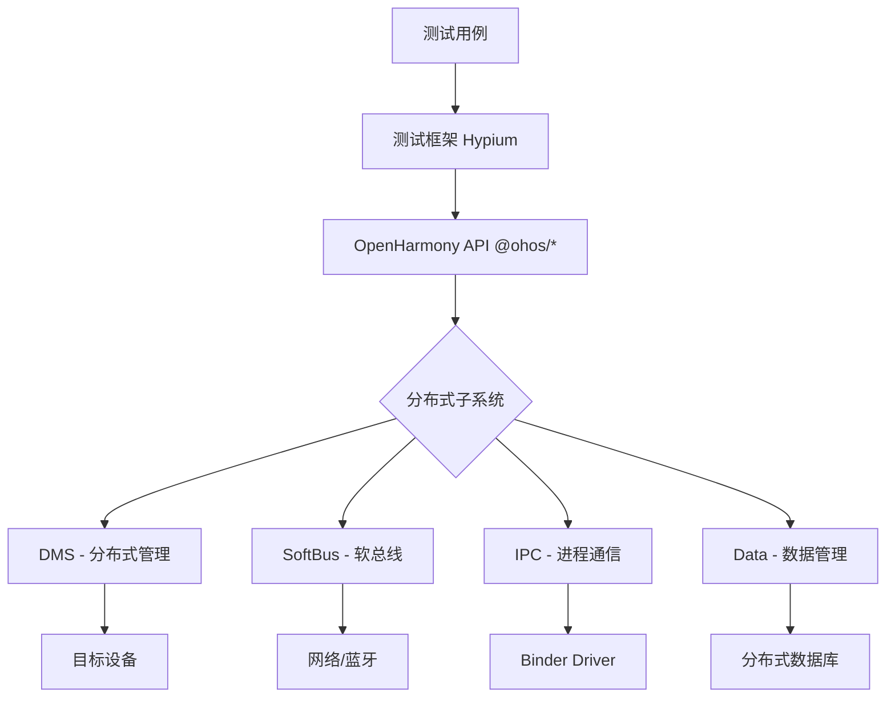
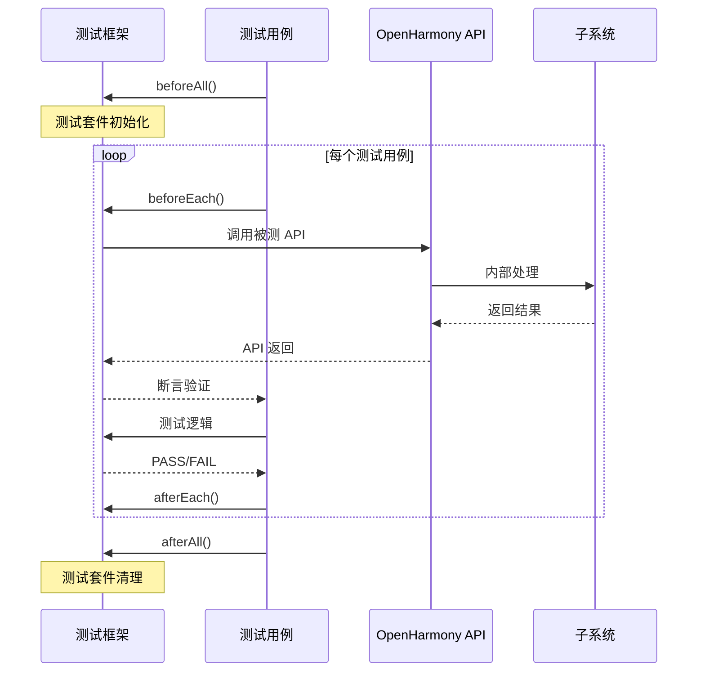
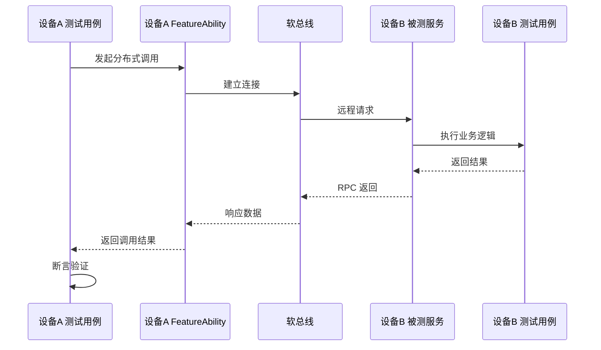

# DCTS 架构设计

## 整体架构

### 架构分层

```
┌─────────────────────────────────────────────────────────┐
│                    测试应用层 (Test Apps)                │
│  ┌───────────┐ ┌───────────┐ ┌───────────┐ ┌─────────┐  │
│  │ ability   │ │  comm     │ │  dhmgr    │ │ media   │  │
│  │   test    │ │   test    │ │   test    │ │  test   │  │
│  └───────────┘ └───────────┘ └───────────┘ └─────────┘  │
├─────────────────────────────────────────────────────────┤
│                   测试框架层 (Test Framework)             │
│  ┌─────────────────────────────────────────────────┐    │
│  │           Hypium / HCPPTest / HCTest            │    │
│  │    (测试用例定义、执行、断言、报告生成)            │    │
│  └─────────────────────────────────────────────────┘    │
├─────────────────────────────────────────────────────────┤
│                   OpenHarmony 系统 API 层                │
│  ┌─────────┐ ┌─────────┐ ┌─────────┐ ┌─────────────┐   │
│  │ @ohos   │ │ @ohos   │ │ @ohos   │ │ @ohos.data  │   │
│  │ ability │ │ rpc     │ │ dms     │ │ *           │   │
│  └─────────┘ └─────────┘ └─────────┘ └─────────────┘   │
├─────────────────────────────────────────────────────────┤
│              OpenHarmony 分布式子系统                     │
│  ┌─────────┐ ┌─────────┐ ┌─────────┐ ┌─────────────┐   │
│  │ DMS     │ │ SoftBus │ │ IPC     │ │ Data       │   │
│  └─────────┘ └─────────┘ └─────────┘ └─────────────┘   │
└─────────────────────────────────────────────────────────┘
```

### 关键组件

| 组件 | 描述 | 位置 |
|------|------|------|
| **测试用例** | 验证特定 API 功能的测试代码 | `*/entry/src/ohosTest/` |
| **测试服务** | 提供测试辅助服务 | `*/entry/src/main/ets/serviceability/` |
| **测试工具** | 通用测试组件 | `testtools/` |
| **公共模块** | 共享内存等公共功能 | `common/` |

## 数据流

### 典型测试数据流



### 测试交互模式

#### 1. 单设备测试

```
┌──────────────┐
│  测试用例     │
└──────┬───────┘
       │
       ▼
┌──────────────┐
│  OpenHarmony │
│  System API  │
└──────┬───────┘
       │
       ▼
┌──────────────┐
│  本地子系统   │
└──────────────┘
```

#### 2. 跨设备测试

```
┌──────────────┐      软总线       ┌──────────────┐
│  设备 A       │◄──────────────►│  设备 B      │
│  测试用例     │                │  被测 API    │
└──────┬───────┘                └──────────────┘
       │
       ▼
┌──────────────┐
│  OpenHarmony │
│  System API  │
└──────────────┘
```

## 线程模型

### 测试执行线程

| 线程类型 | 描述 | 生命周期 |
|----------|------|----------|
| **主线程** | UI 线程，负责界面渲染 | 应用生命周期 |
| **测试线程** | 执行测试用例 | 单个测试用例 |
| **Worker 线程** | 后台任务 | 需要时创建 |

### 分布式测试线程

```
┌─────────────────────────────┐
│       设备 A (测试发起)      │
│  ┌─────────────────────────┐│
│  │     主线程 (UI)          ││
│  │  ┌─────────────────────┐││
│  │  │   测试执行器          │││
│  │  └─────────────────────┘││
│  └─────────────────────────┘│
└─────────────────────────────┘
           │ 软总线
           ▼
┌─────────────────────────────┐
│       设备 B (测试目标)      │
│  ┌─────────────────────────┐│
│  │     远程服务             ││
│  │  ┌─────────────────────┐││
│  │  │   被测 API          │││
│  │  └─────────────────────┘││
│  └─────────────────────────┘│
└─────────────────────────────┘
```

## 关键时序

### 测试用例执行时序



### 分布式测试时序



## 资源生命周期

### 测试模块生命周期

```
┌─────────┐
│  init   │  ← 模块初始化
└────┬────┘
     │
     ▼
┌─────────┐
│ create  │  ← 创建测试环境
└────┬────┘
     │
     ▼
┌─────────┐
│ execute │  ← 执行测试用例
└────┬────┘
     │
     ▼
┌─────────┐
│ destroy │  ← 清理资源
└─────────┘
```

## 相关文档

- [项目概览](01_Overview.md)
- [目录结构](02_Directory_Structure.md)
- [模块详解](04_Modules.md)
- [构建系统](05_Build_System.md)
- [测试框架](appendix/Test_Frameworks.md)
