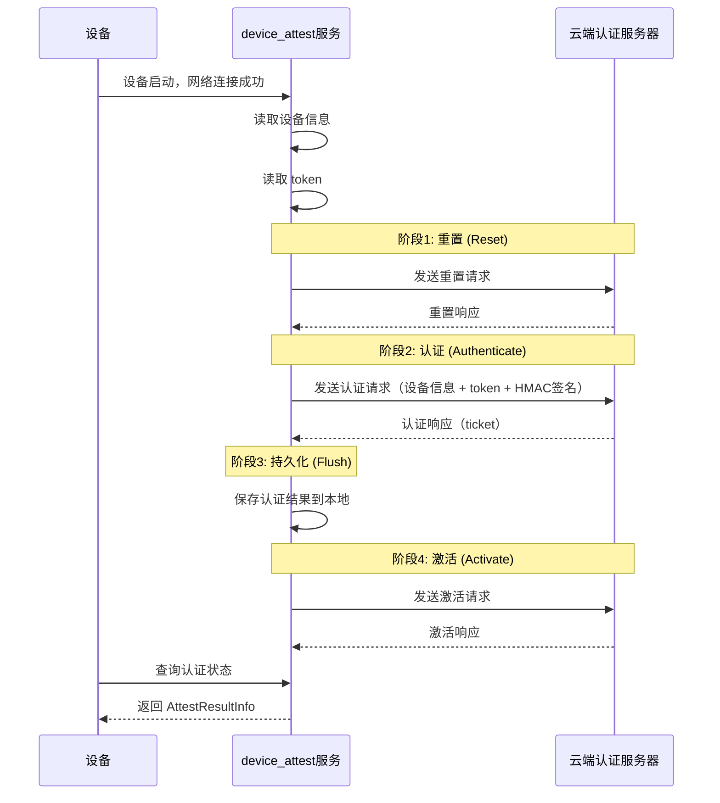

# 01 - 项目定位与关键概念

## 目的与适用范围

**本文档目的**：帮助读者理解 `device_attest` 模块的业务定位、运行环境和核心概念。

**适用范围**：
- OpenHarmony 系统开发者
- 设备厂商集成人员
- 安全审计人员

## 项目定位

### 业务背景

`device_attest`（设备认证模块）是 OpenHarmony XTS（eXtended Test Suite）子系统的核心组件，主要目标是：

> **统计 OpenHarmony 生态设备数量，通过云端上报终端数据实现生态设备计数。**

### 核心职责

1. **设备身份认证**
   - 与 OpenHarmony 兼容性平台云端服务器通信
   - 验证设备合法性（硬件信息 + 软件信息）
   - 获取设备凭证（ticket）

2. **认证状态管理**
   - 维护设备硬件认证结果
   - 维护设备软件认证结果
   - 持久化存储认证状态

3. **查询服务**
   - 对外提供查询接口（JS/C++）
   - 供系统应用获取认证结果

### 运行环境

| 环境项 | 要求 |
|--------|------|
| 系统类型 | 标准系统 (standard) |
| 启动时机 | 设备启动后自动运行 |
| 触发条件 | 网络连接成功后开始认证流程 |
| 进程名 | `devattest_service` |
| SA ID | 5501 |

## 关键概念

### 术语表

| 术语 | 英文 | 说明 | 来源 |
|------|------|------|------|
| 合作伙伴 | Partner | 申请 OpenHarmony 兼容性评估的企业 | 兼容性平台 |
| 厂商密钥 | manuKey | 从兼容性平台获取的密钥，用于加密产品数据 | 兼容性平台分配 |
| 产品标识 | productId | 平台分配的唯一产品标识符 | 兼容性平台分配 |
| 产品密钥 | productKey | 平台分配的产品密钥（预留） | 兼容性平台分配 |
| 设备凭证 | token | 每台设备的唯一凭证，存储在安全分区 | 兼容性平台分配 |
| 版本 ID | versionId | 由设备信息组合生成的唯一标识 | 系统自动生成 |

### 关键数据结构

#### AttestResultInfo（认证结果信息）

**定义位置**: `interfaces/innerkits/native_cpp/include/attest_result_info.h`

```cpp
class AttestResultInfo : public Parcelable {
public:
    int32_t authResult_;                    // 硬件认证结果
    int32_t softwareResult_;                // 软件认证结果
    std::vector<int32_t> softwareResultDetail_;  // 软件详情结果数组
    std::string ticket_;                    // 云端下发的凭证
    int32_t ticketLength_;                  // 凭证长度
};
```

**字段说明**:

| 字段 | 类型 | 说明 | 取值 |
|------|------|------|------|
| authResult | number | 硬件信息认证结果 | 0:未认证 1:通过 2:失败 |
| softwareResult | number | 软件信息认证结果 | 0:未认证 1:通过 2:失败 |
| softwareResultDetail | number[] | 软件详情结果 | [versionId, patchLevel, rootHash, pcid, reserve] |
| ticket | string | 云端下发的凭证 | 加密字符串 |

#### 软件详情结果索引

```cpp
// ATTEST_RESULT_AUTH = 0       // 硬件认证结果
// ATTEST_RESULT_SOFTWARE = 1   // 软件认证结果
// ATTEST_RESULT_VERSIONID = 2  // 版本ID认证结果
// ATTEST_RESULT_PATCHLEVEL = 3 // 安全补丁认证结果
// ATTEST_RESULT_ROOTHASH = 4   // 根哈希认证结果
// ATTEST_RESULT_PCID = 5       // PCID认证结果
// ATTEST_RESULT_RESERVE = 6    // 预留
```

## 集成要求

### 设备信息配置

设备需要在启动参数中配置以下信息（路径：`base/startup/init/services/etc/param/`）：

**OS 信息** (`ohos_const/ohos.para`):
```
const.ohos.releasetype=Beta
const.ohos.apiversion=6
const.ohos.version.security_patch=2021-09-01
const.ohos.fullname=OpenHarmony-1.0.1.0
const.ohos.buildroothash=default
```

**产品信息** (`ohos.para`):
```
const.product.manufacturer=YOUR_MANUFACTURER
const.product.brand=YOUR_BRAND
const.product.model=YOUR_MODEL
const.product.software.version=YOUR_VERSION
```

### OEM 适配接口

设备厂商需要实现以下 HAL 接口（见 `services/oem_adapter/include/device_attest_oem_adapter.h`）:

| 接口 | 功能 | 返回值 |
|------|------|--------|
| `HalGetManufactureKey()` | 读取厂商密钥 | 0:成功 -1:失败 |
| `HalGetProdId()` | 读取产品 ID | 0:成功 -1:失败 |
| `HalReadToken()` | 读取设备 token | 0:成功 -1:失败 |
| `HalWriteToken()` | 写入设备 token | 0:成功 -1:失败 |

### 版本 ID 生成

版本 ID 由以下字段组合生成：

```
VersionId = deviceType/manufacture/brand/productSeries/OSFullName/productModel/softwareModel/OHOS_SDK_API_VERSION/incrementalVersion/buildType
```

**获取方式**：
1. 完成设备信息配置
2. 烧录设备
3. 查看系统日志获取生成的版本 ID
4. 将版本 ID 填入兼容性平台

## 认证流程概览

### 四阶段认证流程

`device_attest` 服务采用四阶段认证流程（证据: `services/core/attest/attest_service.c:274-326`）：

```
┌─────────────────────────────────────────────────────────────────────┐
│                        阶段 1：设备重置 (Reset)                      │
├─────────────────────────────────────────────────────────────────────┤
│  目标：与云端同步设备状态，清除旧凭证                                  │
│  输入：设备挑战值 (Challenge)                                         │
│  输出：重置结果响应                                                   │
│  步骤：                                                               │
│    1. GetChallenge() - 从云端获取挑战值                               │
│    2. GenResetMsg() - 生成重置请求消息                                │
│    3. SendResetMsg() - 发送重置请求到云端                            │
│    4. ParseResetResult() - 解析重置响应                              │
└─────────────────────────────────────────────────────────────────────┘
                              │
                              ▼
┌─────────────────────────────────────────────────────────────────────┐
│                      阶段 2：设备认证 (Authenticate)                 │
├─────────────────────────────────────────────────────────────────────┤
│  目标：验证设备合法性，获取认证结果                                    │
│  输入：设备信息 + Token + 挑战值                                      │
│  输出：认证结果 + Ticket                                             │
│  步骤：                                                               │
│    1. GetChallenge() - 获取新挑战值                                   │
│    2. GenAuthMsg() - 生成认证请求消息（含设备信息签名）               │
│    3. SendAuthMsg() - 发送认证请求                                   │
│    4. ParseAuthResultResp() - 解析认证响应                           │
│  安全：使用 HMAC-SHA256 对 Token 进行签名                            │
└─────────────────────────────────────────────────────────────────────┘
                              │
                              ▼
┌─────────────────────────────────────────────────────────────────────┐
│                      阶段 3：结果持久化 (Flush)                      │
├─────────────────────────────────────────────────────────────────────┤
│  目标：保存认证结果到本地存储                                          │
│  输入：认证状态 + Ticket                                              │
│  输出：更新本地认证状态缓存                                            │
│  步骤：                                                               │
│    1. SaveAuthResult() - 持久化认证状态                              │
│    2. UpdateTicket() - 更新 Ticket 缓存                              │
│    3. SetSystemParameter() - 更新系统参数供查询                      │
│  存储：A/B 双文件冗余存储，版本标记防回滚                            │
└─────────────────────────────────────────────────────────────────────┘
                              │
                              ▼
┌─────────────────────────────────────────────────────────────────────┐
│                      阶段 4：凭证激活 (Activate)                     │
├─────────────────────────────────────────────────────────────────────┤
│  目标：激活云端下发的凭证                                             │
│  输入：Ticket + 设备挑战值                                            │
│  输出：激活结果响应                                                   │
│  步骤：                                                               │
│    1. FlushToken() - 刷新 Token 到安全存储                           │
│    2. GetChallenge() - 获取最终挑战值                                │
│    3. GenActiveMsg() - 生成激活请求消息                              │
│    4. SendActiveMsg() - 发送激活请求                                 │
│    5. ParseActiveResult() - 解析激活响应                             │
└─────────────────────────────────────────────────────────────────────┘
```

### 简化时序图



## 信任边界

```
┌─────────────────────────────────────────────────────────────┐
│                      设备安全分区                            │
│  ┌──────────┐  ┌──────────┐  ┌──────────┐                  │
│  │  manuKey │  │ productId│  │  token   │  （防回刷）      │
│  └──────────┘  └──────────┘  └──────────┘                  │
└─────────────────────────────────────────────────────────────┘
                              │
                              ▼
┌─────────────────────────────────────────────────────────────┐
│                   device_attest 服务                        │
│  ┌──────────────┐  ┌──────────────┐  ┌──────────────┐      │
│  │   核心业务   │  │   安全模块   │  │   网络通信   │      │
│  └──────────────┘  └──────────────┘  └──────────────┘      │
└─────────────────────────────────────────────────────────────┘
                              │
                              ▼
┌─────────────────────────────────────────────────────────────┐
│                    云端认证服务器                            │
│              （OpenHarmony 兼容性平台）                      │
└─────────────────────────────────────────────────────────────┘
```

## 相关链接

- [架构说明](02_Architecture.md) - 深入了解系统架构
- [N-API 接口](03_NAPI.md) - 了解对外接口
- [安全评审](06_Security.md) - 了解安全设计
- [原始 README](../README.md) - 项目原始文档

---

**证据来源**：
- 模块定位：`README.md` 第 18-20 行
- 数据结构：`interfaces/innerkits/native_cpp/include/attest_result_info.h`
- OEM 接口：`services/oem_adapter/include/device_attest_oem_adapter.h`
- 依赖配置：`bundle.json`
