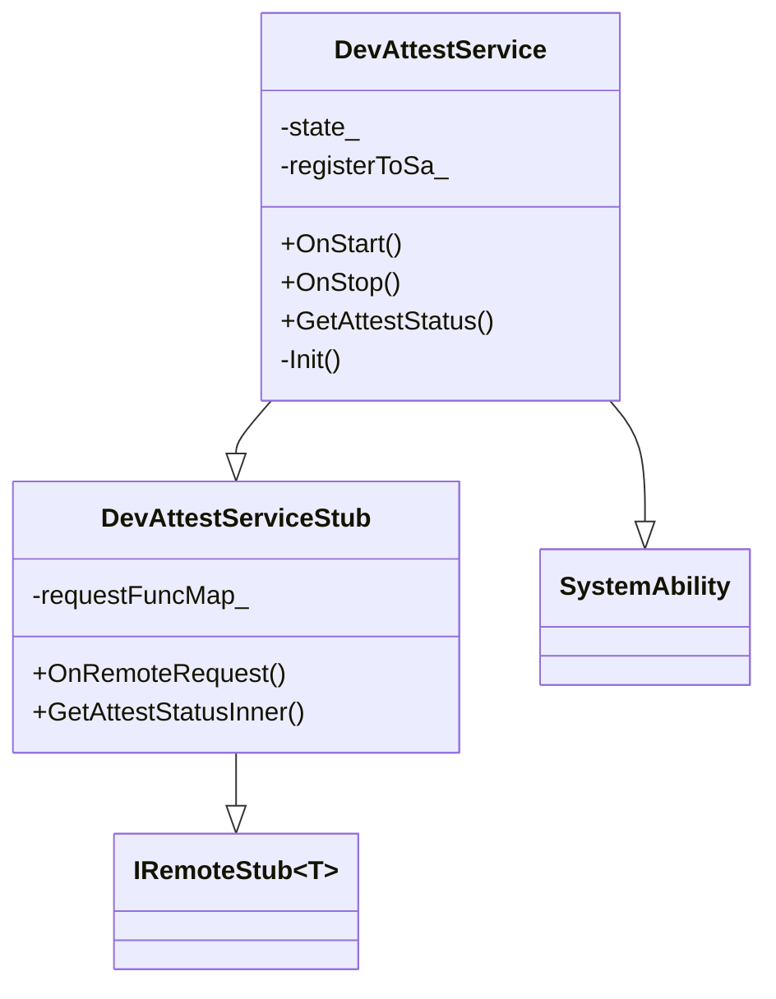
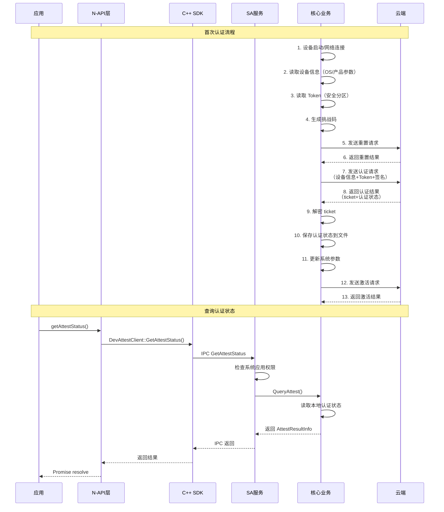
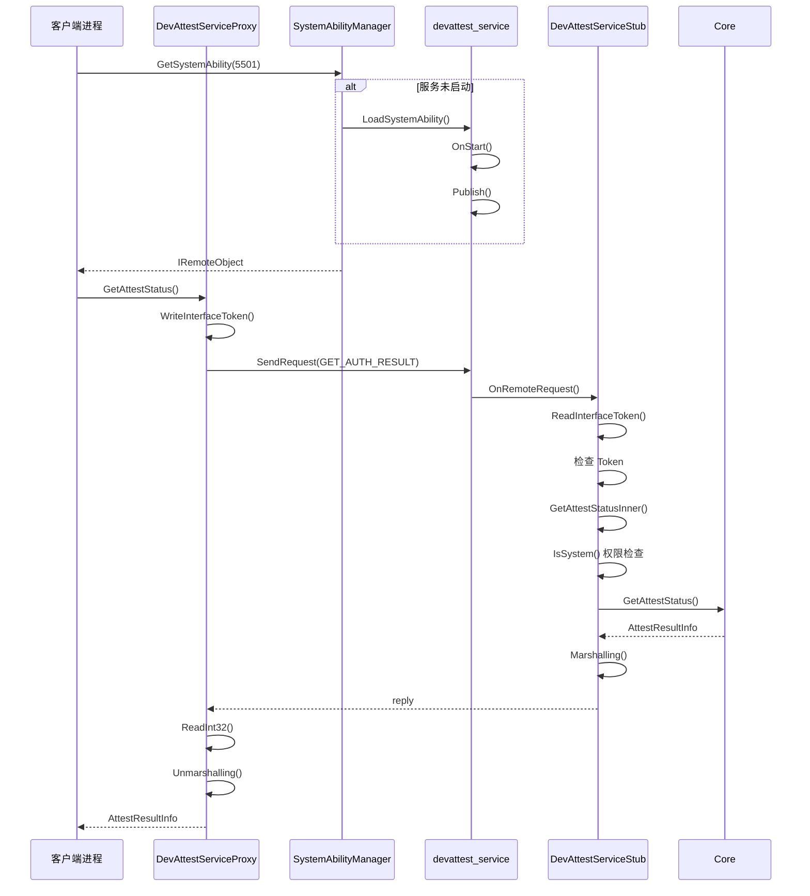
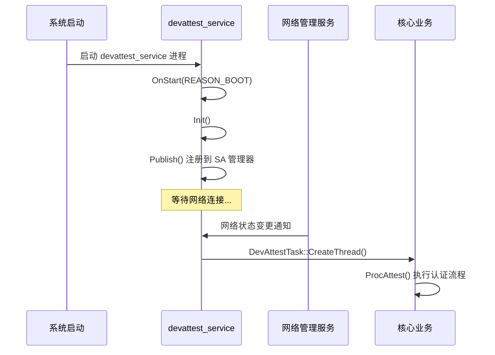
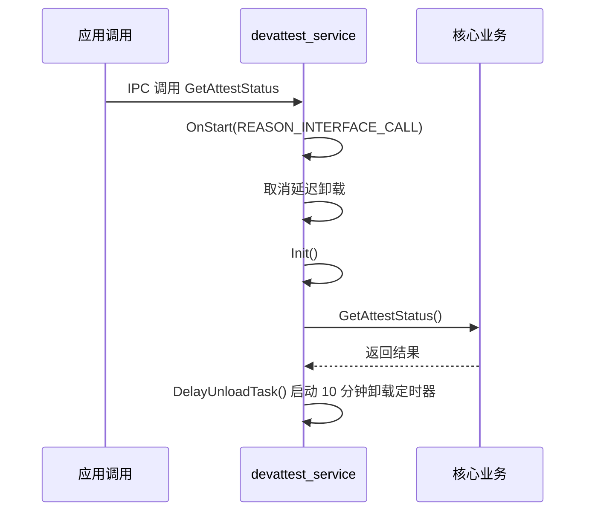
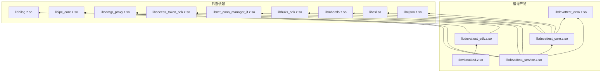

# 02 - 架构说明

## 目的与适用范围

**本文档目的**：帮助读者理解 `device_attest` 模块的系统架构、组件关系和数据流。

**适用范围**：
- 系统架构师
- 模块开发者
- 安全审计人员

## 组件架构图

```mermaid
graph TB
    subgraph 应用层
        JS[JS 应用]
        Native[Native 应用]
    end
    
    subgraph 接口层
        NAPI[deviceattest.z.so<br/>N-API接口]
        SDK[libdevattest_sdk.z.so<br/>C++ SDK]
    end
    
    subgraph 服务层
        SA[devattest_service<br/>System Ability]
        Stub[ServiceStub<br/>IPC Stub]
    end
    
    subgraph 核心层
        Core[libdevattest_core.z.so<br/>业务逻辑]
        Security[安全模块<br/>加密/解密]
        Network[网络模块<br/>HTTP/TLS]
        Adapter[适配层<br/>HAL/OS]
    end
    
    subgraph 外部依赖
        Cloud[云端认证服务器]
        HUKS[HUKS 密钥库]
        SysParam[系统参数服务]
        NetMgr[网络管理服务]
        TokenMgr[访问令牌服务]
    end
    
    JS -->|@ohos.deviceAttest| NAPI
    Native -->|devattest_client.h| SDK
    NAPI --> SDK
    SDK -->|IPC| SA
    SA --> Stub
    Stub --> Core
    Core --> Security
    Core --> Network
    Core --> Adapter
    Network --> Cloud
    Network --> NetMgr
    Security --> HUKS
    Adapter --> SysParam
    SA --> TokenMgr
```

## 模块职责

### 1. N-API 接口层 (`interfaces/kits/napi/`)

**职责**：提供 JavaScript 调用接口

**关键文件**：
- `src/devattest_napi.cpp` - N-API 实现
- `src/devattest_napi_error.cpp` - 错误码转换
- `include/devattest_napi.h` - 头文件
- `../js/@ohos.deviceAttest.d.ts` - TypeScript 定义

**导出接口**：
| 接口名 | 类型 | 说明 |
|--------|------|------|
| `getAttestStatus()` | Promise/Callback | 异步获取认证结果 |
| `getAttestStatusSync()` | Sync | 同步获取认证结果 |

**编译产物**：`deviceattest.z.so`（安装到 `/system/lib/module/`）

### 2. C++ SDK 层 (`interfaces/innerkits/native_cpp/`)

**职责**：提供 C++ 客户端接口，封装 IPC 通信

**关键文件**：
- `src/devattest_client.cpp` - 客户端实现
- `src/devattest_service_proxy.cpp` - IPC 代理
- `include/devattest_client.h` - 客户端头文件
- `include/devattest_interface.h` - 接口定义

**导出符号**：
| 类/函数 | 说明 |
|---------|------|
| `DevAttestClient::GetInstance()` | 单例客户端 |
| `DevAttestClient::GetAttestStatus()` | 获取认证状态 |
| `AttestResultInfo` | 结果数据结构 |

**编译产物**：`libdevattest_sdk.z.so`

### 3. Service Ability 层 (`services/devattest_ability/`)

**职责**：系统 Ability 实现，处理 IPC 请求

**关键文件**：
- `src/devattest_service.cpp` - 服务主类
- `src/devattest_service_stub.cpp` - IPC Stub 实现
- `include/devattest_service.h` - 服务头文件

**类关系**：


**SA 配置** (`services/sa_profile/devattest_service.json`):
```json
{
    "process": "devattest_service",
    "systemability": [{
        "name": 5501,
        "libpath": "libdevattest_service.z.so",
        "run-on-create": false
    }]
}
```

**编译产物**：`libdevattest_service.z.so`

### 4. 核心业务层 (`services/core/`)

**职责**：设备认证业务逻辑实现

**子模块**：

| 子目录 | 职责 | 关键文件 |
|--------|------|----------|
| `attest/` | 认证主流程 | `attest_service.c` - 主流程实现 |
| `security/` | 安全加密 | `attest_security.c` - 加密解密 |
| `network/` | 网络通信 | `attest_network.c` - HTTP 通信 |
| `adapter/` | 系统适配 | `attest_adapter*.c` - 系统接口适配 |
| `utils/` | 工具函数 | `attest_utils*.c` - 通用工具 |

**核心文件清单** (`services/core/`):
```
├── attest_entry.c        # C 入口：AttestTask(), QueryAttest()
├── attest/               # 认证业务逻辑
│   ├── attest_service.c           # 主流程 (AttestStartup)
│   ├── attest_service_auth.c      # 认证消息生成
│   ├── attest_service_challenge.c # 挑战值处理
│   ├── attest_service_active.c    # Token 激活
│   ├── attest_service_reset.c     # 设备重置
│   └── attest_service_device.c    # 设备信息管理
├── security/             # 安全模块
│   ├── attest_security.c          # AES/HKDF 加密
│   ├── attest_security_token.c    # Token 管理
│   └── attest_security_ticket.c  # Ticket 处理
├── network/              # 网络层
│   └── attest_network.c           # HTTPS 客户端
├── adapter/             # 适配层
│   ├── attest_adapter.c           # 通用适配
│   ├── attest_adapter_os.c        # OS 抽象
│   ├── attest_adapter_oem.c       # OEM 接口封装
│   ├── attest_adapter_hal.c       # HAL 接口
│   └── attest_adapter_mock.c      # Mock 实现
└── utils/               # 工具函数
    ├── attest_utils_json.c        # JSON 解析
    ├── attest_utils_file.c        # 文件操作
    ├── attest_utils_timer.c        # 定时器
    └── attest_utils_list.c        # 链表操作
```

**主流程** (`services/core/attest/attest_service.c:357-397`):
```c
int32_t ProcAttest(void) {
    pthread_mutex_lock(&g_mtxAttest);  // 全局锁
    do {
        if (ret == 0) {
            break;  // 认证已完成
        }
        ret = IsFullLoad();  // 检查负载限制
        if (ret != ATTEST_OK) {
            ATTEST_LOG_ERROR("[ProcAttest] Process stopped");
            break;
        }
        ret = InitNetworkServerInfo();  // 初始化网络配置
        if (ret != ATTEST_OK) {
            ATTEST_LOG_ERROR("[ProcAttest] InitNetworkServerInfo failed");
        }
        ret = ProcAttestImpl();  // 执行认证
        if (ret != ATTEST_OK) {
            ATTEST_LOG_ERROR("[ProcAttest] Proc Attest failed");
        }
    } while (0);
    pthread_mutex_unlock(&g_mtxAttest);
}
```

**认证流程** (`services/core/attest/attest_service.c:274-326`):
```c
static int32_t AttestStartup(AuthResult *authResult) {
    // 阶段1: 重置设备
    ret = ResetDevice();
    
    // 阶段2: 设备认证
    ret = AuthDevice(authResult);
    
    // 阶段3: 保存认证结果
    FlushAttestData(authResult->ticket, authResult->authStatus);
    
    // 阶段4: 激活 Token
    ret = ActiveToken(authResult);
}
```

**编译产物**：`libdevattest_core.z.so`

### 5. OEM 适配层 (`services/oem_adapter/`)

**职责**：屏蔽底层硬件差异，提供统一接口

**关键文件**：
```
services/oem_adapter/
├── include/
│   └── device_attest_oem_adapter.h  # OEM 接口定义
├── src/
│   ├── device_attest_oem_adapter.c  # OEM 实现模板
│   └── device_attest_oem_file.c     # 文件操作实现
└── BUILD.gn                          # 构建配置
```

**OEM 接口定义** (`services/oem_adapter/include/device_attest_oem_adapter.h`):
```c
// 厂商必须实现的接口
int32_t OEMGetManufacturekey(char* manufacturekey, uint32_t len);
int32_t OEMGetProductId(char* productId, uint32_t len);
int32_t OEMReadToken(char *token, uint32_t len);
int32_t OEMWriteToken(const char *token, uint32_t len);
```

**Token 存储路径** (`services/oem_adapter/src/device_attest_oem_adapter.c:30`):
```c
#define TOKEN_ADDR "/data/service/el1/public/device_attest"
```

**⚠️ 安全注意**: manuKey 硬编码示例需由厂商替换（证据: `device_attest_oem_adapter.c:188-221`）

**编译产物**：`libdevattest_oem.z.so`

## 数据流图

### 认证流程数据流



### IPC 调用链



## 线程模型

### 服务线程结构

```
devattest_service 进程
├── 主线程 (DevAttestService)
│   ├── OnStart() - 服务启动
│   ├── OnRemoteRequest() - IPC 请求处理
│   └── DelayUnloadTask() - 延迟卸载
│
├── 认证工作线程 (DevAttestTask)
│   └── CreateThread() - 执行认证流程
│       └── ProcAttest() - 主认证逻辑
│           ├── 设备信息收集
│           ├── 网络通信
│           └── 结果保存
│
└── 事件处理线程 (EventHandler)
    └── 卸载定时任务
```

### 线程安全

**关键锁** (`services/core/attest/attest_service.c:39`):
```c
pthread_mutex_t g_mtxAttest = PTHREAD_MUTEX_INITIALIZER;
```

- `ProcAttest()` - 全程持有互斥锁，确保认证流程串行执行
- `QueryAttestStatus()` - 查询时持有锁，防止数据竞争
- `g_authStatusMutex` - 保护认证结果码的读写

## 关键时序

### 服务启动时序



### IPC 调用时序



## 依赖关系

### 模块依赖图



## 相关链接

- [N-API 接口文档](03_NAPI.md) - 对外接口详情
- [内部 API 文档](04_Inner_API.md) - 模块间接口
- [GN 构建目标](05_GN_Targets.md) - 编译配置
- [附录：调用链](appendix/Callgraphs.md) - 详细调用链

---

**证据来源**：
- 架构图基于代码目录结构和 `README.md`
- IPC 机制：`services/devattest_ability/src/devattest_service_stub.cpp`
- 线程模型：`services/devattest_ability/src/devattest_task.cpp`
- SA 配置：`services/sa_profile/devattest_service.json`
