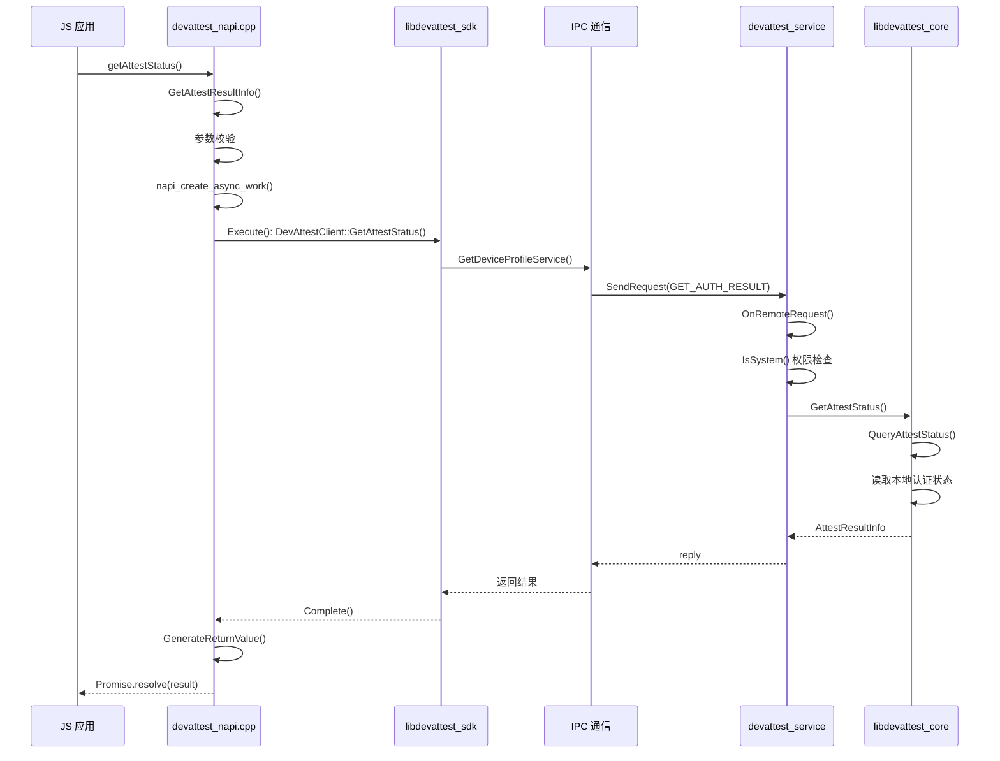

# 03 - N-API 接口文档

## 目的与适用范围

**本文档目的**：提供 `device_attest` 模块 N-API 接口的完整参考，包括 API 清单、参数说明、错误码和使用示例。

**适用范围**：
- 应用开发者（JS/TS）
- 安全审计人员
- 接口集成测试人员

## 接口概述

### 模块信息

| 属性 | 值 |
|------|-----|
| 模块名 | `@ohos.deviceAttest` |
| 系统能力 | `SystemCapability.XTS.DeviceAttest` |
| 适用系统 | standard |
| 权限要求 | System App（系统应用） |
| 导入方式 | `import deviceAttest from '@ohos.deviceAttest'` |

### 接口清单

| 接口名 | 返回类型 | 同步/异步 | 系统 API | 自版本 |
|--------|----------|-----------|----------|--------|
| `getAttestStatus(callback)` | `void` | 异步（Callback） | ✅ | 9 |
| `getAttestStatus()` | `Promise<AttestResultInfo>` | 异步（Promise） | ✅ | 9 |
| `getAttestStatusSync()` | `AttestResultInfo` | 同步 | ✅ | 9 |

## getAttestStatus 接口

### 函数签名

```typescript
// Callback 模式
function getAttestStatus(callback: AsyncCallback<AttestResultInfo>): void;

// Promise 模式
function getAttestStatus(): Promise<AttestResultInfo>;
```

### 功能说明

获取设备认证结果信息，包括硬件认证结果、软件认证结果和云端下发的 ticket。

### 参数说明

| 参数名 | 类型 | 必填 | 说明 |
|--------|------|------|------|
| `callback` | `AsyncCallback<AttestResultInfo>` | 否 | 异步回调函数，用于接收认证结果 |

### 返回值

**Promise 模式**：`Promise<AttestResultInfo>` - 异步返回认证结果

**Callback 模式**：`void` - 通过回调返回结果

### 错误码

| 错误码 | 值 | 说明 | 触发条件 |
|--------|-----|------|----------|
| 202 | `DEVATTEST_ERR_JS_IS_NOT_SYSTEM_APP` | 非系统应用 | 调用者不是系统应用 |
| 401 | `DEVATTEST_ERR_JS_PARAMETER_ERROR` | 参数错误 | 参数类型/数量错误 |
| 20000001 | `DEVATTEST_ERR_JS_SYSTEM_SERVICE_EXCEPTION` | 系统服务异常 | 服务内部错误 |

### 代码实现分析

**实现位置**: `interfaces/kits/napi/src/devattest_napi.cpp:141-189`

```cpp
napi_value DevAttestNapi::GetAttestResultInfo(napi_env env, napi_callback_info info) {
    // 1. 获取 JS 入参
    size_t argc = PARAM1;
    napi_value argv[1] = {0};
    napi_get_cb_info(env, info, &argc, argv, &thisVar, &data);
    
    // 2. 参数校验
    if (argc > PARAM1) {
        napi_throw(env, GenerateBusinessError(env, DEVATTEST_ERR_JS_PARAMETER_ERROR));
    }
    
    // 3. 判断调用模式（Callback/Promise）
    if (argc == PARAM1) {
        // Callback 模式
        napi_create_reference(env, argv[0], 1, &callback->callbackRef);
    } else {
        // Promise 模式
        napi_create_promise(env, &callback->deferred, &promise);
    }
    
    // 4. 创建异步任务
    napi_create_async_work(env, nullptr, resource, Execute, Complete, 
                           static_cast<void*>(callback.get()), &callback->work);
    napi_queue_async_work(env, callback->work);
}
```

**异步执行** (`Execute` 函数，`lines 95-108`):
```cpp
static void Execute(napi_env env, void* data) {
    DevAttestAsyncContext *asyncContext = static_cast<DevAttestAsyncContext*>(data);
    // 调用 C++ SDK 获取认证状态
    int32_t ret = DevAttestClient::GetInstance().GetAttestStatus(asyncContext->value);
    asyncContext->ret = ret;
}
```

**结果返回** (`Complete` 函数，`lines 111-137`):
```cpp
static void Complete(napi_env env, napi_status status, void* data) {
    // result[0] = error, result[1] = 返回值
    napi_value result[2] = {0};
    result[0] = GenerateBusinessError(env, callback->ret);
    result[1] = GenerateReturnValue(env, callback);
    
    if (callback->callbackRef != nullptr) {
        // Callback 模式：调用 JS 回调
        napi_call_function(env, nullptr, callbackfunc, 2, result, &returnValue);
    } else {
        // Promise 模式：resolve/reject
        if (callback->ret == DEVATTEST_SUCCESS) {
            napi_resolve_deferred(env, callback->deferred, result[1]);
        } else {
            napi_reject_deferred(env, callback->deferred, result[0]);
        }
    }
}
```

### 调用链



## getAttestStatusSync 接口

### 函数签名

```typescript
function getAttestStatusSync(): AttestResultInfo;
```

### 功能说明

同步获取设备认证结果信息。此接口会阻塞调用线程，直到获取结果或超时。

### 返回值

| 类型 | 说明 |
|------|------|
| `AttestResultInfo` | 设备认证结果信息 |

### 错误码

与 `getAttestStatus()` 相同。

### 代码实现分析

**实现位置**: `interfaces/kits/napi/src/devattest_napi.cpp:192-203`

```cpp
napi_value DevAttestNapi::GetAttestResultInfoSync(napi_env env, napi_callback_info info) {
    AttestResultInfo attestResultInfo;
    // 直接调用 C++ SDK（同步阻塞）
    int32_t errCode = DevAttestClient::GetInstance().GetAttestStatus(attestResultInfo);
    if (errCode != DEVATTEST_SUCCESS) {
        napi_throw(env, GenerateBusinessError(env, errCode));
    }
    // 封装返回结果
    return GenerateDevAttestHandle(env, attestResultInfo.authResult_, 
                                   attestResultInfo.softwareResult_,
                                   attestResultInfo.ticket_, 
                                   attestResultInfo.softwareResultDetail_);
}
```

### 注意事项

⚠️ **警告**：同步接口会阻塞 JS 线程，建议在以下场景使用：
- 应用启动时需要立即获取认证结果
- 后台任务中调用
- 确定服务已启动并缓存了结果

## AttestResultInfo 接口

### 属性说明

```typescript
interface AttestResultInfo {
    /** 硬件认证结果：0-未认证 1-通过 2-失败 */
    authResult: number;
    
    /** 软件认证结果：0-未认证 1-通过 2-失败 */
    softwareResult: number;
    
    /** 软件详情结果数组：[versionId, patchLevel, rootHash, pcid, reserve] */
    softwareResultDetail: Array<number>;
    
    /** 云端下发的凭证（加密字符串） */
    ticket: string;
}
```

### 属性详解

| 属性名 | 类型 | 说明 | 取值定义 |
|--------|------|------|----------|
| `authResult` | `number` | 硬件认证结果 | `0`: 未认证<br>`1`: 通过<br>`2`: 失败 |
| `softwareResult` | `number` | 软件认证结果 | `0`: 未认证<br>`1`: 通过<br>`2`: 失败 |
| `softwareResultDetail` | `number[]` | 软件详情 | `[0]`: 版本ID结果<br>`[1]`: 补丁级别结果<br>`[2]`: 根哈希结果<br>`[3]`: PCID结果<br>`[4]`: 预留 |
| `ticket` | `string` | 设备凭证 | 云端下发的加密票据 |

**C++ 定义**: `interfaces/innerkits/native_cpp/include/attest_result_info.h`

```cpp
class AttestResultInfo : public Parcelable {
public:
    int32_t authResult_;
    int32_t softwareResult_;
    std::vector<int32_t> softwareResultDetail_;
    std::string ticket_;
    int32_t ticketLength_;
    
    bool Marshalling(Parcel& parcel) const override;
    static AttestResultInfo* Unmarshalling(Parcel& parcel);
};
```

## 使用示例

### Promise 模式（推荐）

```typescript
import deviceAttest from '@ohos.deviceAttest';

async function checkAttestStatus(): Promise<void> {
    try {
        const result = await deviceAttest.getAttestStatus();
        
        console.info(`硬件认证结果: ${result.authResult}`);
        console.info(`软件认证结果: ${result.softwareResult}`);
        console.info(`设备凭证: ${result.ticket}`);
        
        if (result.authResult === 1 && result.softwareResult === 1) {
            console.info('设备认证通过');
        } else {
            console.warn('设备认证未通过');
        }
        
        // 软件详情
        const [versionId, patchLevel, rootHash, pcid] = result.softwareResultDetail;
        console.info(`版本ID: ${versionId}, 补丁: ${patchLevel}`);
        
    } catch (error) {
        console.error(`获取认证状态失败: ${error.code} - ${error.message}`);
    }
}
```

### Callback 模式

```typescript
import deviceAttest from '@ohos.deviceAttest';

function checkAttestStatusWithCallback(): void {
    deviceAttest.getAttestStatus((err, result) => {
        if (err) {
            console.error(`错误码: ${err.code}, 错误信息: ${err.message}`);
            return;
        }
        
        console.info(`认证结果: ${JSON.stringify(result)}`);
    });
}
```

### 同步模式

```typescript
import deviceAttest from '@ohos.deviceAttest';

function checkAttestStatusSync(): void {
    try {
        const result = deviceAttest.getAttestStatusSync();
        console.info(`同步获取结果: ${JSON.stringify(result)}`);
    } catch (error) {
        console.error(`同步调用失败: ${error.code}`);
    }
}
```

## 权限要求

### 系统应用检查

**检查位置**: `services/devattest_ability/src/devattest_service_stub.cpp:57-64`

```cpp
int DevAttestServiceStub::GetAttestStatusInner(MessageParcel& data, MessageParcel& reply) {
    // 检查是否为系统应用
    if (!DelayedSingleton<Permission>::GetInstance()->IsSystem()) {
        HILOGE("[GetAttestStatusInner] not a system");
        reply.WriteInt32(DEVATTEST_ERR_JS_IS_NOT_SYSTEM_APP);
        return DEVATTEST_SUCCESS;
    }
    // ...
}
```

**权限实现**: `common/permission/src/permission.cpp:36-69`

```cpp
bool Permission::IsSystem() {
    AccessTokenID tokenId = IPCSkeleton::GetCallingTokenID();
    ATokenTypeEnum type = AccessTokenKit::GetTokenTypeFlag(tokenId);
    
    switch (type) {
        case ATokenTypeEnum::TOKEN_HAP:
            // 检查是否为系统 HAP
            return TokenIdKit::IsSystemAppByFullTokenID(
                IPCSkeleton::GetCallingFullTokenID());
        case ATokenTypeEnum::TOKEN_NATIVE:
        case ATokenTypeEnum::TOKEN_SHELL:
            return true;  // Native 和 Shell 默认可通过
        default:
            return false;
    }
}
```

### 权限矩阵

| 调用者类型 | 是否允许 | 说明 |
|------------|----------|------|
| 系统 HAP 应用 | ✅ | 通过 `IsSystemAppByFullTokenID()` 检查 |
| 普通 HAP 应用 | ❌ | 返回错误码 202 |
| Native 进程 | ✅ | 默认可通过 |
| Shell 进程 | ✅ | 默认可通过 |

## 错误处理

### 错误码映射

**实现位置**: `interfaces/kits/napi/src/devattest_napi_error.cpp`

```cpp
static const std::unordered_map<uint32_t, std::string> g_errorStringMap = {
    {DEVATTEST_ERR_JS_IS_NOT_SYSTEM_APP,
        "This api is system api, Please use the system application to call this api"},
    {DEVATTEST_ERR_JS_PARAMETER_ERROR,
        "Input parameters wrong, the number of parameters is incorrect..."},
    {DEVATTEST_ERR_JS_SYSTEM_SERVICE_EXCEPTION,
        "System service exception, please try again or reboot your device"},
};
```

### 错误码转换

**转换函数**: `ConvertToJsErrCode()`

```cpp
int32_t ConvertToJsErrCode(int32_t errCode) {
    if (errCode == DEVATTEST_FAIL) {
        return DEVATTEST_ERR_JS_SYSTEM_SERVICE_EXCEPTION;
    }
    return errCode;
}
```

## 相关链接

- [架构说明](02_Architecture.md) - 了解整体架构
- [内部 API 文档](04_Inner_API.md) - 了解 C++ 层接口
- [安全评审](06_Security.md) - 了解安全注意事项
- [TypeScript 定义](../interfaces/kits/js/@ohos.deviceAttest.d.ts)

---

**证据来源**：
- TypeScript 定义：`interfaces/kits/js/@ohos.deviceAttest.d.ts`
- N-API 实现：`interfaces/kits/napi/src/devattest_napi.cpp`
- 错误码定义：`common/devattest_errno.h`
- 权限检查：`common/permission/src/permission.cpp`
