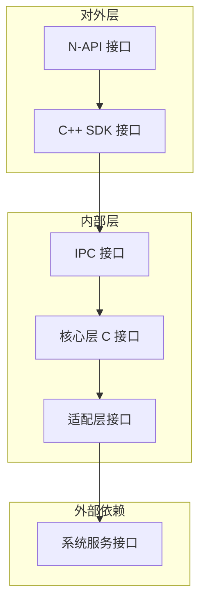

# 04 - 内部 API 文档

## 目的与适用范围

**本文档目的**：提供 `device_attest` 模块内部接口的完整参考，帮助开发者理解模块间通信机制。

**适用范围**：
- 系统开发者
- 模块维护人员
- 安全审计人员

## 接口分层



## IPC 接口

### DevAttestInterface

**定义位置**: `interfaces/innerkits/native_cpp/include/devattest_interface.h`

```cpp
namespace OHOS {
namespace DevAttest {
class DevAttestInterface : public OHOS::IRemoteBroker {
public:
    static const int SA_ID_DEVICE_ATTEST_SERVICE = 5501;
    DECLARE_INTERFACE_DESCRIPTOR(u"ohos.devattest.accessToken");
    
    virtual int32_t GetAttestStatus(AttestResultInfo &attestResultInfo) = 0;
    
    enum {
        GET_AUTH_RESULT = 0,
        ATTEST_INTERFACE_TYPE_BUTT,
    };
};
}
}
```

**接口说明**:
| 方法 | 参数 | 返回值 | 说明 |
|------|------|--------|------|
| `GetAttestStatus` | `AttestResultInfo &` | `int32_t` | 获取设备认证状态 |

**SA ID**: 5501 (`services/sa_profile/devattest_service.json`)

### DevAttestServiceProxy（客户端代理）

**定义位置**: `interfaces/innerkits/native_cpp/include/devattest_service_proxy.h`

```cpp
class DevAttestServiceProxy : public IRemoteProxy<DevAttestInterface> {
public:
    explicit DevAttestServiceProxy(const sptr<IRemoteObject> &impl);
    ~DevAttestServiceProxy() = default;
    int32_t GetAttestStatus(AttestResultInfo &attestResultInfo) override;
    
private:
    static inline BrokerDelegator<DevAttestServiceProxy> delegator_;
};
```

**实现位置**: `interfaces/innerkits/native_cpp/src/devattest_service_proxy.cpp`

```cpp
int32_t DevAttestServiceProxy::GetAttestStatus(AttestResultInfo &attestResultInfo) {
    MessageParcel data;
    MessageParcel reply;
    MessageOption option;
    
    // 写入接口 Token
    if (!data.WriteInterfaceToken(GetDescriptor())) {
        return DEVATTEST_FAIL;
    }
    
    // 发送 IPC 请求
    sptr<IRemoteObject> remote = Remote();
    if (remote == nullptr) {
        return DEVATTEST_FAIL;
    }
    
    int32_t ret = remote->SendRequest(GET_AUTH_RESULT, data, reply, option);
    if (ret != DEVATTEST_SUCCESS) {
        return ret;
    }
    
    // 读取返回结果
    ret = reply.ReadInt32();
    if (ret == DEVATTEST_SUCCESS) {
        // 反序列化 AttestResultInfo
        sptr<AttestResultInfo> infoPtr = AttestResultInfo::Unmarshalling(reply);
        if (infoPtr != nullptr) {
            attestResultInfo = *infoPtr;
        }
    }
    return ret;
}
```

### DevAttestServiceStub（服务端 Stub）

**定义位置**: `services/devattest_ability/include/devattest_service_stub.h`

```cpp
class DevAttestServiceStub : public IRemoteStub<DevAttestInterface> {
public:
    DevAttestServiceStub(bool serialInvokeFlag = true);
    ~DevAttestServiceStub();
    int OnRemoteRequest(uint32_t code, MessageParcel& data, 
                        MessageParcel& reply, MessageOption& option) override;
    virtual void DelayUnloadTask();
    
private:
    int GetAttestStatusInner(MessageParcel& data, MessageParcel& reply);
    using RequestFuncType = int (DevAttestServiceStub::*)(MessageParcel&, MessageParcel&);
    std::map<uint32_t, RequestFuncType> requestFuncMap_;
};
```

### DevAttestClient（客户端封装）

**定义位置**: `interfaces/innerkits/native_cpp/include/devattest_client.h`

```cpp
class DevAttestClient {
public:
    static DevAttestClient &GetInstance();
    int GetAttestStatus(AttestResultInfo &attestResultInfo);
    
private:
    sptr<DevAttestInterface> GetDeviceProfileService();
    bool LoadDevAttestProfile();
    void LoadSystemAbilitySuccess(const sptr<IRemoteObject> &remoteObject);
    void LoadSystemAbilityFail();
    
    sptr<DevAttestInterface> attestClientInterface_ = nullptr;
    std::mutex clientLock_;
    std::condition_variable proxyConVar_;
};
```

**关键常量**: `interfaces/innerkits/native_cpp/src/devattest_client.cpp:27`
```cpp
constexpr int32_t ATTEST_LOADSA_TIMEOUT_MS = 10000;  // 10秒超时
```

### AttestResultInfo（数据结构）

**定义位置**: `interfaces/innerkits/native_cpp/include/attest_result_info.h`

```cpp
class AttestResultInfo : public Parcelable {
public:
    AttestResultInfo() = default;
    ~AttestResultInfo() = default;
    
    int32_t authResult_;
    int32_t softwareResult_;
    std::vector<int32_t> softwareResultDetail_;
    std::string ticket_;
    int32_t ticketLength_;
    
    bool Marshalling(Parcel &parcel) const override;
    static AttestResultInfo* Unmarshalling(Parcel &parcel);
    bool ReadFromParcel(Parcel &parcel);
};
```

## 核心层 C 接口

### 入口接口（attest_entry.h）

**定义位置**: `services/core/attest_entry.h`

```c
#ifdef __cplusplus
extern "C" {
#endif

// 执行认证任务
int32_t AttestTask(void);

// 查询认证状态
int32_t QueryAttest(int32_t** resultArray, int32_t arraySize, 
                    char** ticket, int32_t* ticketLength);

// 等待任务完成
int32_t AttestWaitTaskOver(void);

// 定时器任务管理
int32_t AttestCreateTimerTask(void);
int32_t AttestDestroyTimerTask(void);

#ifdef __cplusplus
}
#endif
```

**接口说明**:
| 接口 | 参数 | 返回值 | 说明 |
|------|------|--------|------|
| `AttestTask` | 无 | `int32_t` | 执行完整的认证流程 |
| `QueryAttest` | `resultArray`, `arraySize`, `ticket`, `ticketLength` | `int32_t` | 查询认证结果 |
| `AttestWaitTaskOver` | 无 | `int32_t` | 等待认证任务完成 |
| `AttestCreateTimerTask` | 无 | `int32_t` | 创建定时任务 |
| `AttestDestroyTimerTask` | 无 | `int32_t` | 销毁定时任务 |

**调用位置**: `services/devattest_ability/src/devattest_service.cpp:74`
```cpp
#include "attest_entry.h"

int32_t DevAttestService::GetAttestStatus(AttestResultInfo &attestResultInfo) {
    // ...
    int32_t ret = QueryAttest(&resultArray, MAX_ATTEST_RESULT_SIZE, 
                             &ticketStr, &ticketLength);
    // ...
}
```

### 服务接口（attest_service.h）

**定义位置**: `services/core/include/attest/attest_service.h`

```c
// 主流程
int32_t ProcAttest(void);
int32_t QueryAttestStatus(int32_t** resultArray, int32_t arraySize,
                          char** ticket, int32_t* ticketLength);
int32_t AttestWaitTaskOverImpl(void);

// 认证结果索引
#define ATTEST_RESULT_AUTH        0
#define ATTEST_RESULT_SOFTWARE    1
#define ATTEST_RESULT_VERSIONID   2
#define ATTEST_RESULT_PATCHLEVEL  3
#define ATTEST_RESULT_ROOTHASH    4
#define ATTEST_RESULT_PCID        5
#define ATTEST_RESULT_RESERVE     6
#define ATTEST_RESULT_MAX         7

// 认证状态码
#define DEVICE_ATTEST_INIT  0
#define DEVICE_ATTEST_PASS  1
#define DEVICE_ATTEST_FAIL  2
```

### 安全接口（attest_security.h）

**定义位置**: `services/core/include/security/attest_security.h`

```c
// 加密/解密
int32_t Encrypt(uint8_t* inputData, size_t inputDataLen, const uint8_t* aesKey,
                uint8_t* outputData, size_t outputDataLen);
int32_t Decrypt(const uint8_t* inputData, size_t inputDataLen, const uint8_t* aesKey,
                uint8_t* outputData, size_t outputDataLen);

// HUKS 加密
int32_t EncryptHks(uint8_t* inputData, size_t inputDataLen, 
                   uint8_t* outputData, size_t outputDataLen);
int32_t DecryptHks(const uint8_t* inputData, size_t inputDataLen,
                   uint8_t* outputData, size_t outputDataLen);

// 密钥派生
int32_t GetAesKey(const SecurityParam* salt, const VersionData* versionData,
                  const SecurityParam* aesKey);

// Base64 编码
int32_t Base64Encode(const uint8_t* srcData, size_t srcDataLen,
                     uint8_t* base64Encode, uint16_t base64EncodeLen);

// MD5 编码
int32_t MD5Encode(const uint8_t* srcData, size_t srcDataLen,
                  uint8_t* outputStr, int outputLen);
```

### 适配层接口（attest_adapter.h）

**定义位置**: `services/core/include/adapter/attest_adapter.h`

```c
// 系统参数
int32_t AttestGetProductId(uint8_t* productId, uint32_t len);
int32_t AttestGetManufacturekey(uint8_t* manufactureKey, uint32_t len);

// 文件操作
int32_t AttestWriteFile(const char* fileName, const char* data, uint32_t len);
int32_t AttestReadFile(const char* fileName, char* buffer, uint32_t len);

// Token 操作
int32_t AttestWriteToken(const char* token, uint32_t len);
int32_t AttestReadToken(char* token, uint32_t len);

// 时间/随机数
int32_t GetRandomNum(void);
int64_t GetCurrentTimeMs(void);
```

## OEM 适配层接口

### 接口定义（device_attest_oem_adapter.h）

**定义位置**: `services/oem_adapter/include/device_attest_oem_adapter.h`

```c
// 读取厂商密钥
int32_t HalGetManufactureKey(char* manuKey, uint32_t len);

// 读取产品 ID
int32_t HalGetProdId(char* productId, uint32_t len);

// 读取 Token
int32_t HalReadToken(char* token, uint32_t len);

// 写入 Token
int32_t HalWriteToken(char* token, uint32_t len);

// 读取产品密钥（预留）
int32_t HalGetProdKey(char* productKey, uint32_t len);
```

**接口说明**:
| 接口 | 参数 | 返回值 | 说明 |
|------|------|--------|------|
| `HalGetManufactureKey` | `manuKey`, `len` | `int32_t` | 从安全分区读取厂商密钥 |
| `HalGetProdId` | `productId`, `len` | `int32_t` | 从安全分区读取产品 ID |
| `HalReadToken` | `token`, `len` | `int32_t` | 从安全分区读取设备 Token |
| `HalWriteToken` | `token`, `len` | `int32_t` | 向安全分区写入设备 Token |
| `HalGetProdKey` | `productKey`, `len` | `int32_t` | 预留接口，暂未使用 |

**返回值定义**:
- `0`: 成功
- `-1`: 失败

## 接口依赖矩阵

| 上层接口 | 依赖接口 | 稳定性 |
|----------|----------|--------|
| N-API | C++ SDK | 稳定 |
| C++ SDK | IPC Interface | 稳定 |
| IPC Interface | Core Entry | 稳定 |
| Core Entry | Core Service | 内部实现 |
| Core Service | Adapter | 内部实现 |
| Adapter | OEM HAL | OEM 相关 |

## 接口调用示例

### C++ SDK 调用示例

```cpp
#include "devattest_client.h"
#include "attest_result_info.h"

using namespace OHOS::DevAttest;

void CheckAttestStatus() {
    AttestResultInfo info;
    int32_t ret = DevAttestClient::GetInstance().GetAttestStatus(info);
    
    if (ret == 0) {
        printf("Auth Result: %d\n", info.authResult_);
        printf("Software Result: %d\n", info.softwareResult_);
        printf("Ticket: %s\n", info.ticket_.c_str());
    }
}
```

### Core 层直接调用示例

```c
#include "attest_entry.h"

void QueryStatus() {
    int32_t* resultArray = NULL;
    char* ticket = NULL;
    int32_t ticketLength = 0;
    
    int32_t ret = QueryAttest(&resultArray, ATTEST_RESULT_MAX, 
                            &ticket, &ticketLength);
    
    if (ret == 0) {
        printf("Auth: %d, Software: %d\n", 
               resultArray[ATTEST_RESULT_AUTH],
               resultArray[ATTEST_RESULT_SOFTWARE]);
    }
    
    free(resultArray);
    free(ticket);
}
```

## 相关链接

- [N-API 接口文档](03_NAPI.md) - 了解 JS 层接口
- [架构说明](02_Architecture.md) - 了解整体架构
- [OEM 适配层源码](../services/oem_adapter/)

---

**证据来源**：
- IPC 接口定义：`interfaces/innerkits/native_cpp/include/devattest_interface.h`
- Core 入口：`services/core/attest_entry.h`
- OEM 适配：`services/oem_adapter/include/device_attest_oem_adapter.h`
- 服务实现：`services/devattest_ability/src/devattest_service_stub.cpp`
