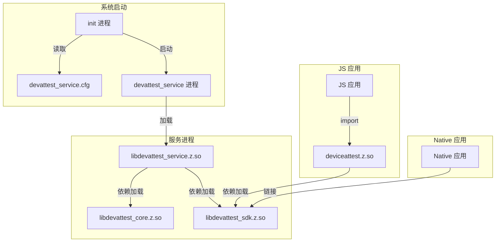

# 05 - GN 构建目标与编译产物

## 目的与适用范围

**本文档目的**：提供 `device_attest` 模块的完整构建配置说明，包括 GN 目标、依赖关系和产物信息。

**适用范围**：
- 系统构建工程师
- 模块开发者
- 集成测试人员

## 构建系统概述

### 主构建入口

**文件**: `build/BUILD.gn`

```gn
import("//build/ohos.gni")
import("//test/xts/device_attest/build/devattestconfig.gni")

group("attest_standard_packages") {
  deps = []
  if (is_standard_system) {
    deps += [
      "${devattest_path}/interfaces/innerkits/native_cpp:devattest_sdk",
      "${devattest_path}/interfaces/kits/napi:deviceattest",
      "${devattest_path}/services/devattest_ability:devattest_service",
      "${devattest_path}/services/etc/init:devattest_etc",
      "${devattest_path}/services/sa_profile:devattest_sa_profile",
    ]
    if (enable_attest_test_sample) {
      deps += [ "${devattest_path}/sample/client:attesttestclient" ]
    }
  }
}
```

**组件配置**: `bundle.json`
```json
{
  "name": "@ohos/device_attest",
  "version": "4.0",
  "component": {
    "name": "device_attest",
    "subsystem": "xts",
    "syscap": ["SystemCapability.XTS.DeviceAttest"],
    "adapted_system_type": ["standard"],
    "build": {
      "sub_component": [
        "//test/xts/device_attest/build:attest_standard_packages"
      ]
    }
  }
}
```

## 构建配置参数

### devattestconfig.gni

**文件**: `build/devattestconfig.gni`

```gnndevattest_path = "//test/xts/device_attest"
devattest_innerkit_path = "${devattest_path}/interfaces/innerkits/"
devattest_kits_path = "${devattest_path}/interfaces/kits/napi"

# 构建版本类型
declare_args() {
  attest_release = "attest_release"
  attest_debug = "attest_debug"
}

# 功能开关
declare_args() {
  # 构建版本: attest_release / attest_debug
  attest_build_target = attest_release
  
  # 模拟网络认证数据（true:模拟 false:真实网络）
  enable_attest_test_mock_network = false
  
  # 模拟设备数据（true:模拟 false:真实设备）
  enable_attest_test_mock_device = false
  
  # 内存泄漏检测
  enable_attest_debug_memory_leak = false
  
  # 网络调试日志
  enable_attest_network_debug_log = false
  
  # 测试 demo
  enable_attest_test_sample = false
  
  # DFX 开关
  enable_attest_debug_dfx = false
  
  # 禁用域名增强
  disable_attest_active_site = false
  
  # Token 预置方案
  enable_attest_preset_token = false
}

# 通用调试开关
declare_args() {
  enable_attest_common_debug = false
}

# debug 模式自动开启调试
if (attest_build_target == attest_debug) {
  enable_attest_common_debug = true
}
```

### 配置参数表

| 参数名 | 类型 | 默认值 | 说明 |
|--------|------|--------|------|
| `attest_build_target` | string | `attest_release` | 构建目标类型 |
| `enable_attest_test_mock_network` | bool | `false` | 模拟网络数据 |
| `enable_attest_test_mock_device` | bool | `false` | 模拟设备数据 |
| `enable_attest_debug_memory_leak` | bool | `false` | 内存泄漏检测 |
| `enable_attest_network_debug_log` | bool | `false` | 网络调试日志 |
| `enable_attest_test_sample` | bool | `false` | 测试 demo |
| `enable_attest_debug_dfx` | bool | `false` | DFX 功能 |
| `disable_attest_active_site` | bool | `false` | 禁用域名增强 |
| `enable_attest_preset_token` | bool | `false` | Token 预置方案 |

## GN Target 详细说明

### 1. devattest_sdk（C++ SDK）

**定义文件**: `interfaces/innerkits/native_cpp/BUILD.gn`

```gn
ohos_shared_library("devattest_sdk") {
  version_script = "libdevattest_sdk.map"
  
  sanitize = {
    cfi = true
    cfi_cross_dso = true
    debug = false
  }
  
  branch_protector_ret = "pac_ret"
  
  sources = [
    "${devattest_path}/services/devattest_ability/src/attest_result_info.cpp",
    "src/devattest_client.cpp",
    "src/devattest_profile_load_callback.cpp",
    "src/devattest_service_proxy.cpp",
  ]
  
  external_deps = [
    "c_utils:utils",
    "bounds_checking_function:libsec_shared",
    "hilog:libhilog",
    "ipc:ipc_core",
    "samgr:samgr_proxy",
  ]
  
  innerapi_tags = [ "platformsdk" ]
}
```

**Target 信息**:
| 属性 | 值 |
|------|-----|
| 类型 | `ohos_shared_library` |
| 输出名 | `libdevattest_sdk.z.so` |
| 版本脚本 | `libdevattest_sdk.map` |
| 安全特性 | CFI、PAC-RET |
| API 标签 | platformsdk |

**源文件**:
- `src/devattest_client.cpp` - 客户端主类
- `src/devattest_service_proxy.cpp` - IPC 代理
- `src/devattest_profile_load_callback.cpp` - SA 加载回调
- `services/devattest_ability/src/attest_result_info.cpp` - 结果数据结构

**依赖**:
- `c_utils:utils` - C 工具库
- `bounds_checking_function:libsec_shared` - 边界检查
- `hilog:libhilog` - 日志
- `ipc:ipc_core` - IPC 核心
- `samgr:samgr_proxy` - SA 管理器代理

### 2. deviceattest（N-API）

**定义文件**: `interfaces/kits/napi/BUILD.gn`

```gn
ohos_shared_library("deviceattest") {
  sanitize = {
    cfi = true
    cfi_cross_dso = true
    debug = false
  }
  
  branch_protector_ret = "pac_ret"
  
  sources = [
    "src/devattest_napi.cpp",
    "src/devattest_napi_error.cpp",
  ]
  
  deps = [ "${devattest_path}/interfaces/innerkits/native_cpp:devattest_sdk" ]
  
  external_deps = [
    "c_utils:utils",
    "bounds_checking_function:libsec_shared",
    "hilog:libhilog",
    "ipc:ipc_single",
    "napi:ace_napi",
  ]
  
  relative_install_dir = "module"
}
```

**Target 信息**:
| 属性 | 值 |
|------|-----|
| 类型 | `ohos_shared_library` |
| 输出名 | `deviceattest.z.so` |
| 安装目录 | `/system/lib/module/` |
| 安全特性 | CFI、PAC-RET |

**源文件**:
- `src/devattest_napi.cpp` - N-API 实现
- `src/devattest_napi_error.cpp` - 错误码转换

**依赖**:
- `devattest_sdk` - C++ SDK
- `napi:ace_napi` - N-API 框架

### 3. devattest_service（系统服务）

**定义文件**: `services/devattest_ability/BUILD.gn`

```gn
ohos_shared_library("devattest_service") {
  version_script = "libdevattest_service.map"
  
  sanitize = {
    cfi = true
    cfi_cross_dso = true
    debug = false
  }
  
  branch_protector_ret = "pac_ret"
  
  sources = [
    "${devattest_path}/common/permission/src/permission.cpp",
    "src/attest_result_info.cpp",
    "src/devattest_network_callback.cpp",
    "src/devattest_network_manager.cpp",
    "src/devattest_service.cpp",
    "src/devattest_service_stub.cpp",
    "src/devattest_system_ability_listener.cpp",
    "src/devattest_task.cpp",
  ]
  
  deps = [ "${devattest_path}/services/core:devattest_core" ]
  
  external_deps = [
    "c_utils:utils",
    "bounds_checking_function:libsec_shared",
    "eventhandler:libeventhandler",
    "hilog:libhilog",
    "ipc:ipc_core",
    "safwk:system_ability_fwk",
    "samgr:samgr_proxy",
    "access_token:libaccesstoken_sdk",
    "access_token:libtokenid_sdk",
    "netmanager_base:net_conn_manager_if",
  ]
}
```

**Target 信息**:
| 属性 | 值 |
|------|-----|
| 类型 | `ohos_shared_library` |
| 输出名 | `libdevattest_service.z.so` |
| 进程名 | `devattest_service` |
| SA ID | 5501 |
| 安全特性 | CFI、PAC-RET |

**源文件**:
- `src/devattest_service.cpp` - 服务主类
- `src/devattest_service_stub.cpp` - IPC Stub
- `src/devattest_task.cpp` - 认证任务
- `src/devattest_network_*.cpp` - 网络管理
- `common/permission/src/permission.cpp` - 权限检查

**依赖**:
- `devattest_core` - 核心业务
- `safwk:system_ability_fwk` - SA 框架
- `access_token:*` - 访问令牌
- `netmanager_base:*` - 网络管理

### 4. devattest_core（核心业务）

**定义文件**: `services/core/BUILD.gn`

```gn
import("attestsource.gni")

sources_common = sources_notmock
sources_common += sources_mock

if (enable_attest_debug_memory_leak) {
  sources_common += [ "utils/attest_utils_memleak.c" ]
}

if (enable_attest_debug_dfx) {
  sources_common += [ "dfx/attest_dfx.c" ]
}

config("devattest_core_config") {
  cflags = [ "-Wall" ]
  include_dirs = include_core_dirs
  
  if (enable_attest_common_debug) {
    defines = [ "ATTEST_HILOG_LEVEL = 0" ]
  } else {
    defines = [ "ATTEST_HILOG_LEVEL = 1" ]
  }
  
  # 条件编译宏
  if (enable_attest_test_mock_network) {
    defines += [ "__ATTEST_MOCK_NETWORK_STUB__" ]
  }
  if (enable_attest_test_mock_device) {
    defines += [ "__ATTEST_MOCK_DEVICE_STUB__" ]
  }
  if (enable_attest_debug_memory_leak) {
    defines += [ "__ATTEST_DEBUG_MEMORY_LEAK__" ]
  }
  if (enable_attest_network_debug_log) {
    defines += [ "__ATTEST_NETWORK_DEBUG_LOG__" ]
  }
  if (disable_attest_active_site) {
    defines += [ "__ATTEST_DISABLE_SITE__" ]
  }
  if (enable_attest_preset_token) {
    defines += [ "__ATTEST_ENABLE_PRESET_TOKEN__" ]
  }
  
  defines += [ "MBEDTLS_ALLOW_PRIVATE_ACCESS" ]
  defines += [ "OPENSSL_SUPPRESS_DEPRECATED" ]
}

ohos_shared_library("devattest_core") {
  version_script = "libdevattest_core.map"
  
  sanitize = {
    cfi = true
    cfi_cross_dso = true
    debug = false
  }
  
  branch_protector_ret = "pac_ret"
  
  sources = sources_common
  configs = [ ":devattest_core_config" ]
  deps = core_deps
  external_deps = core_external_deps
}
```

**条件编译宏**:
| 宏 | 触发条件 | 说明 |
|----|----------|------|
| `__ATTEST_MOCK_NETWORK_STUB__` | `enable_attest_test_mock_network=true` | 模拟网络 |
| `__ATTEST_MOCK_DEVICE_STUB__` | `enable_attest_test_mock_device=true` | 模拟设备 |
| `__ATTEST_DEBUG_MEMORY_LEAK__` | `enable_attest_debug_memory_leak=true` | 内存泄漏检测 |
| `__ATTEST_NETWORK_DEBUG_LOG__` | `enable_attest_network_debug_log=true` | 网络调试日志 |
| `__ATTEST_DISABLE_SITE__` | `disable_attest_active_site=true` | 禁用域名增强 |
| `__ATTEST_ENABLE_PRESET_TOKEN__` | `enable_attest_preset_token=true` | Token 预置 |
| `ATTEST_HILOG_LEVEL` | `enable_attest_common_debug` | 日志级别 |

### 5. devattest_etc（启动配置）

**定义文件**: `services/etc/init/BUILD.gn`

```gn
ohos_prebuilt_etc("devattest_etc") {
  source = "devattest_service.cfg"
  relative_install_dir = "init"
}
```

**产物**: `devattest_service.cfg` → `/system/etc/init/`

### 6. devattest_sa_profile（SA 配置）

**定义文件**: `services/sa_profile/BUILD.gn`

```gn
ohos_sa_profile("devattest_sa_profile") {
  sources = [ "devattest_service.json" ]
}
```

**配置文件**: `devattest_service.json`
```json
{
    "process": "devattest_service",
    "systemability": [{
        "name": 5501,
        "libpath": "libdevattest_service.z.so",
        "run-on-create": false,
        "distributed": false
    }]
}
```

## 编译产物清单

| 产物名 | 类型 | 安装路径 | 说明 |
|--------|------|----------|------|
| `deviceattest.z.so` | 动态库 | `/system/lib/module/` | JS N-API 接口 |
| `libdevattest_sdk.z.so` | 动态库 | `/system/lib/` | C++ SDK |
| `libdevattest_service.z.so` | 动态库 | `/system/lib/` | 系统服务 |
| `libdevattest_core.z.so` | 动态库 | `/system/lib/` | 核心业务 |
| `libdevattest_oem.z.so` | 动态库 | `/system/lib/` | OEM 适配（可选） |
| `devattest_service.cfg` | 配置文件 | `/system/etc/init/` | 启动配置 |
| `devattest_service.json` | 配置文件 | `/system/profile/` | SA 配置 |

## 运行时加载关系



## 构建命令

### 标准构建

```bash
# 构建整个组件
./build.sh --product-name=rk3568 system_size=standard

# 只构建 device_attest
./build.sh --product-name=rk3568 --build-target //test/xts/device_attest/build:attest_standard_packages
```

### 带调试功能构建

```bash
# 启用内存泄漏检测
./build.sh --product-name=rk3568 --gn-args="enable_attest_debug_memory_leak=true"

# 启用网络调试日志
./build.sh --product-name=rk3568 --gn-args="enable_attest_network_debug_log=true"

# Debug 模式
./build.sh --product-name=rk3568 --gn-args="attest_build_target=attest_debug"
```

## 相关链接

- [架构说明](02_Architecture.md) - 了解模块架构
- [内部 API 文档](04_Inner_API.md) - 了解模块接口
- [bundle.json](../bundle.json) - 组件配置

---

**证据来源**：
- 主构建：`build/BUILD.gn`
- 配置定义：`build/devattestconfig.gni`
- SDK 构建：`interfaces/innerkits/native_cpp/BUILD.gn`
- NAPI 构建：`interfaces/kits/napi/BUILD.gn`
- 服务构建：`services/devattest_ability/BUILD.gn`
- Core 构建：`services/core/BUILD.gn`
