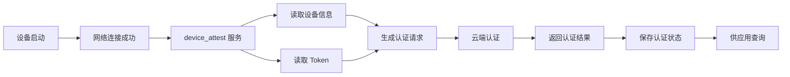
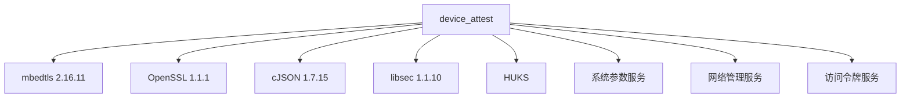

# device_attest 首页概览

## 一句话简介

`device_attest` 是 OpenHarmony 的设备认证模块，负责管理设备认证状态并与云端认证服务器通信，实现对 OpenHarmony 生态设备数量的统计。

## 核心能力



1. **设备认证** - 与云端认证服务器通信，验证设备合法性
2. **状态管理** - 维护设备硬件和软件认证状态
3. **Token 管理** - 安全存储和读取设备凭证
4. **查询接口** - 提供 JS/C++ 接口供应用查询认证结果

## 适用系统

- ✅ 标准系统 (standard)
- ❌ 轻量系统 (lite)
- ❌ 小型系统 (small)

## 快速开始

### 查询设备认证状态（JS）

```javascript
import deviceAttest from '@ohos.deviceAttest';

// 异步查询
deviceAttest.getAttestStatus().then((result) => {
    console.info("Auth Result: " + result.authResult);
    console.info("Software Result: " + result.softwareResult);
    console.info("Ticket: " + result.ticket);
});

// 同步查询
const result = deviceAttest.getAttestStatusSync();
```

### 查询设备认证状态（C++）

```cpp
#include "devattest_client.h"
#include "attest_result_info.h"

using namespace OHOS::DevAttest;

AttestResultInfo info;
int32_t ret = DevAttestClient::GetInstance().GetAttestStatus(info);
if (ret == 0) {
    // 获取认证结果成功
}
```

## 模块依赖



| 依赖库 | 版本 | 用途 |
|--------|------|------|
| mbedtls | 2.16.11 | TLS 加密通信 |
| OpenSSL | 1.1.1 | TLS/SSL 协议 |
| cJSON | 1.7.15 | JSON 数据解析 |
| libsec | 1.1.10 | 安全函数库 |
| HUKS | - | 通用密钥库服务 |
| 系统参数 | - | 获取设备信息 |
| 网络管理 | - | 网络状态监听 |
| 访问令牌 | - | 权限校验 |

## 项目统计

| 指标 | 数值 |
|------|------|
| 代码行数 | ~15,000 行（C/C++） |
| 模块数量 | 5 个主要模块 |
| N-API 接口 | 3 个（2 异步 + 1 同步） |
| SA ID | 5501 |
| 编译产物 | 4 个动态库 |
| 内存占用 | ~2.3MB RAM |
| 存储占用 | ~512KB ROM |

## 目录速览

```
device_attest/
├── interfaces/          # 对外接口
│   ├── kits/napi/      # JS N-API 接口
│   └── innerkits/      # C++ 内部接口
├── services/           # 服务实现
│   ├── core/           # 核心业务逻辑
│   ├── devattest_ability/  # SA 框架
│   └── oem_adapter/    # OEM 适配层
├── common/             # 公共组件
├── build/              # 构建配置
└── sample/             # 示例代码
```

## 下一步阅读

- [项目定位与关键概念](01_Overview.md) - 深入了解业务背景
- [架构说明](02_Architecture.md) - 理解系统架构
- [N-API 接口文档](03_NAPI.md) - 学习接口使用

---

*本文档基于代码自动生成，关键证据路径详见各章节。*
