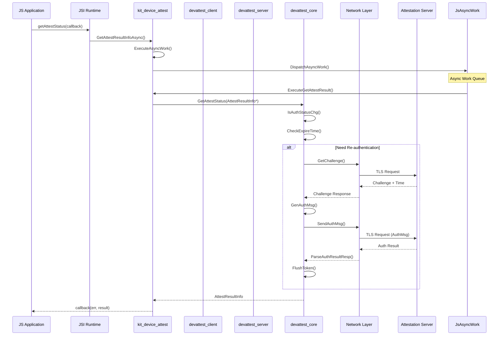
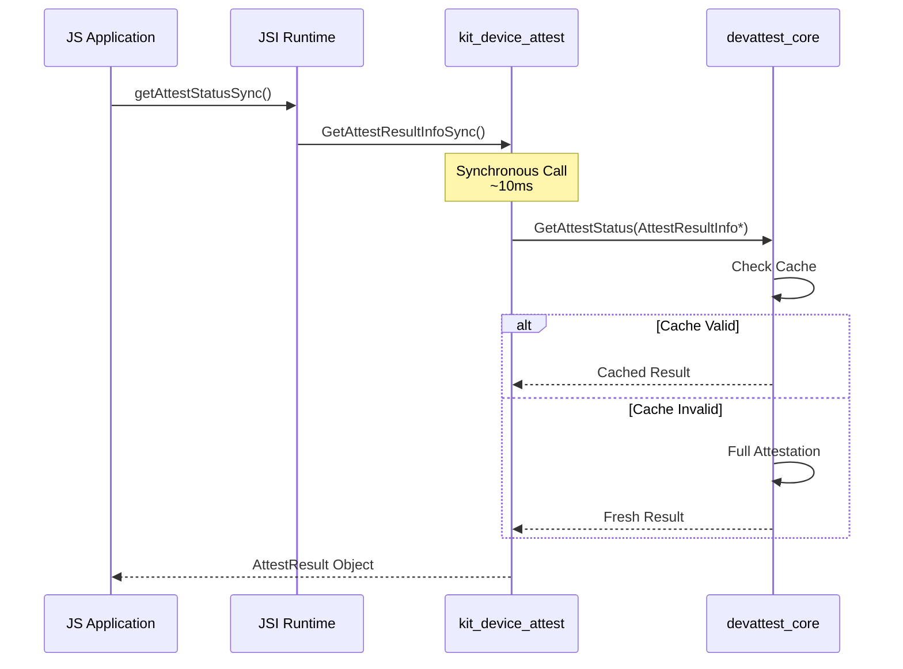
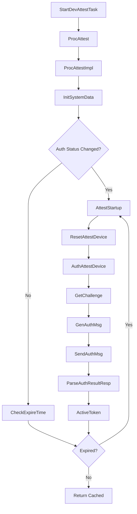
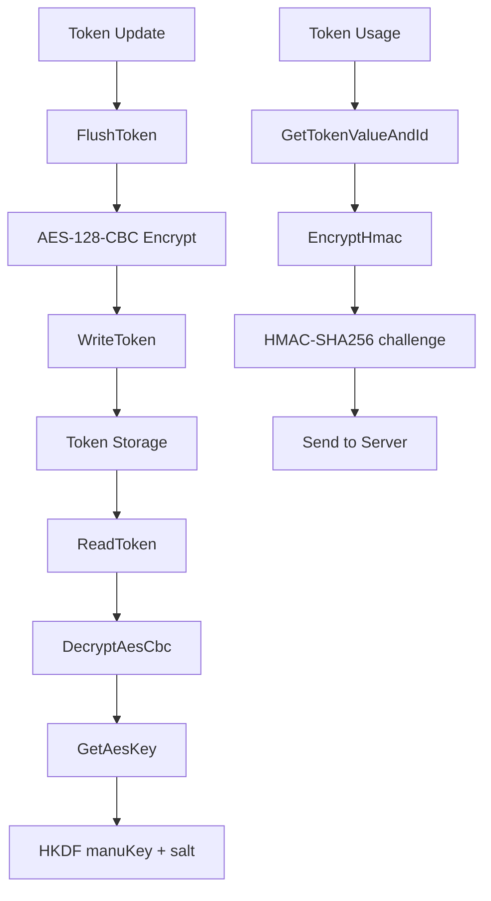
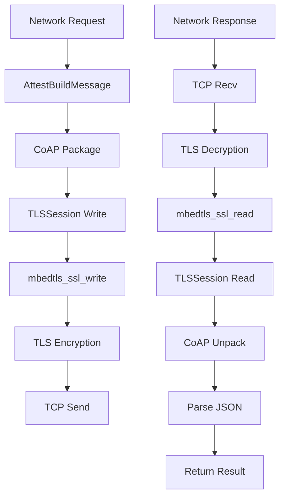
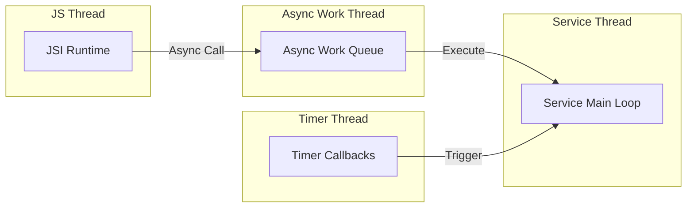

# 关键调用链

## 入口 → 核心逻辑

### 1. JS 异步认证调用

### 2. JS 同步认证调用

---

## 内部调用链

### 3. 认证服务主流程

### 4. Token 生命周期

---

## 网络调用链

### 5. CoAP/TLS 通信

---

## 关键文件 → 函数映射

### 入口函数

| 功能 | 入口文件 | 主函数 |
|------|---------|--------|
| JS 异步调用 | `native_device_attest.cpp` | `GetAttestResultInfoAsync()` |
| JS 同步调用 | `native_device_attest.cpp` | `GetAttestResultInfoSync()` |
| Inner API | `devattest_interface.h` | `StartDevAttestTask()` |
| Inner API | `devattest_interface.h` | `GetAttestStatus()` |

### 核心服务

| 模块 | 文件 | 关键函数 |
|------|------|---------|
| 认证主流程 | `attest_service.c` | `ProcAttest()` |
| 认证状态 | `attest_service_auth.c` | `IsAuthStatusChg()` |
| 认证消息 | `attest_service_auth.c` | `GenAuthMsg()` |
| Token 管理 | `attest_security_token.c` | `GetTokenValueAndId()` |

### 网络模块

| 模块 | 文件 | 关键函数 |
|------|------|---------|
| 连接 | `attest_network.c` | `D2CConnect()` |
| 消息 | `attest_network.c` | `SendAttestMsg()` |
| TLS | `attest_channel.c` | `LazyVerifyCert()` |

### 安全模块

| 模块 | 文件 | 关键函数 |
|------|------|---------|
| AES 加密 | `attest_security.c` | `EncryptAesCbc()` |
| AES 解密 | `attest_security.c` | `DecryptAesCbc()` |
| 密钥派生 | `attest_security.c` | `GetAesKey()` |
| HMAC | `attest_security_token.c` | `EncryptHmac()` |

---

## 线程/任务关系

| 线程 | 职责 | 关键同步 |
|------|------|---------|
| JS 线程 | JSI 调用 | - |
| Async Work | 异步任务 | pthread mutex |
| Service 线程 | SA 消息处理 | g_mtxAttest |
| Timer 线程 | 定时回调 | - |
