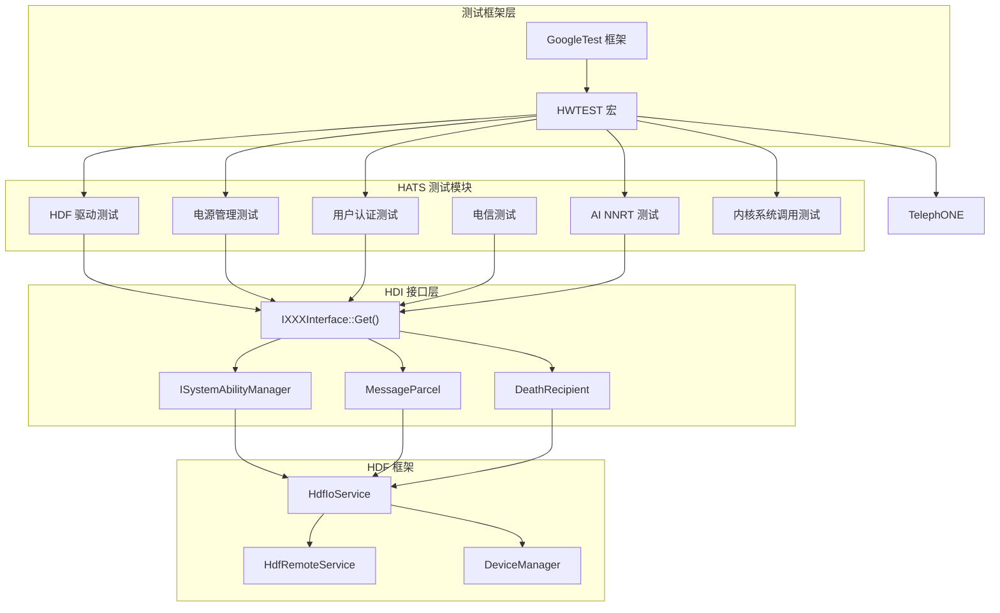
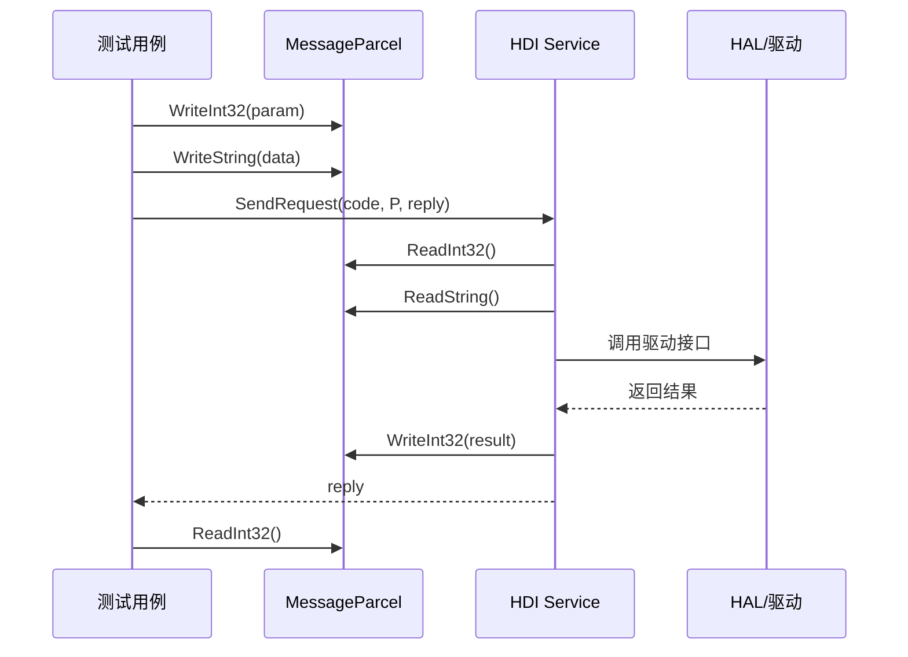
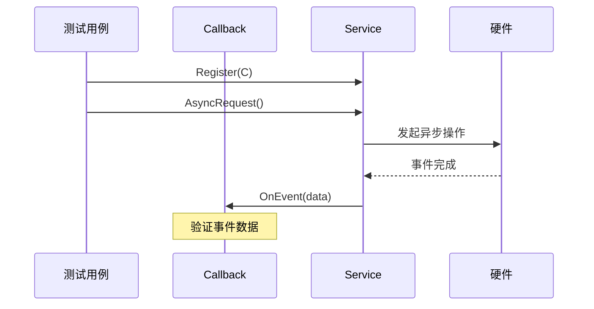
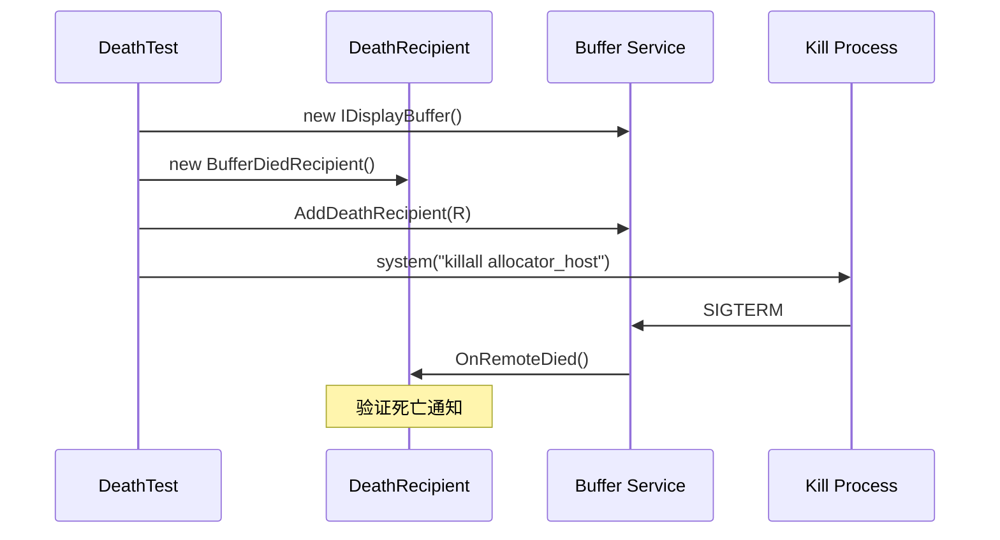
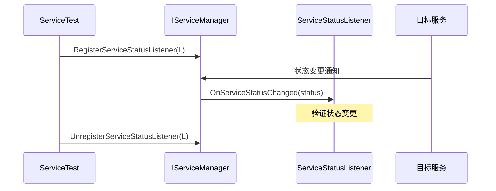

# 架构说明

## 整体架构

### 架构概览

HATS（Hardware Abstract Test Suite）采用分层测试架构，专注于验证 OpenHarmony 硬件抽象层的正确性和兼容性。

```
┌─────────────────────────────────────────────────────────────────┐
│                      测试执行层                                   │
│  ┌─────────────────────────────────────────────────────────┐    │
│  │  GoogleTest (gtest/gtest.h)                            │    │
│  │  HWTEST/HWTEST_F 宏定义                                  │    │
│  │  Level0-Level4 用例级别                                  │    │
│  └─────────────────────────────────────────────────────────┘    │
├─────────────────────────────────────────────────────────────────┤
│                      HDI 测试接口层                              │
│  ┌─────────────────────────────────────────────────────────┐    │
│  │  HDI 服务接口 (V1_0/V1_1/V2_0)                          │    │
│  │  ISystemAbilityManager                                  │    │
│  │  MessageParcel IPC                                      │    │
│  │  DeathRecipient 生命周期监控                             │    │
│  └─────────────────────────────────────────────────────────┘    │
├─────────────────────────────────────────────────────────────────┤
│                      HDF 驱动框架层                              │
│  ┌─────────────────────────────────────────────────────────┐    │
│  │  HdfIoService / HdfRemoteService                        │    │
│  │  Device Manager / Service Manager                        │    │
│  │  Event Listener机制                                      │    │
│  └─────────────────────────────────────────────────────────┘    │
├─────────────────────────────────────────────────────────────────┤
│                      硬件抽象层 (HAL)                           │
│  ┌─────────────────────────────────────────────────────────┐    │
│  │  设备驱动实现                                            │    │
│  │  内核接口                                                │    │
│  └─────────────────────────────────────────────────────────┘    │
└─────────────────────────────────────────────────────────────────┘
```

> **证据**：`/Volumes/lexar/code/d/work/oh/test/xts/hats/README.md:4-8` - HATS 定义为 HAL 兼容性测试套件

---

### 组件交互图



---

## 线程模型

### 典型测试线程模型

```
┌─────────────────────────────────────────────────────────────────┐
│                        主测试线程                                 │
│  ┌─────────────────────────────────────────────────────────┐    │
│  │  HWTEST_F(TestSuite, TestCase)                         │    │
│  │  ├─ SetUpTestCase()  - 全局初始化                       │    │
│  │  ├─ SetUp()           - 用例级初始化                      │    │
│  │  ├─ TestBody()        - 测试逻辑                         │    │
│  │  └─ TearDown()        - 用例级清理                       │    │
│  └─────────────────────────────────────────────────────────┘    │
├─────────────────────────────────────────────────────────────────┤
│                      HDI 回调线程                                │
│  ┌─────────────────────────────────────────────────────────┐    │
│  │  IRilCallback / ISensorCallback / IAuthCallback         │    │
│  │  ├─ OnEvent1()  - 异步事件处理                          │    │
│  │  └─ OnEvent2()  - 异步事件处理                          │    │
│  └─────────────────────────────────────────────────────────┘    │
├─────────────────────────────────────────────────────────────────┤
│                      服务端线程                                  │
│  ┌─────────────────────────────────────────────────────────┐    │
│  │  HDF Service / System Ability Service                    │    │
│  │  ├─ OnRequest()   - 请求处理                            │    │
│  │  └─ OnEvent()     - 事件通知                            │    │
│  └─────────────────────────────────────────────────────────┘    │
└─────────────────────────────────────────────────────────────────┘
```

> **证据**：`/Volumes/lexar/code/d/work/oh/test/xts/hats/useriam/fingerprintauth/src/fingerprint_auth_hdi.cpp` - 回调注册模式

---

### 线程安全注意事项

| 场景 | 模式 | 证据 |
|------|------|------|
| 回调注册 | 单线程注册，多线程回调 | `g_rilInterface->Register(callback)` |
| 资源清理 | 服务端先停止，回调再注销 | `RemoveDeathRecipient()` |
| 并发测试 | 使用同步屏障或 Mock | `system("killall allocator_host")` |

---

## 数据流

### HDI 调用数据流



> **证据**：`/Volumes/lexar/code/d/work/oh/test/xts/hats/hdf/manager/managerServiceTest/service_manager_hdi_test.cpp:148-157`

---

### 异步回调数据流



> **证据**：`/Volumes/lexar/code/d/work/oh/test/xts/hats/telephony/ril/hdi_v1.0/hdf_ril_hdiService_test.cpp`

---

## 关键时序

### 设备热插拔时序



> **证据**：`/Volumes/lexar/code/d/work/oh/test/xts/hats/hdf/display/buffer/death/death_test.cpp:47-57`

---

### 服务状态监听时序



> **证据**：`/Volumes/lexar/code/d/work/oh/test/xts/hats/hdf/manager/managerServiceTest/service_manager_hdi_test.cpp:366`

---

## 依赖方向

### 模块依赖图

```
                    ┌─────────────────┐
                    │   testtools     │
                    │  (配置工具)      │
                    └────────┬────────┘
                             │
        ┌────────────────────┼────────────────────┐
        │                    │                    │
        ▼                    ▼                    ▼
┌───────────────┐  ┌───────────────┐  ┌───────────────┐
│     hdf       │  │    kernel      │  │   powermgr    │
│  (154 BUILD)  │  │ (307 BUILD)    │  │  (13 BUILD)   │
└───────┬───────┘  └───────┬───────┘  └───────┬───────┘
        │                  │                    │
        │    ┌──────────────┴──────────────┐    │
        │    │                              │    │
        ▼    ▼                              ▼    ▼
┌─────────────────────────────────────────────────────────┐
│              第三方依赖 (third_party)                   │
│  ┌─────────────────┐  ┌─────────────────────────┐    │
│  │  googletest     │  │  bounds_checking_func   │    │
│  │  (gtest_main)   │  │  (libsec_shared)        │    │
│  └─────────────────┘  └─────────────────────────┘    │
└───────────────────────────────────────────────────────┘
```

---

### 依赖类型统计

| 依赖类型 | 示例 | 用途 |
|----------|------|------|
| 测试框架 | `//third_party/googletest:gtest_main` | 测试用例执行 |
| 工具库 | `c_utils:utils` | 通用工具函数 |
| 驱动接口 | `drivers_interface_battery:libbattery_proxy_2.0` | HDI 绑定 |
| 日志 | `hilog:libhilog` | 日志输出 |
| IPC | `ipc:ipc_single` | 进程间通信 |
| 安全 | `access_token:libaccesstoken_sdk` | 权限验证 |

> **证据**：`/Volumes/lexar/code/d/work/oh/test/xts/hats/powermgr/battery/hdi_battery/BUILD.gn`

---

## 稳定性标注

### 接口稳定性分级

| 层级 | 路径模式 | 稳定性 | 说明 |
|------|----------|--------|------|
| **稳定** | `//drivers/hdf_core/...` | Stable | HDF 框架核心接口 |
| **稳定** | `hdi/*/V1_0/` | Stable | V1_0 版本接口 |
| **中等** | `hdi/*/V1_1/` | Moderate | V1_1 增量接口 |
| **实验** | `hdi/*/V2_0/` | Experimental | 新增功能 |
| **不稳定** | `*_additional/` | Unstable | 扩展测试用例 |

### 可替换点

| 组件 | 替换点 | 证据 |
|------|--------|------|
| 回调实现 | `IRemoteObjectStub` 子类 | `/Volumes/lexar/code/d/work/oh/test/xts/hats/hdf/manager/managerServiceTest/service_manager_hdi_test.cpp:102-118` |
| Mock 接口 | `IPowerInterface` 实现类 | `/Volumes/lexar/code/d/work/oh/test/xts/hats/powermgr/power/hdi_power/common/hdi_power_test.cpp` |
| 测试夹具 | `testing::Test` 子类 | 所有测试文件遵循 GoogleTest 模式 |

---

## 相关文档

| 文档 | 路径 | 说明 |
|------|------|------|
| 子系统详解 | [02_Modules.md](./02_Modules.md) | 各模块详细说明 |
| N-API 说明 | [03_N-API.md](./03_N-API.md) | HDI 接口清单 |
| 构建系统 | [04_Build.md](./04_Build.md) | GN 构建配置 |
| 安全评审 | [05_Security.md](./05_Security.md) | 安全风险分析 |
| 附录 | [06_Appendix.md](./06_Appendix.md) | 调用链与配置 |
