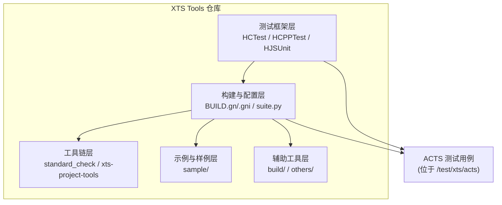
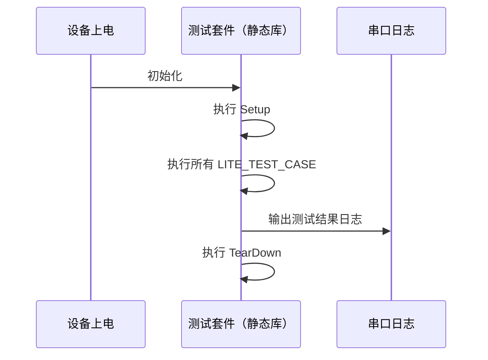
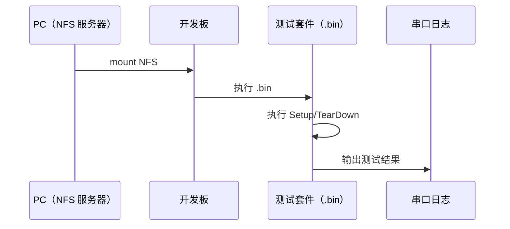
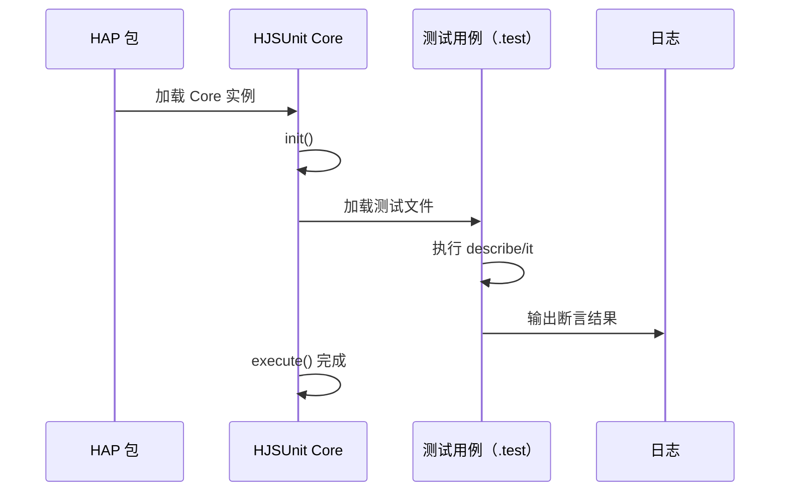

# 02_Architecture.md

## 目的

本文档说明 XTS Tools 的整体架构，包括组件图、数据流、线程模型与关键时序。帮助开发者理解模块协作与运行机制。

## 适用范围

- 仅涉及非测试模块
- 忽略 test/tests/unittest/fuzz 等测试代码

---

## 组件图

### 高层组件关系

说明：测试框架层通过构建与配置层与工具链、示例、辅助工具交互，共同为 ACTS 测试用例提供开发、构建、运行环境。

### 测试框架组件

- HCTest（C，Mini 系统）
  - 基于 Unity 框架增强
  - 宏：LITE_TEST_SUIT、LITE_TEST_CASE、RUN_TEST_SUITE
  - 证据：README.md:250-310

- HCPPTest（C++，Small/Standard 系统）
  - 基于 Googletest 框架增强
  - 宏：HWTEST、HWTEST_F
  - 证据：README.md:370-483

- HJSUnit（JavaScript，Standard 系统）
  - 基于 Jasmine 框架
  - 语法：describe、it、beforeAll、afterAll 等
  - 证据：README.md:511-649

---

## 数据流

### 构建数据流

1. 开发者编写测试用例（C/C++/JavaScript）
2. GN 编译系统（BUILD.gn/.gni）解析目标依赖
3. Ninja 执行编译，生成产物（.a/.so/.bin/.hap）
4. 工具链（suite.py）打包测试套件与配置
5. 部署与执行（通过 NFS/串口/设备挂载）

### 运行时数据流

- Mini 系统
  - 测试用例链接为静态库，烧录至镜像
  - 串口日志输出测试结果
  - 证据：README.md:345-351

- Small/Standard 系统（C++）
  - 测试用例构建为独立 .bin 可执行文件
  - 通过 NFS 挂载共享目录执行
  - 证据：README.md:477-483

- Standard 系统（JavaScript）
  - 测试用例打包为 HAP
  - 通过 HJSUnit 框架加载与执行
  - 证据：README.md:645-649

---

## 线程模型

- 测试框架线程模型
  - HCTest/HCPPTest：单线程执行（单进程）
  - HJSUnit：JavaScript 单线程事件循环

- 工具链线程模型
  - suite.py：主线程 + 可能的子进程（NFS 挂载/设备交互）
  - 其他 Python 脚本：通常单线程执行

TODO: 进一步阅读 Python 脚本与 GN 配置，确认是否涉及线程池或并发执行。

---

## 关键时序

### C 测试用例执行时序（Mini 系统）

证据：README.md:345-351

### C++ 测试用例执行时序（Small/Standard 系统）

证据：README.md:485-510

### JavaScript 测试用例执行时序（Standard 系统）

证据：README.md:511-649

---

## 相关跳转

- [00_Overview.md](00_Overview.md)
- [01_Directory_Structure.md](01_Directory_Structure.md)
- [04_Inner_APIs.md](04_Inner_APIs.md)
- [appendix/Callgraphs.md](appendix/Callgraphs.md)
