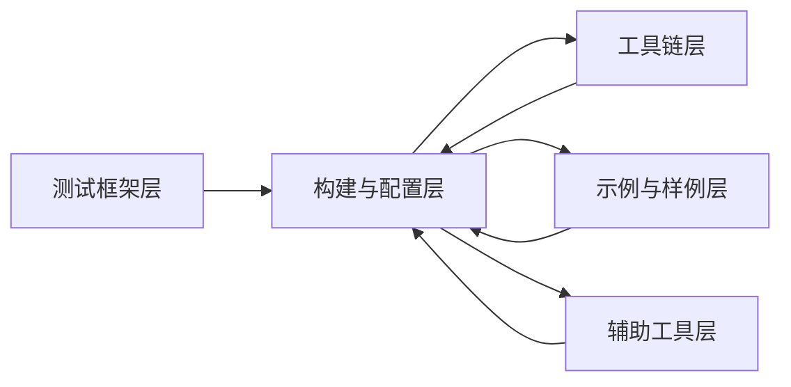

# 04_Inner_APIs.md

## 目的

本文档梳理 XTS Tools 的内部 API，包括模块接口、依赖方向、稳定性与可替换点。帮助开发者理解模块间协作与接口稳定性。

## 适用范围

- 仅涉及 tools/ 仓库内部模块
- 不涉及对外 N-API（见 [03_NAPI_Surfaces.md](03_NAPI_Surfaces.md)）

---

## 核心模块职责与边界

### 测试框架模块

- HCTest（C，Mini 系统）
  - 职责：提供 C 测试框架（基于 Unity）
  - 边界：不涉及 C++/JS 测试
  - 依赖：Unity 框架（开源）
  - 证据：README.md:250-310
  - 文件位置：`lite/hctest/src/hctest.c`、`lite/hctest/include/hctest.h`

- HCPPTest（C++，Small/Standard 系统）
  - 职责：提供 C++ 测试框架（基于 Googletest）
  - 边界：不涉及 C/JS 测试
  - 依赖：Googletest 框架（开源）
  - 证据：README.md:370-483
  - 文件位置：`lite/hcpptest/BUILD.gn`（约40个Google Test/Mock源文件）

- HJSUnit（JavaScript，Standard 系统）
  - 职责：提供 JS 测试框架（基于 Jasmine）
  - 边界：不涉及 C/C++ 测试
  - 依赖：Jasmine 框架（开源）
  - 证据：README.md:511-649

### IPC 通信模块

- SAMGR Lite（System Ability Manager Lite）
  - 职责：提供轻量级系统间通信能力（Mini/Small 系统）
  - 边界：不涉及标准系统 Binder IPC
  - 依赖：`//foundation/systemabilitymgr/samgr_lite/interfaces/kits/samgr`（外部依赖）
  - 证据：`lite/hctest/src/hctest_service.c` 中使用 `samgr_lite.h`
  - 关键 API：`SAMGR_GetInstance()`、`SAMGR_SendRequest()`、`SAMGR_SendResponseByIdentity()`
  - 关键结构：`INHERIT_SERVICE` 宏、`Service` 结构体、`Identity` 结构体、`Request` 结构体

- UI 层 IPC（标准系统）
  - 职责：提供 UI 扩展组件的代理通信
  - 边界：不涉及底层 IPC 实现
  - 依赖：`@kit.IPCKit`（外部依赖）
  - 证据：`sample/ui_compare/uiCompareTest_02/` 中的 `UIExtensionProxy`、`UIServiceProxy`
  - 关键方法：`send()`（异步）、`sendSync()`（同步）、`onRemoteReady()`（事件监听）

---

## 依赖方向（避免环）

### 依赖图

说明：
- 测试框架层依赖构建与配置层（BUILD.gn/.gni、suite.py 等）
- 工具链、示例、辅助工具层反向依赖构建与配置层（提供脚本与工具）

### 具体依赖

- HCTest/HCPPTest/HJSUnit → GN/Ninja（构建）
  - 证据：`lite/hctest/BUILD.gn`、`lite/hcpptest/BUILD.gn`

- suite.py → GN/Ninja（调用编译）
  - 证据：`build/suite.py`

- HCTest → SAMGR Lite（IPC 能力）
  - 证据：`lite/hctest/src/hctest_service.c` 使用 `samgr_lite.h`
  - 外部依赖：`//foundation/systemabilitymgr/samgr_lite/interfaces/kits/samgr`

- queryStandard → device_attest、c_utils、init、ipc（标准系统查询工具）
  - 证据：`others/query/BUILD.gn` 中的 `deps = ["//third_party/bounds_checking_function:libsec_shared", "//foundation/communication/ipc/ipc_single:ipc_single"]`

- querySmall → libbegetutil、devattest_client（小型系统查询工具）
  - 证据：`lite/others/query/BUILD.gn`

- checksum → libsec_shared（校验和工具）
  - 证据：`lite/checksum/BUILD.gn`

- format-tc-doc.py → Python 标准库
  - 证据：`xts-project-tools/format-tc-doc/format_tc_doc.py`

- check_hvigor.py → HVIGR 工具（外部）
  - 证据：`standard_check/check_hvigor.py`

- UI 层 IPC → @kit.IPCKit（外部）
  - 证据：`sample/ui_compare/uiCompareTest_03/entry/src/ohosTest/ets/testability/MyEmbeddedUIExtAbility/MyEmbeddedUIExtAbility.ets` 中的 `import { rpc } from '@kit.IPCKit'`

---

## 接口稳定性标注

### 稳定接口（长期不变）

- 测试框架宏与 API（如 LITE_TEST_SUIT、HWTEST、describe、it）
  - 理由：框架定义，兼容性要求
  - 证据：README.md 各框架章节

### 不稳定接口（可能变更）

- 内部 Python 脚本 API（如 suite.py 内部函数）
  - 理由：工具链迭代较快
  - 证据：无文档承诺，实现细节

TODO: 经 Phase 4 补充具体接口稳定性证据（注释、命名约定、目录结构）

---

## 可替换点（插件/扩展）

### GN 模板与脚本

- suite.gni —— 可扩展 GN 目标模板
  - 替换点：添加新测试套件模板
  - 证据：README.md:318-327、440-458

- suite.py —— 可扩展测试套件管理逻辑
  - 替换点：添加新测试执行策略
  - 证据：glob 发现 build/suite.py

### 工具链脚本

- format-tc-doc.py —— 可扩展文档格式化规则
  - 替换点：添加新格式化策略
  - 证据：README.md:xxx（待补充）

- check_hvigor.py —— 可扩展 HVIGR 检查规则
  - 替换点：添加新检查项
  - 证据：glob 发现 standard_check/check_hvigor.py

---

## 错误传播机制

- 测试框架
  - HCTest/HCPPTest：通过断言宏（EXPECT_*、ASSERT_*）传播错误
  - HJSUnit：通过 expect().assertEqual() 等传播错误
  - 证据：README.md:630-642

- 工具链脚本
  - Python 脚本：通过异常（Exception）与退出码传播错误
  - TODO: 经 Phase 4 补充具体错误处理证据

---

## 资源生命周期

- 测试套件
  - Mini 系统：静态库链接至镜像，生命周期随系统
  - Small/Standard 系统：.bin 可执行文件，NFS 挂载后执行
  - Standard 系统（JS）：HAP 包，应用生命周期
  - 证据：README.md:345-351、477-483、645-649

- 工具链进程
  - Python 脚本：短生命周期（按需执行）
  - TODO: 经 Phase 4 补充具体进程管理证据

---

## 相关跳转

- [00_Overview.md](00_Overview.md)
- [02_Architecture.md](02_Architecture.md)
- [05_GN_Targets.md](05_GN_Targets.md)
