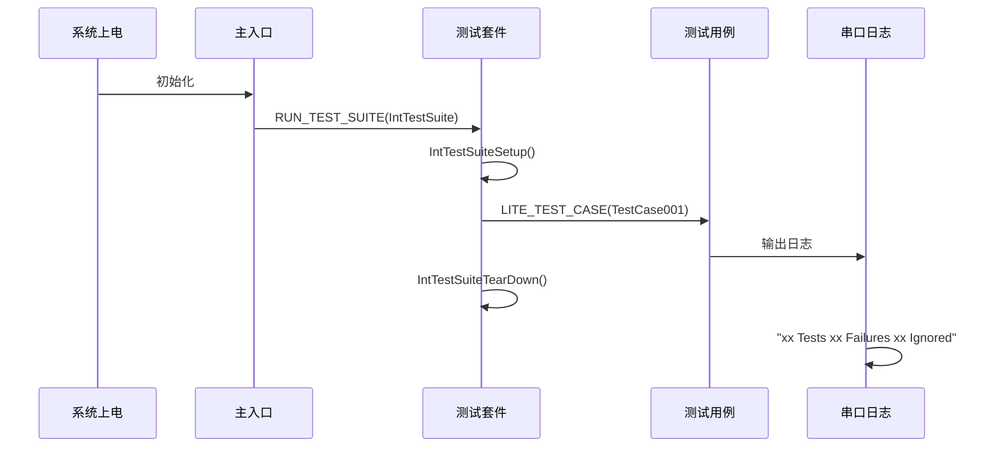
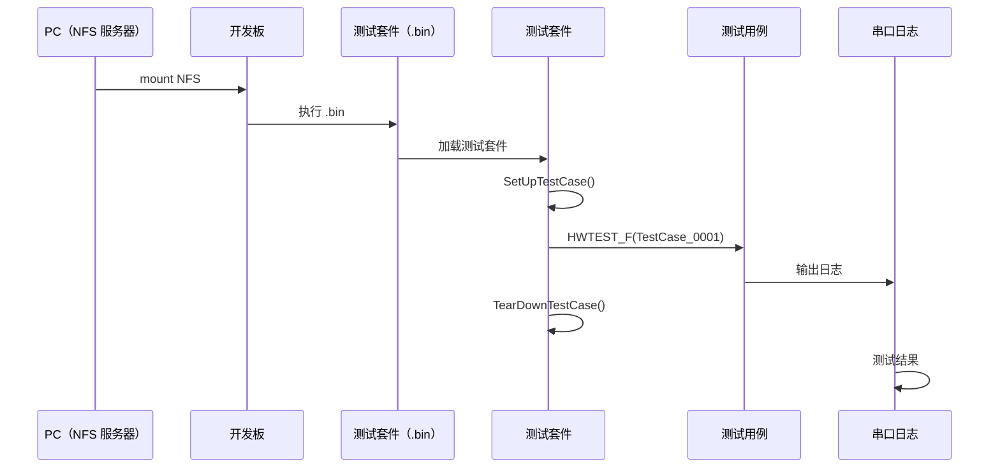
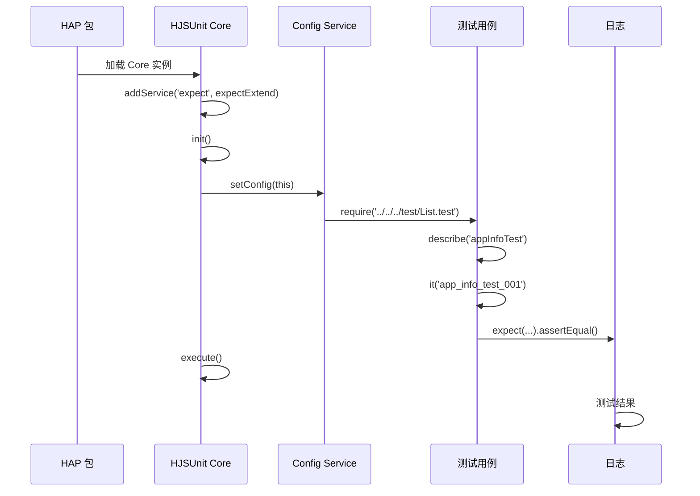
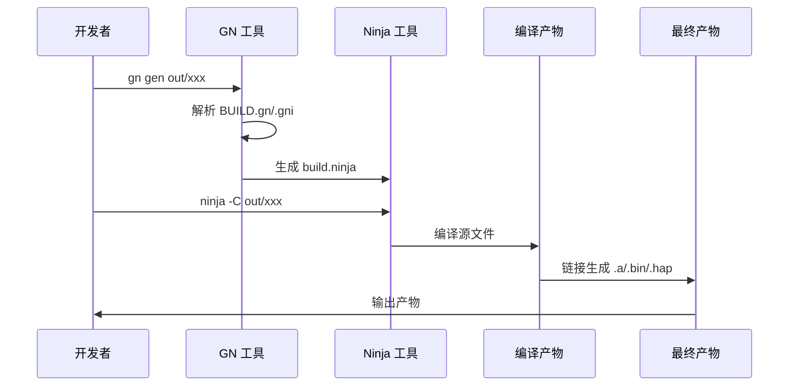
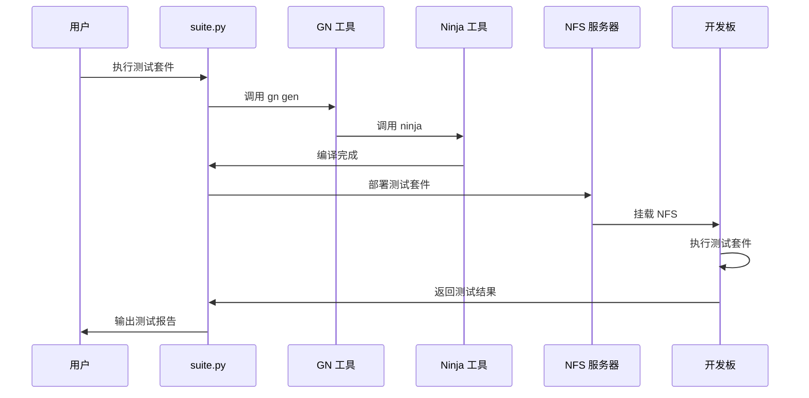
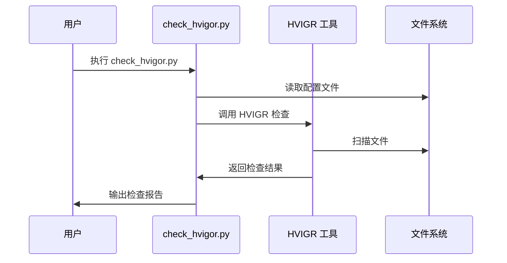

# Callgraphs.md

## 目的

本文档提供 XTS Tools 的关键调用链（入口→核心逻辑），帮助开发者理解代码执行路径。

## 适用范围

- 仅涉及 tools/ 仓库的核心流程
- 不涉及测试用例具体实现

---

## C 测试用例执行调用链（Mini 系统）

证据：README.md:310-351

---

## C++ 测试用例执行调用链（Small/Standard 系统）

证据：README.md:485-510

---

## JavaScript 测试用例执行调用链（Standard 系统）

证据：README.md:511-649

---

## GN 构建调用链

证据：README.md:318-327、440-458

---

## suite.py 调用链（测试套件管理）

证据：glob 发现 build/suite.py；README.md:485-510

---

## check_hvigor.py 调用链（HVIGR 检查）

证据：glob 发现 standard_check/check_hvigor.py

---

## 相关跳转

- [00_Overview.md](00_Overview.md)
- [02_Architecture.md](02_Architecture.md)
- [05_GN_Targets.md](05_GN_Targets.md)
